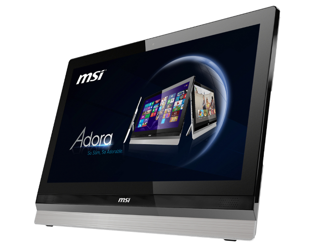
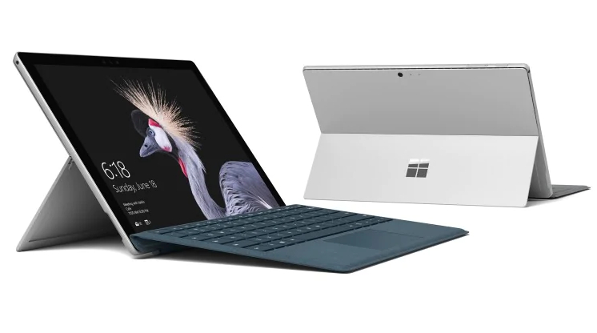
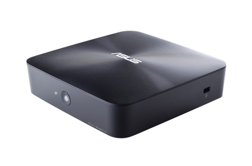
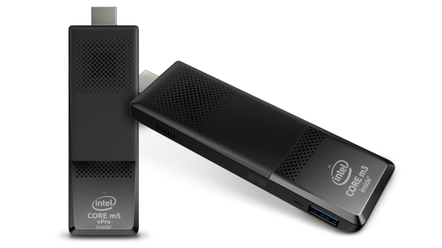

import AssemblingPcFooter from '../../typography/assemblingPcFooter'

Zanim zaczniemy kupować lub składać swojego wymarzonego "peceta" warto zastanowić się czy inne urządzenie nie spełni lepiej naszych wymagań. W dzisiejszych czasach komputer to nie tylko klasyczna duża puszka stojąca gdzieś pod biurkiem. Proces miniaturyzacji pozwala na stworzenie komputera wielkości przerośniętego pendrive'a. Zatem przyjrzyjmy się wszystkim rozwiązaniom:

## Klasyczna jednostka typu PC

Na początek klasyczny komputer PC, który najczęściej można spotkać w naszych domach. Do jego zalet można zaliczyć przede wszystkim szerokie, niemalże nieograniczone, możliwości modyfikacji. Każda część może zostać wymieniona oraz dobrana do własnych potrzeb. Ta cecha przekłada się na wyjątkowy komfort pracy na tym urządzeniu. Oczywiście, wiele też zależy od reszty peryferiów komputerowych takich jak monitor, klawiatura czy myszka, ale i tak komfort będzie wciąż odczuwalny. Wadami rozwiązania są za to gabaryty samych urządzeń, które w małych pokojach mogą trochę przeszkadzać oraz fakt, iż do podłączenia takiego komputera jest potrzebna pewna podstawowa wiedza.

### Plusy:

- dowolne modyfikacje podzespołów
- komfort pracy

### Minusy:

- duże gabaryty urządzenia
- skomplikowane podłączanie (dużo kabli)

## Komputer All-In-One

<ImageDescription>Komputer MSI Adora typu All-In-One, źródło: msi.com</ImageDescription>

Komputery tego typu zyskują coraz to większą popularność i nie ma co się temu dziwić. Komputer AIO (bo tak mówimy na nie w skrócie) to jednostka centralna zintegrowana w monitorze. Niektóre modele jest nawet ciężko odróżnić od klasycznego monitora. W porównaniu do komputera PC pozwalają zredukować ilość miejsca potrzebnego do stworzenia stanowiska komputerowego (znika potrzeba miejsca na jednostkę centralną) przy jednoczesnym zachowaniu komfortu pracy. Dodatkowym atutem w tym przypadku jest estetyka związana z kablami. Komputer tego typu do uruchomienia potrzebuje jedynie kabla zasilającego podłączonego do gniazdka. Komunikacja z Internetem jest najczęściej obsługiwana bezprzewodowo poprzez sieć WiFi, choć zazwyczaj komputery AIO posiadają też złącze internetowe, podobnie jest z klawiaturą i myszką. Wadą tego rozwiązania jest bardzo ograniczone pole do modyfikacji komputera.

### Plusy:

- łatwa obsługa (mało kabli)
- estetyka stanowiska komputerowego
- komfort pracy

### Minusy:

- bardzo ograniczone możliwości modyfikacji

## Laptop / Tablet 2w1

Dobrze nam znany laptop. Nieoceniony, gdy zachodzi potrzeba pracy na komputerze w podróży lub poza domem. I to jest główna zaleta laptopów - mobilność i praca na baterii. Mogłoby się wydawać, że laptop może zastąpić klasyczny komputer w domu, lecz nie byłbym taki pewny z dwóch względów. Po pierwsze tego typu komputer nadal stanowi kompromis między wydajnością a mobilnością. Laptop o potężnych podzespołach będzie dużo ważyć oraz będzie bardzo prądożerny, a tak duży pobór energii może sprawić, że wbudowana w niego bateria będzie jedynie awaryjnym zasilaniem na wypadek zaniku prądu w domu. Po drugie laptop, w przeciwieństwie do stanowiska komputerowego, nie daje takiego komfortu pracy. Mały i nisko położony ekran może męczyć wzrok i szyję, a bliska monitora klawiatura (często bardzo okrojona) nie pozwoli też na wygodne pisanie długich tekstów. Oczywiście, jeśli ktoś potrzebuje urządzenia zarówno do domu, jak i pracy w terenie to laptop jest jak najbardziej dla niego. Jedynie zachęcam do wyposażenia biurka w zewnętrzną klawiaturę i myszkę oraz specjalną podstawkę pod laptopa, która pozwoli postawić go po skosie podnosząc monitor do góry. Takie podstawki zapewniają też dodatkowe chłodzenie urządzenia oraz mogą doposażyć stanowisko w większą liczbę portów USB.

<ImageDescription>Microsoft Surface Pro - przykład laptopa z odłączaną klawiaturą, źródło: microsoft.com</ImageDescription>

Laptop 2w1 jest to wariacja połączenia laptopa z tabletem, a mówiąc prościej: jest to laptop z odłączaną klawiaturą. W przypadku tych urządzeń całość elektroniki znajduje się "na plecach" monitora. Taka konstrukcja pozwala na komfortowe korzystanie z ekranu dotykowego, a w razie potrzeby szybkie podłączenie klawiatury. Niektóre klasyczne laptopy także posiadają ekrany dotykowe. W przypadku konstrukcji, która pozwala obrócić klawiaturę o 360 stopni (na plecy ekranu) ma to sens. Laptopy, które posiadają klasyczne zawiasy, niestety, nie wykorzystują w pełni potencjału ekranów dotykowych, ponieważ już po chwili pracy u użytkownika pojawia się zmęczenie nadgarstków wynikające z potrzeby wykręcania dłoni nad klawiaturą urządzenia.

### Plusy:

- mobilność
- praca na wbudowanej baterii
- łatwa obsługa (monitor, klawiatura i mysz zintegrowana w urządzenie)

### Minusy:

- dyskomfort przy dłuższej pracy
- bardzo ograniczone możliwości modyfikacji (w przypadku laptopów 2w1 praktycznie niemożliwe)

<AdSense/>

## Mini PC

<ImageDescription>Miniaturowy komputer ASUS VivoMini, źródło: asus.com</ImageDescription>

Połączenie pełnowymiarowego stanowiska komputerowego z mobilnością laptopa? Komputery typu Mini PC to małe kwadratowe jednostki centralne o boku o długości kilkunastu centymetrów. Dzięki swojemu rozmiarowi mogą być bez problemu przenoszone między stanowiskami komputerowymi. Jest to idealne rozwiązanie dla osób, które nie potrzebują komputera do pracy w terenie, ale lubią czuć się przy każdym stanowisku (czy to w pracy, czy w miejscu publicznym) jak u siebie w domu.

### Plusy:

- wymiary urządzenia
- łatwość w przenoszeniu

### Minusy:

- bardzo ograniczone możliwości modyfikacji

## Stick

<ImageDescription>Intel Compute Stick - komputer wielkości pendrive'a, źródło: intel.pl</ImageDescription>

Mini PC był za mało mini? No to może komputer wielkości pendrive'a? Może nie grzeszą one mocą i możliwościami, ale coś za coś. Stanowią bardziej pokaz możliwości miniaturyzacji niż coś, na czym można by wygodnie pracować. Komputery typu stick faktycznie podłącza się jak typową pamięć przenośną. Z tą różnicą, że nie do portu USB, a do portu HDMI w monitorze lub telewizorze. Sprawia to, że podłączenie takiego urządzenia jest bajecznie proste. Minusem jest, tak jak mówiłem, moc jaką dysponują oraz bardzo ubogi zestaw złączy. Komputery tego typu opierają się głównie o komunikację bezprzewodową WiFi oraz Bluetooth. Klawiaturę oraz mysz można podłączyć za pomocą omawianych wcześniej technologii bezprzewodowych lub za pomocą portu USB, który najczęściej występuje w ilości AŻ(!) jednej sztuki. Komputery tego typu zalecałbym dla osób, które chcą zamienić swój telewizor w Smart TV lub stworzyć interaktywny ekran do sklepu lub instytucji publicznej.

### Plusy:

- ekstremalnie mały rozmiar komputera
- łatwość w przenoszeniu
- szybka i łatwa instalacja na nowym stanowisku

### Minusy:

- bardzo ograniczona moc i możliwości
- brak możliwości modyfikacji
- brak komfortu pracy

## HTPC

Na koniec pozwoliłem sobie zostawić komputery HTPC. Mówiąc w skrócie są to komputery do oglądania multimediów i udostępniania ich w domowej sieci WiFi. Można je zbudować samemu lub skorzystać z gotowych rozwiązań producentów. Przyjmują one różne formy, ale najczęściej montuje się je w poziomych lub sześciennych obudowach oraz stawia (w miarę możliwości) na pasywne bezgłośne chłodzenie, tak by nic nie zakłócało seansu naszego ulubionego serialu. Jest to temat bardzo rozległy i starczyłby na osobny artykuł.

### Plusy:

- modyfikacje podzespołów (w przypadku składania urządzenia samemu)
- duże możliwości co do oferowanych funkcji

### Minusy:

- trochę duże gabaryty urządzenia
- utrudniona obsługa (w przypadku składania urządzenia samemu)

<AssemblingPcFooter nextPost='/elementy-stanowiska-komputerowego'/>
