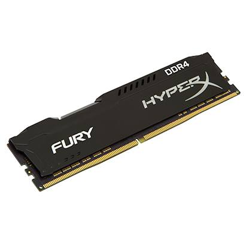
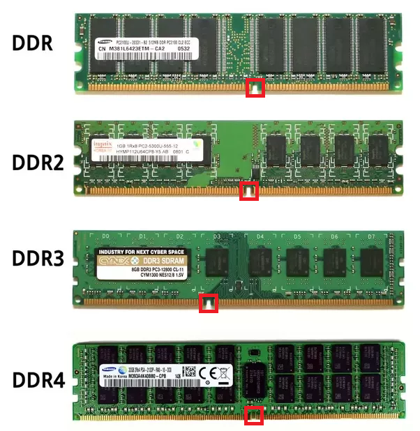
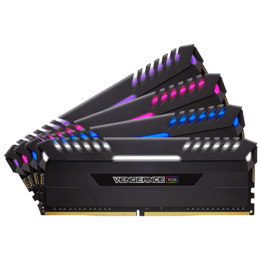
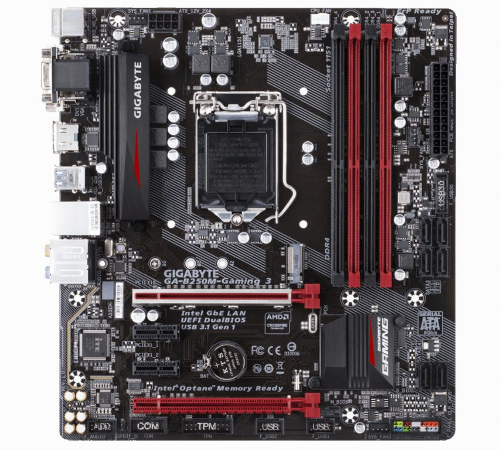

Pamięć RAM (ang. Random Access Memory, czyli pamięć o dostępie swobodnym) jest odpowiedzialna za przechowywanie danych niezbędnych do prawidłowej pracy systemu operacyjnego. To od niej zależy z ilu aplikacji naraz możemy korzystać. Szczególnym zapotrzebowaniem na ten rodzaj pamięci charakteryzują się przeglądarki internetowe, gry oraz programy do edycji grafiki i filmów. Nie pozwala ona na trwały zapis naszych danych, ponieważ jest to pamięć ulotna - po odłączeniu zasilania wszystkie dane zostają utracone. Szczególną cechą pamięci RAM jest jej szybka praca, którą zawdzięcza bezpośredniemu połączeniu z procesorem komputera. Omawiany podzespół sprzedawany jest w postaci prostokątnych modułów, potocznie nazywanymi "kośćmi". Są one montowane na płytach głównych komputerów stacjonarnych oraz niektórych laptopów.

<ImageDescription>Pamięć HyperX Fury, źródło: hyperxgaming.ocm</ImageDescription>

## Najważniejsze parametry

### Rozmiar modułu

Komputery stacjonarne korzystają z pełnowymiarowego standardu oznaczanego skrótem DIMM. W przypadku laptopów mamy do czynienia ze zmniejszonym standardem SO-DIMM. Należy mieć też na uwadze, że niektóre laptopy mogą posiadać nietypowe moduły nazywane "pamięciami dedykowanymi". Informację o zastosowanym module najlepiej zweryfikować u producenta lub spróbować odczytać typ pamięci z naklejki na elemencie zainstalowanym w urządzeniu.

### Typ pamięci

Oprócz standardów rozmiaru dla pojedynczego modułu mamy do czynienia jeszcze z generacjami pamięci oznaczanymi literami DDR, DDR2, DDR3 itd. Aktualnie na rynku królują już tylko moduły z cyfrą 3 oraz 4. Poprzedniczki zostały całkowicie wyparte z rynku. Przed zakupem kości pamięci RAM należy sprawdzić jakiego typu modułów potrzebuje nasza płyta główna. Taką informacje znajdziemy na stronie internetowej jej producenta lub na samej płycie głównej. Generację modułu można także rozróżnić wizualnie po miejscach wcięć w stykach modułu:

<ImageDescription>Miejsca wcięć modułów pamięci RAM, źródło: quora.com</ImageDescription>

### Częstotliwość odświeżania

Parametr ten jest podawany w MHz (megahercach) i mówiąc prosto określa szybkość pracy naszej pamięci. Oczywiście, im wyższa wartość odświeżania, tym lepiej. Należy jednak uważać, aby dana częstotliwość była wspierana przez płytę główną, na której to montujemy moduł. Tak samo jak w przypadku poprzedniego parametru, tu również należy sprawdzić czy dane urządzenie lub płyta główna obsługuje daną prędkość.

### Opóźnienie

Parametr oznaczany skrótem CL, który wyraża liczbę "cyklów zegara taktującego". Nie wchodząc w szczegóły: mniejsza wartość = mniejsze opóźnienie = szybsza praca. W przypadku tego parametru nie ma potrzeby sprawdzania jego kompatybilności z płytą główną, z wyjątkiem jednego przypadku, gdzie należy zwrócić uwagę na jego wartość i który zostanie opisany później.

### Chłodzenie **modułów oraz dodatkowe** funkcje

Niektóre moduły wyposażone są w metalowe obudowy spełniające funkcję radiatorów odprowadzających ciepło. Jeśli użytkownik zamierza bawić się w tzw. overclocking, czyli zmienianie fabrycznych parametrów pracy urządzenia, powinien zainteresować się takimi modułami. Kolejną dodatkową funkcją jest podświetlenie RGB LED. Najczęściej do takich pamięci dołączane jest specjalne oprogramowanie pozwalające sterować podświetleniem modułów.

<ImageDescription>Corsair VENGEANCE RGB, źródło: corsair.com</ImageDescription>

### Pojemność

Na koniec, chyba najbardziej oczywisty, parametr wyrażany w dobrze znanych nam GB (gigabajtach). Pojemność kupowanego moduł zależy od nas. Przyjęło się, aby pojemność RAM-u w komputerze zwiększać dwukrotnie (2GB, 4GB, 8GB, 16GB...), ale nic nie stoi na przeszkodzie, żeby wyposażyć maszynę w np. 3 gigabajty. Poniżej podaję przybliżone pojemności pamięci RAM jakie powinien posiadać nasz komputer wyposażony w system Microsoft Windows:

- **2GB** - totalne minimum, nie zapewni komfortowego użytkowania komputera
- **4GB** - wystarczająca ilość pamięci do pracy w Windowsie 7 oraz do umiarkowanej pracy w Windowsie 10 (mimo, iż wymagania 10-tki są takie same co 7-ki)
- **8GB** - pozwala na komfortową pracę z systemem Windows 10 oraz na otworzenie wielu aplikacji, niektóre z mniej wymagających gier powinny już mieć wystarczającą ilość pamięci do przyjemnej rozgrywki
- **16GB** - ilość pozwalająca na zabawę z bardzo pamięciożernymi aplikacjami oraz na uruchomienie najnowszych gier

<AdSense/>

## Dokładanie pamięci do komputera

W przypadku instalowania pamięci w nowo składanym komputerze należy jedynie dopilnować, aby płyta główna komputera obsługiwała dany moduł (rozmiar, typ/generacja, częstotliwość). W przypadku dobierania pamięci rozszerzającej obecną, zainstalowaną już w komputerze pamięć RAM, należy kierować się paroma zasadami:

1. Częstotliwości pracy modułów muszą być takie same (choć nowe płyty główne potrafią już radzić sobie z różnicą prędkości - wszystkie moduły zostają przełączone na częstotliwość równą najwolniejszemu modułowi)
2. Wartość CL (opóźnienie) musi być taka sama
3. Dobrze jest gdy moduły pochodzą od tego samego producenta

Niespełnienie podanych powyżej zasad może (choć nie musi) skutkować zdestabilizowaniem pracy całego komputera. Może się to objawiać losowymi zawieszeniami pracy systemu operacyjnego lub pojawieniem się tzw. "niebieskiego ekranu śmierci" (BSOD - Blue Screen Of Death). Natomiast spełniając podane zasady może także zwiększyć ogólną wydajność pamięci uruchamiając tzw. tryb dual channel (o którym za chwilę).

## Łączenie modułów w pary

Tryb dual channel, bo o nim mowa, jest to specjalny tryb płyty głównej wykorzystujący dwa moduły pamięci RAM do zwiększenia finalnej przepustowości całego magazynu danych. Omawiane w poprzednim podrozdziale zasady gwarantują, że tryb ten zostanie uruchomiony dla zainstalowanych modułów pamięci. Nowsze płyty główne coraz lepiej radzą sobie z różnicami w zainstalowanych pamięciach (nawet w przypadku występowania różnicy w pojemnościach), ale jeśli istnieje możliwość dokupienia modułu o takich samych parametrach, warto to zrobić.

Specjalnie pod kątem wykorzystania trybu dual channel producenci oferują zestawy zawierające dwie identyczne kości. Takie zestawy oznaczane są symbolem 2x (np.: 2x4GB). Takie rozwiązania warte są zainteresowania, ponieważ jeśli mamy wystarczającą ilość wolnych slotów na płycie głównej i chcemy zakupić 8 gigabajtów pamięci lepszym rozwiązaniem będzie kupienie 2x4GB zamiast 1x8GB.

Żeby aktywować omawiany tryb, oprócz dobrania odpowiednich parametrów, moduły należy umieścić w wyznaczonych przez producenta płyty głównej slotach. Są one oznaczone nazwami nadrukowanymi obok slotów. Niektórzy producenci stosują także różne kolory samych gniazd. Dla przykładu: dwa sloty będą koloru czerwonego, a dwa niebieskiego - włożenie modułów do slotów tego samego koloru pozwoli na aktywowanie trybu dual channel.

<ImageDescription>Płyta GIGABYTE GA-B250M-Gaming 3 - sloty wyróżnione kolorem czerwonym i czarnym, źródło: gigabyte.pl</ImageDescription>

Wszelkie dodatkowe informacje dotyczące instalacji modułów w gniazdach, a także informacje o warunkach jakie muszą spełniać obie kości, można znaleźć w instrukcji dołączonej do płyty głównej.

## Czynności po uruchomieniu komputera

Jeśli komputer rozpozna nowy moduł pamięci RAM może przy pierwszym uruchomieniu ją przetestować, dlatego też rozruch maszyny po takim zabiegu może potrwać dłużej niż zwykle. Niektóre urządzenia wyświetlają nawet komunikat potwierdzający wykrycie nowego modułu i przeprowadzenie testu (np. laptopy HP). Jeśli komputer nie wyświetli komunikatu możemy też ręcznie wejść do BIOS-u i sprawdzić pojemność posiadanej pamięci oraz czy pracuje ona w trybie dual channel.
