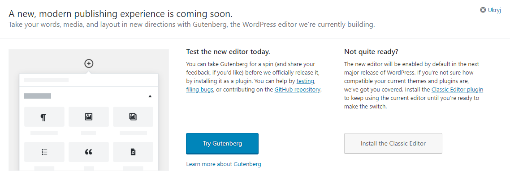
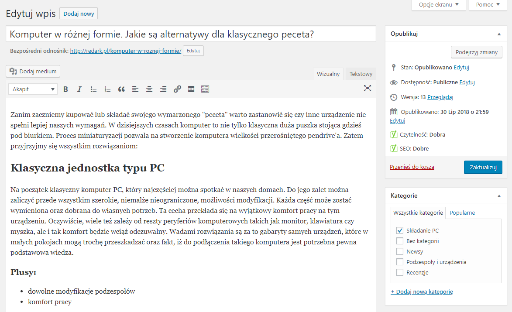
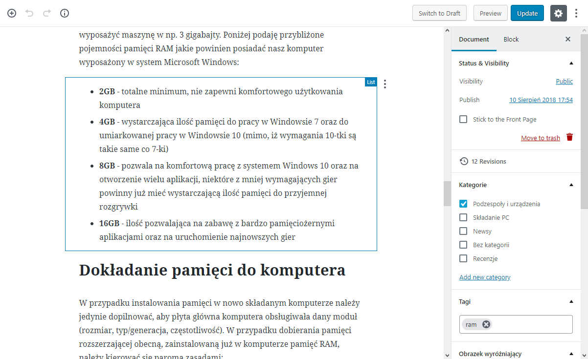
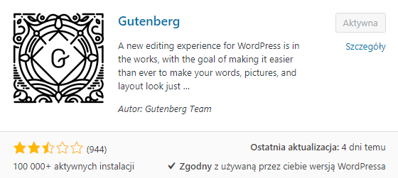

Powodem dłuższej przerwy w publikowaniu artykułów na portalu nie była wyłącznie wielka fala upałów przechodzących nad Polską, która skutecznie odebrała mi chęci do pracy. Drugą, dość niespodziewaną przyczyną okazało się pojawienie takiego oto komunikatu na stronie głównej panelu administracyjnego Wordpressa:

<ImageDescription>Komunikat informujący o nadejściu nowego edytora treści</ImageDescription>

Jak się dowiedziałem, niedawno została przeprowadzona automatyczna aktualizacja do wersji o numerze 4.9.8 wszystkich witryn opartych o tą technologię. Wprowadziła ona, tak jak każda poprzednia aktualizacja, poprawki błędów i drobne usprawnienia. Lecz nie to obudziło społeczność, a pokazany już komunikat.

## O co tyle zamieszania?

Komunikat informuje o nadchodzącej dużej aktualizacji oznaczonej okrągłą liczbą 5.0. Jedną z największych nowości będzie nowy edytor treści o nazwie Gutenberg (na cześć twórcy pierwszej przemysłowej metody druku). Twórcy CMS-a podają, że udostępniają nowy edytor w postaci wtyczki gotowej do zainstalowania w witrynie wszystkich zainteresowanych. Ma to na celu powiększenie liczby testerów nowej technologii (i wyeliminowanie błędów) oraz na danie administratorom szansy wstępnego przygotowania motywu witryny przed wypuszczeniem aktualizacji. Twórcy zapewniają, że nawet nieprzygotowany motyw nie powinien ulec zniekształceniu po przejściu na Gutenberga.

## Zmiany są złe?

Mówiąc szczerze? Tak. Dla każdego administratora serwisu internetowego, każda zmiana, zwłaszcza ta, która może zepsuć stronę jest niebezpieczna. Gutenberg kompletnie zmienia podejście do pisania artykułów i dla osoby, która nie interesowała się tymi zmianami, komunikat może wywołać niepokój i zdziwienie. Jeśli o mnie chodzi też nie śledziłem na bieżąco planowanej przyszłości Wordpressa i po zobaczeniu komunikatu szukałem na forach opinii innych użytkowników.

<ImageDescription>Tak wygląda edytor treści teraz...</ImageDescription>

<ImageDescription>...a tak ma wyglądać Gutenberg</ImageDescription>

## Ciężki los Gutengerga

Gutenberg nie ma lekko. Naturalna niechęć do zmian oraz liczne błędy we wciąż rozwijającym się edytorze zaowocowały niską, wręcz odstraszającą oceną wtyczki w oficjalnym sklepie rozszerzeń Wordpressa. Po otwarciu komentarzy użytkowników naszym oczom ukazuje się litania zażaleń na nowy edytor. Ze świecą szukać opinii osób, które powiedziałyby twórcom „dobra robota!” albo „fajny pomysł!”. Z głównych wad przedstawionych w komentarzach można zaliczyć niedopracowanie edytora i dużą liczbę błędów. Część osób informuje o wolnym działaniu i o ryzyku utracenia swojej cennej pracy. Można natknąć się też o prośby skierowane do twórców o to, aby Gutenberg był i pozostał OPCJONALNĄ wtyczką do Wordpressa. Niestety aktualne stanowisko twórców ws. nowego edytora jest takie, że zastąpi on całkowicie stary edytor wraz z zainstalowaniem aktualizacji 5.0.

<ImageDescription>2.5/5 gwiazdki, to bardzo mało...</ImageDescription>

## Przyszłość Gutenberga i REDARKa

Jeśli chodzi o mnie, to ostatecznie postanowiłem dać szansę Gutenbergowi. Prawdopodobnie nie zdecydowałbym się na to mając już rozbudowany serwis, ale że w REDARKu widnieją (aż!) trzy wpisy, doszedłem do wniosku, że niewiele ryzykuję, a moją ocenę oraz opis aktualizacji i przystosowania całego CMS-a przedstawię w jedynym z następnych artykułów.
