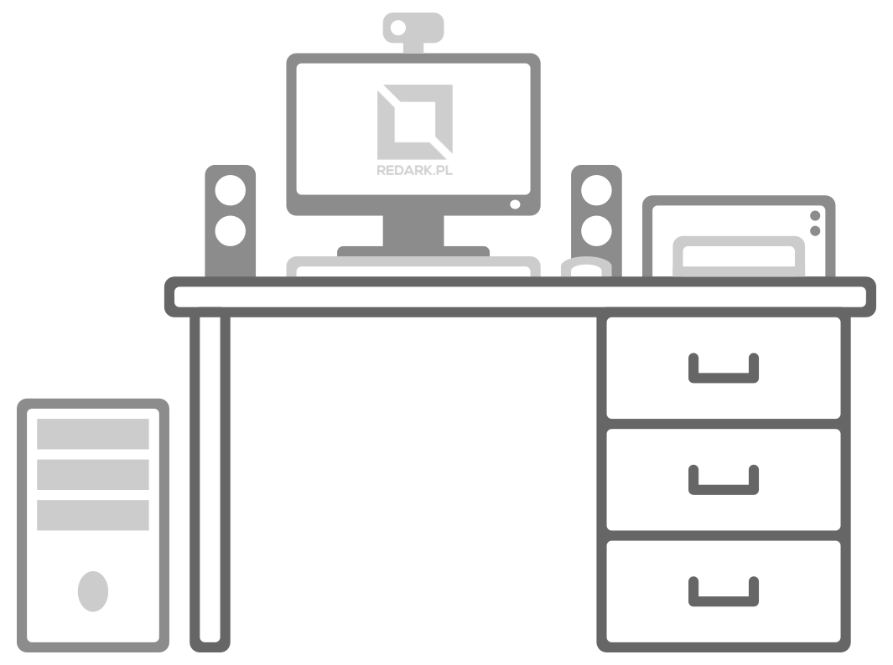

import AssemblingPcFooter from '../../typography/assemblingPcFooter'

W [poprzednim artykule](/komputer-w-roznej-formie) z cyklu „Składanie PC” omówione zostały alternatywy dla klasycznego, składanego „peceta”. Natomiast w tym artykule przybliżę podstawowe oraz dodatkowe elementy stanowiska komputerowego. Nawet jeśli części z czytających temat ten, rodem z pierwszej szkolnej lekcji informatyki, może wydawać się śmieszny, to chcę to usystematyzować w krótki i przystępny sposób.

## Podstawowe elementy

Aby w ogóle mówić o stanowisku komputerowym potrzebnych jest kilka podstawowych elementów takich jak: monitor, jednostka centralna (którą samodzielnie będziemy chcieli złożyć), klawiatura i mysz. Bez tych elementów nie będzie możliwości zrobienia czegokolwiek na komputerze, ani nawet przetestowania jego działania zaraz po złożeniu.

## Elementy warte posiadania

Pozwoliłem sobie oddzielić te dwa elementy od podstawowych, ponieważ nie są one wymagane do uruchomienia komputera, ale warto wyposażyć w nie stanowisko. Pierwszym to fotel, dzięki któremu będziemy mogli pracować w pozycji siedzącej, a drugim, często ignorowanym elementem jest listwa zasilająca. Do podstawowego stanowiska z komputerem i monitorem będziemy potrzebowali jedynie 2 gniazdek 230V, ale nawet jeśli posiadamy wolne gniazdka w ścianie obok stanowiska nadal warto zakupić osobną listwę zasilającą. Więcej informacji na temat tych dwóch rzeczy znajdziecie w osobnych artykułach na ich temat.

<ImageDescription>Schemat przykładowego stanowiska komputerowego</ImageDescription>

## Dodatkowe elementy

Urządzenia wymienione w tym podrozdziale nie są już wymagane na stanowisku komputerowym i są dokupywane wedle potrzeb użytkownika. Jeśli korzystający ze stanowiska zamierza słuchać muzyki lub oglądać filmy, naturalnym będzie zaopatrzenie komputera w głośniki lub słuchawki (jeśli potrzebuje prywatności lub odciąć się od świata zewnętrznego). Osoba nagrywająca filmiki lub prowadząca wideo rozmowy przez Internet zaopatrzy się w kamerkę internetową lub inną kamerę kompaktową, a nawet w zewnętrzny mikrofon, aby poprawić jakość swojego głosu. Grafik z chęcią sięgnie po tablet graficzny, który usprawni jego pracę. Nie należy też zapominać o drukarce. Niezależnie od użytkownika (przedsiębiorstwo wystawiające faktury czy zwykły domownik) możliwość wydrukowania dokumentu czy maila jest bardzo przydatna.

<AdSense/>

## Podłączenie stanowiska do Internetu

Na zakończenie doprowadzenie połączenia internetowego do naszego komputera. Obecnie coraz mniej osób decyduje się na bezpośrednie podłączenie kabla usługodawcy do komputera. Prawie zawsze chcemy, aby dom bądź mieszkanie posiadało sieć bezprzewodową Wi-Fi, a i sami usługodawcy coraz częściej dorzucają własne urządzenia sieciowe. Jeśli usługodawca nie dostarcza nam takiego urządzenia albo planujemy stworzenie własnej, rozbudowanej sieci wewnętrznej, warto rozważyć zakup takich urządzeń jak:

- **switch** – swojego rodzaju rozdzielacz kabla internetowego, który pozwala obsłużyć kilka urządzeń na jednym kablu lub rozdzielić sygnał na kilka innych urządzeń sieciowych (np. do różnych kondygnacji domu)
- **router** – najbardziej popularne urządzenie „z antenką”, posiada analogiczne właściwości do switcha oraz pozwala na zaawansowane sterowanie ruchem sieciowym oraz utworzenie sieci bezprzewodowej Wi-Fi
- **repeater Wi-Fi** – urządzenie bardzo przydatne, gdy w którymś z pomieszczeń mamy słaby sygnał sieci bezprzewodowej Wi-Fi, ma formę dużej wtyczki podłączanej do gniazdka 230V i służy do wzmacniania istniejącej już sieci bezprzewodowej w naszym domu
- **serwer NAS** – urządzenie przydatne dla osób, które często przesyłających sobie różnego rodzaju multimedia, liczne funkcje tego urządzenia zostaną opisane w osobnym artykule

<AssemblingPcFooter nextPost='/kablologia-przewody-jednostki-centralnej'/>
