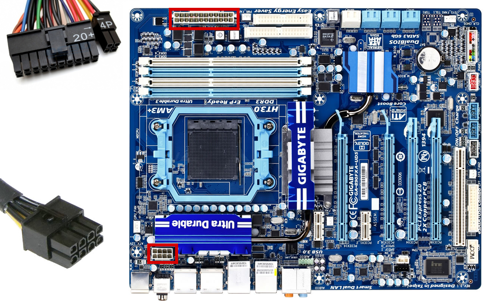
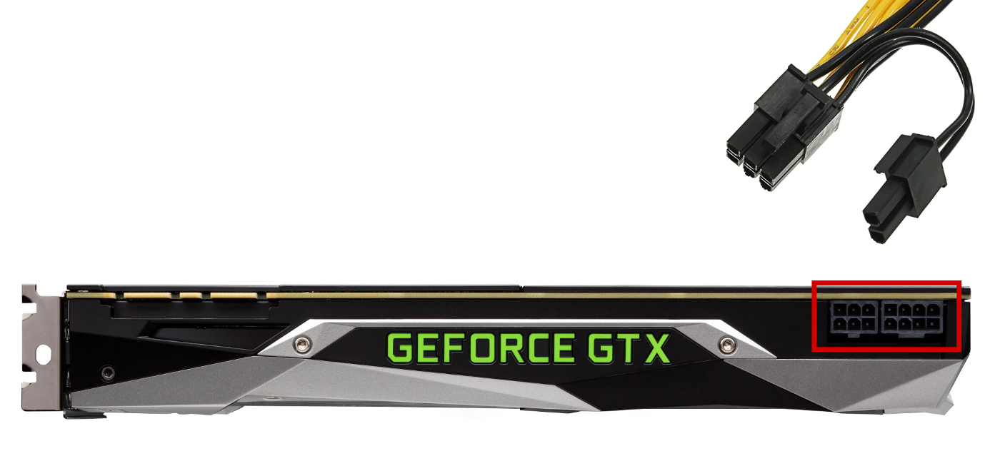
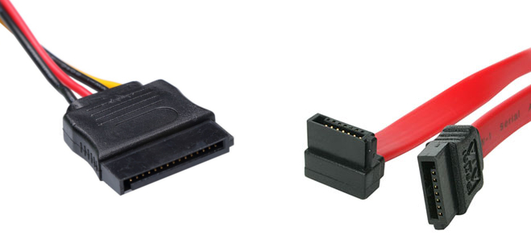
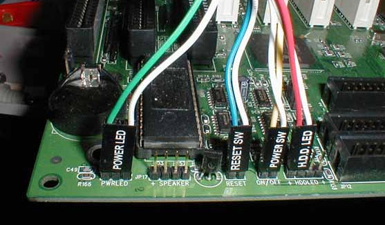
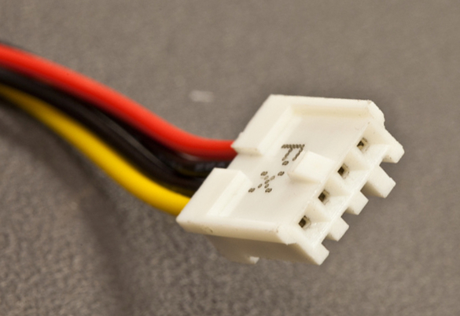

import AssemblingPcFooter from '../../typography/assemblingPcFooter'

W [serii „Składanie PC”](/skladanie-pc) omówione już zostały elementy z jakich składa się typowe [stanowisko komputerowe](/elementy-stanowiska-komputerowego). Teraz kolej na te wszystkie przewody, które znajdują się wewnątrz obudowy, jak i te plątające się za naszym biurkiem. Tak jak mówiłem we wstępie do tego poradnika, nie chcę podawać poleceń typu „to podłącz tu, a to tu”, tylko nauczyć czytelnika rozpoznać złącze i dedukować gdzie je podłączyć. Dlatego bez zbędnego gadania przejdźmy do pierwszej części kablologii, czyli przewodów wewnątrz naszej obudowy.

## Zasilanie płyty głównej i procesora

Większość przewodów w naszej obudowie zajmują te, które doprowadzają prąd stały generowany w naszym zasilaczu do wszystkich podzespołów. Największą wtyczką wychodzącą z zasilacza jest 24 pinowe złącze ATX pokazane na zdjęciu poniżej. Należy zaznaczyć, że starsze płyty główne używały złącza z czterema pinami mniej, dlatego też większość producentów stosuje w swoich zasilaczach dwie wtyczki: jedną 20 pinową i drugą 4 pinową. Obie te wtyczki na swoich krawędziach posiadają zaczepy umożliwiające ich trwałe połączenie ze sobą. W taki sposób można zachować kompatybilność ze starymi, jak i nowymi płytami głównymi.

Rosnące zapotrzebowanie procesorów na energię elektryczną wymusza doprowadzenie dodatkowych kabli zasilających w taki sposób, aby nie zmieniać (i tak już dużego) standardu wtyczki ATX. Omawiane gniazdo jest zawsze montowane w pobliżu naszego procesora na płycie głównej i posiada 4 lub 8 pinów.

<ImageDescription>Płyta Gigabyte GA-890FXA-UD5 z zaznaczonymi gniazdami sekcji zasilania</ImageDescription>

<InfoBlock>Kolory przewodów zasilacza (o ile producent nie zastosował jednolitego koloru) oznaczają napięcia płynące przez nie do podzespołów: żółty – 12V, czerwony – 5V, pomarańczowy – 3.3V, czarny – masa. Pozostałe kolory oznaczają kable sygnałowe, sterujące pracą zasilacza. Takie oznaczenie jest szczególnie przydatne gdy użytkownik chce zamontować oświetlenie LED biurka lub obudowy i podłączyć je do zasilacza komputera.</InfoBlock>

## Zasilanie kart graficznych PCI-E

Prądożerne karty graficzne wymagają dodatkowej energii do pracy, ponieważ PCI-E, czyli poziome złącze na płycie głównej, nie jest w stanie tyle jej dostarczyć. W takim przypadku zasilanie jest dostarczane przez 6 lub 8 pinowe kable podłączanie do krawędzi karty graficznej. Tak samo jak w przypadku wtyczki ATX, producenci zasilaczy często stosują wtyczkę 6+2, aby zachować kompatybilność z wszystkimi kartami.

<ImageDescription>Karta graficzna GTX 1080 Ti zasilanie pobiera z dwóch wtyczek: jednej 6 pinowej i drugiej 8 pinowej</ImageDescription>

## Kable dysków pamięci masowych

Nieważne czy posiadamy tradycyjny dysk talerzowy czy nowoczesny SSD, musimy dostarczyć do nich zasilanie oraz sygnał z płyty głównej. W przypadku starego typu sprzętu napotkamy złącze zasilające MOLEX oraz ogromną (najczęściej) szarą taśmę sygnałową IDE. Taśmy te zostały już całkowicie wyparte przez nowy standard SATA (o którym za chwilę), ale warto wiedzieć, że coś takiego kiedyś istniało.

<ImageDescription>Taśma IDE oraz wtyczka zasilająca MOLEX</ImageDescription>

Drugim rozwiązaniem, które jest aktualnie stosowane w domowych komputerach, jest standard SATA. Na oba kable przyjęło mówić się tak samo – kabel zasilający SATA i kabel sygnałowy SATA.

<ImageDescription>Kabel zasilający SATA oraz jego nieco węższy kabel sygnałowy</ImageDescription>

<InfoBlock>Obie powyższe technologie oraz kable służyły też do podłączania napędów optycznych montowanych z przodu komputera.</InfoBlock>

<AdSense/>

## Pozostałe okablowanie

Z pozostałych, mniejszych kabli, które można spotkać w obudowie i należy omówić, są różnego rodzaju gniazda szpilkowe nazywane goldpinami. Za ich pomocą podłączymy wszystkie elementy panelu przedniego obudowy (przyciski, diody LED, gniazda USB i audio). Występują one w postaci pojedynczych kabelków zakończonych pojedynczym pinem lub w postaci zintegrowanych wtyczek. Podobnym gniazdem połączymy także wszelkiego rodzaju wentylatory chłodzące nasz komputer.

<ImageDescription>Goldpiny obsługujące przedni panel obudowy komputera, źródło: experts-exchange.com</ImageDescription>

Ostatnim elementem o którym warto wspomnieć jest wtyk MINI MOLEX. Nadal montuje się go w niektórych zasilaczach i służył on do zasilania archaicznych już napędów dysków miękkich, czyli dyskietek (tak, to coś co klikamy, żeby zapisać projekt w Wordzie i masie innych programów).

<ImageDescription>Kabel zasilający MINI MOLEX</ImageDescription>

<AssemblingPcFooter nextPost='/kablologia-pajeczyna-za-biurkiem'/>
