import AssemblingPcFooter from '../../typography/assemblingPcFooter'

Kontynuując temat z [poprzedniego artykułu](/kablologia-przewody-jednostki-centralnej) zajmiemy się dziś kablami tworzącymi swoistą pajęczynę za naszym biurkiem. Informacje zawarte poniżej są bardzo ważne, ponieważ pozwolą prawidłowo podłączyć komputer po jego zbudowaniu. Dodatkowo, sprawne rozpoznawanie złączy przyda się podczas wyboru płyty głównej lub laptopa.

## Parametry złączy i kabli

### Technologia "Plug and Play"

Urządzenia wspierające tą technologię potrafią komunikować się z komputerem zaraz po podłączeniu. Dzięki temu, system operacyjny może prawidłowo rozpoznać nowe urządzenie, a także rozpocząć instalację sterowników potrzebnych do prawidłowego działania urządzenia.

### Technologia "Hot Plug"

Złącza "Hot Plug" nazywane także "Hot Swap" pozwalają na podłączanie i odłączanie urządzeń podczas pracy komputera. Brak wsparcia tej technologii spowodowałby zawieszenie i wywołanie ekranu śmierci po odłączeniu chociażby zwykłego pendrive'a.

### Typ męski i żeński

Wtyczki oraz gniazda można podzielić na dwa typy: męski oraz żeński. Wtyki i gniazda męskie posiadają styki w postaci bolców, a żeńskie w postaci otworów. Ten podział jest przydatny podczas kupowania niektórych przedłużaczy, rozdzielaczy sygnału i przejściówek.

## Podłączanie ekranu lub projektora

Aktualnie na rynku można napotkać 4 złącza służące do przesyłania obrazu. Niektóre z nich posiadają także możliwość przesyłania opcjonalnego sygnału audio. Wymienione zostaną w kolejności ich wprowadzenia.

### D-Sub (mylnie nazywany VGA)

Przestarzały kabel oznaczany kolorem niebieskim przesyłający obraz analogowy, przez co jest wrażliwy na zakłócenia elektromagnetyczne. Mimo wad, nadal jest stosowany w tańszych monitorach i kartach graficznych.

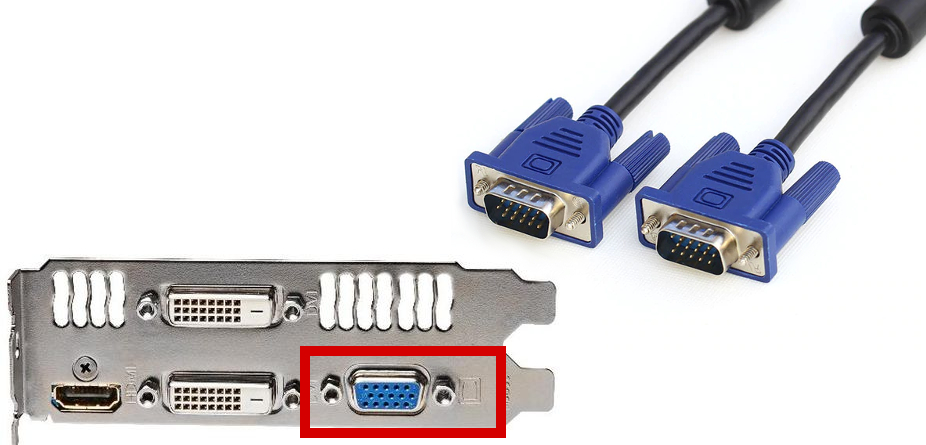

<ImageDescription>Kabel D-Sub oraz jego gniazdo na karcie graficznej Gigabyte GT640</ImageDescription>

### DVI

Standard oznaczany białym kolorem, ma zastąpić kabel D-Sub. Tak samo jak u poprzednika, mamy tu do czynienia wyłącznie z przesyłaniem obrazu. Złącze istnieje w 3 wersjach, które można odróżnić wyglądem pinów:

- **DVI-D** - przesyła sygnał cyfrowy
- **DVI-A** - przesyła sygnał analogowy
- **DVI-I** - przesyła sygnał cyfrowy oraz analogowy

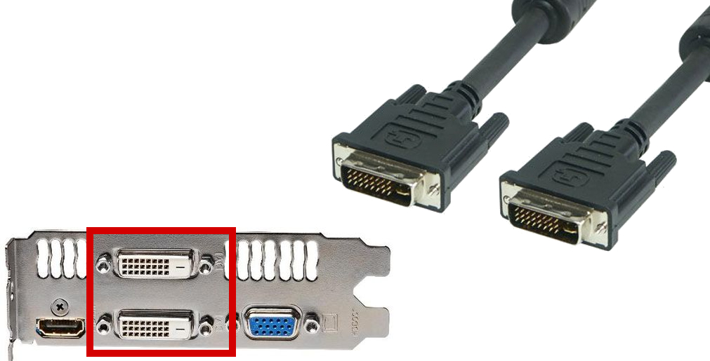

<ImageDescription>Kabel DVI oraz jego 2 białe gniazda</ImageDescription>

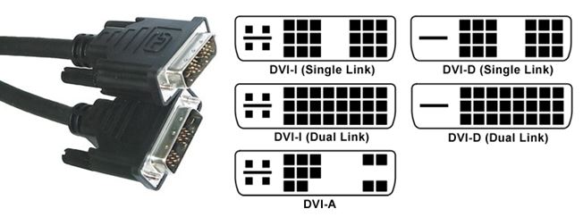

<ImageDescription>Wersję obsługującą sygnał analogowy można poznać po 4 pinach wokół poziomego styku</ImageDescription>

<WarningBlock>Należy zwrócić uwagę na typ posiadanego złącza DVI. Wersje DVI-A oraz DVI-I idealnie nadają się na pasywne przejściówki do gniazda D-Sub. Natomiast DVI-D wymaga zastosowania aktywnego konwertera cyfrowo-analogowego, który jest znacznie droższy od zwykłej przejściówki.</WarningBlock>

<AdSense/>

### HDMI

Jest to pierwszy interfejs pozwalający na przesyłanie obrazu wysokiej rozdzielczości razem z 8 kanałowym dźwiękiem. Standard ten jest cały czas rozwijany, a jego nowe wersje pozwalają m.in. na przesyłanie obrazu 3D bądź udostępnianie połączenia Ethernet. Po pełną listę obsługiwanych funkcji odsyłam do [strony Wikipedii](https://pl.wikipedia.org/wiki/HDMI) poświęconej temu standardowi.

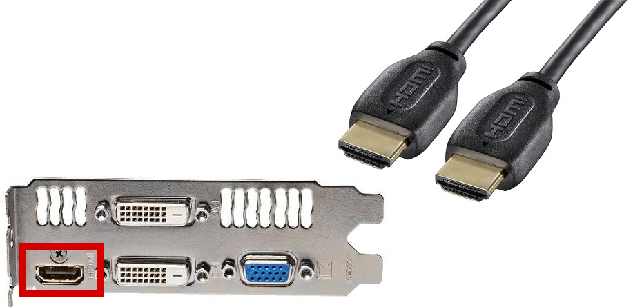

<ImageDescription>Standardowy kabel HDMI z zaznaczonym gniazdem na karcie graficznej</ImageDescription>

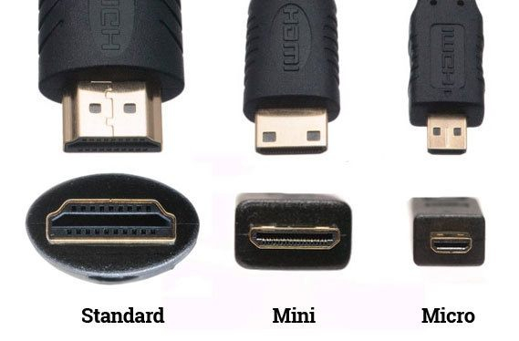

<ImageDescription>Wszystkie rozmiary wtyczek HDMI, źródło: quora.com</ImageDescription>

### DisplayPort

Standard opracowany 4 lata po HDMI. Tak samo jak poprzednik, pozwala na przesyłanie cyfrowego obrazu i dźwięku. Najczęściej wersje standardowe tego gniazda spotyka się na kartach graficznych, monitorach i projektorach, a wersje mini w laptopach.

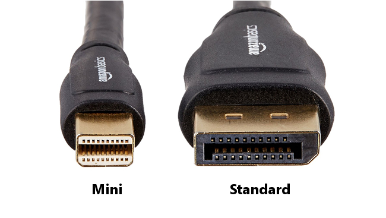

<ImageDescription>Wersja standardowa oraz mini wtyczki DisplayPort</ImageDescription>

## Gniazda audio

### Złącza jack 3.5 mm

Drugim ważnym zestawem portów, na które warto zwrócić uwagę, są te odpowiedzialne za podłączenie sprzętu audio. Sygnał przesyłany jest analogowo poprzez podłużne złącze typu jack 3.5 mm. Aby odróżnić je od siebie, producenci stosują symbole lub kolory obwódek gniazd:

- **ZIELONY** - wyjście audio dla głośników lub słuchawek
- **RÓŻOWY** - mikrofonowe wejście audio
- **NIEBIESKI** - wejście audio do podłączenia innego źródła dźwięku np. instrumentu muzycznego
- **POMARAŃCZOWY** - wyjście głośnika centralnego i subwoofera
- **CZARNY** - wyjście głośników bocznych (lewy i prawy)
- **SZARY** - wyjście głośników tylnych (lewy i prawy)

Płyty główne z podstawową kartą dźwiękową posiadają tylko i wyłącznie trzy pierwsze gniazda, co pozwala to na podłączenie maksymalnie zestawu głośników w konfiguracji 2.1. Natomiast podłączenie bardziej rozbudowanych zestawów audio będzie wymagało zaopatrzenia się w płytę główną o lepszej karcie dźwiękowej lub w zewnętrzny interfejs audio.

<Gallery>
- 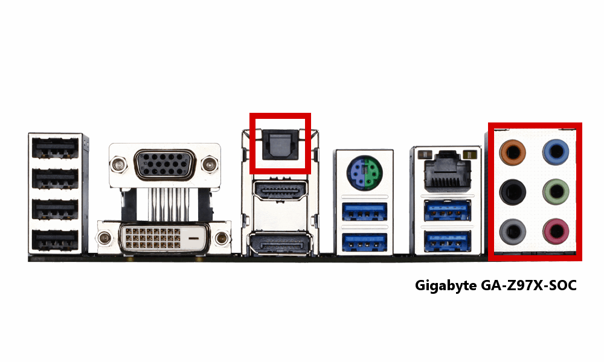
- 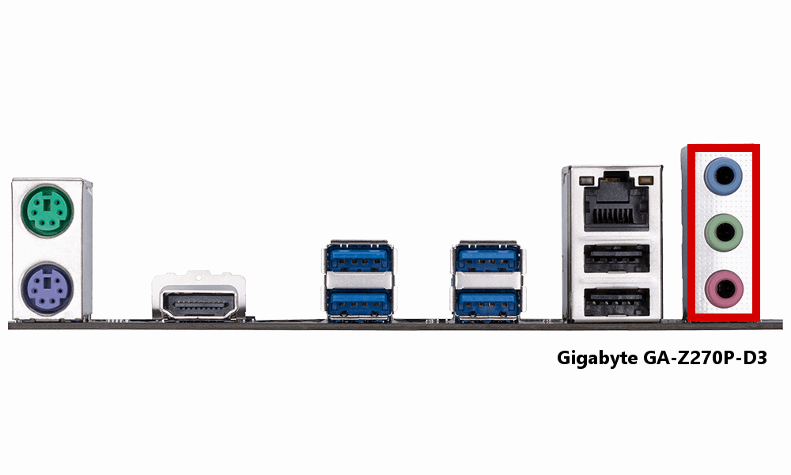
- 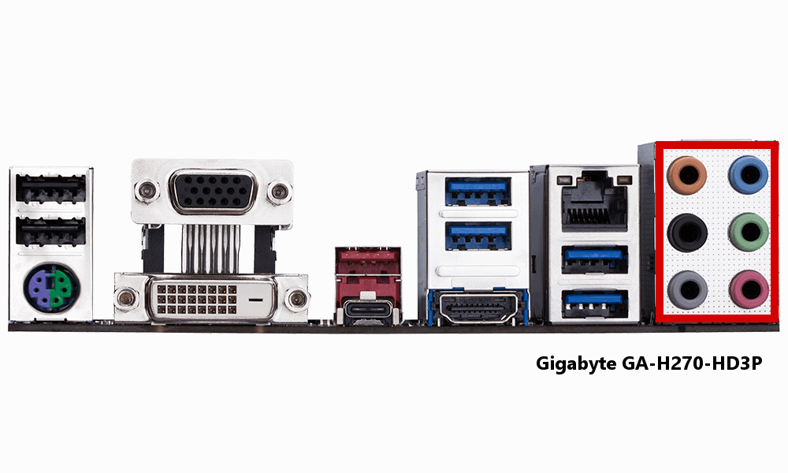
</Gallery>

W przypadku laptopów mamy zazwyczaj do czynienia z podstawową funkcjonalnością, czyli słuchawki + mikrofon. Są one najczęściej zintegrowane w jedno gniazdo 4 pinowe.

### Złącza S/PDIF

Alternatywą dla analogowych złączy jack są dwa kable przesyłające cyfrowy dźwięk w standardzie S/PDIF. Pierwszy z nich to kabel koncentryczny z gniazdem oznaczonym kolorem pomarańczowym. Drugi to TOSLINK, czyli kabel światłowodowy opracowany przez firmę Toshiba. Zalecany jest do podłączania urządzeń, które dzieli znaczący dystans, ponieważ jest całkowicie odporny na zakłócenia.

<ImageDescription>Kabel optyczny i koncentryczny oraz odpowiadające im gniazda</ImageDescription>

## Złącze Ethernet

Złącze Ethernet, nazywane potocznie gniazdem Internet, służy, jak sama nazwa wskazuje, do podłączenia naszego komputera do sieci. Niektóre płyty główne mogą posiadać nawet 2 karty sieciowe i co za tym idzie, dwa złącza Ethernet. Droższe modele płyt mogą posiadać wbudowane karty bezprzewodowe umożliwiające połączenie komputera z siecią Wi-Fi. W takich modelach, wśród złączy panelu tylnego, można odnaleźć gniazda koncentryczne służące do podłączenia zewnętrznej anteny.

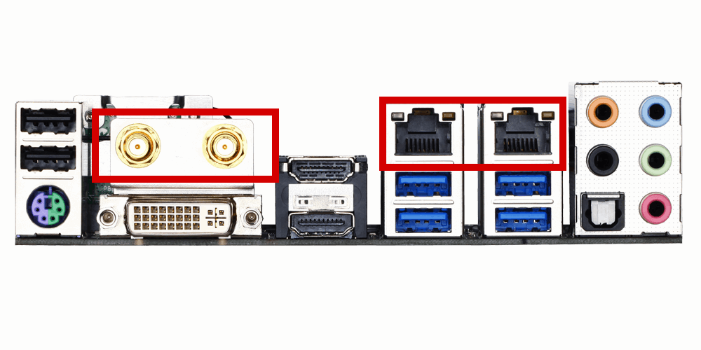

<ImageDescription>Płyta Gigabyte GA-Z97N-WIFI z dwoma interfejsami przewodowymi oraz gniazdami do podłączenia anteny Wi-Fi</ImageDescription>

## USB - złącze do wszystkiego

Chyba nie ma osoby, która nie spotkałaby się ze złączem USB. Możemy je spotkać w komputerach, laptopach, telefonach, samochodach i w wielu innych miejscach. Interfejs ten jest na tyle ważny i rozbudowany, że zostanie dokładnie omówimy w następnej części poradnika, żeby nie przedłużać tego (i tak już długiego) artykułu.

<ActionButton to='/kablologia-zlacza-usb'>USB - omówienie standardu</ActionButton>

<AdSense/>

## Złącza wychodzące z użytku

Na koniec złącza, które wychodzą już z codziennego użytku, choć niektóre z nich są wciąż montowane na płytach głównych.

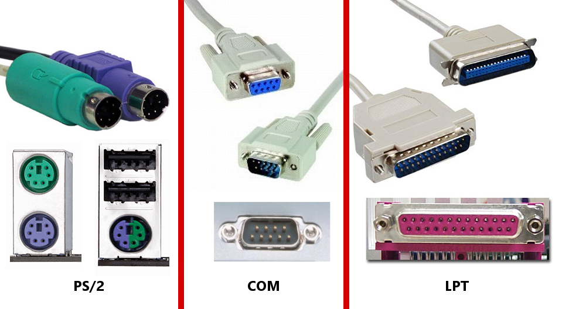

<ImageDescription>Kable oraz gniazda PS/2, COM oraz LPT</ImageDescription>

### PS/2

Najczęściej spotykany port służący do podłączania starszych myszek oraz klawiatur. Port pod myszki oznaczany jest kolorem zielonym (morskim), a dla klawiatur kolorem fioletowym. W nowszych modelach można spotkać też port hybrydowy, który posiada oba kolory.

### COM i LPT

Port COM jest portem szeregowym przypominającym port D-Sub. Można je rozróżnić po liczbie pinów oraz typie gniazda (typ męski) oraz wtyczki (typ żeński). Wykorzystywany jest m.in. w drukarkach fiskalnych bądź interfejsach diagnostycznych do samochodów. Długie niebieskie lub fioletowe gniazdo LPT służyło niegdyś do podłączania drukarek, ploterów i skanerów. Problemy związane z transmisją równoległą oraz duża popularność standardu USB całkowicie wyparła to gniazdo z użytku.

<InfoBlock>Niektórzy producenci, mimo że nie wyprowadzają portów COM i LPT na tylny panel komputera, to nadal oferują funkcjonalność tych portów w postaci pinów do samodzielnego podłączenia, umieszczonych na dole płyty głównej.</InfoBlock>

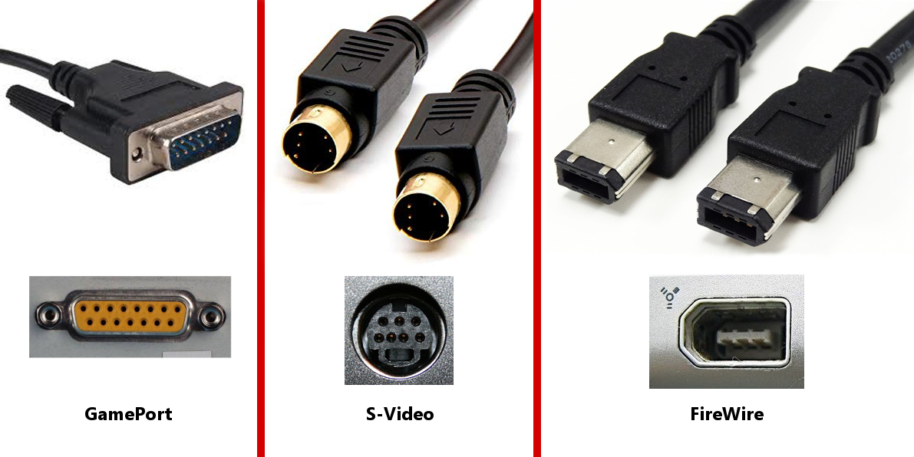

<ImageDescription>Kable oraz gniazda GamePort, S-Video oraz FireWire</ImageDescription>

### GamePort

Bardzo stare złącze służące kiedyś do podłączania różnego rodzaju joysticków bądź gamepadów. Umożliwiało także podłączenie instrumentów muzycznych do karty dźwiękowej. Aktualnie został już całkowicie wyparty przez port USB.

### S-Video

Stare łącze obrazu stworzone do poprawienia jakości obrazu płynącego przez pojedynczego "cincha".

### FireWire

Szeregowe złącze służące do szybkiej komunikacji z np. dyskiem zewnętrznym. Dzisiaj rzadko spotykane z powodu popularności portów USB.

<AssemblingPcFooter nextPost='/kablologia-zlacza-usb'/>
