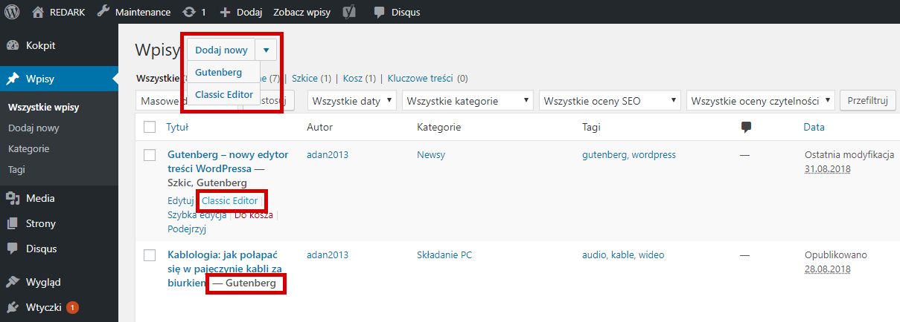
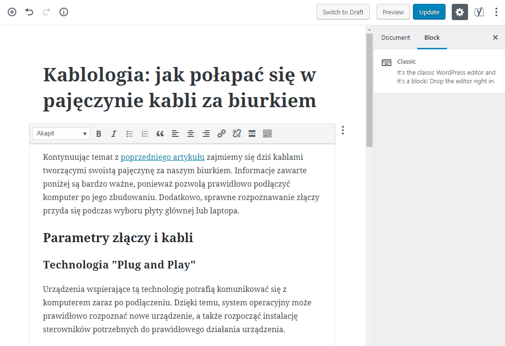
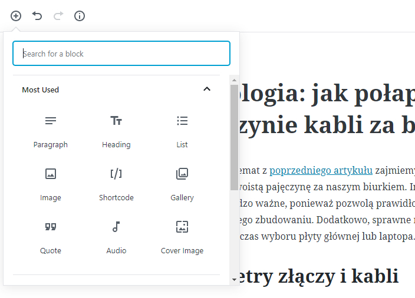
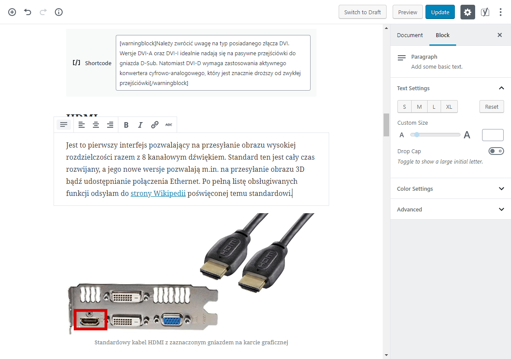
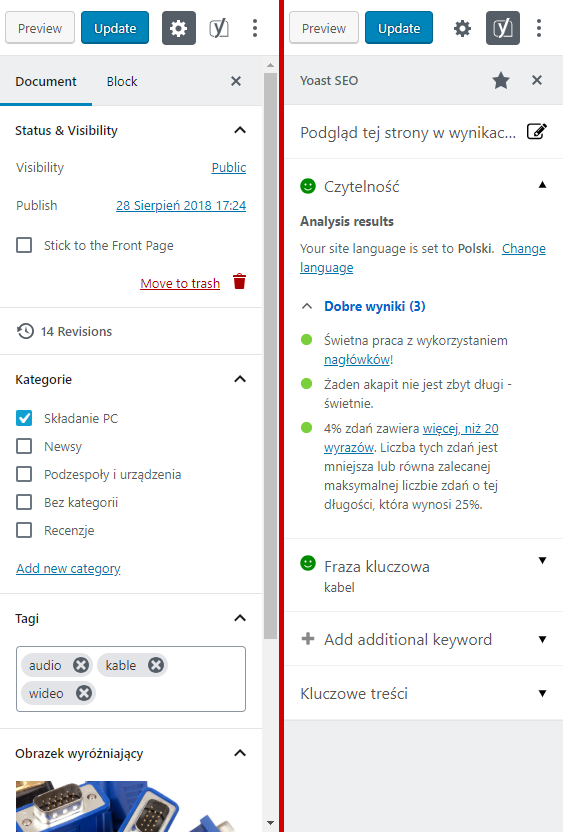
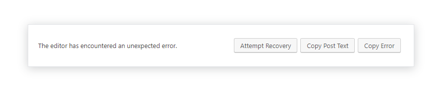

Jakiś czas temu [informowałem Was o komunikacie](/nadchodzi-gutenberg), jaki ukazał się wszystkich użytkownikom WordPressa. Mowa tutaj o przygotowaniach do dużej aktualizacji oznaczonej numerem 5.0 i nadejściu nowego edytora treści o nazwie Gutenberg. Dzisiaj, zgodnie z zapowiedzią z tamtego artykułu, przedstawię moją opinię o tych zmianach.

## Proces instalacji Gutenberga

Przejście na nowy edytor zostało maksymalnie uproszczone, przez co nie wymaga ingerowania w pliki CMSa. Proces instalacji ogranicza się do kliknięcia niebieskiego przycisku na komunikacie o aktualizacji lub tak samo jak w przypadku każdego innego rozszerzenia, znalezieniu edytora w sklepie WordPressa. Na koniec wystarczy jedynie uruchomić wtyczkę i już możemy cieszyć się nowym edytorem.

## Kompatybilność z motywem strony

Tak jak czytaliśmy w komunikacie, Gutenberg ma nie kolidować z motywem naszej strony, a czytelnicy nie powinni zauważyć różnicy w wyglądzie artykułów. Dlatego też, zaraz po instalacji nowego edytora i napisaniu testowego artykułu, byłem ciekaw jak (mój autorski) motyw REDARKa zareagował na zmiany i muszę przyznać, że twórcy mieli rację. W artykule było widać drobne różnice, ale dotyczyły one jedynie zmiany samych marginesów.

## Zachowanie wstecznej kompatybilności

Aby umożliwić bezpieczny proces przejścia na nowy edytor twórcy WordPressa rozpowszechnili Gutenberga w postaci wtyczki. Nie zastępuje on całkowicie klasycznego edytora, lecz pozwala na korzystanie z obu jednocześnie. W menu bocznym pojawia się nowa pozycja pozwalająca na kontakt z twórcami i zgłaszanie błędów, a przy artykułach dodatkowe komunikaty informujące za pomocą którego z edytorów napisany jest dany tekst.

<ImageDescription>Po zainstalowaniu Gutenberga nie tracimy dostępu do poprzedniego edytora</ImageDescription>

Teraz, jeśli otworzymy artykuł, tekst domyślnie pojawi się w Gutenbergu, ale przekonwertowany na niego zostanie dopiero podczas zapisu treści. Powrót do starego edytora umożliwia przycisk zaprezentowany na powyższej grafice.

<AdSense/>

Na poniższym zdjęciu, oprócz opisanej wcześniej możliwości swobodnej żonglerki edytorami, tekst artykułu napisanego za pomocą starego edytora w nowym Gutenbergu znajduje się w bloku o nazwie „Classic”, który zachowuje wszystkie opcję klasycznego edytora. Tak, twórcy stworzyli edytor w edytorze i nie mówię tego myśląc „O nie, co oni zrobili, kto się w tym połapie?!”, tylko chcę podkreślić, że jest to genialne rozwiązanie w kwestii wstecznej kompatybilności. Taki bowiem zabieg pozwala na przetrzymywanie obecnej już treści w klasycznym edytorze i rozbudowanie artykułu o nowe funkcje dostępne w Gutenbergu.

<ImageDescription>Zawartość z poprzedniego edytora nie jest automatycznie przenoszona do bloków. Cała treść trafia do bloku classic, który jest odzwierciedleniem starego edytora</ImageDescription>

## Budowanie z bloków – nowe podejście do projektowania stron www

W poprzednim akapicie użyłem sformułowania „tekst artykułu znajduje się w bloku”. Główną rewolucją nowego edytora jest zerwanie z pisaniem treści w zwykłym edytorze tekstowym, który pozwala jedynie na stworzenie zwykłego tekstu i nie dostosowuje go do urządzeń mobilnych. Gutenberg opiera się na budowie blokowej, którą niektórzy mogą kojarzyć z zewnętrznych wtyczek do WordPressa nazywanymi „Page Builder’ami”.

### Podstawowe bloki

Tworzenie strony w Gutenbergu polega na zbudowaniu jej z klocków posiadających różne funkcje oraz umiejętności. Do napisania podstawowego artykułu przydadzą nam się bloki takie jak:

- **Heading** – blok nagłówka, którym możemy nadać tytuł treści jaką piszemy
- **Paragraph** – blok paragrafu umożliwiający wstawienie treści
- **Image** oraz **Gallery** – blok pojedynczego obrazka oraz galerii, umożliwia urozmaicenie artykułu o grafikę
- **List** – blok listy numerowanej lub punktowanej

### Bloki dla lubiących bawić się treścią

Powyżej wymieniłem jedynie podstawowe bloki, ale Gutenberg pełen jest innych boków z funkcjami, o których nie śniło się twórcom poprzedniego edytora. Przybliżę parę z nich, które moim zdaniem nawet sceptyków przekonają do Gutenberga:

- **Video, Audio, File** – bloki umożliwiające załączenie dowolnej treści multimedialnej do naszego artykułu, a także dodanie przycisku pobierania
- **Custom HTML, Preformatted, Code** – koniec z wchodzeniem w tryb tekstowy by wprowadzić nietypowe elementy do artykuły. Wymienione tutaj bloki pozwalają na przejęcie pełnej kontroli nad formatowaniem treści przez WordPressa oraz łatwe dodanie kodu źródłowego przez programistów
- **Table, Button, Separator, Spacer** – czy wiecie, że WordPress nie umożliwiał tworzenia tabel w artykułach? Żeby takową zrobić użytkownik musiał bawić się w zewnętrzne wtyczki, a Gutenberg zrywa z taką zabawą i umożliwia dodanie tabel, przycisków oraz innych elementów bezpośrednio w edytorze
- **Widgets, Twitter, YouTube, Facebook, Instagram** – bloki umożliwiające załączenie treści pochodzących z zewnętrznych serwisów oraz wtyczek

Dużo nowości, prawda? A ich gama może jeszcze zostać powiększona przez rozszerzenia. Budowa blokowa znacznie zwiększa możliwości tworzenia stron i artykułów. Jest to też idealny sposób na pozbycie się wszystkich wtyczek, które nie tylko spowalniają działanie witryny, ale i dodają kolejne przyciski na ekranie administracyjnym. Teraz wszystko będzie w jednym miejscu.

<ImageDescription>Jednym ze sposobów na dodawanie nowych bloków jest użycie przycisku z plusem w górnym lewym rogu Gutenberga</ImageDescription>

Jeszcze jedną ciekawą funkcją, o której wcześniej nie wspomniałem, będzie wsparcie do tworzenia układu kolumn, które pozwalają na umiejscowienie obok siebie kilku treści. W czasie powstawania tego artykułu opcja ta jest oznaczona jako funkcja „beta” więc jeszcze występują problemy z jej pełną implementacją.

## Interfejs Gutenberga

<ImageDescription>Interfejs Gutenberga w całej okazałości</ImageDescription>

W centralnym miejscu ekranu znajduje się powierzchnia robocza. To tutaj piszemy nasz artykuł oraz dodajemy nowe bloki. Górny pasek zawiera najważniejsze przyciski potrzebne podczas pisania, takie jak: cofanie zmian, wstawianie bloków, statystyki artykułu, zapis oraz publikacja tekstu, itd. Na prawo od powierzchni roboczej znajduje się panel boczny zawierający ustawienia artykułu (kategoria, tagi, grafika) oraz aktualnie zaznaczonego bloku (kolor tła, rozmiar tekstu i dużo więcej).

<AdSense/>

Twórcy WordPressa zachęcają programistów do dostosowywania swoich wtyczek do paska bocznego edytora. Taką funkcję otrzymała m.in. wtyczka „Yoast SEO”. Jeśli mamy ją zainstalowaną to na pasku u góry (obok zębatki) widoczna jest ikona rozszerzenia umożliwiająca przełączenie panelu bocznego na podgląd pozycjonowania artykułu.

<ImageDescription>Yoast SEO współpracujący z panelem bocznym Gutenberga</ImageDescription>

## Podsumowanie

Na zakończenie chciałbym, aby wszyscy negatywnie nastawieni na tą wtyczkę spróbowali postawić się na miejscu twórców WordPressa. Aktualny edytor, choć jest stabilny i prosty w obsłudze, to mocno ogranicza rozwój CMSa oraz wprowadza chaos w instalowaniu wtyczek, których zadaniem jest naprawienie jego braków. WordPress nie może stać w miejscu i chwalić się edytorem zatrzymanym w rozwoju na poziomie WordPada Microsoftu. Twórcy muszą iść dalej i dokładają wszelkich starań, aby zachować stabilność działania strony na czas migracji. Tak jak już pisałem, zapewnili płynny okres przejścia na nowy edytor oraz wsteczną kompatybilność. Do czasu publikacji tego artykułu Gutenberg otrzymał 2 lub 3 aktualizacje, które usprawniły jego pracę.

Napisałem w tym edytorze 5 artykułów i jestem zadowolony z postępu prac oraz nie mam nic do zarzucenia programistom WordPressa. Może i stary edytor był przejrzystszy dla nowych użytkowników, którzy chcieli wykonać prostą tekstową stronę reklamującą np. swoją pizzerie, ale nie można stworzyć programu, który byłby jednocześnie prosty i rozbudowany. Już teraz edytor posiada podstawowy samouczek, a sądzę, że zaraz po premierze społeczność zacznie tworzyć masę poradników, które ułatwią start wszystkim. Pozostaje mi tylko czekać na wydanie wersji 5.0, a Was zapraszam do przetestowania Gutenberga na własnej skórze. W tym celu nie trzeba go nawet instalować na własnej stronie, ponieważ lekko okrojona wersja edytora znajduje się pod adresem [https://wordpress.org/gutenberg/](https://wordpress.org/gutenberg/).

## AKTUALIZACJA WPISU:

Dzień przed publikacją tego artykułu, czyli 31 sierpnia 2018, programiści wypuścili dużą aktualizację Gutenberga oznaczoną numerkiem 3.7.0. Niestety zamiast nowych funkcji, które potwierdziłyby poprawny rozwój edytora otrzymałem taki komunikat:

<ImageDescription>Komunikat krytycznego błędu Gutenberga</ImageDescription>

Był to krytyczny błąd, który uniemożliwił uruchomienie edytora (zarówno edycji jak i tworzenia tekstów). Od razu uspokoję: to był błąd ładowania edytora, więc nasze treści były bezpieczne. Mój przypadek nie był odosobniony, ponieważ [strona wtyczki](https://wordpress.org/support/plugin/gutenberg) została zalana zgłoszeniami tego samego błędu. Jednak prawdziwym winowajcą tego zamieszania okazała się wtyczka Yoast SEO. Posiadacze jej najnowszej wersji tracili dostęp do Gutenberga, a jedynym rozwiązaniem tego problemu było przywrócenie poprzedniej wersji Yoasta lub Gutenberga.

Oczywiście przytoczona sytuacja zaprzecza dobrej opinii edytora, jaką mu wystawiłem, ale chcę zaznaczyć, że awarie spowodowała inna wtyczka, którą akurat miałem zainstalowaną oraz to, że nasze dane pozostały cały czas bezpieczne. Chcę też podziękować właścicielowi witryny [www.szkockakrata.pl](https://www.szkockakrata.pl) za pomoc w rozwiązaniu tego problemu.
