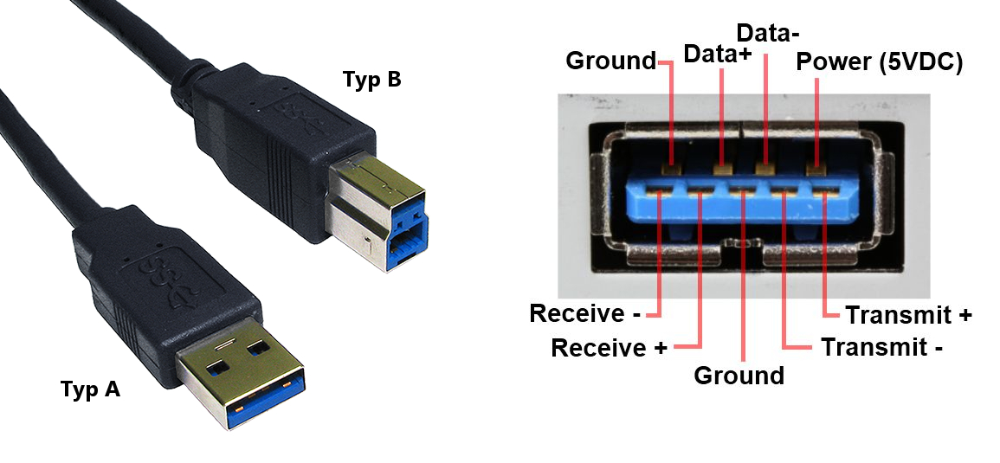
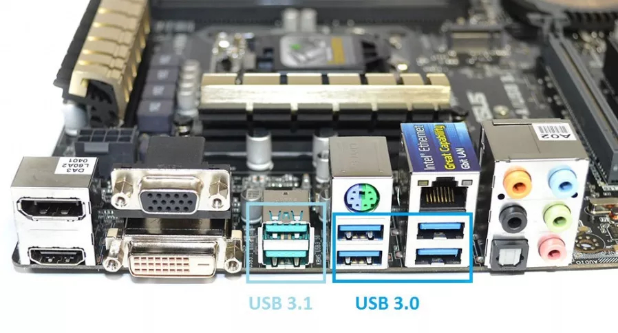
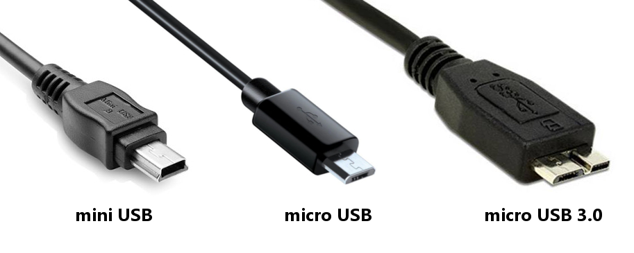
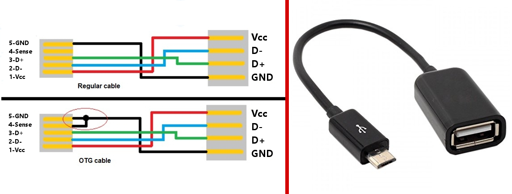
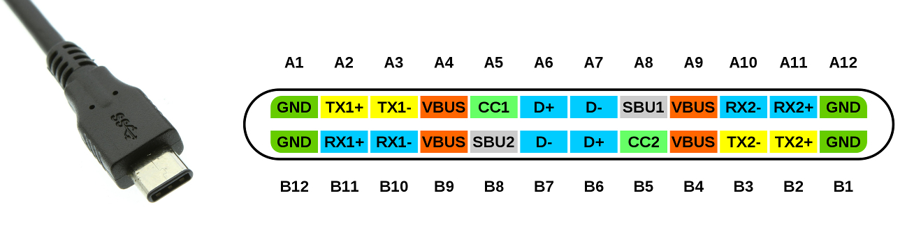

import AssemblingPcFooter from '../../typography/assemblingPcFooter'

Kontynuując tematykę [poprzedniego artykułu](/kablologia-pajeczyna-za-biurkiem) omówimy sobie złącze USB, które zawładnęło światem kabli i sukcesywnie zastępuje inne gniazda. Na początek krótko opiszę zasadę działania interfejsu USB, a następnie przejdziemy przez wszystkie generacje standardu idąc od najstarszego do najnowszego.

## Zasada działania

Cechą wyróżniającą USB jest praca w architekturze host – urządzenia. Nie można połączyć dwóch urządzeń peryferyjnych lub dwóch komputerów bez zastosowania układu scalonego, który obsługiwał by komunikację miedzy nimi. Do jednego (kontrolera) portu USB można podłączyć aż 127 urządzeń peryferyjnych w topologii drzewa, za pomocą rozgałęźników zwanymi hubami. Wtyczki i gniazda przeznaczone dla urządzenia hosta nazywamy **„TYPEM A”**, a dla urządzeń peryferyjnych **„TYPEM B”**.

## Generacje

### USB 1.0

Pierwsza generacja standardu USB ukazała się w roku 1998. Pozwalała na osiągnięcie, wystarczającej jak na tamte czasy, prędkości 1.5 MB/s. Natężenie prądu mogące zasilić urządzenie wynosiło maksymalnie 500 mA. Generacja ta najczęściej oznaczana była białym kolorem gniazda, a wewnątrz znajdowały się 4 przewody: zasilanie +5V, masa oraz para przewodów sygnałowych.

### USB 2.0 „High Speed”

Ulepszona wersja standardu 1.0 ogłoszona została w 2000 roku. Urządzenia zgodne ze specyfikacją standardu 2.0 mogły pracować z prędkością do 60 MB/s oraz przekazywać 500 mA. Standard oznaczany jest kolorem czarnym.

<ImageDescription>USB 1.0 oraz 2.0 posiadają jaki sam wygląd, źródło: tracer.pl oraz wikipedia.org</ImageDescription>

### USB 3.0 „SuperSpeed”

Jest to generacja opublikowana w roku 2008 charakteryzująca się wysoką prędkością (625 MB/s) przesyłu danych, przeznaczona głównie dla pamięci masowych. Zwiększoną prędkość uzyskano dodając dwie pary kabli sygnałowych, które pozwoliły także na zastosowanie trybu „full duplex”, czyli jednoczesną komunikację w obu kierunkach. Maksymalne natężenie prądu zostało zwiększone do 900 mA. Mimo zwiększenia ilości styków do 9, generacja ta jest w pełni kompatybilna ze swoimi poprzedniczkami (urządzenie 3.0 podłączone do portu 2.0 komunikuje się prędkością starszego interfejsu). Generacja oznaczana jest kolorem niebieskim.

<ImageDescription>Kompatybilność wtyczki 3.0 jest możliwa dzięki przeniesieniu nowych styków do drugiego rzędu</ImageDescription>

<InfoBlock>Wtyczka typu A jest w pełni kompatybilna z poprzednim standardem i może zostać bezproblemowo podłączona do gniazda 2.0 komputera. Natomiast wtyczka typu B przez swoją „nadbudowę” nie może zostać podłączona do gniazda starszej generacji.</InfoBlock>

### USB 3.1 „SuperSpeed+”

Generacja z 2013 roku oznaczana kolorem turkusowym. Pozwala na transfer z prędkością do 10 Gb/s oraz przekazanie do 100 W mocy. Podobnie jak wersja 3.0, USB 3.1 jest kompatybilne wstecz.

<ImageDescription>Różnica kolorów między generacją 3.0, a 3.1, źródło: proline.pl</ImageDescription>

## Wtyczki mini oraz micro USB

W przypadku urządzeń mobilnych takich jak kamery, aparaty czy smartfony mamy do czynienia z mniejszymi wersjami standardowych wtyczek. Wtyczki generacji 1.0 i 2.0 zawierają 5 styków, a generacje 3.0 i 3.1 10 styków. Dodatkowy pin w obu przypadkach odpowiedzialny jest za prawidłowe działanie technologii OTG (o której za chwilę).

<ImageDescription>Mniejsze standardy wtyczek najczęściej spotykane w urządzeniach mobilnych</ImageDescription>

Powyżej zaprezentowano wtyczki typu B, czyli do urządzeń peryferyjnych. Istnieją także ich odpowiedniki typu A o lekko zmienionym kształcie, ale są one bardzo rzadko spotykane.

<AdSense/>

## OTG (On The Go)

Technologie OTG możemy spotkać w urządzeniach przenośnych. Umożliwia ona podłączenie urządzenia peryferyjnego (klawiatury, myszki czy pamięci przenośnej) do telefonu bądź tabletu. Wówczas mamy do czynienia z podłączeniem urządzenia peryferyjnego z telefonem, który też należy do takich urządzeń. Tak jak już wspominałem, interfejs USB potrzebuje urządzenia hosta oraz urządzenia podrzędnego. Do określania, które z urządzeń będzie tym dominującym, służy piąty pin wtyczki mini oraz micro USB. Wtyczka urządzenia hosta ma połączony pin 5 z 4 (masą), a urządzenie podrzędne - nie. Technologia ta jest również używana podczas ładowania baterii jednego telefonu z drugiego telefonu.

<ImageDescription>Schemat połączeń kabla OTG, źródło: ashleyslab.co</ImageDescription>

## Gniazdo „Sleep and Charge”

Oprócz kolorów wymienionych podczas omawiania generacji USB możemy spotkać gniazda koloru czerwonego lub żółtego. Są to gniazda typu „Sleep and Charge”, a ich cechą szczególną jest brak zaniku zasilania po wyłączeniu komputera. Są one idealne do ładowania telefonu lub podtrzymywania zasilania zewnętrznych głośników komputerowych.

## Gniazdo typu C (USB Type-C)

Mówiłem już o istnieniu wtyczki USB typu A oraz typu B. Niestety, twórcy standardu skomplikowali sprawę i stworzyli jeszcze gniazdo typu C, które zaczyna być coraz bardziej popularne. Tym razem zerwano ze wsteczną kompatybilnością i Type-C posiada zupełnie inny wygląd oraz dzięki swojej budowie, pozwala na obustronne podłączenie wtyczki. Posiada 20 styków, choć realnie wykorzystywanych jest tylko 10 – tak samo jak w przypadku micro USB 3.0 (druga dziesiątka to lustrzane odbicie).

<ImageDescription>Schemat styków wtyczki USB-C, źródło: wikipedia.org</ImageDescription>

Typ C posiada znacznie więcej udogodnień, m.in. umożliwia przesyłanie do 100 W energii, co pozwala na naładowanie nawet laptopa! Dodatkowo dzięki posiadanym 3 parom kabli sygnałowych, USB-C jest w stanie przesłać sygnał HDMI lub DisplayPortu. Pokazuje to, jak wiele możliwości daje ten typ gniazda. Możliwe, że w przyszłości laptopy wyposażone wyłącznie w szereg takich gniazd.

## Szybkie ładowanie

Na zakończenie zostawiłem temat jakim jest szybkie ładowanie. Niestety, tutaj producenci też stworzyli niezły bałagan. Generacja 2.0 (tą, którą ładujemy smartfony) pozwala jedynie na 500 mA, co daje marne 2.5 wata. Taki prąd ładowałby nasz telefon przez około 6 godzin, dlatego stworzono standard USB Battery Charging (BC 1.2), który kosztem transmisji danych, pozwala na ładowanie telefonu za pomocą 1.5 A (7.5 W).

Na rynku zaczęły pojawiać się rozwiązania poszczególnych producentów. Chyba najbardziej rozpoznawalnym jest technologia QuickCharge od Qualcomma. Polega ona na dynamicznym sterowaniu napięciem ładowania przy natężeniu równym 2A. Telefony wspierające tą technologię muszą (oczywiście) posiadać procesor Qualcomma oraz specjalny układ scalony odpowiedzialny za zbijanie napięcia, gdy nie jest już ono potrzebne (zwykle powyżej 40% pojemności baterii), co powoduje znaczne wydzielanie ciepła przez urządzenie.

Technologia Qualcomma posiada jedną ogromną wadę – duże ilości ciepła, co poniekąd rozpoczęło prawdziwy wyścig producentów. Powstały technologie takie jak: VOOC, DashCharge czy Super Charge. Opierają się one na modyfikacji natężenia przy zachowaniu standardowego napięcia 5 V. Plusem tego rozwiązania jest układ sterujący przeniesiony z telefonu do ładowarki, a minusem przymus stosowania grubszych i krótszych kabli.

<WarningBlock>W przypadku tych technologii istnieje ryzyko, że użytkownik zgubi fabryczny gruby kabel ładowarki i zastąpi go tanim chińskim zamiennikiem, co może mieć katastrofalne skutki.</WarningBlock>

By nie przedłużać artykułu zakończę na tym kwestię szybkiego ładowania. Producenci na siłę próbują ominąć ograniczenia portu USB, który nie został stworzony do takich rzeczy, dlatego pozostaje nam tylko czekać, aż sytuacja się uspokoi i ustandaryzuje.

<AssemblingPcFooter nextPost='/budowa-i-dzialanie-komputera'/>
