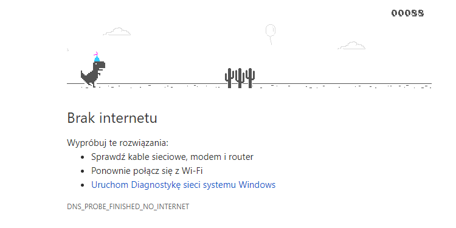
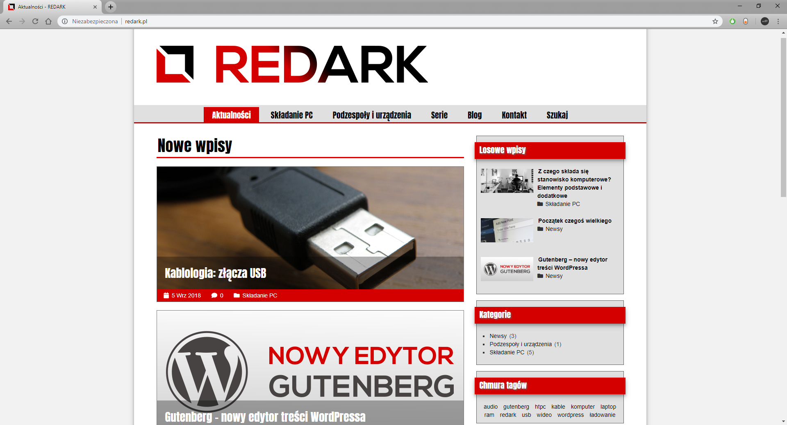
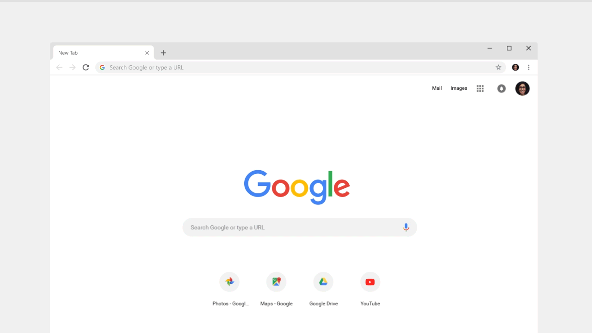
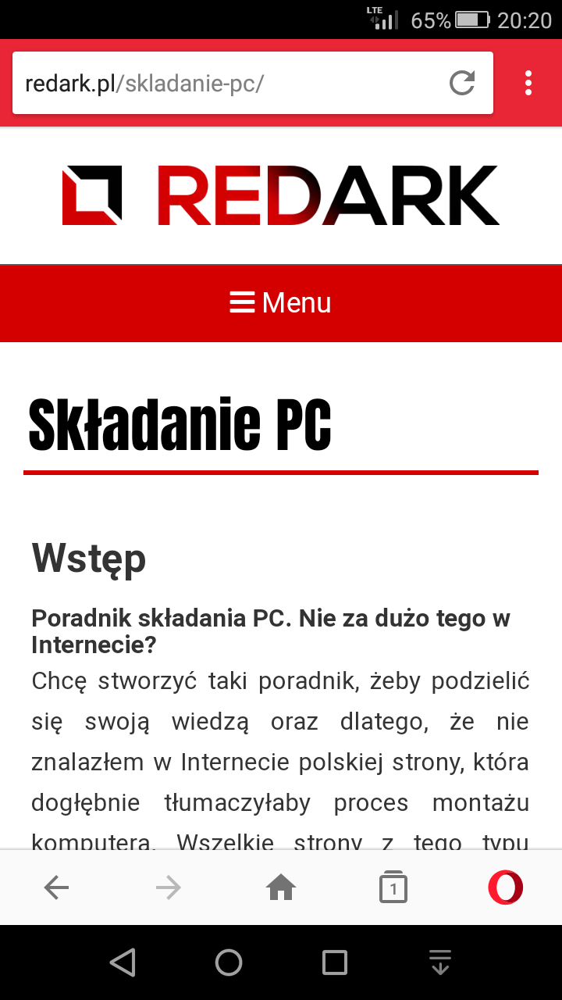

Przez ostatnie tygodnie na portalach technologicznych co chwilę przewija się temat obchodów 10. urodzin przeglądarki Google Chrome. Jej twórcy przygotowali parę nowości z okazji tego święta i dziś podzielę się z Wami moim komentarzem na temat tych zmian.

## Dinozaur w pogoni za ciastem

Każdy, który doświadczył przerwy w dostawie Internetu podczas używania Chrome'a dobrze kojarzy mini grę z dinozaurem. Z okazji urodzin Google wzbogacił tą sympatyczną grę o takie elementy jak ciasta czy baloniki.

<Gallery>

</Gallery>

Gdy podczas naszej bezcelowej drogi napotkamy ciasto i je zjemy (a raczej dotkniemy) wówczas na głowie dinozaura pojawi się urodzinowa czapeczka. Nie oczekujcie tutaj jakiejś fabuły, ot zwykły smaczek. Na koniec należy dodać, że zmieniona wersja gry będzie dostępna tylko przez miesiąc, później powróci ona do swojej klasycznej formy.

## Duża aktualizacja z numerkiem 69

Parę dni temu na komputery trafiła nowa wersja przeglądarki obdarzona numerem 69. Czy duży numer to duża liczba zmian? Sprawdźmy, choć nie liczyłbym na jakieś super nowości.

### Material Design

Jak obiecywali, tak zrobili. Google od dawna podawał informacje o zbliżającej się zmianie wyglądu przeglądarki. Nie jest to ogromna odmiana, która wywraca do góry nogami cały interfejs aplikacji, a kosmetyczna zmiana górnej belki, ustawień, strony startowej czy ukrycie protokołu sieciowego z paska adresu. Zmianie uległo także miejsce ikonki profilu użytkownika.

W moim pierwszym odczuciu nowy wygląd przeglądarki jest gorszy. Jakoś przyzwyczaiłem się do starych, kanciastych kart. Obecne przypominają mi karty Firefoxa z domieszką Edge'a. Choć początkowo byłem sceptycznie nastawiony do nowego wyglądu to muszę przyznać, że po 10 minutach surfowania po Internecie przestał mi on przeszkadzać.

### Nowe funkcje

Urodzinowa aktualizacja nie przynosi wyłącznie różnic w wyglądzie. Chrome został także rozbudowany o nowe funkcję. Najbardziej zauważalną jest generator losowych haseł. Został on zintegrowany z auto-uzupełnianiem treści formularzy. Gdy przeglądarka wykryje rejestrację użytkownika w nowym portalu zaproponuje mu skorzystanie z automatycznie wygenerowanego hasła. Jeśli użytkownik się na nie zdecyduje, Chrome zapisze je oraz zsynchronizuje z pozostałymi urządzeniami podłączonymi do konta Google.

<GifViewer>

</GifViewer>

Drugą funkcję znajdziemy w Omniboxie, czyli rozwijanym pasku adresu. Oprócz nowego wyglądu pojawią się tam szybkie podpowiedzi do wpisywanych przez nas fraz. Dzięki temu możemy poznać pogodę dla danej miejscowości, przetłumaczyć zdanie czy sprawdzić kurs waluty bez przechodzenia na stronę wyszukiwarki.

<GifViewer>

</GifViewer>

### Jeden wygląd, wiele urządzeń

Brzmi to jak slogan Windowsa 10, ale tak jest. Chrome zabrał się za ujednolicanie wyglądu aplikacji, dlatego nowy wygląd pojawi się nie tylko na komputerach, ale także na iOS oraz Androidzie.

<GifViewer>

</GifViewer>

Niestety użytkowników Androida nie zachwyciła grafika pokazana powyżej. Chodzi tutaj o dyskryminację zielonego robocika i odbieranie mu możliwości posiadania belki u dołu ekranu, doskonale znanej z systemu od Apple. Dodatkowo oliwy do ognia dodaje fakt, że opcja ta była kiedyś dostępna w przeglądarce, ale Google postanowił ją usunąć.

Osobom chcącym mieć belkę u dołu ekranu polecam przeglądarkę Opery na Androida. Według mnie jest to bardzo dobry konkurent, który pracuje na tym samym silniku co Chrome oraz ma wiele do zaoferowania.

