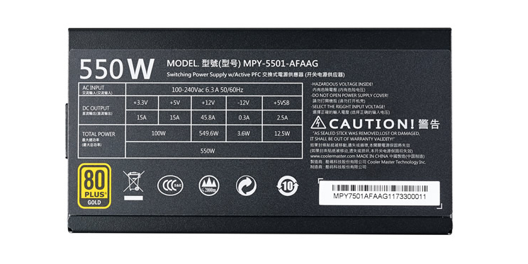
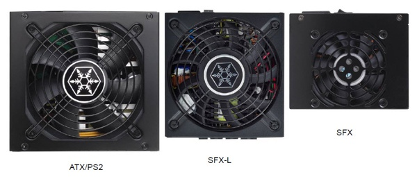
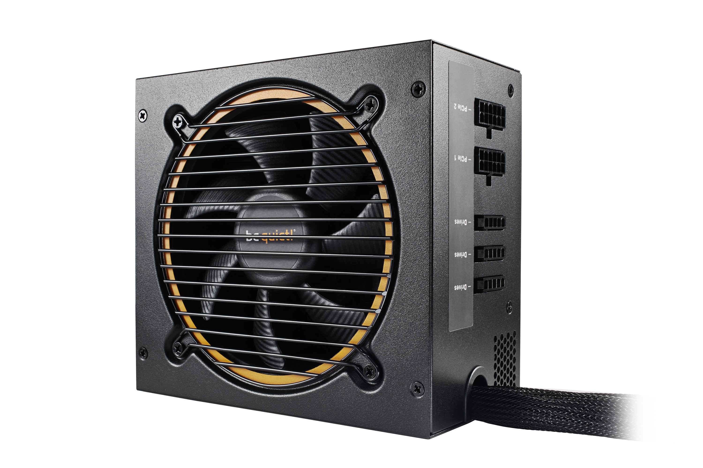
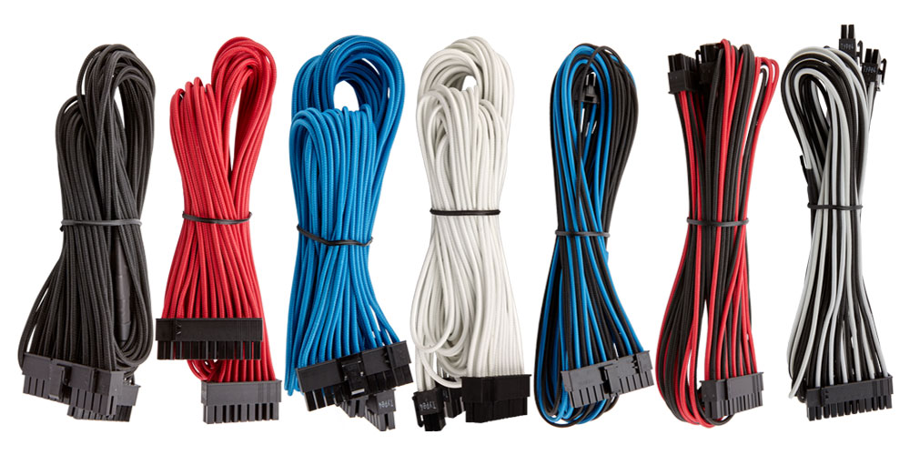

Zasilacz to jeden z podstawowych elementów jednostki centralnej komputera. Głównym zadaniem tego podzespołu, oprócz rozprowadzania kablami zasilania do wszystkich urządzeń w naszej obudowie, jest też przetwarzanie prądu zmiennego na prąd stały. Zasilacz stanowi również barierę ochronną przed wszelkimi anomaliami pojawiającymi się w sieci elektrycznej naszego domu lub mieszkania. Jego wybór należy dobrze przemyśleć, aby uchronić się od przykrych konsekwencji.

## Najważniejsze parametry

### Producent

Może się to wydawać śmieszne, ponieważ producent tylko tworzy sprzęt, a jeśli posiada on parametry jakich potrzebujemy, to w czym problem? Otóż w przypadku zasilacza jest to bardzo ważne. Nigdy nie kupujemy zasilaczy tanich, produkowanych przez firmy "nieznane, ale lubiane". Można spotkać też modele, do których producent nawet się nie przyznaje - nazywane są potocznie "no name'ami" . Takie zasilacze tworzone są oczywiście u naszych przyjaciół w Chinach, a komponenty jakich używa się do ich produkcji wołają o pomstę do nieba. Kupowanie takich zasilaczy jest proszeniem się o rychły pokaż domowych fajerwerków. Internet pełny jest "czarnych list zasilaczy", których należy się wystrzegać i żeby zobaczyć skutki kupienia takiego zasilacza zapraszam na [ten wątek forum elektrody](https://www.elektroda.pl/rtvforum/topic1199271.html).

### Moc zasilacza

Jest to najważniejszy parametr zasilaczy podawany w watach (W). Określa jaki maksymalny prąd może zostać dostarczony do naszego komputera. Wartość tego parametru należy dobrać do "prądożerności" naszych podzespołów. Im wydajniejszy procesor bądź kartę graficzną posiadamy, tym mocniejszego zasilacza potrzebujemy. Aby obliczyć jakiego zasilacza potrzebuje nasz komputer możemy skorzystać z tzw. "kalkulatorów mocy", które posiada wielu producentów zasilaczy. Jeden z nich [znajdziecie tutaj](https://www.enermax.outervision.com/).

<InfoBlock>Moc zasilacza jest wartością maksymalną. Kupienie modelu 600W nie oznacza, że komputer przez cały będzie pobierać 600W energii. Pobór prądu będzie zmieniał się dynamicznie w zależności od zapotrzebowania.</InfoBlock>

### Maksymalne obciążenie linii 12V

Do prawidłowego działania komputer potrzebuje 3 różnych napięć: 12V, 5V oraz 3,3V. Moc zasilacza jest sumą maksymalnego obciążenia linii (kabli) dostarczających wszystkie trzy wymienione napięcia. Linią, która najbardziej dostaje w kość w naszym komputerze, jest ta dostarczająca napięcie 12 volt. Przed zakupem zasilacza należy sprawdzić maksymalne obciążenie poszczególnych linii na tabliczce znamionowej zasilacza lub na stronie producenta. Producenci dobrych zasilaczy zapewniają na linii 12V ponad 90% sumarycznej mocy zasilacza.

<ImageDescription>Tabliczka znamionowa zasilacza COOLER MASTER MWE GOLD 550 FULLY MODULAR, źródło: coolermaster.com</ImageDescription>

### Sprawność

Świat, w którym zasilacz pobiera i oddaje taką samą ilość energii, nie istnieje. Tak samo jak robią to silniki spalinowe, zasilacz część dostarczanej mu energii zamienia w ciepło. Im wyższa sprawność, tym lepiej dla nas i naszego portfela. By ułatwić użytkownikom rozpoznanie sprawności zasilacza wprowadzono certyfikat "80 plus". Ich odmiany oraz parametry, jakie zapewniają, przedstawione są poniżej:

<ImageDescription>Poziomy sprawności zasilacza dla certyfikatu 80 PLUS, źródło: wikipedia.org</ImageDescription>

### Chłodzenie

Przy poprzednim parametrze dowiedzieliśmy się, że część energii pobieranej przez zasilacz jest zamieniana w ciepło, które następnie trzeba odprowadzić z urządzenia. Na rynku można spotkać trzy typy chłodzenia:

- **Aktywne** - najpopularniejszy typ wykorzystujący do chłodzenia w postaci jednego dużego wentylatora montowanego od spodu urządzenia.
- **Pasywne** - droższy wariant występujący raczej w zasilaczach o małej mocy. Jego zaletą jest całkowicie bezgłośna praca, dzięki zastosowaniu tylko i wyłącznie metalowych radiatorów.
- **Pół pasywne / Hybrydowe** - wariacja dwóch powyższych wariantów. Zasilacz tego typu posiada radiatory oraz centralny wentylator, który zostaje uruchomiony tylko w przypadku wystąpienia wzrostu temperatury urządzenia.

<InfoBlock>Cicha praca zasilacza z wentylatorem zależy przede wszystkim od zastosowanych w nim łożysk, ale też od średnicy samego wentylatora. Większy model potrafi wydajniej schłodzić urządzenie bez używania wysokich prędkości wirnika.</InfoBlock>

### Zabezpieczenia

Podczas wyboru zasilacza możemy natknąć się na szereg skrótów oznaczających zastosowane zabezpieczenia chroniące nasz komputer:

- **OVP (Over Voltage Protection)** - zabezpieczenie przed zbyt wysokim napięciem
- **UVP (Under Voltage Protection)** - zabezpieczenie przed zbyt niskim napięciem
- **OPP (Over Power Protection)** - zabezpieczenie przed przeciążeniem zasilacza, czyli zbyt wysokim poborem prądu
- **SCP (Short Circuit Protection)** - zabezpieczenie przed zwarciem przewodów
- **OTP (Over Temperature Protection)** - zabezpieczenie przed przegrzaniem urządzenia

<AdSense/>

### Rozmiar zasilacza

Typowa obudowa komputera wymaga zasilacza w standardzie ATX. W przypadku budowy mini komputera lub HTPC może się okazać, że obudowa jaką kupiliśmy posiada mniejszą wnękę na zasilacz o standardzie SFX lub SFX-L. Należy zwrócić na to uwagę przed zakupem tego podzespołu.

<ImageDescription>Porównanie standardów ATX, SFX-L oraz SFX, źródło: pcper-com</ImageDescription>

### Okablowanie modularne

Standardowe zasilacze posiadają przewody przyczepione na stałe, przez co użytkownik musi ukryć nieużywane kable gdzieś w czeluściach obudowy. Istnieje jednak alternatywa w postaci okablowania modularnego. W przypadku takiego zasilacza możemy decydować jakich kabli chcemy używać, ponieważ wszystkie, oprócz wtyczki ATX, mogą być swobodnie podłączane i odłączane od zasilacza. Jest to ciekawa opcja dla osób, które chcą zachować porządek w obudowie.

<ImageDescription>Zasilacz modularny be quiet! PURE POWER 10 600W CM, źródło: bequiet.com</ImageDescription>

### Kolorystyka i oplot kabli

Tanie zasilacze oferują standardowe kolory przewodów, oznaczające przeznaczenie danego kabla. Niektórzy producenci dodatkowo powlekają kable siatkowym oplotem zwiększającym wytrzymałość i estetykę okablowania. Przykłady takich kabli zaprezentowano poniżej:

<ImageDescription>Specjalne kable do zasilaczy Corsaira, idealne dla moderów, źródło: corsair.com</ImageDescription>

### Wtyczki

Na koniec, bardzo ważny parametr zasilacza jakim jest lista wtyczek służących do podłączenia wszystkich podzespołów komputera. Przed zakupem zasilacza należy sprawdzić jakich złączy będziemy potrzebowali. Ich dokładny opis wraz ze zdjęciami możesz zobaczyć w [artykule o kablach w obudowie komputera](/kablologia-przewody-jednostki-centralnej) z [serii "Składanie PC"](/skladanie-pc). Brak jednego ze złączy możemy naprawić kupując odpowiednią przejściówkę np. z MOLEXa na SATA.

Niektórzy producenci (np. be quiet!) na swoich stronach podają wymiary kabli swoich zasilaczy oraz dokładny rozstaw złączy na nich. Informacja ta może być przydatna dla osób budujących komputer w nietypowej obudowie.
