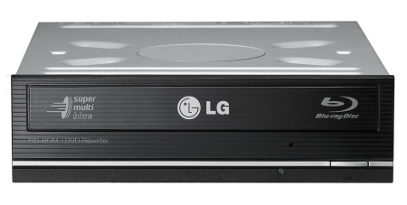
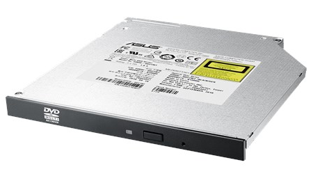
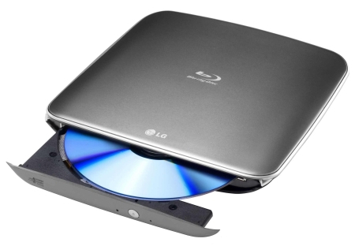

Rosnąca popularność dystrybucji cyfrowej sprawiła, że napędy optyczne powoli odchodzą do lamusa. Nawet instalacja systemu operacyjnego przestaje już być przeprowadzana przy użyciu połyskującego krążka. Obecnie produkowane płyty główne pozwalają na bezproblemową instalację systemu za pomocą szybkich i wydajnych pendrive’ów.

Dlatego, czy wciąż opłaca się posiadać napęd optyczny? Moim zdaniem, tak. Płyty są nadal chętnie używane, choćby w dystrybucji filmów, a każdy kolekcjoner pudełkowych wydań gier nie może się bez nich obejść. Ponadto napędy optyczne nie są drogie. Urządzenie o standardowych parametrach można zakupić nawet za mniej niż 50 złotych. Natomiast, jeśli ktoś nie chce psuć wyglądu frontowego panelu jednostki centralnej komputera, może skorzystać z zewnętrznych rozwiązań, które nieużywane schować do szuflady. Aby nie przedłużać, zacznijmy omawiać ich parametry.

## Najważniejsze parametry

### Typ obudowy/przeznaczenie

Możemy wyróżnić trzy różne typy napędów optycznych:

1. **Wewnętrzny do kieszeni 5.25 cala** – standardowy napęd montowany na stałe z przodu obudowy komputera
2. **Wewnętrzny typu Slim** – montowany w laptopach lub miniaturowych obudowach PC
3. **Zewnętrzny na USB** – idealne dla osób, które potrzebują napędu, ale nie chcą go montować w komputerze. Takie rozwiązanie pozwala także na wykorzystanie jednego napędu przy wielu komputerach.

<ImageDescription>Klasyczny napęd 5.25" LG CH10LS28, źródło: lg.com</ImageDescription>

<ImageDescription>Napęd ASUS SDRW-08U1MT typu Slim, źródło: asus.com</ImageDescription>

<ImageDescription>Zewnętrzny napęd na USB LG BP40NS20, źródło: lg.com</ImageDescription>

### Interfejs

Tutaj sprawa jest prosta. W przypadku napędów wewnętrznych mamy do czynienia tylko i wyłącznie z **SATA** (które zastąpiło stare taśmy IDE). W rozwiązaniach zewnętrznych interfejsem takich napędów będzie zazwyczaj **USB 2.0**, a w droższych modelach, jego szybszy odpowiednik – **USB 3.0**.

### Obsługiwane nośniki

Tutaj należy sprawdzić jakie rodzaje płyt jest w stanie odczytać dany napęd. Standardowo powinny być to wszystkie rodzaje płyt CD oraz DVD, a droższe modele za kilkaset złotych powinny oferować także obsługę płyt Blu-ray. Poniżej prezentuję mini słownik oznaczeń określających typ płyty:

- **ROM** – płyta tylko do odczytu
- **R** – płyta jednokrotnego zapisu
- **RW** – płyta wielokrotnego zapisu
- **SL** – płyta jednowarstwowa
- **DL** – płyta dwuwarstwowa

### Prędkość odczytu/zapisu

Jeśli mamy już wybranych kilka urządzeń spełniających nasze wymagania, należy wybrać najszybszy model. Pierwszym parametrem, który pozwoli to określić jest prędkość odczytu oraz zapisu. Określa on maksymalną prędkość obrotową płyty. Naturalnie im wyższa, tym szybszy transfer danych jest możliwy.

<InfoBlock>Jeśli prędkości zapisu nie są podane, oznacza to że napęd służy jedynie do odczytu danych i nie posiada funkcji nagrywarki.</InfoBlock>

### Czas dostępu

Jest to drugi parametr określający szybkość działania napędu. Podawany jest w milisekundach (ms) i powinien być jak najmniejszy.

### Rozmiar bufora

Ostatni parametr określający szybkość napędu. Podaje rozmiar pamięci bufora, który wpływa na efektywność odczytu danych i im większy bufor, tym lepiej.
