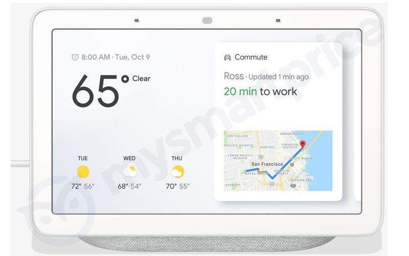
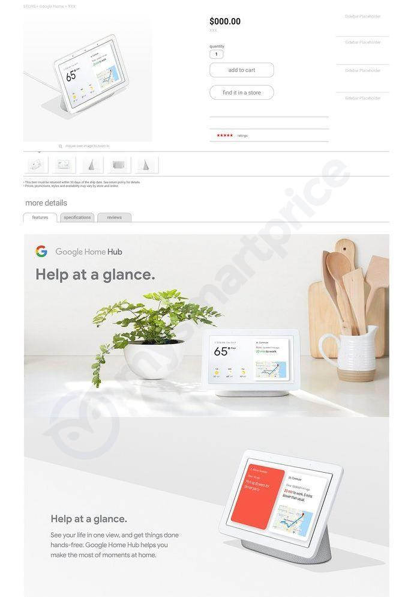
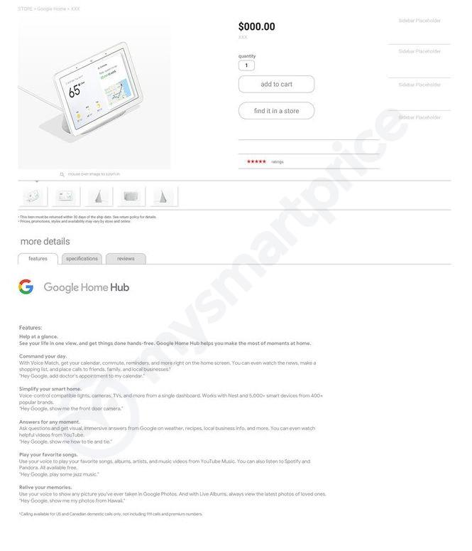
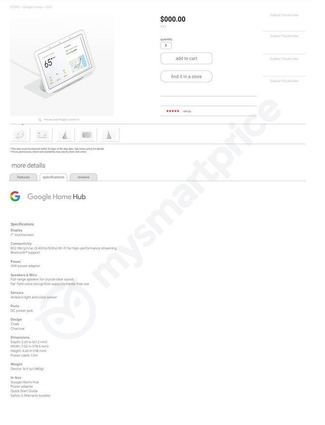

W sieci pojawiły się przecieki dotyczące najnowszego owocu pracy Google, które prawdopodobnie zobaczymy oficjalnie na konferencji internetowego giganta 9 października 2018 roku.

Google Home Hub jest to inteligenty ekran napędzany technologią asystenta głosowego Google Assistant. Nie jest to żadna nowość na rynku, ponieważ podobne urządzenia zaprezentowało już m.in. LG czy Lenovo, a za granicą można spotkać już ekran Alexa Echo Show z konkurencyjnym asystentem Amazona.

<Gallery>

</Gallery>

## Specyfikacja urządzenia

Urządzenie będzie posiadało **7-calowy dotykowy ekran**, czułe mikrofony na froncie oraz donośny głośnik na swoich "pleckach". Do łączności ze światem posłuży tu **moduł Bluetooth oraz Wi-Fi w paśmie 2.4 oraz 5 GHz**. Na zaprezentowanych zdjęciach możemy zauważyć czujnik światła, **brak frontowej kamerki oraz możliwość pracy tylko w pozycji horyzontalnej**. Z przycisków będziemy mieli do dyspozycji regulację głośności oraz suwak do wyłączenia nasłuchu urządzenia. Sprzęt ma być dostępny w dwóch wersjach kolorystycznych.

Nie jest pierwszy taki wyciek danych o urządzeniach Google, jeszcze przed ich oficjalną premierą. To samo spotkało nowe modele smartfonów z serii Pixel (Pixel 3 oraz Pixel 3 XL), które mają być głównym tematem nadchodzącej konferencji. Wszyscy jednak uważają, że dwa telefony to za mało na cały pokaz i Google uzupełni go także o segment poświęcony asystentowi.

<Gallery>

</Gallery>

## Czy usłyszymy w końcu "Dzień dobry?"

Ponowny szum wokół asystenta Google'a powinien ucieszyć również obywateli Polski. Od paru miesięcy mówi się o niejawny programie testów asystenta Google w naszym rodzimym języku. Jeśli plotki okażą się prawdą to podczas październikowej konferencji będziemy mogli usłyszeć także datę rozpoczęcia oficjalnego wsparcia językowego. Byłby to pierwszy asystent głosowy, nie uwzględniając najnowszego sterowania głosowego telewizorów LG, do którego moglibyśmy zwrócić się po polsku, a on bez problemu zrozumiałby, że chcemy np. sprawdzić pogodę w Bydgoszczy.

Jeśli chodzi o mnie, to nie mogę doczekać się nowych wieści o Google Assistant. Zarówno jeśli chodzi o wsparcie językowe dla Polski, jak i rozwój inteligentnych wyświetlaczy. Już poprzednie głośniki od Google'a bardzo mi się podobają, ale raczej nie znalazłyby u mnie tylu zastosowań co Home Hub, który jakby nie patrzeć, oprócz odtwarzania muzyki będzie potrafił wyświetlić szczegółowe informacje dostępne w wyszukiwarce, pokazać mapę z dojazdem do interesującego nas celu czy filmik z serwisu YouTube.
