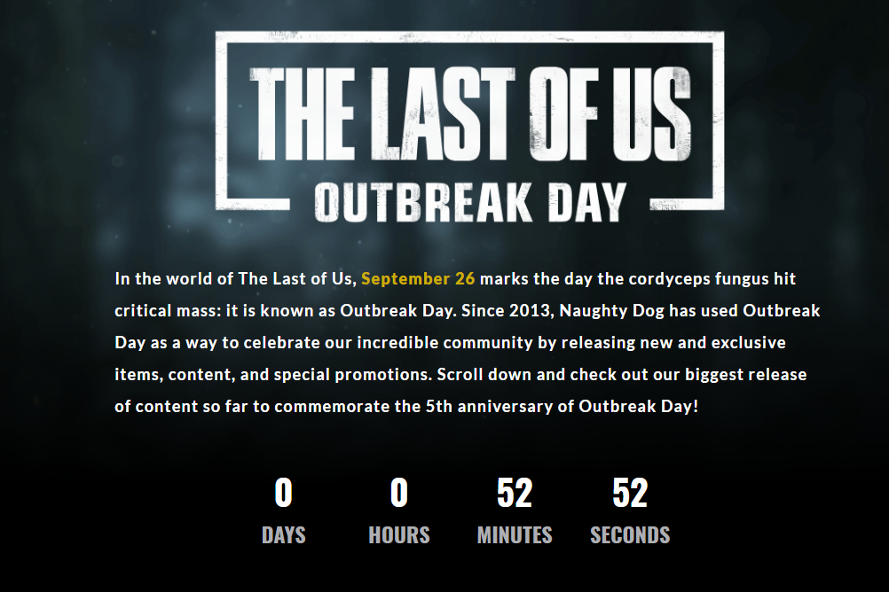
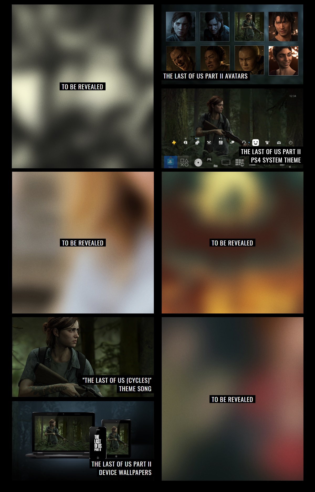
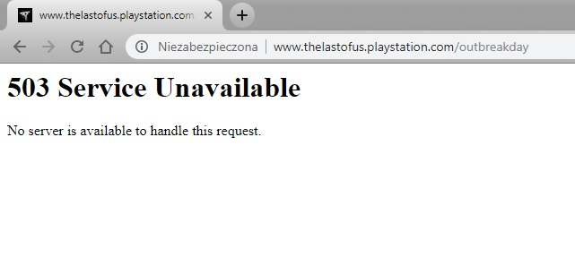
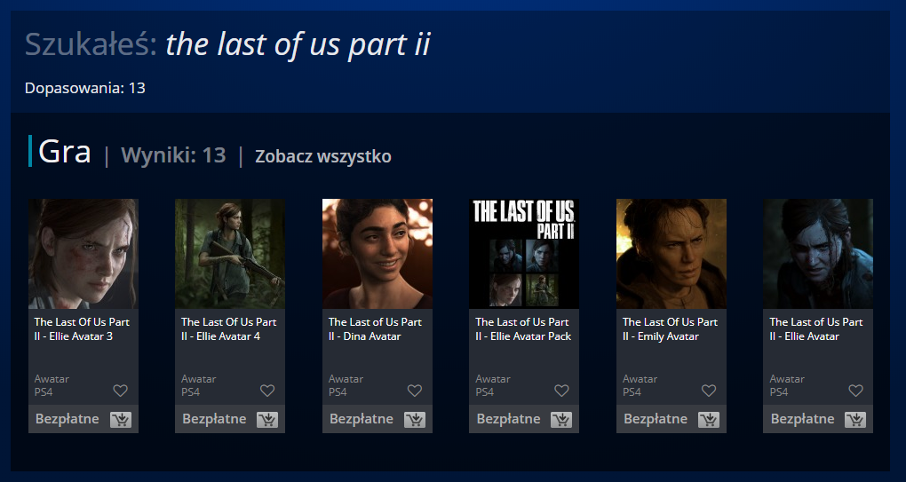
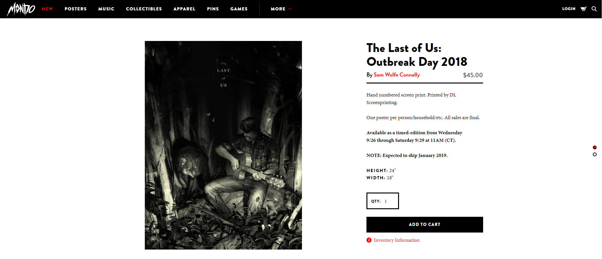
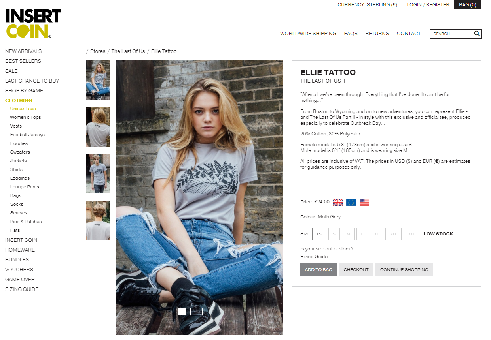
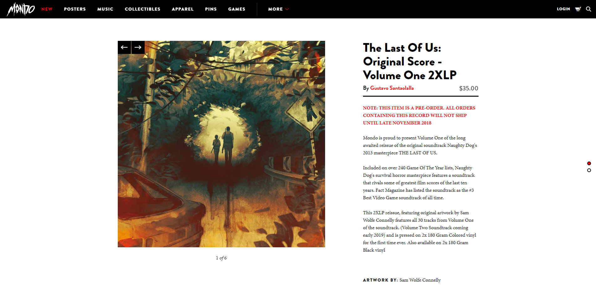
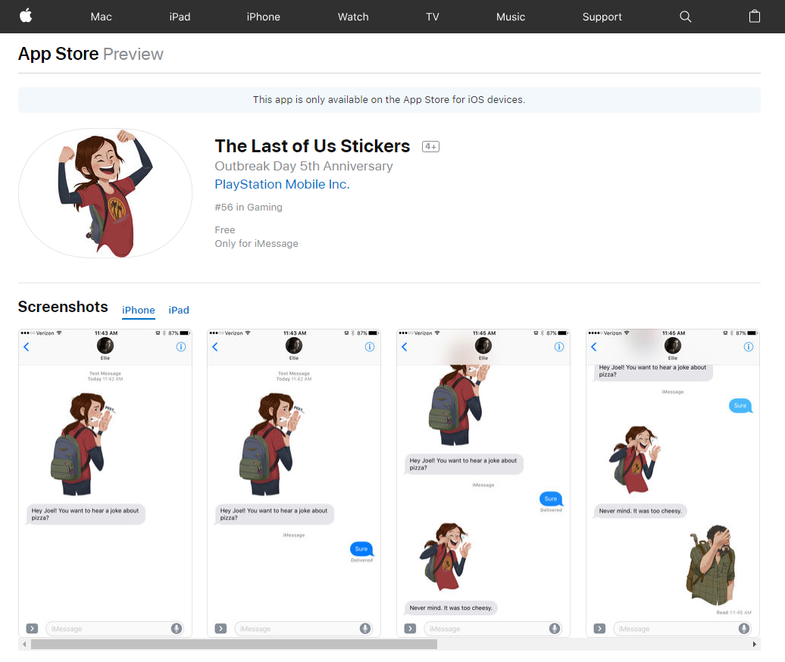
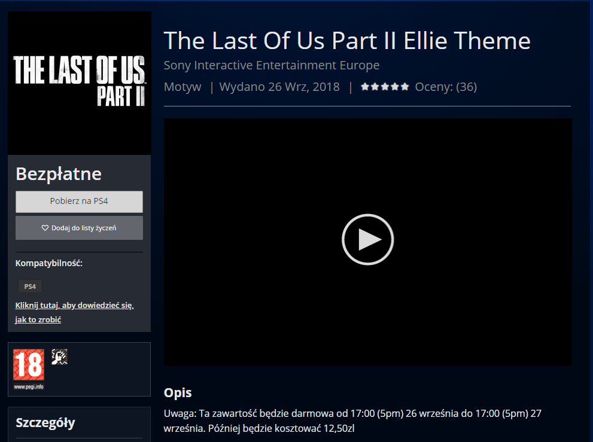

26 września wszyscy fani The Last Of Us obchodzą Outbreak Day, czyli rocznicę wybuchu zarazy znanej ze świata gry. Od 2013 roku Naughty Dog przygotowuje dla graczy PlayStation paczkę niespodzianek, które będzie można zakupić lub pobrać z oficjalnego sklepu PS Store.

## Odliczanie trwa

<ImageDescription>Tik tak tik tak...</ImageDescription>

Od jakiegoś czasu na [stronie PlayStation](http://www.thelastofus.playstation.com/outbreakday) można obserwować licznik odmierzający czas do opublikowania pełnej listy niespodzianek. Mówię pełnej, ponieważ część atrakcji jest już ujawniona, a część będzie dopiero dzisiaj o godzinie 18 polskiego czasu.

Do ujawnionych pozycji należą:

- Paczka ośmiu awatarów z bohaterami trailerów drugiej części gry
- Dynamiczny motyw systemowy dla konsoli PlayStation 4
- Plik audio z głównym motywem gry
- Paczka tapet na smartfony i komputery

## Data premiery The Last Of Us: part II?

Wszyscy fani czekają z niecierpliwością na ujawnienie daty premiery drugiej części tej gry, a pokazane trailery wzbudzają ogromne zainteresowanie wielu graczy. Na jednej z konferencji w grudniu ubiegłego roku Neil Druckmann ogłosił, że gra jest ukończona w 50-60 procentach. To dobrze mówi o postępie prac i przewidywanej dacie premiery.

Jeśli chodzi o mnie, wielkiego fana gier od Naughty Dog, nie mogę doczekać się dalszych informacji o drugiej części serii. Nie jestem jednak przekonany, co do ujawnienia dzisiaj czegoś ważnego, jak data premiery. Takie rzeczy producent raczej zostawi sobie na duże konferencje związane z branżą gier takie jak E3 czy PlayStation Experience (PSX).

W poprzednich latach Naughty Dog obdarowywał nas specjalnymi plakatami lub figurkami. Sądzę, że i w tym roku będzie podobnie. Mnie z pewnością zaciekawi dynamiczny motyw na PS4 oraz paczka tapet (mimo, że obecnie mam już takie na komputerze).

## Aktualizacja 18:00

<ImageDescription>No to sobie poczekamy :D</ImageDescription>

## Aktualizacja 18:15

Poznaliśmy pełną listę niespodzianek, ale część stron jeszcze nie może się podnieść po zmasowanym ataku DDoS fanów serii:

- Paczka ośmiu awatarów z bohaterami trailerów drugiej części gry
- Dynamiczny motyw systemowy dla konsoli PlayStation 4
- Plik audio z głównym motywem gry
- Paczka tapet na smartfony i komputery
- **Plakat okolicznościowy**
- **T-Shirt z tatuażem Ellie**
- **Płyta winylowa z soundtrackiem gry**
- **Pakiet naklejek dla urządzeń od Apple**

## Aktualizacja 18:35

Wrzucam screeny prezentujące produkty, które już mamy dostępne oraz informuję, że część zawartości **ZOSTAŁA UDOSTĘPNIONA ZA DARMO NA JEDEN DZIEŃ!**

## Aktualizacja 18:55

Nadal nie mamy informacji o pliku audio z głównym motywem gry. Na kafelku wciąż widnieje napis "COMING SOON".
