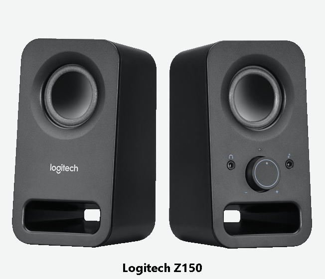
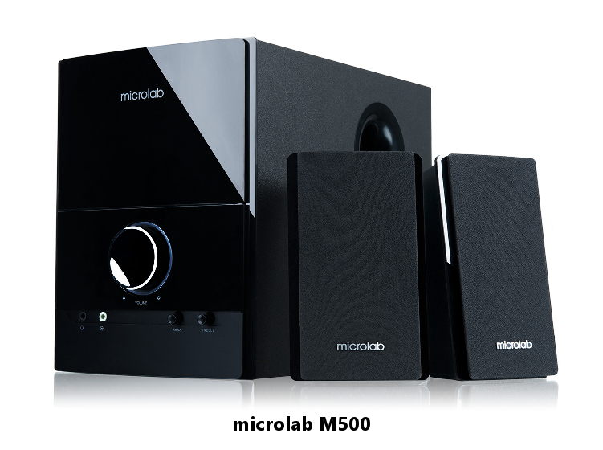
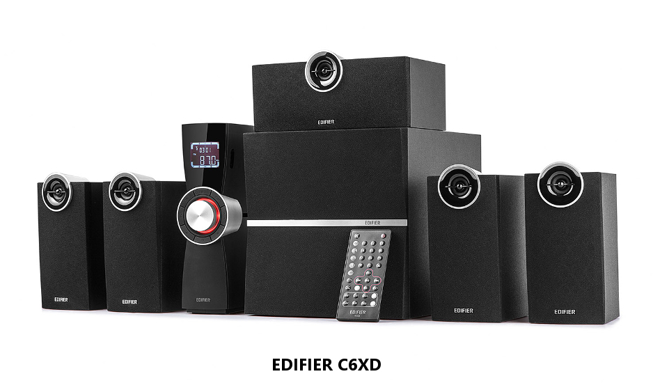
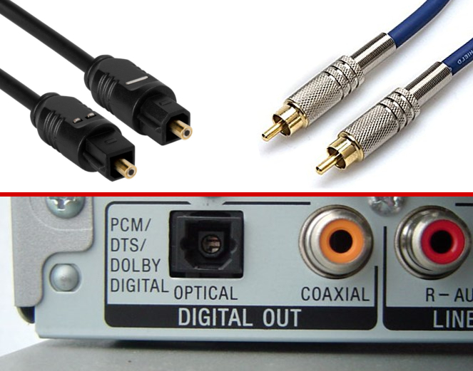
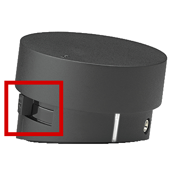
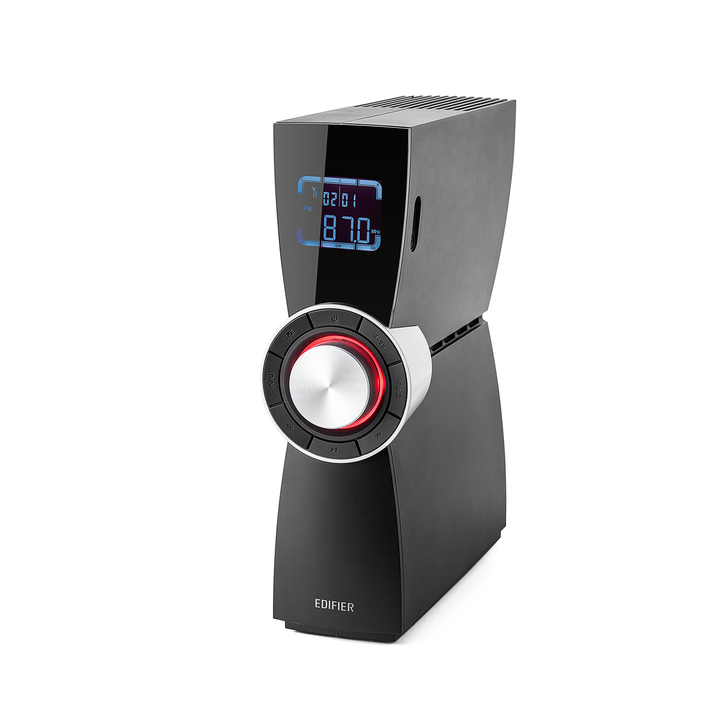

Mimo dużej popularności słuchawek, popyt na głośniki komputerowe nie maleje. Są nieocenione podczas oglądania filmów ze znajomymi lub gdy chcemy przyprawić sąsiadów o ból głowy. Zobaczmy na jakie parametry warto zwrócić uwagę.

## Podstawowe parametry

### Układ głośników

Pierwszy parametr, który definiuje jakich głośników potrzebujemy. Określa ilość głośników oraz ich przeznaczenie. Zapisywany jest w postaci dwóch liczb oddzielonych kropką. Pierwsza z nich określa ilość satelit, czyli małych głośników bocznych, druga zaś ilość głośników nisko tonowych tzw. subwooferów. Oto lista najpopularniejszych układów:

- **2.0** – głośniki zapewniające jedynie podstawowy dźwięk stereo (lewy i prawy)
- **2.1** – głośniki, które oprócz dwóch satelit obsługujących dźwięk stereo, oferują głębokie niskie tony dzięki osobnemu subwooferowi
- **5.1** – zestaw składający się ze standardowych głośników stereo, dwóch głośników umieszczanych za użytkownikiem, głośnika centralnego umieszczanego przed odbiorcą oraz subwoofera

<Gallery>

</Gallery>

Pierwszy z powyższych układów zajmuje najmniej miejsca i jest zalecany dla osób, które wymagają jedynie przeciętnej jakości dźwięku. Drugi układ zapewni głębsze brzmienie dźwięku i lepsze doznania płynące ze słuchania muzyki. Ostatni zestaw, ze względu na potrzebę specyficznego rozmieszczenia głośników, zalecany jest do dużych pomieszczeń oraz dla osób poszukujących przestrzennego dźwięku znanego z sal kinowych. Inne układy głośników, choć istnieją, są rzadko spotykane.

### Moc RMS

Parametr ten stanowi sumę mocy wszystkich głośników wchodzących w skład kupowanego zestawu. Podawany jest w watach i określa z jaką mocą głośniki pozwalają emitować czysty dźwięk. Im wyższa wartość, tym głośniejszą muzyką możemy się cieszyć. Na ten parametr należy zwrócić szczególną uwagę, gdyż dla celów marketingowych, producenci często podają go zamiennie z wartością parametru **PMPO**, która jest znacznie większa od RMS i nie należy się nią kierować!

### Pasmo przenoszenia

Określa zakres częstotliwości jakie głośniki są w stanie wygenerować. Oczywiście, im większy zakres, tym lepiej, ale należy mieć na uwadze ograniczenia ludzkiego organizmu. Zdrowy, młody człowiek jest w stanie usłyszeć dźwięki z zakresu 20 – 20 000 Hz. Wraz z wiekiem zakres (a zwłaszcza jego górna granica) zaczyna się zmniejszać. Możliwe jest nawet określenie wieku człowieka za pomocą generatora wysokich tonów.

### Wykonanie głośników

Ważnym elementem głośnika jest materiał, z którego został wykonany. Plastikowe głośniki dają zazwyczaj słabsze brzmienie od modeli wykonanych z drewna. Jest to szczególnie ważne w przypadku głośników nisko tonowych narażonych na duże wibracje. Dlatego też warto zwrócić uwagę czy subwoofer jest wykonany z płyty MDF zamiast plastiku.

<AdSense/>

## Łączność

Nie bez znaczenia jest w jaki sposób możemy podłączyć nasze głośniki do źródła dźwięku. Poniżej pokrótce opiszę każde z nich.

### Zasilanie

Każdy głośnik do prawidłowej pracy potrzebuje zasilania. Mało wymagającym zestawom prawdopodobnie wystarczy zasilanie z portu USB komputera, ale w przypadku mocniejszych zestawów potrzebne będzie gniazdko 230V.

<InfoBlock>Zdarza się, że głośniki posiadają dwa porty USB. W takim przypadku drugie złącze służy do przesyłania dźwięku z komputera. Takie modele wyposażone są we własną kartę dźwiękową i do poprawnego działania wymagają zainstalowania sterowników, przez co nie mogą być podłączone do telefonu. Jednakże jest to dobre rozwiązanie, gdy nasz komputer nie posiada karty dźwiękowej lub jest ona słabej jakości.</InfoBlock>

### Złącza analogowe

Do standardowego połączenia z kartą dźwiękową komputera potrzebna jest pojedyncza wtyczka **jack 3,5 mm**. W przypadku zestawu 5.1 głośniki będą wymagały podłączenia **za pomocą trzech takich kabli**. Niektóre głośniki mogą posiadać **złącza RCA** w kolorze białym i czerwonym, potocznie nazywane „cinchami”. Żeby podłączyć je do komputera potrzebna jest odpowiednia przejściówka.

<ImageDescription>Przejściówka RCA -> jack 3,5 mm, źródło: elektroda.pl</ImageDescription>

### Złącza cyfrowe

W droższych modelach podłączenie źródła dźwięku może odbywać się za pomocą kabli przesyłających sygnał cyfrowo. Należą do nich **S/PDIF** (sygnał optyczny) oraz **Coaxial** (sygnał elektryczny).

### Technologie bezprzewodowe

W komunikację bezprzewodową powinny zaopatrzyć się osoby, które lubią słuchać muzyki z telefonu na głośnikach przy komputerze, ale nie zostawiać tam urządzenia. Udogodnienie to zapewnią głośniki wspierające technologię komunikacji radiowej **Bluetooth**. Takie głośniki dodatkowo mogą być wyposażone w **moduł komunikacji zbliżeniowej NFC**. Umożliwia on szybkie i automatyczne sparowanie urządzeń ze sobą poprzez zbliżenie telefonu do obudowy głośnika.

<ImageDescription>Grafika prezentacyjna głośników Fenda F380X wyposażonych w Bluetooth oraz NFC, źródło: fenda.pl</ImageDescription>

### Inne udogodnienia

Bardzo przydatne w głośnikach okazują się dodatkowe złącza jack, które najczęściej znajdują się przy potencjometrze głośników. Są to:

- **wyjście słuchawkowe** – pozwala na szybkie podłączenie słuchawek bez sięgania w stronę obudowy komputera
- **wejście liniowe** – pozwala na podłączenie źródła audio (np. telefonu) bez odłączania głównego przewodu z tyłu obudowy komputera

<ImageDescription>Pilot głośników microlab M200 BT wyposażony w dwa omawiane złącza jack. Na górze znajduje się wcześniej już omawiana antena do komunikacji zbliżeniowej NFC, źródło: microlab.com</ImageDescription>

## Sterowanie głośnikami

Głośnikami należy w jakiś sposób sterować. Tańsze modele umożliwią jedynie sterowanie głośnością dźwięku, a droższe mogą posiadać nawet swój własny equalizer.

### Parametry do regulacji

Sterowanie głośnikami 2.0 zazwyczaj ogranicza się jedynie do potencjometru głośności. Zestawy z subwooferem, oprócz regulacji głośności, powinny pozwalać na regulację poziomu niskich tonów, a zestawy z wyższej półki dodatkowo zapewniać regulację poszczególnych tonów, balans lewego i prawego kanału oraz wybór źródła dźwięku (w modelach z kilkoma wejściami).

### Położenie panelu sterowania

Zestawy 2.0 swój potencjometr posiadają na lewej bądź prawej satelicie. Potencjometry zestawów 2.1 mogą znajdować się na głośniku nisko tonowym lub na kablowym pilocie kładzionym na powierzchni biurka. Zazwyczaj znajduje się tam jedynie regulacja głośności, ale zdarzają się modele posiadające tam też regulację niskich tonów. To samo tyczy się wyłącznika zasilania - zestaw można wyłączyć potencjometrem na pilocie lub trzeba sięgnąć w stronę subwoofera.

<ImageDescription>Pilot głośników Logitech Z533 z zaznaczonym suwakiem sterowania subwooferem, źródło: logitech.com</ImageDescription>

Droższe modele mogą posiadać sterowanie za pomocą pilota na podczerwień. Przydaje się to jeśli znajdujemy się w znacznej odległości od panelu sterowania. W innym przypadku jest to kolejna rzecz, którą możemy zgubić.

<ImageDescription>Jednostka sterująca głośnikami EDIFIER C6XD. Pozwala ona na zmianę wszystkich parametrów dźwięku, odtworzenie muzyki z usb i kart SD oraz uruchomienie radia FM. Część funkcji dostępna jest jedynie z pilota na podczerwień, źródło: edifier.com</ImageDescription>

## Inne parametry

Dodatkową funkcją mogą być np. specjalne zaczepy umożliwiające powieszenie głośników na ścianie, a przy poszukiwaniu profesjonalnych głośników warto też zwrócić uwagę na certyfikat THX, który zapewnia doznania jak z sal kinowych.
