Jakiś czas temu informowałem Was o przecieku informacji dotyczących [najnowszego urządzenia od Google, czyli Google Home Hub](/google-home-hub-smart-display-od-google). W tym samym artykule zastanawiałem się, kiedy gigant z Mountain View pozwoli nam, Polakom, na korzystanie z ich asystenta głosowego. Dziś przychodzę z nowymi informacjami, ponieważ Google postanowił pozwolić mi na testowanie tej technologii!

## Niejawny program testów

Już jakiś czas temu użytkownicy informowali o rozsyłanych przez Google propozycji zostania testerami. Były to m.in. osoby aktywnie udzielające się w Google Maps, posiadające znaczek tzw. "Lokalnego Przewodnika".

Na dzień dzisiejszy Google pozwala zgłosić się do programu testów [na tej stronie](https://support.google.com/websearch/answer/6307673?hl=pl), ale nie gwarantuje tego, że podanie zostanie pozytywnie rozpatrzone. Jednakże zamiast omawiać stare fakty, zajmijmy się dzisiejszymi wydarzeniami.

## Niespodzianka na ekranie telefonu

Jakie było moje zdziwienie, kiedy podczas podróży autobusem, po odblokowaniu ekranu mojego telefonu, ujrzałem białą ikonkę z dobrze mi znanym symbolem Google Assistant.

<Gallery>
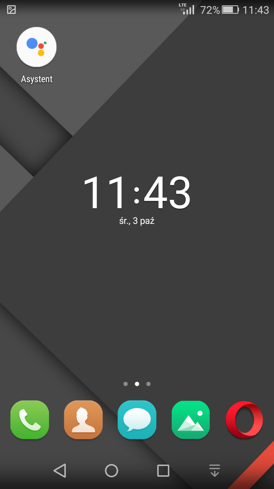
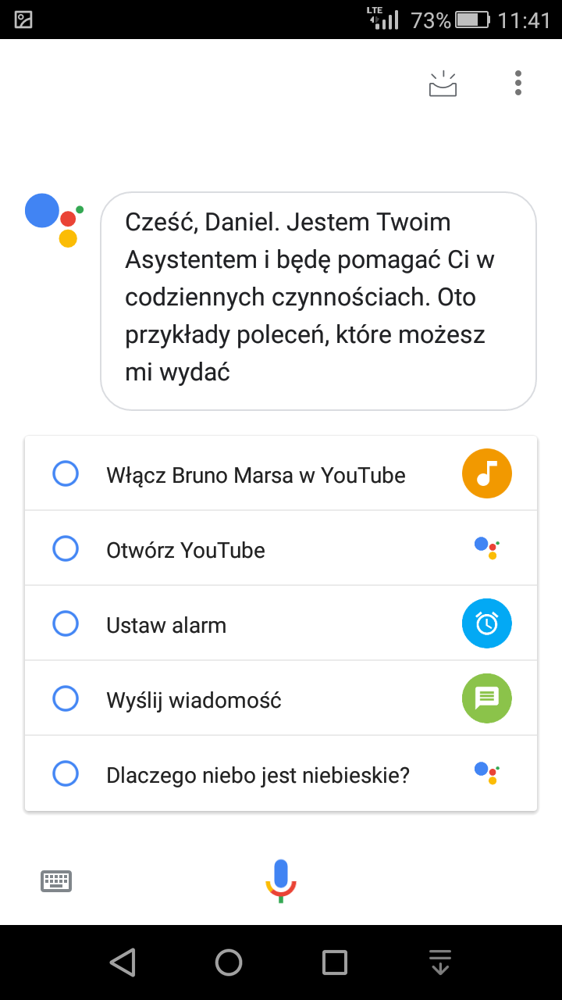
</Gallery>

Moje zdziwienie wynikało głównie z tego, że nie zgłaszałem się nigdy jako tester. Bez jakiegokolwiek uprzedzenia w postaci komunikatu lub maila, od tak na ekranie pojawiła się nowa ikona. Domyślam się też, że nie jestem jedynym, który dostał taką możliwość. Fakt, iż Google zaczyna udostępniać asystenta "osobom postronnym" świadczy o tym, że testy dobiegają końca, a produkt działa już przynajmniej w stopniu zadowalającym.

## Od ustawień czas zacząć

Po wypowiedzeniu kilku komend i potwierdzeniu, że asystent faktycznie rozumie język polski, udałem się do ustawień aplikacji.

<Gallery>
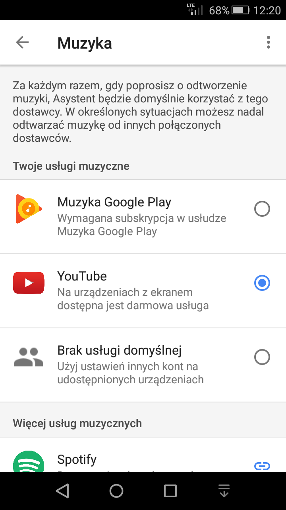
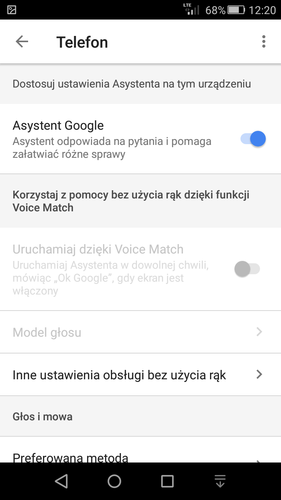

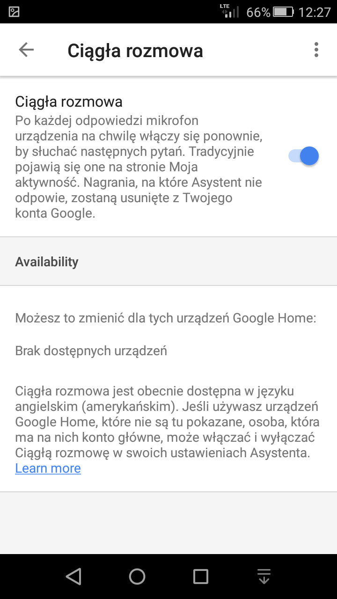
</Gallery>

Jak można zauważyć na powyższych screenach, aplikacja umożliwia m.in. wybór domyślnej aplikacji do odtwarzania muzyki (u mnie YouTube). Inną przydatną opcją jest wybór informacji, o których asystent ma nas informować na początku dnia (funkcja "Mój dzień"). Do opcji niedostępnych lub niedziałających można zaliczyć funkcjonalność "ciągłej rozmowy". Według informacji podanych na ekranie, opcja ta działa jedynie w języku angielskim amerykańskim. Drugą z tych opcji jest możliwość wywołania asystenta przy wyłączonym ekranie. Może to być wina braku zaimplementowania tej funkcji w języku polskim lub mojej wersji Lollipopa. Nie jest to bardzo stary system, ale Google ewidentnie celuje swoim asystentem w systemy od Marshmallow (6.0) w górę.

## Google Assistant w akcji

A jak działa asystent? Zaskakująco dobrze. Mówię tutaj zarówno w kwestii rozpoznawania polskiej mowy, jak i w działaniu usług. Swoje testy rozpocząłem od próby dowiedzenia się czegoś o maszynie "siedzącej" po drugiej stronie. Co ciekawe asystent potwierdził, że w Polsce pojawił się w 2018 roku, a także zaserwował ciekawostkę w postaci informacji o chińskim roku psa - najlepszego przyjaciela człowieka.

<Gallery>

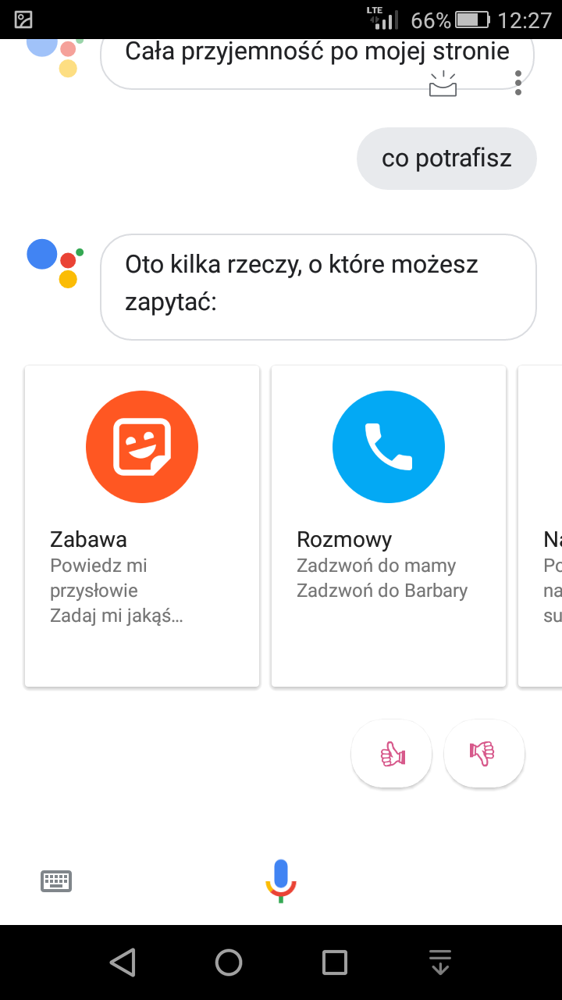

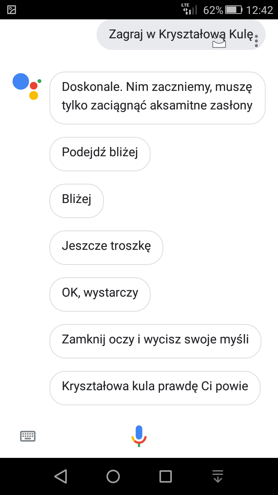
</Gallery>

Na skutek takiego odpytywania asystent zaproponował, żeby zagrać w "Kryształową Kulę". Nie był to jakiś super wyrafinowany smaczek, w przeciwieństwie do komunikatów dostosowanych do odległości głowy od ekranu (popatrz na ostatni screen powyżej). Gra polegała po prostu na zadawaniu różnych pytań, na które komputer odpowiadał krótkimi odpowiedziami twierdzącymi lub przeczącymi.

<AdSense/>

Jeśli chodzi o podawanie informacji z Internetu nie widzę poważniejszych problemów. Na proste pytania asystent sam znajduje odpowiedź oraz automatycznie wypowiada ją na głos. W przypadku bardziej złożonych wypowiedzi, serwuje zestaw wyników z wyszukiwarki.

<Gallery>
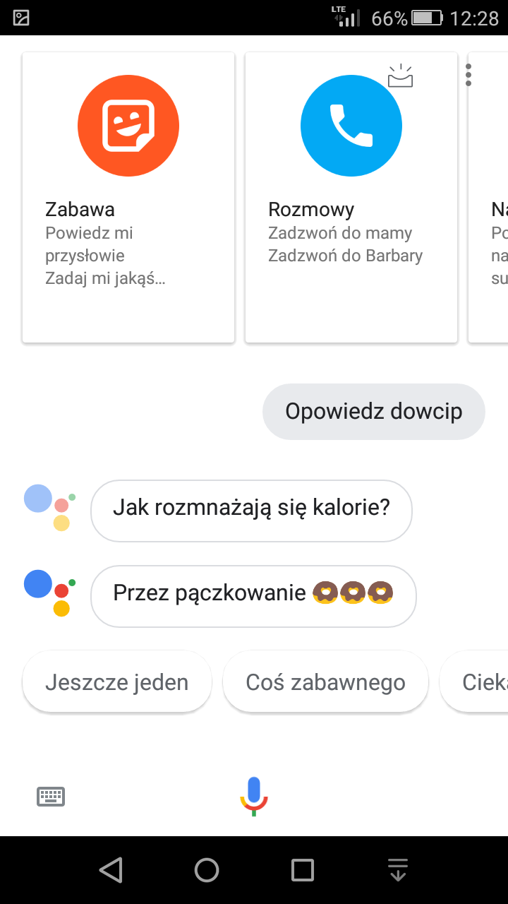
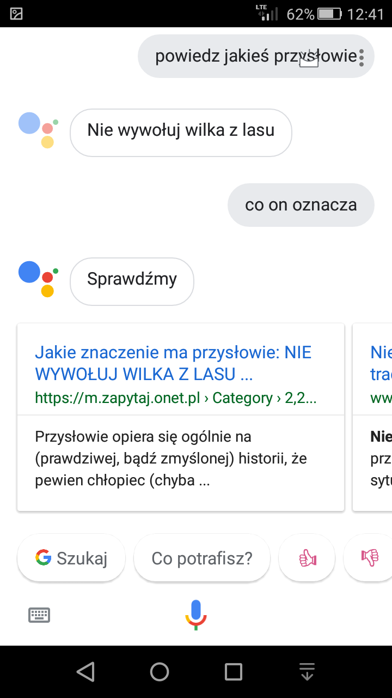
</Gallery>

Na drugim screenie widać, że asystent potrafi odgadnąć odniesienie do poprzedniej wypowiedzi. Po pytaniu "co on oznacza" bez problemu zrozumiał, że chodziło mi o przysłowie, które sam wcześniej wyświetlił. Oczywiście, mechanizm ten parę razy zawiódł i prowadził do bardzo dziwnych sytuacji, ale jak widać to na ostatnim screenie, asystent potrafi dobrze rozpoznać naszą wypowiedź i zwrócić poprawne wyniki.

<Gallery>
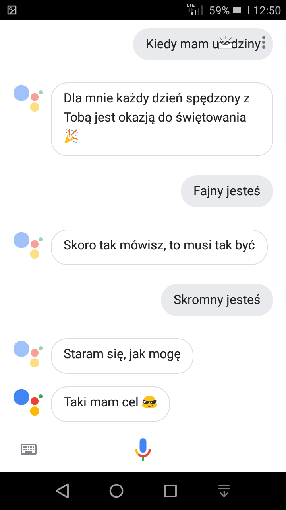
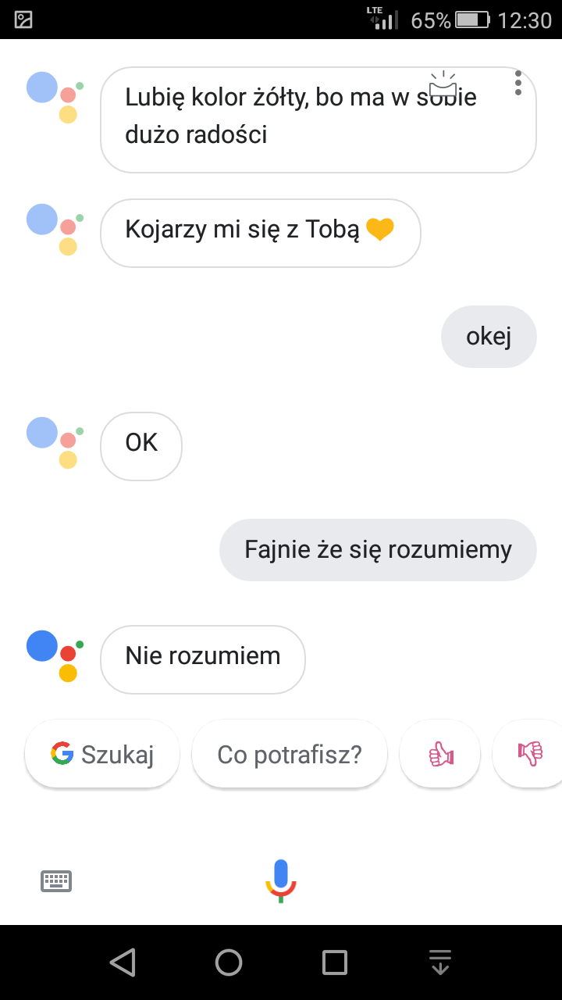
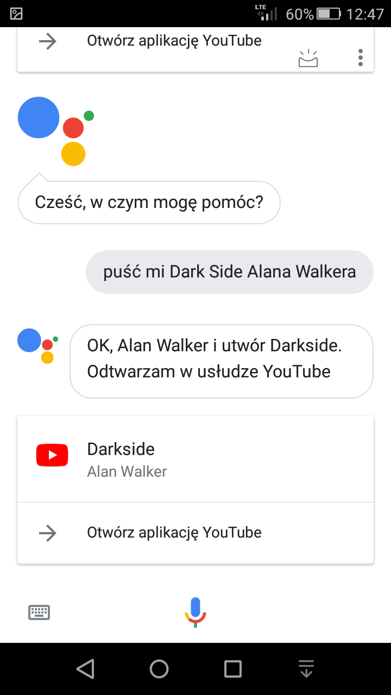
</Gallery>

## Podsumowanie

Osobiście jestem bardzo zadowolony z działania asystenta. Nie dysponuje on jeszcze pełną funkcjonalnością oraz miewa problemy z wykryciem frazy aktywacyjnej "Ok, Google", ale jest to dobry początek do uzyskania pełnego wsparcia dla Polski. Pragnę jeszcze przypomnieć, że będzie to pierwszy asystent głosowy rozumiejący język polski, co może się przełożyć na dużą popularność tej usługi w naszym kraju. Więcej informacji na ten temat zapewne otrzymamy na konferencji Google, która odbędzie się 9 października.
