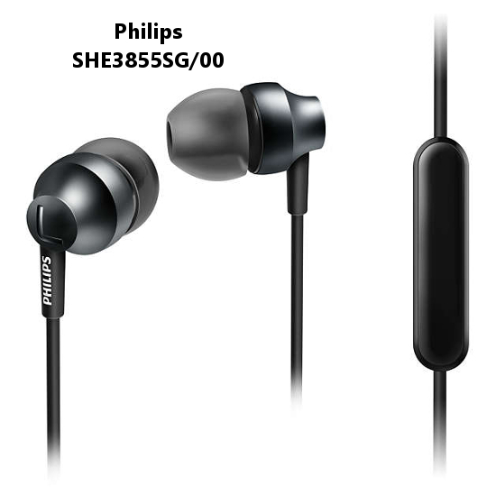
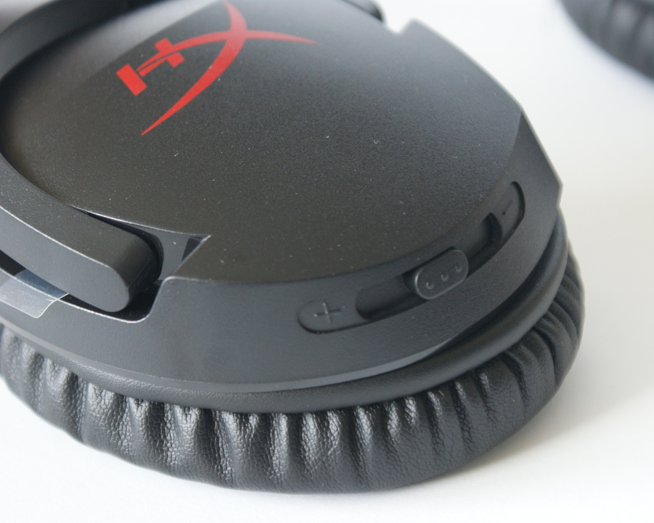
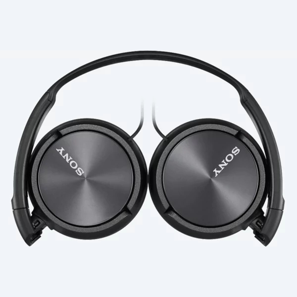
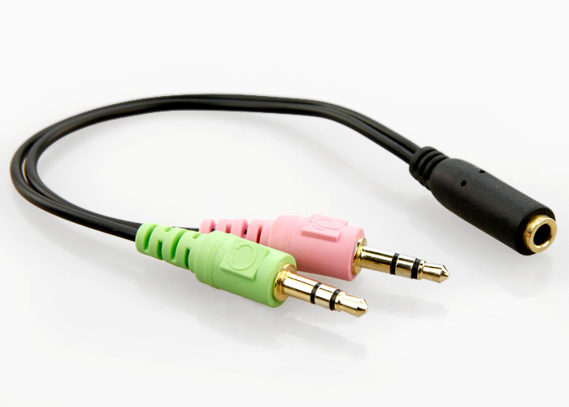
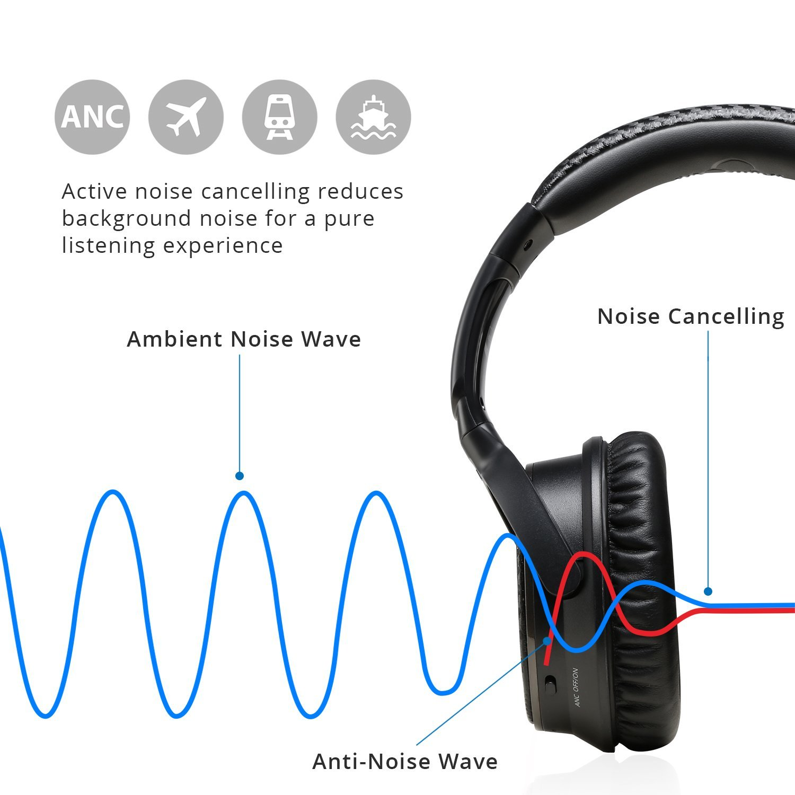

Słuchawki pozwalają ich użytkownikowi odizolować się od zewnętrznego świata i cieszyć się ulubioną muzyką. Omówimy sobie, jakie funkcje mogą posiadać te urządzenia, a także jaką formę mogą przybrać.

## Budowa i przeznaczenie

Wyróżniamy następujące typy słuchawek:

- **wokółuszne** - muszla całkowicie obejmuje małżowinę uszną i opiera się na czaszce. Obie słuchawki utrzymują się dzięki pałąkowi.
- **nauszne** - wyglądają podobnie jak poprzedni typ, ale są znacznie mniejsze. Muszla naciska w nich bezpośrednio na małżowinę ucha.
- **zauszne** - stosowane głównie przez sportowców, gdzie wymagane jest silne mocowanie słuchawki do ucha przy jak najmniejszej wadze urządzenia. Słuchawka posiada pałąk w kształcie ślimaka zakładany za małżowinę. Taką konstrukcję spotyka się w aparatach słuchowych lub w pojedynczych słuchawkach Bluetooth.
- **douszne** - małe, kompaktowe urządzenia wkładane do wnętrza małżowiny usznej.
- **dokanałowe** - najmniejszy typ słuchawek. Składają się z głośniczka oraz korka wykonanego z silikonu lub pianki, który wciskany jest bezpośrednio do kanału słuchowego.

<Gallery>

</Gallery>

Dodatkowo, słuchawki wokółuszne i nauszne możemy podzielić ze względu na obudowę membrany głośnika słuchawki:

- **zamknięte** - membrana całkowicie zasłonięta, izolacja od czynników zewnętrznych bardzo dobra, niskie tony wyraziste.
- **otwarte** - prawie cała obudowa słuchawki jest perforowana, wymiana powietrza nie jest ograniczana, dźwięk nie jest zniekształcony, ale izolacja od świata zewnętrznego praktycznie nie istnieje.
- **półotwarte** - tylko część obudowy słuchawek jest perforowana, zapewnia to kompromis między powyższymi wariantami.

<InfoBlock>Konstrukcje zamknięte z powodu swojej dobrej izolacji mogą powodować pocenie się skóry ucha w ciepłych pomieszczeniach, co skutkuje dyskomfortem podczas dłuższego użytkowania. Efekt ten nie zawsze musi występować i zależy on także od fizjologii użytkownika.</InfoBlock>

### Do zastosowań profesjonalnych

Osoby profesjonalnie zajmujące się obróbką dźwięku powinny sięgnąć raczej po konstrukcje otwarte zapewniające dobre odwzorowanie dźwięku.

### Dla aktywnego stylu życia

Osoby chcące słuchać muzyki podczas uprawiania różnego rodzaju sportów lub wykonujące inne czynności, które wymagają ciągłego ruchu, powinny unikać słuchawek o dużej masie. Sprawdzą się tutaj słuchawki zauszne lub niektóre dokanałowe, które dzięki swojej małej masie i dobremu umocowaniu nie powinny wypaść z ucha.

### Do gier

Do gier komputerowych najlepiej sprawdzą się budowy wokółuszne oraz nauszne. Konstrukcje zamknięte pozwolą na odizolowanie się od świata zewnętrznego oraz na uzyskanie wyrazistych niskich tonów zwiększających doznania płynące z gry.

### Do głośnego środowiska

Tutaj także przyda się dobra izolacja akustyczna. Jeśli rozmiar i waga nie stanowią problemu to ponownie sprawdzą się rozwiązania zamknięte, zasłaniające małżowinę. Jeśli zaś potrzebujemy mobilności warto sięgnąć po słuchawki dokanałowe.

<WarningBlock>Nie wszystkie słuchawki dokanałowe zapewniają dobrą izolację akustyczną. Z powodu swojej budowy najbardziej narażają człowieka na utratę słuchu spowodowaną zbyt głośnym słuchaniem muzyki. Jeśli poziom izolacji nie jest wystarczający warto rozważyć słuchawki wyposażone w aktywną redukcję szumów (którą omówię później).</WarningBlock>

<AdSense/>

## Parametry głośników

Jednym z parametrów definiujących głośniki w słuchawkach jest **pasmo przenoszenia**. Określa ono zakres częstotliwości, jakie głośniki są w stanie wygenerować. Oczywiście, im większy zakres, tym lepiej, ale należy mieć na uwadze ograniczenia ludzkiego organizmu. Zdrowy, młody człowiek jest w stanie usłyszeć dźwięki z zakresu 20 – 20 000 Hz. Wraz z wiekiem zakres (a zwłaszcza jego górna granica) zaczyna się zmniejszać.

Następnie warto zwrócić uwagę na **impedancję** oraz **poziom ciśnienia akustycznego**, w skrócie SPL. Od tych parametrów zależy jak głośno będą grały nasze słuchawki. Dla urządzeń pracujących z telefonami optymalne wartości impedancji powinny znajdować się w zakresie 16-32 Ohm, a ciśnienia akustycznego w okolicach 100 dB.

## Dodatkowe funkcje

### Mikrofon

Słuchawki z mikrofonem zwane "headsetami" są idealne dla graczy lub osób często rozmawiających przez telefon np. podczas prowadzenia auta. Słuchawki podłączane do komputera powinny mieć możliwość wyciszenia mikrofonu bez jego odłączania. W przypadku małych słuchawek do telefonów zazwyczaj nie jest to możliwe.

<ImageDescription>Headset gamingowy Logitech G233, źródło: logitechg.com</ImageDescription>

### Regulacja głośności

Miłym dodatkiem jest możliwość regulacji poziomu głośności bezpośrednio na słuchawkach lub ich kablu. Tak samo, jak w przypadku wyciszenia mikrofonu, opcja ta zazwyczaj dotyczy dużych słuchawek do komputerów.

<ImageDescription>Suwak głośności w słuchawkach HyperX Cloud Stinger</ImageDescription>

### Sterowanie odtwarzaczem

Niektóre modele słuchawek posiadają nawet mały pilot do sterowanie odtwarzaczem. W przypadku tych do telefonów, na kablu znajduje się mała pastylka z jednym przyciskiem. Służy ona do wznawiania i zatrzymywania muzyki, a także do odbierana połączeń głosowych. Droższe modele posiadają bardziej rozbudowane piloty z możliwością zmiany utworów, a nawet uruchamiania asystenta głosowego telefonu (np. Google Assistant, Siri).

<ImageDescription>Panel sterowania słuchawek JBL Synchros E40BT, źródło: jbl.com</ImageDescription>

### Samoregulujący się pałąk

Słuchawki często zmieniające użytkownika powinny posiadać samoregulujący się pałąk, który nie wymaga ręcznego dostosowywania do rozmiaru głowy. Takie słuchawki można poznać po podwójnym pałąku - jednym ruchomym wykonanym z materiału, a drugim stałym z metalu lub tworzywa.

<ImageDescription>Słuchawki AKG K72, źródło: akg.com</ImageDescription>

### Składana konstrukcja

Coś dla podróżujących. Niema nic gorszego niż złamanie słuchawek w plecaku. Aby tego uniknąć warto wyposażyć się w słuchawki składane, które po złożeniu przyjmują znacznie mniejszą i wytrzymalszą formę, gotową do transportu.

<ImageDescription>Składane słuchawki SONY MDR-ZX310, źródło: sony.pl</ImageDescription>

## Łączność

Słuchanie na uwięzi kabla czy wolność fal radiowych? Słuchawki przewodowe będą współpracowały z większą ilością urządzeń. Słuchawki bezprzewodowe natomiast zapewnią swobodę poruszania się, ale są nieco droższe i wymagają ładowania akumulatorów.

<AdSense/>

Najpopularniejszym rozwiązaniem jest **technologia Bluetooth.** Jest ona idealna dla słuchawek pracujących z telefonami lub innymi urządzeniami mobilnymi. Alternatywą są modele wykorzystujące **standardową komunikację radiową** do przesyłania dźwięku. Posiadają one własne stacje dokujące wyposażone w antenę oraz ładowarkę do akumulatorów słuchawek. Sama stacja podłączana jest do komputera lub innego urządzenia za pomocą kabla. Zaletą takiego rozwiązania jest znacznie większy zasięg słuchawek, a także bardzo długi czas pracy na baterii sięgający nawet kilkunastu godzin. Wadami natomiast jest zwiększona możliwość wystąpienia zakłóceń sygnału, a także brak łatwej możliwości podłączenia telefonu.

Słuchawki przewodowe najczęściej wyposażone są w klasyczny wtyk **jack 3,5 mm**. W przypadku braku mikrofonu wtyk będzie posiadał 3 piny. Modele z mikrofonem mogą posiadać pojedynczą wtyczkę 4 pinową lub dwie wtyczki - jedną od słuchawek, a drugą od mikrofonu. Takie rozwiązanie jest idealne do komputera, który posiada osobne wtyczki do tych funkcjonalności.

<ImageDescription>Rozdzielacz combo jack -> mikrofon + słuchawki, źródło: ebay.com</ImageDescription>

<InfoBlock>Niektórzy producenci headsetów dołączają do swoich produktów przejściówki z pojedynczej wtyczki na podwójną. Pozwala to korzystać ze słuchawek przy różnych urządzeniach.</InfoBlock>

Alternatywą dla jacka jest **złącze USB**. Zaletą takiego rozwiązania są większe możliwości urządzenia takie jak: sterowanie odtwarzaczem i głośnością w systemie, dodatkowe wibracje podkreślające niskie tony czy podświetlenie LED. Minusem takiego rozwiązania jest problematyczne, a nawet całkowicie niemożliwe, podłączenie ich do telefonów lub konsol.

## Aktywna redukcja szumów

Na koniec technologia, która pozwala dostarczyć nowych wrażeń ze słuchania muzyki i wymaga dokładniejszego omówienia. Funkcja jest dostępna jedynie w droższych modelach, a do poprawnego działania wymaga zasilania. Dlatego też występuje jedynie w modelach przewodowych, wyposażonych w USB lub w bezprzewodowych posiadających własne akumulatory.

### Schemat działania

<ImageDescription>Schemat działania ANC, źródło: techdissected.com</ImageDescription>

W skrócie postaram się wytłumaczyć działanie tej technologii. Na muszli obu słuchawek znajdują się mikrofony rejestrujące dźwięki otoczenia, takie jak szumy, rozmowy innych osób czy warkot silnika. Następnie procesor na podstawie tych odczytów, generuje przeciwfazę, która nadawana w naszych słuchawkach powoduje prawie całkowite wytłumienie zewnętrznych hałasów.

<InfoBlock>Generowaną przez słuchawki przeciwfazę możemy usłyszeć poprzez połowiczne zdjęcie słuchawki u ucha. Pozbawienie ucha izolacji akustycznej sprawi, że zacznie ono słyszeć szum dochodzący z głośnika.</InfoBlock>

Dźwięk, a raczej fala akustyczna to drgające cząsteczki, które interpretowane są przez nasz mózg. Zadaniem przeciwfazy jest zrównoważenie drgań tych cząsteczek. Zjawisko to można zobrazować za pomocą wagi szalkowej. Jeśli na jej jednej stronie położymy odważnik to ramię wagi się przechyli. Położenie takiego samego odważnika po drugiej stronie sprawi, że waga powróci do stanu równowagi.

<ImageDescription>Waga szalkowa, źródło: księgarnia-edukacyjna.pl</ImageDescription>

<InfoBlock>Technologia aktywnego redukowania szumów wykorzystywana jest też przez niektórych producentów samochodów osobowych. Transmituje ona przez zestaw audio przeciwfazę dźwięków pochodzących z silnika spalinowego.</InfoBlock>

### Dla kogo takie słuchawki?

Powracając do tematu słuchawek. Każdy, kto potrzebuje używać słuchawek w głośnym środowisku, a nie chce podgłośniać muzyki do szkodliwego poziomu głośności, powinien zastanowić się nad zakupem słuchawek wspierających tą technologię. Nieprzekonanych do działania tej funkcji zachęcam do wizyty w sklepie z elektroniką. Zapewne znajdzie się tam stoisko z możliwością przetestowania paru utworów. Ponieważ w takich sklepach jest zazwyczaj głośno, różnicę można poczuć od razu po założeniu słuchawek na głowę. Świat zewnętrzny przestaje istnieć.

<WarningBlock>Technologia redukcji szumów przynosi ze sobą również zagrożenie w postaci pieszych niesłyszących nadjeżdżających samochodów. Dlatego też należy używać tej opcji z rozwagą. Niektóre słuchawki, np. Sony, pozwalają nawet na szybkie wyłączenie tej funkcji poprzez przyłożenie ręki do jednej ze słuchawek. W takim przypadku tłumienie zostaje wyłączone, a mikrofony zaczynają nadawać dźwięki otoczenia wprost do naszych uszu, tak żebyśmy nie musieli zdejmować słuchawek.</WarningBlock>
