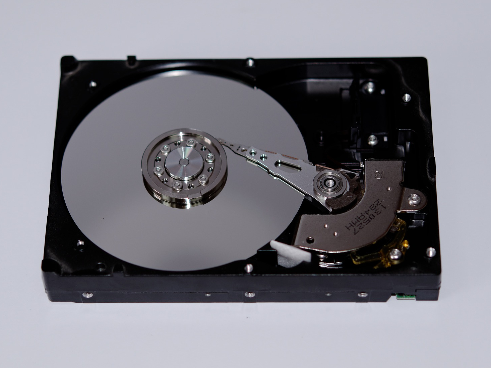
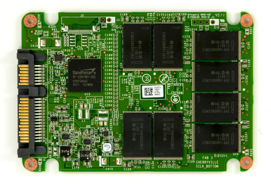
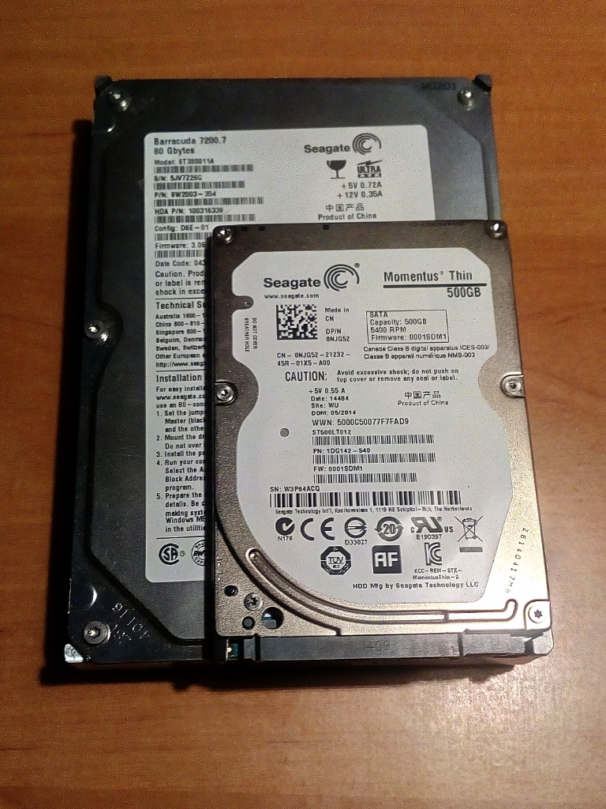
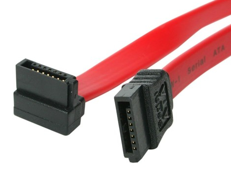
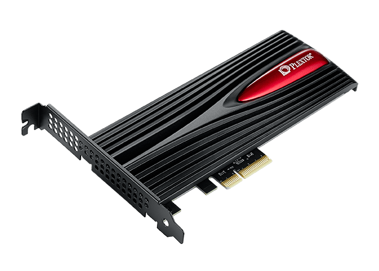
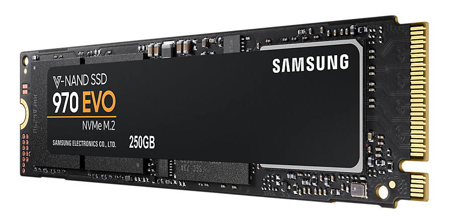
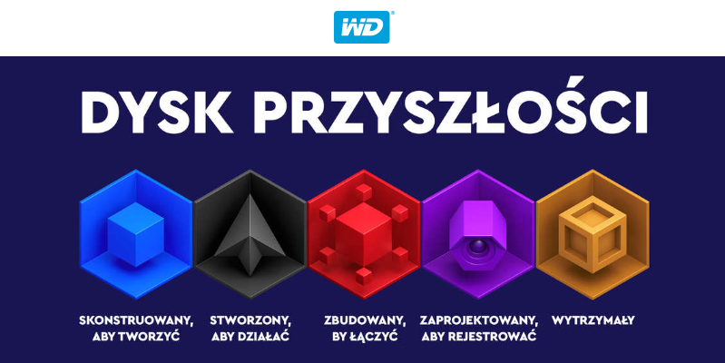

Każdy podzespół komputera, który uległ awarii, możemy wymienić, przywracając tym pełną sprawność urządzenia. Jedynym wyjątek od tej reguły stanowi nośnik pamięci. Nieważne, czy pracujemy z dokumentami, gramy w gry, czy jesteśmy miłośnikami robienia zdjęć, awaria dysku potrafi każdego skłonić do płaczu. Od sprawności i niezawodności tego podzespołu zależy nasz spokój o przechowywane dane. Dlatego też dokładnie omówię parametry jakimi powinniśmy się kierować przy wyborze urządzenia, któremu powierzymy przechowywany na komputerze
dorobek naszej pracy.

## Typy dysków

Obecnie na rynku trwa walka między dyskami **HDD (Hard Disk Drive)** oraz **SSD (Solid State Drive)**. Pierwszy potocznie nazywany "twardzielem", towarzyszy od początku istnienia komputerów osobistych, natomiast dyski SSD prędkościami biją poprzednika na głowę, lecz nadal nie mogą wyprzeć HDD-ków z rynku. Dlaczego? Przekonajmy się...

### HDD - dyski talerzowe

Głównymi elementami, z jakich wykonany jest dysk twardy, są wirujące talerze wykonane z ferromagnetyku oraz ruchoma głowica odczytująco-zapisującą znajdującą się nad talerzami. Dane zapisywane są na talerzu dzięki zjawisku indukcji magnetycznej.

<ImageDescription>Wnętrze dysku HDD. Widoczny jest talerz i głowica odczytująco-zapisująca</ImageDescription>

Przez zastosowanie fizycznych elementów **prędkość pracy tego urządzenia jest ograniczona** oraz dysk emituje **niechciany hałas**. Kolejną wadą fizycznych elementów jest **podatność na uszkodzenia** w wyniku uderzenia. Dlaczego więc dyski HDD są nadal popularne? **Ich zaletą są niskie koszty produkcji** - 1 GB pamięci kosztuje mniej niż 20 groszy! Pozwala to na produkowanie atrakcyjnych cenowo nośników o pojemnościach nawet kilku tysięcy gigabajtów.

### SSD - dyski półprzewodnikowe

W tym przypadku wewnątrz dysku nie znajdziemy nic ruchomego. Obudowa skrywa jedynie płytkę drukowaną z czarnymi układami pamięci.

<ImageDescription>Wnętrze dysku SSD skrywa jedynie płytkę z bankami pamięci flash</ImageDescription>

Ile mamy tu zalet? Bardzo dużo. Dzięki wyeliminowaniu ruchomych elementów, dysk stał się **bardziej odporny na uderzenia oraz nie hałasuje.** **Dyski SSD są wielokrotnie szybsze** od tych znanych w HDD. System oraz programy ładują się w mgnieniu oka, ponieważ zazwyczaj to dysk twardy stanowi tzw. "wąskie gardło" wydajności komputera.

Mogłoby się wydawać, że SSD jest wolny od wszystkich wad poprzednika. Dlaczego więc ciężko mu wyprzeć go z rynku? Przede wszystkim ze względu na cenę. Mimo ciągłego rozwoju tej technologii **cena wyprodukowania jednego gigabajta takiego dysku jest wysoka** i waha się między 80 a 100 groszy.

Pięciokrotnie wyższy koszt produkcji powoduje, że dyski SSD nie dorównują pojemnościami dyskom HDD. W cenie dysku HDD o pojemności 1 TB, czyli 1024 GB można kupić dysk SSD o pojemności około 256 GB. Dlatego też dyski HDD nadal są chętnie stosowane są tam, gdzie przechowuje się duże ilości danych (montażownie filmów, kopie zapasowe, serwerownie).

Dodatkowo dyski SSD opierają się na pamięciach typu flash, które **posiadają ograniczoną liczbę operacji zapisu/odczytu.** Dlatego też dyski tego typu zawierają w sobie specjalny układ sterujący, który odpowiada za równomierne zużywanie się całej pamięci. Część producentów dołącza do swoich dysków oprogramowanie, które powiadomi użytkownika o konieczności migracji danych, gdy poziom sprawności dysku spadnie do niebezpiecznego poziomu

<InfoBlock>Producenci cały czas pracują nad rozwiązaniem powyższego problemu, przez co żywotność dysków SSD znacząco się poprawiła, ale należy mieć na uwadze fakt istnienia takiego zjawiska.</InfoBlock>

### SSHD - dyski hybrydowe

Co się dzieje, gdy dwie technologie ze sobą konkurują? Tworzy się alternatywa łącząca zalety obu rozwiązań. Tak było też z dyskami SSHD, które są tradycyjnymi dyskami talerzowymi wzbogaconymi o małą szybką pamięć flash z dysków SSD.

Wewnątrz takiej hybrydy znajduje się układ analizujący dane wykorzystywane przez system operacyjny komputera. Jeśli któreś dane są często wykorzystywane zostają przeniesione na dysk półprzewodnikowy. Takie rozwiązanie pozwala zachować pojemność dysków twardych oraz osiągnąć wyższe prędkości odczytu i zapisu przy niewygórowanej cenie. Niestety prędkości, jakie oferuje takie rozwiązanie, wciąż są dalekie od tych oferowanych przez technologię SSD, a potrzeba "uczenia" się dysku SSHD powoduje,że nie widać wyraźnego skoku szybkości. Dyski tego rodzaju stanowią mniejszość na rynku.

<AdSense/>

## Najważniejsze parametry

### Pojemność

Jest to chyba najbardziej oczywisty parametr, który kilkukrotnie był już wspomniany w artykule. Podawany jest w gigabajtach lub terabajtach (1 TB = 1024 GB) i określa jaką ilość danych jest w stanie zapisać.

Zakres pojemności jest ogromny, więc podam tylko przykładowe wartości wraz z ich możliwym przeznaczeniem:

- **16 GB lub mniej** - totalne minimum pozwalające jedynie zainstalować system operacyjny bez dużej ilości dodatkowych aplikacji
- **16 GB - 32 GB** - system operacyjny + kilka programów oraz danych użytkownika
- **32 GB - 120 GB** - taka pojemność pozwala już na w miarę komfortową pracę, ale może okazać się zbyt mała dla osób przechowujących duże ilości danych
- **120 GB - 512 GB** - popularna pojemność dysków talerzowych w laptopach, pozwala na bezproblemowe przechowywanie większych ilości danych takich jak zdjęcia lub filmy
- **1 TB** - chyba najbardziej opłacalna pojemność dysków talerzowych w komputerach klasy PC, miejsca jest bardzo dużo i pozwala ono na swobodną pracę oraz pobieranie dużych gier czy plików multimedialnych
- **więcej niż 1 TB** - dla osób obracających dużą ilością danych np. montażystów wideo, zwykły użytkownik rzadko kiedy jest w stanie wykorzystać taką pojemność

### Obudowa / rozmiar urządzenia

Dyski występują w kilku różnych formach. Oprócz dysków na PCIe oraz M.2 (o których za chwilę) mamy do czynienia z dwoma rozmiarami obudów:

- **2.5 cala** - rozmiar dysków HDD i SSD montowanych w laptopach oraz w komputerach osobistych
- **3.5 cala** - rozmiar dysków HDD montowanych wyłącznie w komputerach osobistych. Dysków SSD nie spotkamy w takim rozmiarze

<ImageDescription>Porównanie dysków o rozmiarze 3.5 i 2.5 cala</ImageDescription>

### Interfejs

Czyli złącze jakim podłączamy dysk do komputera. Najstarszym interfejsem jest IDE (czasami nazywanego ATA lub PATA). Kable sygnałowe dysków opartych na tym interfejsie miały postać (najczęściej) szarych, szerokich taśm. Niskie prędkości oraz transmisja równoległa sprawiły, że zostały one już całkowicie wyparte.

<ImageDescription>Przestarzała już taśma sygnałowa IDE/ATA</ImageDescription>

Następcą IDE było złącze SATA oferujące transmisje szeregową osiągającą znacznie wyższe prędkości. Złącze to jest do dzisiaj powszechnie używane.

<ImageDescription>Kabel sygnałowy SATA - następca taśmy IDE</ImageDescription>

<InfoBlock>Najstarszy żart informatyczny jaki chyba istnieje: Przychodzi informatyk do sklepu komputerowego i mówi: -Poproszę dysk SATA -Nie mamy -No to IDE</InfoBlock>

Oprócz dysków wyposażonych w złącza SATA istnieją modele nośników instalowanych bezpośrednio na płycie głównej komputera. Pierwszym z nich są dyski PCI Express montowane z tyłu komputera, podobnie jak karty graficzne. Drugim rozwiązaniem są podłużne dyski M.2 montowane płasko w specjalnych złączach na płycie głównej. Ich przykłady prezentuje poniżej.

<ImageDescription>Dysk SSD na PCIe Plextor M9Pe(Y), źródło: goplextor.com</ImageDescription>

<ImageDescription>Dysk Samsung SSD 970 EVO montowany w gnieździe M.2, źródło: samsung.com</ImageDescription>

### Prędkość obrotowa

Jeśli dobrze uważałeś/aś czytając charakterystykę dysków HDD i SSD to wiesz, że ta cecha odnosi się jedynie do dysków talerzowych. Jednostką tego parametru są obroty na minutę (w skrócie RPM) i określają maksymalną prędkość obrotową talerzy wewnątrz dysku. Naturalnie im wyższa prędkość, tym szybsze odczyty danych.

Dyski talerzowe pracują zazwyczaj z prędkościami 5400 lub 7200 rpm. Ta pierwsza stosowana jest w małych dyskach dla laptopów, a druga w przypadku dużych 3.5 calowych dysków do komputerów PC. Istnieją także dyski o prędkościach 10000 lub 15000 rpm, ale są to rozwiązania stosowane jedynie w dużych serwerach.

### Pamięć podręczna

Kolejny parametr występujący jedynie w dyskach talerzowych. Tradycyjny dysk HDD posiada małą, kilku megabajtową pamięć, na której składuje często używane dane tak jak to ma miejsce w przypadku hybryd SSHD. Jej rozmiar wpływa na szybkość odczytu danych z talerzy, dlatego też w przypadku tego parametru istnieje jedna zasada: im więcej, tym lepiej.

### Czas dostępu oraz szybkość transferu

Są to dwa zbliżone parametry informujące o szybkości pracy dysku podawane przez producenta. Nie należy się nimi zbytnio przejmować, ponieważ każdy producent inaczej dokonuje ich pomiarów. Po prostu: czas dostępu ma być jak najmniejszy, a szybkość transferu odczytu i zapisu jak największa.

<AdSense/>

## Dyski do zadań specjalnych

Przez cały artykuł mówiłem o dyskach do komputerów domowych lub biurowych, ale nie tylko tam są one potrzebne. Chcę tu omówić specjalne serie modeli przystosowanych do pracy w konkretnych warunkach, a przykładem posłużą mi serie dysków talerzowych wydawanych przez Western Digital - jednego z największych producentów nośników pamięci do komputerów.

### Niebieskie dyski

Jest to najbardziej popularna seria dysków tego producenta, ponieważ przeznaczona jest dla standardowych użytkowników.

### Czarne dyski

Dyski oznaczone kolorem czarnych są przeznaczone dla osób wymagających podwyższonego bezpieczeństwa danych. Modele z tej serii są wyposażone w szereg zabezpieczeń chroniących talerze przed uszkodzeniem.

### Czerwone dyski

Przeznaczone do pracy w serwerach NAS. Ich zadaniem jest sprawne i bezpieczne operowanie z kopiami bezpieczeństwa. Mają one także zwiększoną wytrzymałość, nawet przy ciągłej pracy.

### Fioletowe dyski

Przeznaczone są do strumieniowego przesyłania danych z różnego rodzaju monitoringu. Wyposażono je w technologie zapobiegające gubieniu klatek obrazu oraz awariom.

### Złote dyski

Ostatnia seria dysków od WD przeznaczona dla profesjonalnych serwerów operujących dużą ilością danych. Jest to najbogatsza seria o najwyższym stopniu bezpieczeństwa i wydajności.

## Dodatkowe funkcje

Producent prześcigają się między sobą na technologie i funkcję. Jeśli bardzo zależy nam na bezpieczeństwu danych, warto zainteresować się następującymi parametrami:

- **czas pracy** - oczywiście jest to szacowana wartość obliczona przez producenta, ale im jest ona wyższa, tym wytrzymalszy powinien być nośnik
- **szyfrowanie** - w przypadku potrzeby przechowywania poufnych informacji warto zainteresować się dyskami wyposażonymi w sprzętowe szyfrowanie danych, które zabezpiecza nasze dane "w locie" podczas zapisu
- **gwarancja** - dobry producent, który wierzy w wytrzymałość swojego produktu, daje wieloletnią gwarancję bezproblemowej pracy dysku
- **odzyskiwanie danych** - cecha wiążąca się z gwarancją producenta, jeśli dane na dysku są bardzo ważne, należy sprawdzić czy producent dysku w razie awarii oferuję usługę odzyskiwania danych
