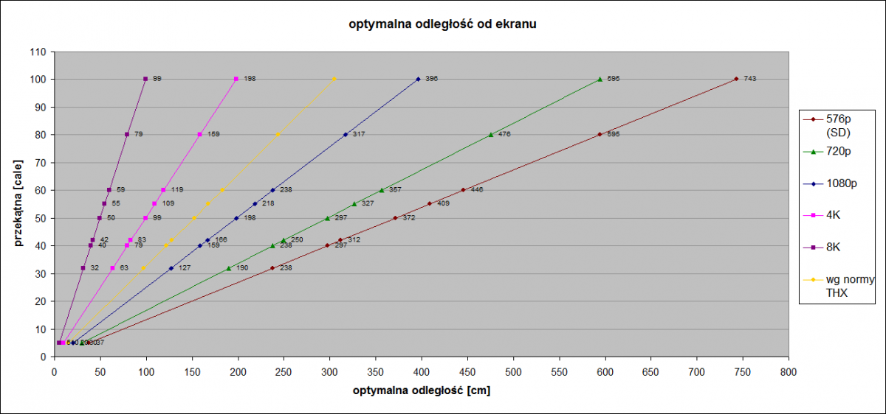
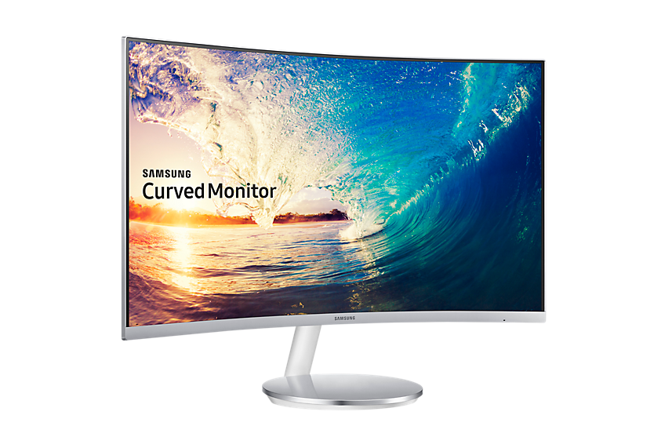
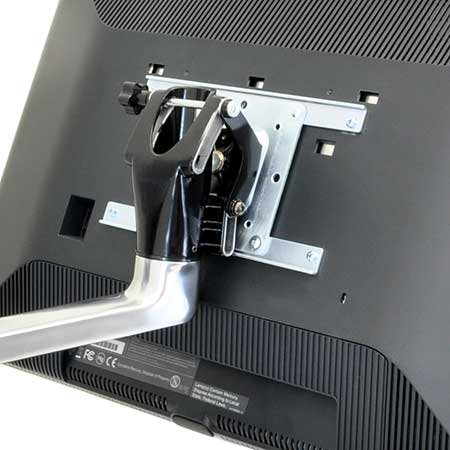
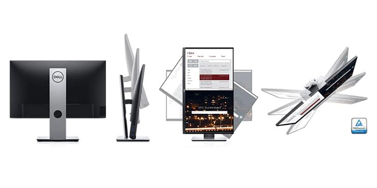
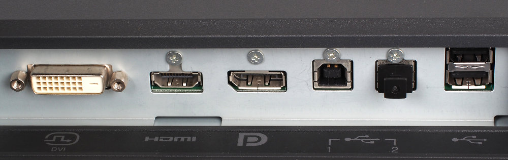
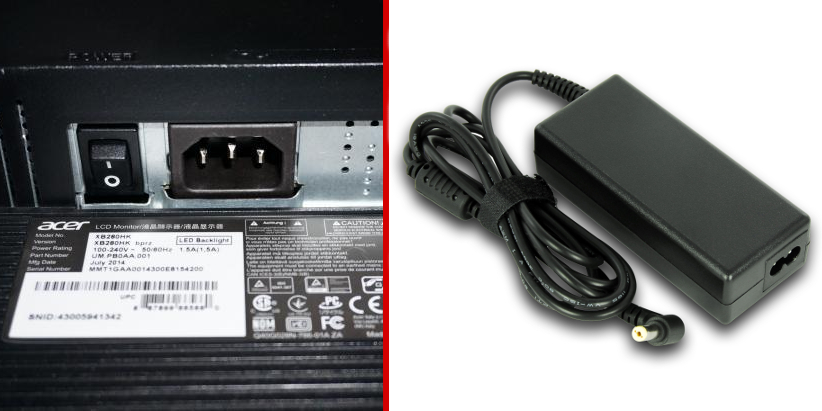
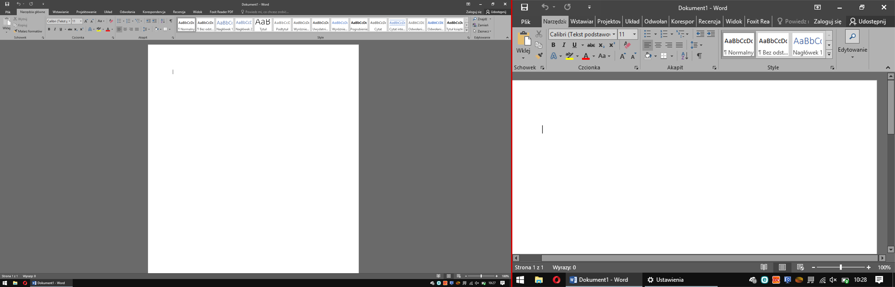
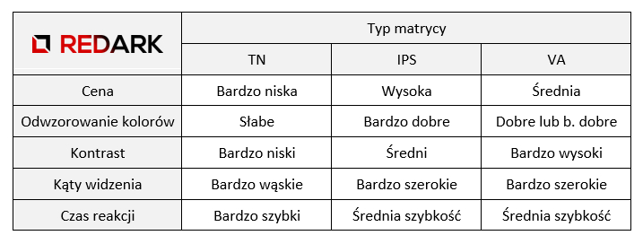
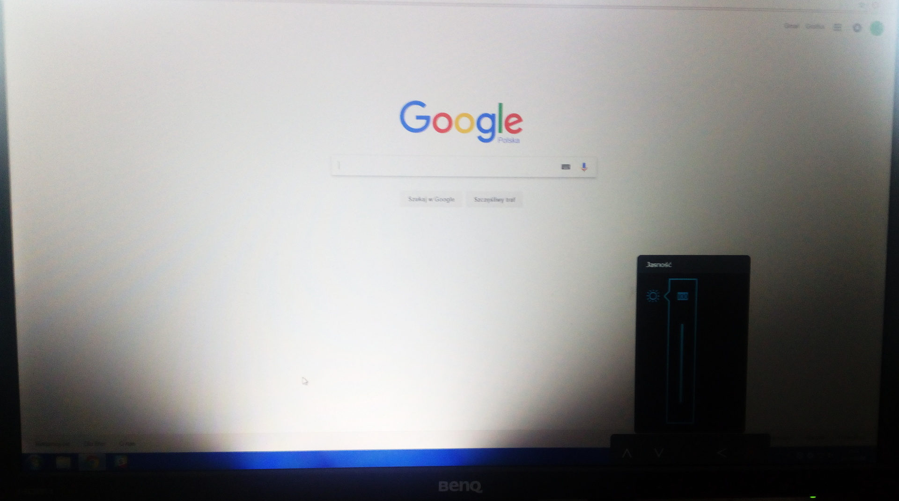

Żeby użytkownik mógł pracować na komputerze, oprócz klawiatury i myszki potrzebuje urządzenia, dzięki któremu będzie widzieć efekty swojej pracy. Za to zadanie odpowiedzialny jest centralny element stanowiska komputerowego jakim jest monitor. Jego wybór jest bardzo ważny, gdyż w dużym stopniu zależy od niego komfort pracy na komputerze oraz poziom ochrony naszego bezcennego wzroku.

Z racji bardzo dużej ilości parametrów i funkcji, jakie mogą posiadać monitory, omawiane zagadnienia podzieliłem na cztery grupy, z których pierwsze dwie zostaną omówione w tym artykule, a kolejne pojawią się w kolejnym artykule. Zapraszam do lektury.

## Parametry fizyczne

Rozpocznijmy od parametrów widocznych na pierwszy rzut oka.

### Przekątna ekranu

Najbardziej oczywisty parametr monitora, mierzony w calach pomiędzy najbardziej oddalonymi od siebie narożnikami ekranu. Aby dobrać odpowiedni rozmiar ekranu należy zmierzyć orientacyjnie odległość oczu użytkownika od płaszczyzny ekranu. Następnie otrzymaną długość należy zestawić z rozdzielczością matrycy monitora, która będzie nas interesować (o której później) i odczytać optymalną przekątną ekranu z wykresu poniżej:

<ImageDescription>Optymalna odległość oczu od monitora, źródło: nieidealny.pl</ImageDescription>

Po odczytaniu prawidłowej przekątnej monitora należy jeszcze sprawdzić, czy dany monitor zmieści się na naszym biurku, czy też nie. Najprostszym sposobem jest znalezienie przykładowego monitora o wybranej przekątnej i sprawdzenie jego wymiarów fizycznych.

<InfoBlock>Można się też tutaj wykazać znajomością Twierdzenia Pitagorasa i samemu obliczyć wymiary ekranu :)</InfoBlock>

### Zakrzywiony ekran

Nie, nie jest to wina złego transportu urządzenia. Monitor typu curved (z ang. zakrzywiony) posiada ekran o lekko zakrzywionej powierzchni. Takie rozwiązanie pozwala na lepsze doznania płynące z oglądania filmów lub grania w gry - użytkownik zostaje bardziej wchłonięty w akcję wyświetlaną na ekranie.

<ImageDescription>Monitor Samsung curved 27" CF591, źródło: sklepsamsung.pl</ImageDescription>

Czy takie rozwiązanie sprawdza się przy zwykłej pracy z komputerem? Zdania są bardzo podzielone. Wadą takiego monitora jest oczywiście podwyższona cena oraz problem w przypadku pracy w kilka osób. Wówczas prawidłowy obraz może zobaczyć jedynie osoba, która znajduje się centralnie przed ekranem, a pozostali obserwatorzy otrzymują obraz zdeformowany.

### Proporcje ekranu

Jest to stosunek szerokości do wysokości ekranu. Dawniej w telewizorach i monitorach królowała proporcja 4:3, przez co ekrany były zbliżone do kwadratu. Dzisiaj najpopularniejszy jest format 16:9, tzw. panoramiczny. Proporcje te posiada większość monitorów dostępnych na rynku. Niektórzy producenci eksperymentują z innymi wartościami, np. 16:10, ale wciąż stanowią mniejszość na rynku.

### Uchwyty montażowe VESA

To gwintowane otwory znajdujące się na plecach monitora, które przeznaczone są dla zewnętrznego uchwytu umożliwiającego powieszenie ekranu na ścianie lub montażu na krawędzi biurka. Warto sprawdzić czy dany monitor posiada uchwyt VESA oraz jaki rozstaw śrub został tam zastosowany (VESA 75/100/200).

<ImageDescription>Uchwyt VESA przykręcony do monitora, źródło: ergotron.com</ImageDescription>

### Regulacja położenia + pivot

Idealny monitor powinien pozwalać na swobodne ustawienie ekranu we wszystkich trzech płaszczyznach. Niestety, taką możliwość posiadają tylko najdroższe modele. Standardowy, tani monitor umożliwia jedynie drobne zmiany kąta pochylenia. Droższe modele posiadają już ruchomą nóżkę pozwalającą zmienić wysokość ekranu, a nawet przesuwać go w poziomie.

<AdSense/>

Na chwilę uwagi zasługują **monitory z tzw. pivot-em**. Pozwalają one na obrócenie ekranu o 90 stopni zamieniając tym ekran panoramiczny na portretowy. Jest to rozwiązanie idealne dla pisarzy lub programistów pracujących z dokumentami tekstowymi i kodem źródłowym. Taki ekran umożliwia przeglądanie dużej ilości tekstu bez potrzeby przewijania widoku.

<ImageDescription>Monitor Dell 22" USB-C P2219HC, źródło: dell.com</ImageDescription>

Idealną alternatywą dla drogich, ergonomicznych monitorów jest **uchwyt VESA** omówiony w poprzednim podrozdziale. Nawet najtańszy monitor, zamontowany na takim wysięgniku, można regulować w trzech płaszczyznach oraz zyskuje on funkcję obrotu o 90 stopni.

### Złącza + technologia MHL

Na koniec parametrów fizycznych omówię coś, bez czego monitor byłby bezwartościowy, czyli złącza sygnałowe. Poniżej znajduje się lista złącz audio/wideo stosowanych w monitorach. Ich dokładny wygląd oraz specyfikację można znaleźć [w tej części "kablologii"](/kablologia-pajeczyna-za-biurkiem).

- **D-SUB** - analogowy sygnał wideo
- **DVI** - cyfrowy lub analogowy sygnał wideo
- **HDMI** - cyfrowy sygnał wideo i audio
- **DisplayPort** - cyfrowy sygnał wideo i audio
- **Wyjście jack 3,5 mm** - analogowe złącze do podłączenia słuchawek
- **Wejście jack 3,5 mm** - analogowe złącze doprowadzające audio do monitora

<ImageDescription>Złącza monitora Eizo ColorEdge CG277 (DVI, HDMI, DP, 2x USB-B, 2x USB-A), źródło: ephotozine.com</ImageDescription>

Oprócz wymienionych powyżej złączy każdy monitor wymaga kabla doprowadzającego zasilanie. Część urządzeń posiada **zewnętrzny zasilacz, a część wbudowany**. Można je rozróżnić po typie gniazda zasilania:

<ImageDescription>Monitor z wbudowanym zasilaczem (po lewej) oraz rozwiązanie zewnętrzne z kablem zakończonym wtykiem DC (po prawej)</ImageDescription>

<InfoBlock>Monitory z zewnętrznym zasilaczem są z reguły bardzo płaskie, ale wymagają znalezienia w pobliżu monitora dodatkowego miejsca na ulokowanie jednostki zasilacza z kablem.</InfoBlock>

Droższe modele mogą posiadać również **złącza USB**. Służą one do podłączenia przenośnych pamięci masowych lub klawiatury i myszy. W przypadku takich modeli, do poprawnego działania złączy tego typu, potrzebne jest połączenie monitora z komputerem kablem USB dołączonym do urządzenia.

Na koniec, warto jeszcze wspomnieć o **technologii MHL**, w którą może zostać wyposażone jedno z gniazd HDMI monitora. Złącze oznaczone tymi literkami umożliwia podłączenie kablem HDMI-microUSB urządzenia mobilnego (telefon, tablet) bezpośrednio do monitora. Umożliwia to łatwe przesyłanie obrazu z urządzenia do monitora wraz z jednoczesnym ładowaniem jego baterii.

## Parametry obrazu i matrycy

Główną funkcją monitora jest wyświetlanie obrazu, dlatego też musimy zadbać, aby jego parametry nam odpowiadały. W tej grupie parametrów urządzenia zawarłem te, na jakie warto zwrócić uwagę w specyfikacji monitora.

### Kąty widzenia

Parametr ten określa w jakim zakresie kątów kolory wyświetlanego obrazu nie są przekłamane. Efekt ten można zaobserwować oglądając film znajdując się z boku słabej jakości monitora - kolory będą ciemne i niemalże nierozpoznawalne.

### Kontrast

Kontrast, czyli różnica między czernią a bielą. Przy tej cesze należy rozważyć dwa typy pomiaru kontrastu: **statyczny i dynamiczny**. Pierwszy mierzony jest na jednym poziomie jasności, a drugi na minimalnym (kolor czarny) i maksymalnym (kolor biały) poziomie jasności monitora.

<WarningBlock>Kupujący bardziej powinien interesować się wartością kontrastu statycznego, ale producenci monitorów często stosują nieczysty chwyt marketingowy i podają wartość kontrastu dynamicznego (bez odpowiedniego oznaczenia). Ma to na celu pokazanie bardziej atrakcyjnych wartości pomiaru dynamicznego w stosunku do niskich wartości pomiaru statycznego podawanego przez konkurencję.</WarningBlock>

### Rozdzielczość

Najbardziej rozpoznawalny parametr informujący o wymiarach matrycy, podawany w pikselach w formacie szerokość x wysokość. Od tego parametru zależy, jaka powinna być odległość oczu od ekranu komputera, ponieważ im wyższą mamy rozdzielczość, tym mniejsze elementy na ekranie zobaczymy.

**większa rozdzielczość = większe zagęszczenie = dużo małych elementów**

Do najpopularniejszych rozdzielczości należą:

- **1366x768 (HD)** - stosowana w małych laptopach lub tabletach
- **1920x1080 (Full HD)** - najpopularniejszy typ stosowany na stanowiskach komputerowych oraz w droższych laptopach
- **3840x2160 (4K)** - stosunkowo nowa rozdzielczość stająca się standardem w telewizorach, powoli wprowadzana do monitorów komputerowych

<ImageDescription>Obraz monitora w rozdzielczości 1920x1080 (po lewej) i 800x600 (po prawej)</ImageDescription>

<InfoBlock>Oczywiście, system operacyjny pozwala dowolnie zmieniać rozdzielczość obrazu generowanego przez kartę graficzną. Jest to znany trick stosowany przy prezentacjach z udziałem projektora (elementy interfejsu są wtedy większe). W przypadku monitorów zmniejszenie rozdzielczości spowoduje rozmazanie obrazu, ponieważ wygenerowane piksele będą podzielone na kilka rzeczywistych pikseli na ekranie.</InfoBlock>

### Typ matrycy

Najważniejszym parametrem definiującym jakość wyświetlanego obrazu jest typ matrycy w jaką wyposażony jest dany monitor. Jej wybór definiuje wartości takich parametrów jak kontrast czy kąty widzenia. Nie będę tutaj omawiał technicznego aspektu działania poszczególnych ekranów, ale skupię się na ich zaletach i wadach istotnych dla użytkownika.

Pierwszym typem jest **matryca TN**. Jest bardzo tania w produkcji oraz oferuje krótkie czasy reakcji (szybkość wyświetlania obrazu), ale na tym jej zalety się kończą. Monitory z tym typem matrycy nie są proponowane osobom pracującym z grafiką lub lubiącym oglądać filmy. Jakość kolorów i kontrast nie powala, a bardzo wąskie kąty widzenia uniemożliwiają komfortowe oglądanie w kilka osób.

Naprzeciw wadom TN-a wychodzi **matryca IPS**. Jest ona droższa w produkcji, ale oferuje znakomite parametry wyświetlania koloru, dzięki czemu idealnie sprawdza się w przypadku grafików. Na rynku istnieje także wersja S-IPS (Super IPS) posiadająca poprawione czasy reakcji i wartości kontrastu od klasycznego odpowiednika.

**Matryca VA** wraz z wszystkimi swoimi pochodnymi (AMVA, MVA itd.) została stworzona jako kompromis między matrycami TN i IPS. Charakteryzuje się dobrym czasem reakcji, rewelacyjnym poziomem kontrastu oraz odrobinę gorszym odwzorowaniem barw w porównaniu z IPS-em. Koszt produkcji takiego ekranu plasuje się poniżej swojego droższego przeciwnika.

Zestawienie omówionych zalet i wad przedstawia poniższa tabelka:

<AdSense/>

### Podświetlenie matrycy

Każdy, kto kiedykolwiek uszkodził podświetlenie ekranu wie, że sama matryca nie emituje światła. Ta jedynie zabarwia swoją powierzchnię, tak aby zmienić kolor białego światła pochodzącego od podświetlenia umieszczonego za nią. Tu należy mieć na uwadze dwie cechy:

- **LED lub zimna katoda CCFL** - chodzi tu o element generujący światło. Wcześniej w monitorach LCD stosowało się zimne katody, ale przez swoje gabaryty, prądożerność oraz duże wydzielanie ciepła jest systematycznie wypierane przez małe, energooszczędne diody LED
- **pełne lub krawędziowe** - elementy świetlne mogą znajdować się na całej powierzchni matrycy lub jedynie na jej krawędziach. Pierwszy typ charakteryzuje się wysokimi kosztami produkcji oraz bardzo dobą jakością podświetlenia. Typ krawędziowy jest tani w produkcji, pozwala uzyskać bardzo cienkie wyświetlacze, ale jakość podświetlenia może być bardzo różna, gdyż zależy od materiału rozpraszającego tzw. dyfuzora

<ImageDescription>Monitor z uszkodzonym podświetleniem krawędziowym - działa jedynie jeden segment LED u dołu ekranu</ImageDescription>

### Powłoka matrycy

O tym aspekcie często się zapomina, a odgrywa kluczową rolę, zwłaszcza w urządzeniach pracujących przy ostrym świetle. Mowa tutaj o powłoce, jaka jest nałożona na matrycę. Może być ona **matowa** lub **błyszcząca**. Pierwsza, droższa, pozwala na komfortową pracę przy ostrych odblaskach świetlnych. Powłoka błyszcząca, tak jak nazwa wskazuje: błyszczy się... Jest tańsza w produkcji, pozwala lepiej odwzorować kolory, ale o pracy przy żarówce lub na słońcu można zapomnieć.

<ImageDescription>Odblaski widoczne na błyszczącej matrycy laptopa, źródło: kalleboo Flickr</ImageDescription>

### Technologia HDR

**HDR**, czyli **High Dynamic Range** , mówiąc w skrócie, odpowiada za zwiększanie rozpiętości tonalnej oglądanego obrazu, co pozwala otrzymać obraz z bogatymi i nasyconymi kolorami. Monitory z tą technologią charakteryzują się obrazem o bardzo dobrej jakości.

<ActionButton to='/monitory-czesc-2'>II część artykułu</ActionButton>
