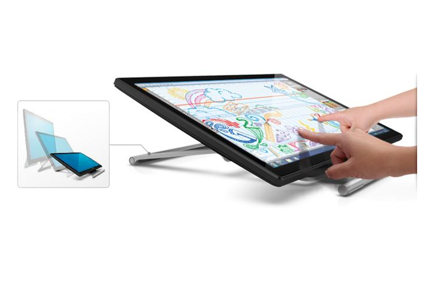
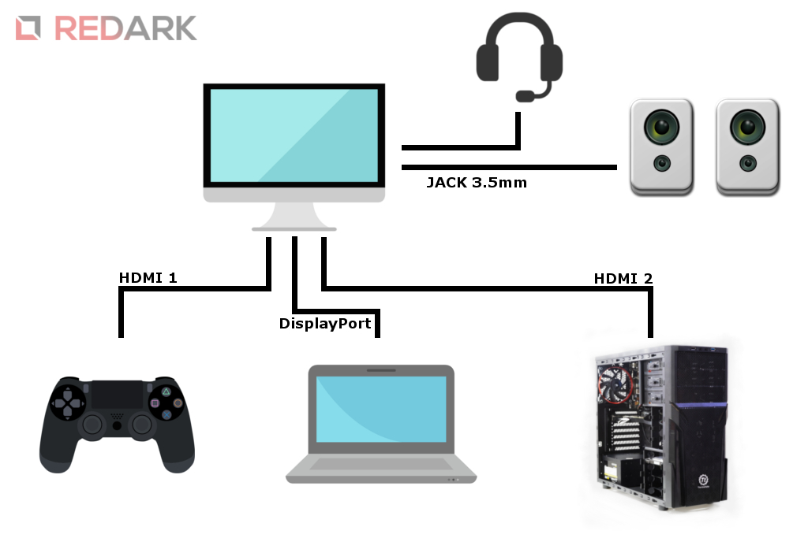
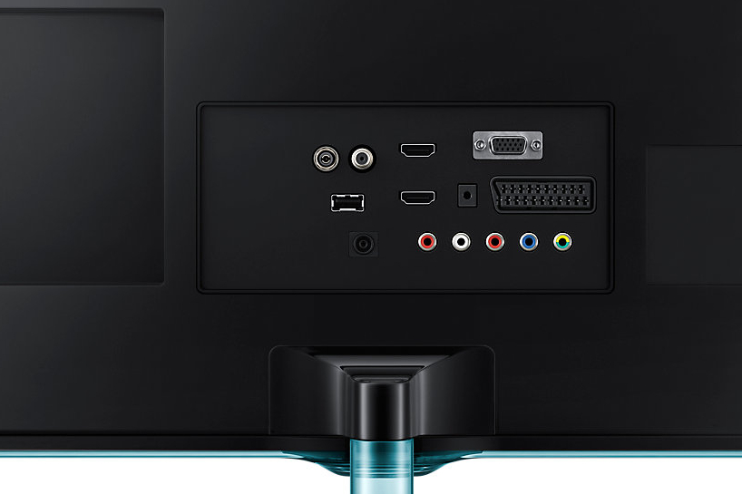
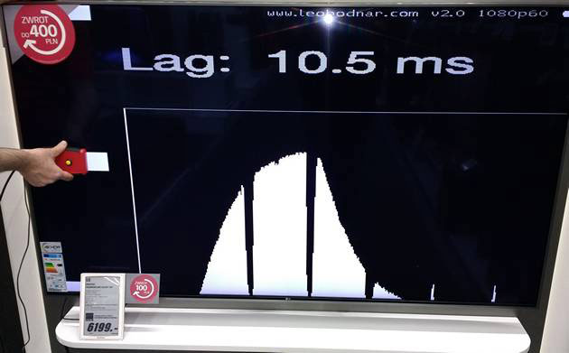
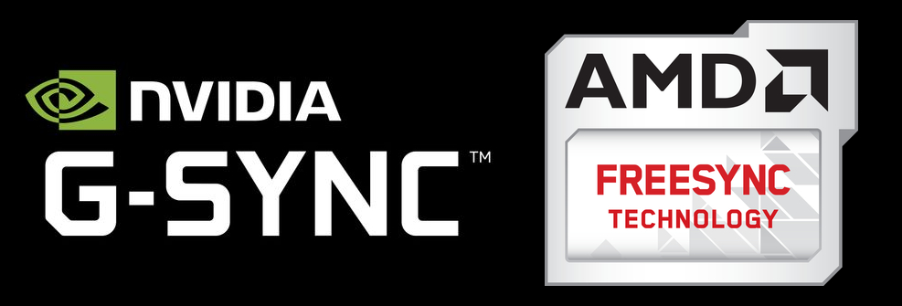

<ActionButton to='/monitory-czesc-1'>I część artykułu</ActionButton>

Teraz skupimy się na funkcjach dołączanych do produktów przez producentów oraz parametrach istotnych dla graczy.

## Dodatkowe funkcje i technologie

### Ekran dotykowy

Dość nietypowa funkcja, która w rękach zwykłego użytkownika jest po prostu zbędna i stanowi niepotrzebny wydatek, gdyż monitory tego typu nie są tanie. Jednakże takie rozwiązanie idealnie sprawdza się w restauracjach ułatwiając i przyspieszając obsługę klientów i zamówień. Natomiast ekrany wyposażone dodatkowo w **specjalny rysik** będą sprawdzać się w przypadku grafików i projektantów.

<ImageDescription>Monitor Dell S2240T z ruchomą nóżką i ekranem dotykowym, źródło: dell.com</ImageDescription>

### Głośniki

Funkcja znacznie bardziej przydatna od poprzedniej. Umożliwia zrezygnowanie z zewnętrznego zestawu głośników. Zmniejsza to koszty zakupu zestawu komputerowego i pozwala zachować więcej miejsca na biurku. Kolejną zaletą wbudowanych głośników jest automatyczne odtwarzanie dźwięków z urządzenia, z którego obraz jest aktualnie wyświetlany na monitorze. W przypadku większości głośników komputerowych wiąże się to z potrzebą przepinania kabla sygnałowego do każdego z urządzeń z osobna.

Wadą tego rozwiązania jest najczęściej słaba jakość głośników zastosowanych w urządzeniu, przez co monitor nie sprawdza się podczas słuchania muzyki. Ciekawą alternatywą dla takiego rozwiązania jest zakup urządzenia **wyposażonego w wyjście audio**. Pozwala to na podłączenie zewnętrznych głośników bezpośrednio do monitora, a co za tym idzie, także do wszystkich komputerów i konsol podłączonych do monitora.

<ImageDescription>Przykładowe podłączenie sprzętu audio do wielu urządzeń</ImageDescription>

<InfoBlock>Przypominam, że nie wszystkie kable przekazują do monitora obraz z dźwiękiem. Aby móc wykorzystać głośniki monitora należy użyć kabli takich jak HDMI czy DisplayPort.</InfoBlock>

### Tuner TV

Oprócz złączy omawianych w poprzedniej części artykułu, monitor może zostać wyposażony w tuner telewizyjny i wówczas wśród jego złączy mogą pojawić się gniazda antenowe, satelitarne, a nawet slot dla kart CAM/CI+ (karty dostępu warunkowego w telewizji płatnej). Taki model można spokojnie nazwać małym telewizorem. Do monitorów tego typu dołącza się pilot na podczerwień, a także posiadają wbudowane głośniki, zazwyczaj dobrej jakości. Jeśli ktoś chce odbierać telewizję i oszczędzić sobie zakupu osobnego telewizora, a seanse odbywane w fotelu przed komputerem mu nie przeszkadzają, to warto zainteresować się takim rozwiązaniem.

<ImageDescription>Złącza monitora Samsung TD390 wyposażonego w tuner telewizyjny, źródło: samsung.com</ImageDescription>

### Redukcja niebieskiego światła

Jest to bardzo przydatna funkcja chroniąca nasze oczy przed szkodliwym dzianiem niebieskiego światła. Ten typ światła męczy nasz wzrok i powoduje kłopoty ze snem, gdyż barwa niebieska pobudza aktywność naszego mózgu. Technologia jest różnie nazywana, najczęściej spotykane są określenia Blueshield i Eye-care. Wygoda tego rozwiązania polega na tym, że redukcji nie musimy ustawiać za pomocą oprogramowania w systemie, tylko wszystko dzieje się sprzętowo, bezpośrednio w monitorze. Zazwyczaj funkcja ta jest domyślnie wyłączona w monitorze, ale warto ją aktywować i dobrać stopień redukcji do naszych preferencji.

### Flicker Free - redukcja migotania obrazu

Kolejna funkcja chroniąca nasz wzrok. W tym przypadku chodzi o efekt migotania obrazu, który w pewnym stopniu męczy nasz wzrok. Każdy, kto choć raz próbował zrobić "profesjonalnego" screenshota ekranu za pomocą aparatu lub smartphone'a. Choć my nie zauważamy migotania obrazu, to obiektyw już tak. Monitory wyposażone w technologię Flicker Free, praktycznie nie posiadają efektu migotania, a obraz na zdjęciach wychodzi bez falowań. Jest to szczególnie ważne w przypadku modeli wyposażonych w podświetlenie LED.

<InfoBlock>Zrobienie zdjęcia monitora to najszybsza metoda sprawdzenia czy nasz monitor jest wyposażony w technologię Flicker Free.</InfoBlock>

## Monitory dla graczy

Na koniec przedstawię kilka parametrów, na które uwagę powinny zwrócić osoby grające w gry komputerowe.

### Odświeżanie ekranu

Jest to parametr matrycy podawany w Hz (hercach). Określa ile obrazów na sekundę jest w stanie wyświetlić monitor. Typowy monitor może wyświetlić 60 klatek na sekundę. Jest to wartość, która spokojnie wystarczy do standardowej pracy oraz grania w 60 FPS-ach.

Osoby chcące grać na wyższym klatkażu, aby móc "zobaczyć" większą płynność obrazu, powinny wyposażyć się w monitory o zwiększonym odświeżaniu obrazu (np. do 144 Hz). Takie modele są znacznie droższe, ale pozwalają na wykorzystanie pełnego potencjału karty graficznej.

<AdSense/>

### Czas reakcji

O tym parametrze wspominałem już podczas omawiania typów matryc. Podawany jest w ms (milisekundach) i informuje, z jaką szybkością monitor potrafi zmienić kolor piksela z czarnego na biały i z powrotem. Im mniejsza wartość tego parametru, tym lepiej monitor sprawdza się podczas wyświetlania dynamicznych scen.

Pionierami w krótkim czasie reakcji są matryce TN. Pierwsze matryce IPS oraz VA, na skutek długich czasów reakcji, borykały się z **negatywnym efektem smużenia**. Powodowało to widoczne opóźnienia w zmianie koloru pikseli. Aktualnie te dwa typy matryc zostały udoskonalone i nie odstają już tak bardzo od matrycy TN.

<WarningBlock>Tak samo jak w przypadku kontrastu, producenci stosują nieczyste zagrania marketingowe. Prawidłową wartością powinna być wartość pomiaru BTB (black to black), ale aby móc pokazać wyższe wyniki producenci używają pomiaru GTG (gray to gray).</WarningBlock>

### Input lag

Kolejna cecha dotycząca opóźnienia. Parametr określany tą nazwą mówi po jakim czasie od wysłania sygnału do monitora, ekran wyświetlił dany obraz. Jest to problem odczuwalny przez graczy, u których liczy się każda milisekunda. Z tym zjawiskiem bardzo często borykają się duże ekrany. Dlatego też przy zakupie telewizora do grania (na konsoli lub PC) warto jest sprawdzić wartość input laga i wybrać model z najmniejszym opóźnieniem.

<ImageDescription>Pomiar wartości input laga przy pomocy specjalnego urządzenia pomiarowego, źródło: benchmark.pl</ImageDescription>

<InfoBlock>Zwiększone czasy reakcji lub input laga mogą zauważyć tylko profesjonaliści grający na najwyższym poziomie w tryby sieciowe. Przy normalnej rozgrywce te parametry nie są tak istotne.</InfoBlock>

### Synchronizacja pionowa / G-sync / FreeSync

Świat, w którym karta graficzna generuje stałą i niezmienną liczbę klatek obrazu, nie istnieje. Dynamiczniejsza scena lub wejście w grze do miasta bądź lasu potrafi obniżyć znacząco klatkaż gry. Falująca ilość klatek na sekundę powoduje powstawanie na ekranie negatywnego zjawiska określanego jako rozrywanie obrazu. Spowodowane jest ono różną prędkością pracy karty graficznej i monitora. W celu rozwiązania tego problemu opracowano trzy technologie opisane poniżej.

Synchronizacja pionowa opiera się na generowaniu specjalnych danych na podstawie przesyłanego obrazu, dzięki którym monitor synchronizuje swoją pracę z pracą GPU. Wadą tego rozwiązania jest dodatkowe obciążenie komputera.

Aby rozwiązać problem rozrywania obrazu, dwóch producentów kart graficznych: Nvidia oraz AMD stworzyło własne rozwiązania technologiczne. Oba oparte są na specjalnym układzie scalonym w monitorze, który komunikuje się i synchronizuje z kartą graficzną. Różnica między rozwiązaniami polega na tym, że technologia **G-Sync działa tylko z kartami od Nvidii, a FreeSync tylko z kartami od AMD**. Ponadto technologia zielonych jest licencjonowana i nie może zostać dodana przez producentów monitorów za darmo, w przeciwieństwie do rozwiązania od AMD.

### Dodatkowe nakładki na obraz

Niektóre monitory, na przykład seria Asus ROG, pozwalają nałożyć na obraz kilka nakładek bezpośrednio z menu samego monitora. Są to m.in.:

- **celowniki** - kilka rodzajów ułatwiających celowanie broni podczas "strzelania z biodra"
- **minutnik** - pozwala umieścić timer w jednym z narożników ekranu
- **FPS** - sprzętowy licznik klatek na sekundę generowanych przez GPU
