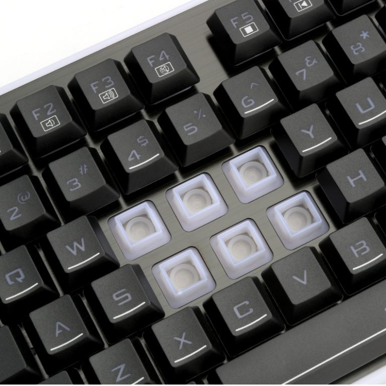
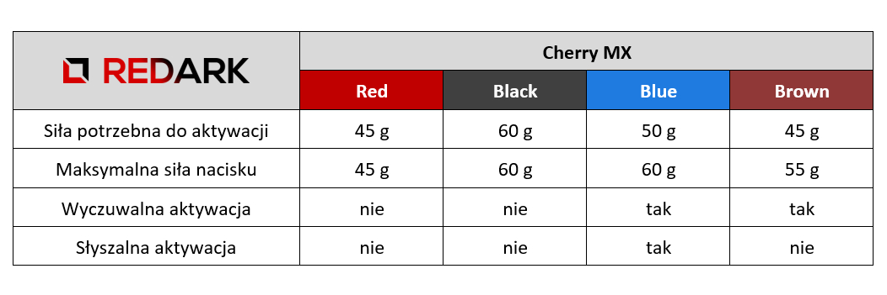
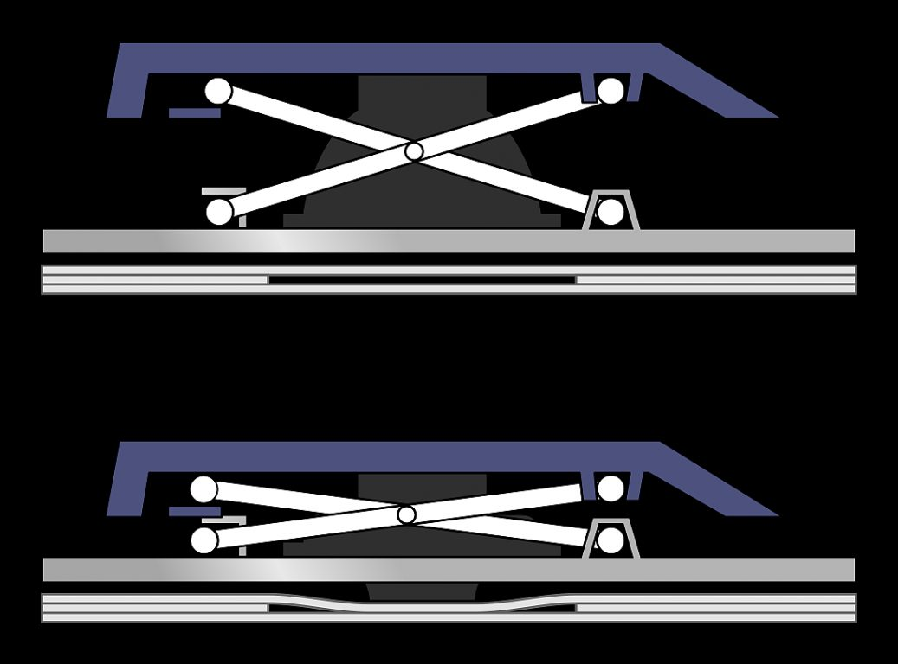
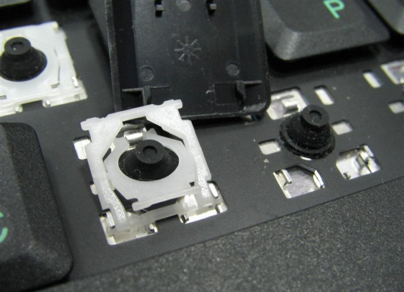

Podobnie jak ma to miejsce z [dyskami HDD i SSD](/nosniki-pamieci-dyski-hdd-ssd), od lat toczy się walka między dwoma technologiami: klawiaturami membranowymi i mechanicznymi. Wybór jednej z nich wcale nie jest taki oczywisty, ponieważ oba rozwiązania posiadają swoje mocne i słabe strony.

## Klawiatura membranowa

### Charakterystyka i opis działania

Pierwszy typ klawiatury charakteryzuje się niską ceną oraz średnią głośnością pracy. Wciskany przez użytkownika klawisz naciska na gumową membranę w kształcie półkuli. Ta, zmiażdżona klawiszem, dotyka płytki drukowanej znajdującej się na dnie urządzenia. Po puszczeniu klawisza, membrana powraca do swojego pierwotnego kształtu i tym samym wypycha klawisz z powrotem na górę.

<ImageDescription>Klawiatura membranowa Redragon K509, źródło: aliexpress.com</ImageDescription>

Niestety, jakość wykonania klawiatur tego typu jest bardzo różna. Membrana, sama w sobie, nie jest w stanie precyzyjnie odbić plastikowego klawisza, dlatego też jego ruch kierowany jest przez małe prowadnice, od których jakości zależy ogólny komfort pisania.

### Plusy

- bardzo niski koszt produkcji (ceny klawiatur zaczynają się od 20 złotych)
- lekka i prosta konstrukcja
- zazwyczaj cicha praca
- technologia umożliwia tworzenie cienkich klawiatur

### Minusy

- słabe prowadzenie klawisza
- nieliniowy opór stawiany przez klawisz
- wolniejszy powrót klawisza do stanu wyjściowego
- słabsze prowadzenie klawisza na jego krawędziach
- średnia lub słaba żywotność (może dojść do przebicia membrany)

<AdSense/>

## Klawiatura mechaniczna

### Charakterystyka i opis działania

Jak sama nazwa wskazuje, mamy tu do czynienia ze specjalnym mechanizmem odpowiedzialnym za prowadzenie i odbijanie klawisza. Jest to rozwiązanie znacznie droższe (jeden przełącznik może kosztować nawet 5-10 złotych), ale dający nieporównywalnie lepszy komfort pracy. Mimo to, spora rzesza osób, nawet tych dużo piszących na komputerze (pisarze i programiści), nie chce korzystać z tego rozwiązania, przez co klawiatury mechaniczne nadal nie mogą "wygryźć" z rynku membranowych rywali. Dzieje się to za sprawą wad tego rozwiązania, do których można zaliczyć wysoką cenę urządzenia, wysoki skok klawisza oraz głośny dźwięk, który może uniemożliwić komfortową pracę w grupie.

<ImageDescription>Przełączniki Cherry MX w różnych wersjach oznaczonych kolorami</ImageDescription>

Charakterystyka pracy klawisza klawiatury mechanicznej jest zależna od typu zastosowanego w nim przełącznika. Rynek mechanizmów zdominowany jest przez dwie marki: niemiecką firmę Cherry MX oraz jej tańszy, chiński odpowiednik Kailh. Dodatkowo, niektórzy producenci, tacy jak np. Razer, stosują w swoich produktach własne, autorskie rozwiązania.

<ImageDescription>Porównanie najpopularniejszych wersji przełączników Cherry MX</ImageDescription>

<GifViewer>
]
</GifViewer>

<ImageDescription>Działanie przełączników Cherry MX pokazane w przekroju, źródło: steelseries.com</ImageDescription>

Który z przełączników jest dla nas odpowiedni to kwestia gustu. Najlepszym sposobem ich doboru jest przetestowanie klawiatur w sklepie lub w ostateczności obejrzenie porównań w serwisie YouTube.

### Plusy

- stabilny ruch oraz liniowy opór stawiany przez klawisze
- szybki powrót klawiszy do położenia wyjściowego
- duża żywotność (nawet do 50 milionów kliknięć)
- łatwe oddzielenie klawisza od przełącznika, co pozwala na łatwe wyczyszczenie dna klawiatury

### Minusy

- wysoki koszt produkcji przełączników
- głośny, często uciążliwy, dźwięk pracy przełącznika
- większa grubość klawiatury (nawet do kilku centymetrów)
- ciężka konstrukcja (ponad kilogram)

## Klawiatury hybrydowe

Gdzie dwóch się bije, tam trzeci korzysta. Również w przypadku klawiatur pojawiły się kolejne rozwiązania mające na celu połączenie zalet obu technologii. Oto dwie z nich:

### Charakterystyka i opis działania

Co zrobić, żeby klawiatura mechaniczna była tańsza? Wyposażyć jedynie część klawiszy w przełączniki, a resztę w membrany. Przełączniki w klawiaturach hybrydowych umieszczane są pod strzałkami, WSADem oraz jego okolicami. Jest to rozwiązanie skierowane stricte dla graczy, którzy podczas gry chcą cieszyć się lepszą precyzją klawiatur mechanicznych, bez wydawania dużych pieniędzy. Rozwiązanie raczej nie sprawdzi się u osób używających klawiatury do standardowej pracy przy komputerze, ponieważ będą odczuwać zupełnie inne charakterystyki pracy klawiszy, tak jakby pracowali na dwóch różnych urządzeniach jednocześnie.

### Plusy

- średnia cena urządzenia (znacznie niższa w porównaniu do pełnoprawnej klawiatury mechanicznej)

### Minusy

- różna charakterystyka pracy klawiszy, co utrudnia pisanie
- wyższy komfort jedynie podczas grania w gry

## Klawiatury scyzorykowe (nożycowe)

### Charakterystyka i opis działania

Alternatywa bardziej praktyczna i uniwersalna niż klawiatura hybrydowa. Choć jej nazwa, a raczej nazwa jej mechanizmu może wydawać się obca, to korzystamy z niej już od dawna. Mowa tutaj o typie klawiatury montowanym w laptopach, który zyskuje coraz większe uznanie w komputerach klasy PC.

Dlaczego stworzono taką technologię? Dla laptopów przełączniki mechaniczne są za duże i za ciężkie, a rozwiązanie membranowe nie zapewnia wystarczającej trwałości. Dodatkowo, membrana do prawidłowego działania potrzebuje nieco przestrzeni, która w urządzeniach takich jak laptopy, jest na wagę złota. Dlatego też ulepszono budowę klawiatury membranowej dodając do niej sprężysty element w kształcie litery X, nazwany scyzorykiem. Przyjmuje on postać plastikowej płytki lub małego metalowego drucika. Jakie zalety przyniosło takie rozwiązanie? Ogromne!

<ImageDescription>Zasada działania mechanizmu scyzorykowego (nożycowego), źródło: lenovozone.pl</ImageDescription>

Nowy mechanizm przejął funkcję powrotną klawisza, przez co sama membrana stała się mniejsza i zachowuje swoją żywotność na dłużej. Zniwelowało to też potrzebę stosowania prowadnic klawiszy, które teraz są kierowane sztywno przez zawiasy scyzoryka i cechują się wyraźniejszym i lepszym skokiem (również na krawędziach). Jakby tego było mało, klawiatury tego typu charakteryzują się małymi rozmiarami oraz bardzo cichą pracą.

<ImageDescription>Klawisz z plastikowym scyzorykiem, źródło: kakprosto.ru</ImageDescription>

### Plusy

- pewny i wyczuwalny skok klawisza
- dobra reakcja na nacisk na krawędziach klawisza
- bardzo niski skok klawisza
- klawiatura może być cienka i lekka
- cicha praca

### Minusy

- słabsza od klawiatur mechanicznych - mimo dobrej żywotności klawiszy nadal może dojść do pęknięcia membrany lub scyzoryka

## Która klawiatura dla kogo?

Poznaliśmy już wszystkie typy mechanizmów występujących w klawiaturach. Możemy teraz odpowiedzieć sobie na pytanie, który z nich jest dla nas odpowiedni:

### Do codziennego użytku

Jeśli komputer ma służyć niemalże wyłącznie do prostych, codziennych czynności - wybór jest jeden. Klawiatura membranowa nie nadwyręży portfela i zaoferuje przyzwoity komfort pisania.

### Dla graczy

Tutaj najlepiej sprawdzi się klawiatura mechaniczna, która zapewni niezawodność i szybkość działania. Tańszą alternatywą są oczywiście klawiatury membranowe, ale należy zwrócić uwagę na to, żeby były bardzo dobrej jakości.

<AdSense/>

### Dla tych, którzy dużo piszą

Tutaj wybór jest naprawdę trudny i dlatego zostawiłem go na koniec. Są osoby, które wolą pisać na jednym typie, a inne na drugim. Chyba najprostszym rozwiązaniem jest zacząć od klawiatury membranowej o dobrej jakości. Jeśli nie zapewni ona zadowalającego komfortu pisania, można wówczas spróbować przejść na klawiaturę mechaniczną. Natomiast osoby, którym pasuje styl pracy klawiatury laptopów, powinny dać szansę klawiaturze scyzorykowej, która nie nadwyręży portfela, a zapewni lepszy komfort pisania przy wielogodzinnej pracy.

## Jeśli chodzi o mnie...

Pisanie artykułów dla REDARKa oraz wykonywanie swoich prywatnych projektów związanych z programowaniem i webmasteringiem, wiąże się z tym, że przykładam ogromną wagę do klawiatury, której używam. Jednakże, jeśli ktoś liczy tutaj na stwierdzenie typu "ja używam tej i ty też taką kup" będzie zawiedziony.

Obecnie, przy komputerze używam klawiatury mechanicznej na przełącznikach Cherry MX w wersji Red. Czy jestem z niej zadowolony na tyle, że nigdy nie tknę już membrany? Nie. Mechanik pozwolił mi doświadczyć nowych wrażeń płynących z pisania na komputerze, ale wysoki skok i głośna praca obniżają komfort pisania. Ponadto nie wyobrażam sobie posiadania klikalnych przełączników (które zapewne na drugi dzień, za sprawą niekoniecznie mnie, tylko któregoś z domowników, skończyłoby się rozbitym oknem). Może to wina tego, że nie gram na komputerze i nie czuję potrzeby posiadania dźwiękowego "feedback'u", ale u mnie taki przełącznik zwolennika nie znajdzie. Choć zdaję sobie sprawę z tego, że wiele osób nie wyobraża sobie pisania kodu czy książki na tańszej klawiaturze membranowej to gdyby ktoś podsunął mi membranę (oczywiście dobrej jakości) pod palce, nie miałbym nic przeciwko.

Jaka będzie moja następna klawiatura? Szczerze, to nie wiem. Może dalej będzie to mechanik, a może powrócę do klawiatury membranowej. Nie wykluczam też scyzoryków, które ubóstwiam, dzięki mojemu laptopowi, ale ten typ klawiatur nadal stanowi mniejszość na rynku i ciężko znaleźć coś dla siebie. Niezależnie od tego jaka będzie moja decyzja, wybrany model na pewno doczeka się recenzji na REDARKu.
