Klawiatura, wraz z leżącą obok myszką, należy do głównych narzędzi służących do komunikacji z systemem operacyjnym. Jej konstrukcja musi znosić nawet dziesiątki tysięcy uderzeń palców użytkownika dziennie, a jednocześnie zapewniać komfort użytkowania. Ilość modeli klawiatur oraz rozpiętość ich cen jest ogromna, co nie ułatwia zakupu. Wybór jest to też o tyle trudny, że wiele zależy od osobistych preferencji użytkownika. Klawiatura, która dla jednej osoby jest idealna, dla drugiej może okazać się niezdatna do użytku.

## Typ mechanizmu

Na początek należy określić do jakich celów będziemy wykorzystywać nasz komputer. Głownie do sprawdzania poczty i odpisywanie na maile? Pisanie obszernych tekstów lub kodów? A może jest to komputer do gier i potrzebne jest precyzyjne i niezawodne rozwiązanie?

Obecnie na rynku istnieją dwa główne rodzaje klawiatur: membranowe i mechaniczne. Obie posiadają swoje wady i zalety, a to, jaki typ jest bardziej odpowiedni dla danej osoby, jest kwestią sporną. Plusy i minusy oraz proponowane przeznaczenie tych klawiatur omówiłem [w osobnym artykule](/membranowa-czy-mechaniczna). Zawiera on też opis budowy urządzeń wraz z charakterystyką ich pracy.

## Komunikacja z komputerem

Tutaj sprawa jest znacznie prostsza. Istnieją rozwiązania przewodowe podłączane kablem do komputera oraz rozwiązania bezprzewodowe wykorzystujące dobrodziejstwa fal radiowych.

### Komunikacja przewodowa

Tańsze i pewniejsze rozwiązanie. Klawiatury wyposażone w przewód zazwyczaj oferują znacznie więcej dodatkowych opcji takich jak np. podświetlenie LED. Najczęstszym interfejsem jest oczywiście standard USB, ale nadal można spotkać modele wyposażone w starszy port PS/2.

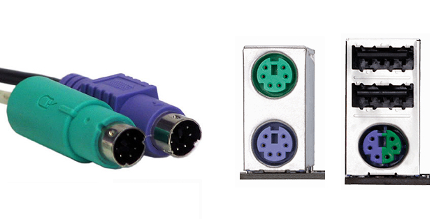

<ImageDescription>Od lewej: wtyczki PS/2, oddzielne gniazda PS/2, 2x USB + hybrydowe gniazdo PS/2</ImageDescription>

### Komunikacja bezprzewodowa

Klawiatury bezprzewodowe są idealne dla osób, którym przeszkadza widok kabli na biurku lub potrzebują większej mobilności. Takie rozwiązanie będzie również idealne do sterowania telewizorem smartTV. Należy jednak pamiętać, że urządzenie tego typu co jakiś czas, niestety, należy naładować lub wymienić baterie. Możemy spotkać 3 różne technologie bezprzewodowe:

- **fale radiowe** - klawiatura łączy się z komputerem za pomocą miniaturowego odbiornika montowanego w gnieździe USB
- **bluetooth** - idealne dla urządzeń mobilnych i laptopów wspierających tą technologie. Komputery PC rzadko posiadają odbiornik bluetooth - w tym przypadku trzeba dokupić zewnętrzne rozwiązanie na USB
- **WI-FI** - rzadkie rozwiązanie umożliwiające sterowanie komputerem podłączonym do tej samej sieci bezprzewodowej co klawiatura

<WarningBlock>W przypadku klawiatur bezprzewodowych ważne jest, aby producent wyposażył swój produkt w szyfrowane połączenie, które zagwarantuje bezpieczeństwo naszych danych i nie narazi nas na podsłuchiwanie.</WarningBlock>

## Klawisze

Głównym elementami klawiatury są oczywiście klawisze. Stąd naturalnym jest to, aby wybrać urządzenie wyposażone w klawisze, które spełniają nasze potrzeby i wymagania.

### Układ QWERTY

Nie istnieje jeden układ definiujący rozmieszczenie klawiszy na klawiaturze. Oprócz najpopularniejszego układu QWERTY (nazwa pochodzi od pierwszych liter układu) istnieje na przykład układ QWERTZ. Posiada on jedynie zamienione klawisze Y i Z, które łatwo mogą być niezauważone podczas wyboru urządzenia.

<InfoBlock>Ciekawą alternatywą dla układu QWERTY jest klawiatura Dvoraka. Jej układ został stworzony w taki sposób, aby zmaksymalizować szybkość pisania w języku angielskim.</InfoBlock>

Pozostając w temacie układu QWERTY, warto wspomnieć, że istnieje kilka jego odmian. Różnią się one położeniem i rozmiarem takich klawiszy jak enter, lewy shift, backslash i backspace. Różnice pomiędzy odmianami dokładnie pokazuje poniższa grafika:

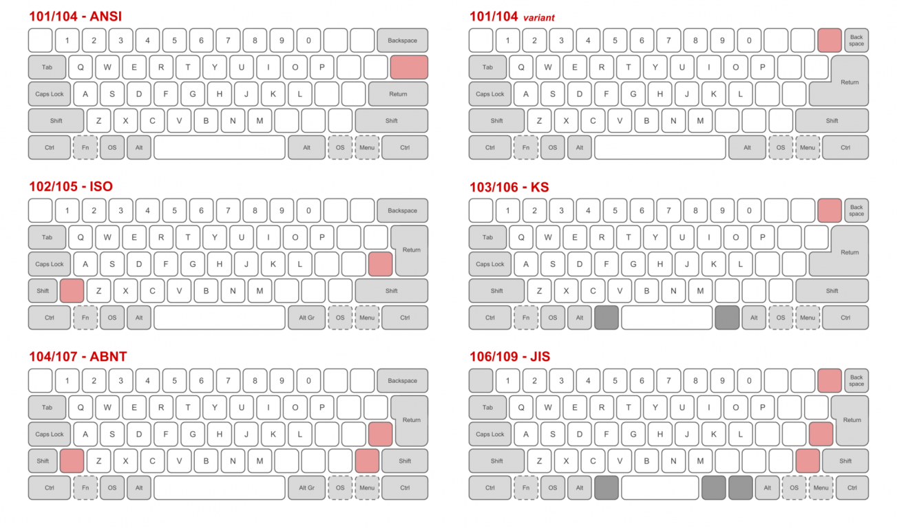

<ImageDescription>Różnice między poszczególnymi wersjami układu QWERTY, źródło: wikipedia.org</ImageDescription>

Z własnego doświadczenia wiem, że nie są to jedyne kombinacje klawiszy występujących na rynku. Jednak ich nazewnictwo nie jest ważne. Trzeba jedynie znaleźć wersję odpowiadającą swoim preferencjom i szukać klawiatur o takim samym układzie.

<InfoBlock>Osobiście preferuje wersje wyposażone w szeroki shift, enter i backspace. Zmniejsza to prawdopodobieństwo nietrafienia w klawisz małym palcem lewej i prawej ręki. Dlatego też mój wybór padł na układ ANSI.</InfoBlock>

<AdSense/>

### Wersja amerykańska i angielska

Oprócz wcześniej omówionych układów, przy wyborze klawiatury, możemy spotkać oznaczenie US-layout lub EN-layout. Wiele osób myśli, że takie klawiatury nie są dla nas odpowiednie, ponieważ nie zawierają polskich znaków dialektycznych. Tak jednak nie jest i nie istnieje coś takiego jak PL-layout. Obie wersje mogą spokojnie wprowadzać "ogonki" przy użyciu klawisza Alt, a różnice między nimi są inne, np. znak waluty na klawiszu 4. Niemniej jednak, **w Polsce powszechnie używana jest wersja amerykańska.**

### Skok klawisza

Zamykając temat układu klawiszy, przejdźmy do charakterystyki pracy samego mechanizmu. Jako pierwszy - skok klawisza, czyli odległość, na jaką możemy wcisnąć klawisz aż do napotkania oporu. Wyróżniamy klawiatury z wysokim i niskim skokiem. Do pierwszej grupy zaliczymy klawiatury mechaniczne oraz niektóre membranowe. Niskim skokiem będzie charakteryzowała się większość klawiatur membranowych, a w szczególności wszystkie modele wyposażone w mechanizm scyzorykowy (nożycowy).

<InfoBlock>Od skoku klawisza zależy też wysokość całego urządzenia. Klawiatury mechaniczne są wysokie, a ich klawisze można zazwyczaj nacisnąć na głębokość 4 milimetrów, jednak moment aktywacji przełącznika może odbywać się już w połowie głębokości.</InfoBlock>

### Klawiatura wyspowa

Jest to specjalny typ klawiatur, który najczęściej spotykamy w laptopach wraz z mechanizmem scyzorykowym. Klawisze w modelach tego typu oddzielone są niewielką przerwą i nie stanowią jednolitej tafli. Ma to na celu poprawienie komfortu podczas pisania długich tekstów. Niestety, klawiatury wyspowe nadal stanowią mniejszość na rynku.

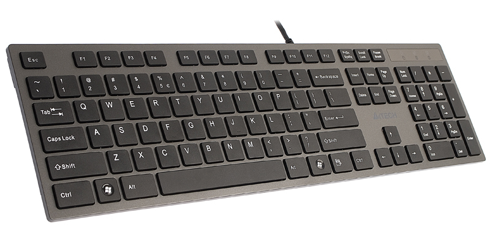

<ImageDescription>Klawiatura wyspowa A4TECH KV300, źródło: a4tech.com</ImageDescription>

### Klawisze multimedialne i sterujące

Dawniej istniał podział na klawiatury zwykłe i multimedialne - przystosowane do częstego odtwarzania filmów i muzyki. Dzisiaj ta granica mocno się już zatarła. Jeśli słuchasz muzyki i nie lubisz przełączać się na odtwarzacz multimedialny po byle błahostkę, sprawdź czy klawiatura wyposażona jest przyciski takie jak:

- wznawianie i wstrzymywanie odtwarzania
- przełączenie utworów
- sterowanie poziomem głośności
- wyciszenie wyjścia audio

Oprócz klawiszy multimedialnych można spotkać rozwiązania służące do kontroli samego komputera. Występują one zazwyczaj w modelach przeznaczonych do laptopów, a należą do nich:

- usypianie i wznawianie pracy
- sterowanie jasnością ekranu
- wyciszanie wbudowanego mikrofonu
- uruchamianie kalkulatora, poczty, przeglądarki www

### Blok numeryczny

Klawiatura może zostać wyposażona w specjalny blok numeryczny znajdujący się po jej prawej stronie. Ułatwia on obsługę kalkulatora oraz umożliwia łatwe wprowadzanie dużej ilości liczb.

Rozwiązanie to jest idealne dla osób pracujących w księgowości lub sprzedaży. Domowe komputery również mogą zostać w nie wyposażone, choć są pewne wyjątki. Osoby posiadające myszkę i klawiaturę na tym samym poziomie (bez użycia wysuwanej półki) mogą czasem odczuwać dyskomfort wynikający ze zbyt dużego rozstawu rąk podczas pracy. Wówczas klawiatura kompaktowa, bez bloku numerycznego, może być postawiona bliżej myszy.

<InfoBlock>Na rynku istnieją też zewnętrzne mini klawiatury na USB zawierające tylko i wyłącznie blok numeryczny.</InfoBlock>

## Ergonomia pracy

Tak jak już wspominałem, klawiatura musi zapewniać nam wysoki komfort pracy na komputerze. Przyjrzyjmy się zatem jakie dogodności oferują nam producenci.

### Nóżki

Często zapominany element klawiatury, ponieważ są ukryte na jej spodniej części. Prawie zawsze umożliwiają one dwustopniową regulację poziomu pochylenia urządzenia. Dobrym nawykiem jest sprawdzić, czy kupowana przez nas klawiatura posiada taką regulację, a także przetestowanie obu ustawień po jej zakupie.

### Podkładka/podpórka pod nadgarstki

Praca na wysokich klawiaturach może być męcząca z powodu różnicy wysokości między nadgarstkiem a klawiszem. Rozwiązaniem mogą okazać się modele wyposażone w podkładki pod nadgarstki znajdujące się przed samą klawiaturą. Droższe modele mogą posiadać nawet cienką poduszkę na powierzchni podkładki oraz oferować możliwość odłączenia jej od reszty urządzenia.

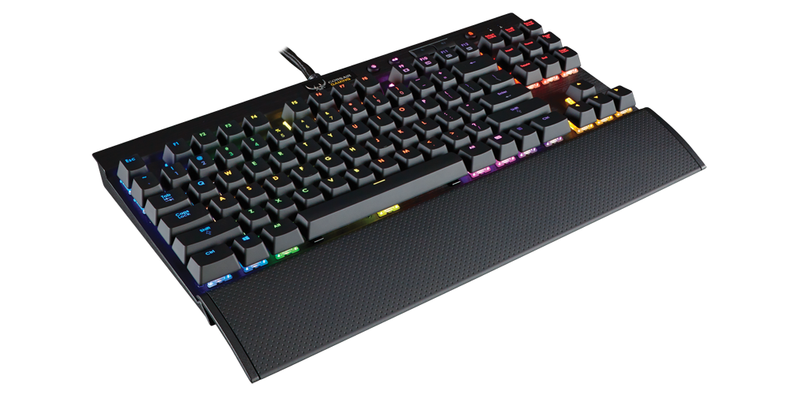

<ImageDescription>Klawiatura Corsair K65, źródło: corsair.com</ImageDescription>

Osoby potrzebujące podkładki pod nadgarstki, które nie chcą wymieniać swojej klawiatury, mogą zainteresować się zewnętrznymi rozwiązaniami dostępnymi w wielu sklepach. Są to różnego rodzaju szerokie poduszki wykonane z pianki lub wypełnione żelem.

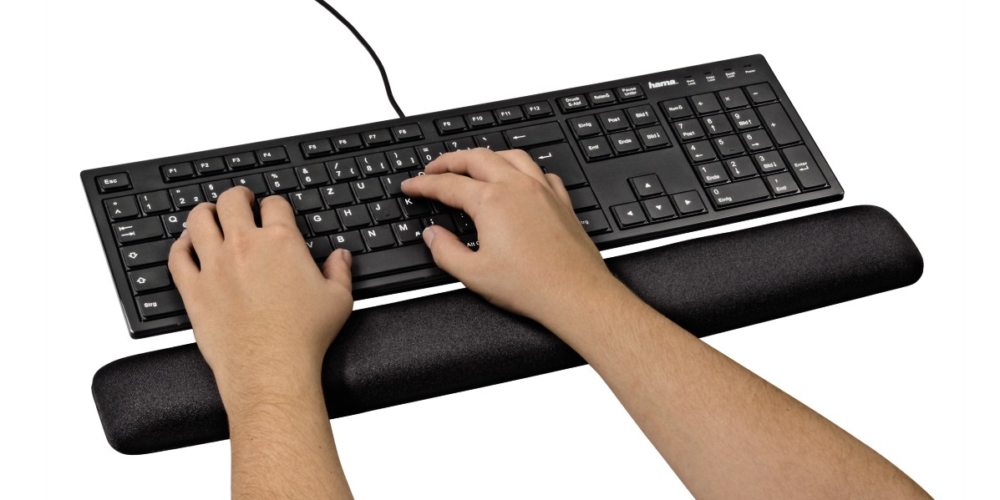

<ImageDescription>Zewnętrzna podkładka pod nadgarstki firmy Hama, źródło: hama.com</ImageDescription>

### Falowany kształt

Klasyczny, prostokątny kształt klawiatury nie jest dobry dla naszych nadgarstków, ponieważ muszą one pracować cały czas w zgięciu. Rozwiązaniem tego problemu są tzw. klawiatury ergonomiczne o falującym kształcie. Sprawiają one, że nasze ręce znajdują się w bardziej naturalnym ułożeniu i mniej się męczą. Wadą takiego rozwiązania jest potrzeba przyzwyczajenia się do dość nietypowego układu klawiszy.

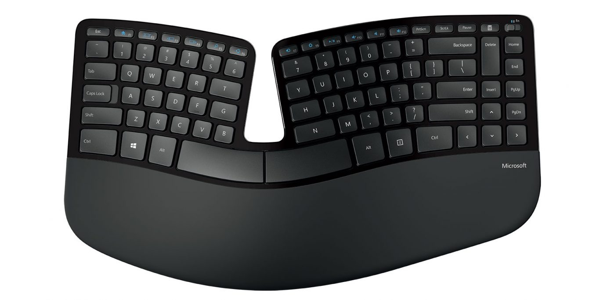

<ImageDescription>Klawiatura ergonomiczna Microsoft Sculpt Ergonomic Desktop, źródło: microsoft.com</ImageDescription>

## Do zadań specjalnych

Klawiatury posiadają wiele funkcji, które dla jednych nie będą potrzebne, a dla drugich są nieodzowne przy pracy na komputerze. Należą do nich:

### Programowalna rolka lub pokrętło

Niektóre klawiatury posiadają na swojej powierzchni rolkę lub pokrętło, które za pomocą zainstalowanego w komputerze oprogramowania pozwala manipulować zawartością nad którą aktualnie pracujemy. Dla przykładu:

- przeglądarka www - przewijanie strony
- przeglądarka zdjęć - przewijanie galerii lub powiększanie widoku
- grafika 3D - obracanie bryły
- edytor tekstowy - przewijanie stron lub kursora

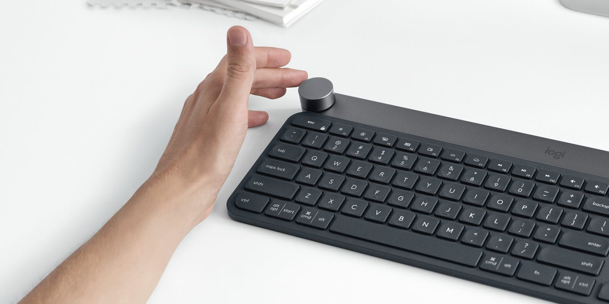

<ImageDescription>Klawiatura Logitech CRAFT, źródło: logitech.com</ImageDescription>

<AdSense/>

### Hub USB/audio

Często podłączasz pendrive'y lub słuchawki do komputera? A czemu nie robić tego do leżącej na wierzchu klawiatury?

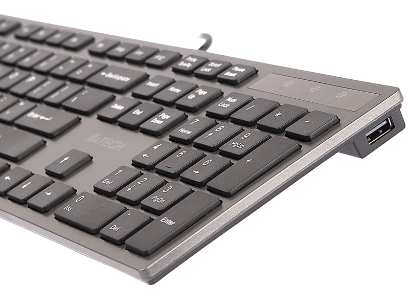

<ImageDescription>Hub USB wbudowany w klawiaturę A4TECH KV300, źródło: a4tech.com</ImageDescription>

### Zintegrowany touchpad

Idealne do sterowania smartTV. Zamiast próbować jeździć myszką po podłodze lub kanapie wybierz klawiaturę z wbudowanym touchpadem.

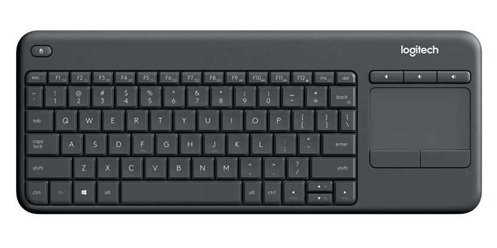

<ImageDescription>Klawiatura Logitech K400, źródło: logitech.com</ImageDescription>

### Wodoodporność i kurzoodporność

Lubisz jeść i pić podczas pracy na komputerze? Nie ma nic gorszego niż okruszki pod klawiszami czy wylana cola. Czy twoja klawiatura jest na to gotowa?

### Klawiatura elastyczna oraz składana

Coś dla lubiących mobilność. Istnieją modele klawiatur wykonane jedynie z elastycznej gumy (silikonu). Pozwala to na bezproblemowe zwinięcie jej w mały rulon. Nie jest to popularny typ klawiatur, ponieważ pisanie na niej nie jest zbytnio wygodne i efektywne. Lepszą opcją jest zakup klawiatury składanej. Zazwyczaj jest ona dwu- lub trzyczęściowa i oferuje znacznie lepszy komfort pisania niż model gumowy.

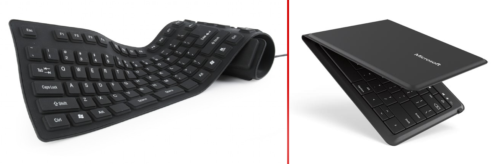

<ImageDescription>Po lewej: Gembird KB-109F-B (gembird.com). Po prawej: Microsoft Universal Foldable Keyboard (microsoft.com)</ImageDescription>

### Klawiatura wielokomputerowa

Specjalny, bardzo nietypowy model klawiatury przystosowany do pracy z kilkoma komputerami. Posiadają one na swojej powierzchni przyciski (wyróżnione kolorem) służące do przełączania się między urządzeniami.

<ImageDescription>Klawiatura Logitech K780 umożliwiająca kontrolę 3 różnych komputerów wraz z łatwą wymianą plików między nimi, źródło: logitech.com</ImageDescription>

## Dla graczy i nie tylko

Na koniec funkcje przeznaczone głównie dla graczy, ale spokojnie przydają się także w codziennej pracy.

### Klawisze programowalne (makra)

Często podczas gry, gracze muszą wciskać kilka przycisków w odpowiedniej kolejności. Aby ułatwić sobie grę używają specjalnych programowalnych klawiszy pod którymi zapisują sobie przygotowane wcześniej kombinacje klawiszy. Naturalnie ta sama opcja może także posłużyć do szybszej pracy w edytorze tekstu lub grafiki. Poniżej prezentuję listę funkcji jakie mogą posiadać klawiatury:

- tworzenie kombinacji w oprogramowaniu lub bezpośrednio na klawiaturze
- kombinacje zapisywane w pamięci klawiatury
- osobny blok klawiszy programowalnych
- opcja ustawiania szybkości wykonywania kombinacji
- opcja zapętlania kombinacji

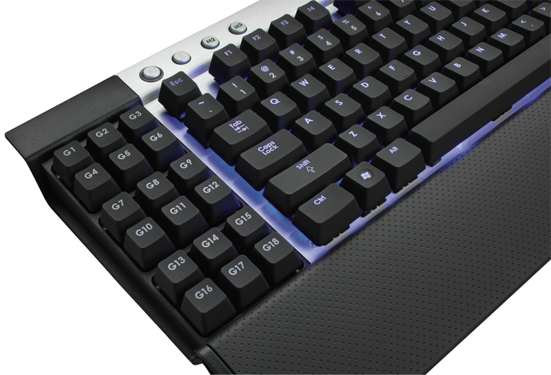

<ImageDescription>Klawiatura Corsair VENGEANCE K90 z osobnym blokiem klawiszy makr, źródło: corsair.com</ImageDescription>

<AdSense/>

### Podświetlenie LED

Funkcja ułatwiająca pracę po ciemku oraz dostarczająca ciekawych efektów wizualnych. Podświetlenie można scharakteryzować na dwa sposoby.

Kolor podświetlenia (od najtańszego do najdroższego):

- **stały jednokolorowy** - klawiatura świeci tylko jednym kolorem
- **stały wielokolorowy** - klawiatura może świecić na kilka kolorów (pojedynczo lub jednocześnie)
- **wielokolorowy** - podświetlenie RGB świecące wszystkimi kolorami

Typ podświetlenia (od najtańszego do najdroższego):

- **jednostajne** - cała klawiatura świeci lub nie
- **strefowe** - klawisze są połączone w grupy sterowane niezależnie
- **punktowe** - każdy klawisz świeci niezależnie i może być sterowany za pomocą oprogramowania komputera lub klawiatury

Poniżej przedstawiam galerię przykładowych podświetleń klawiatur:

<Gallery width={2}>
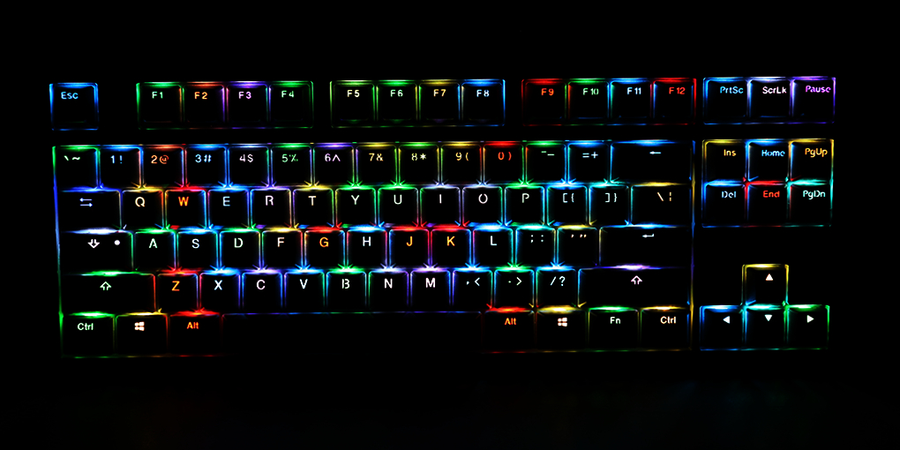
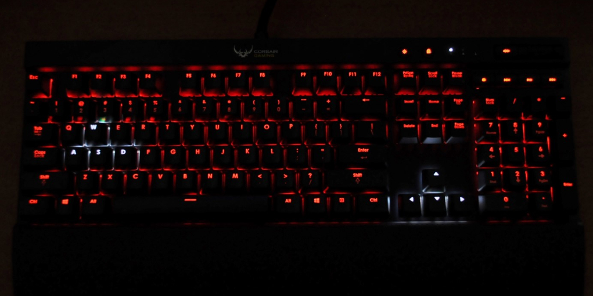
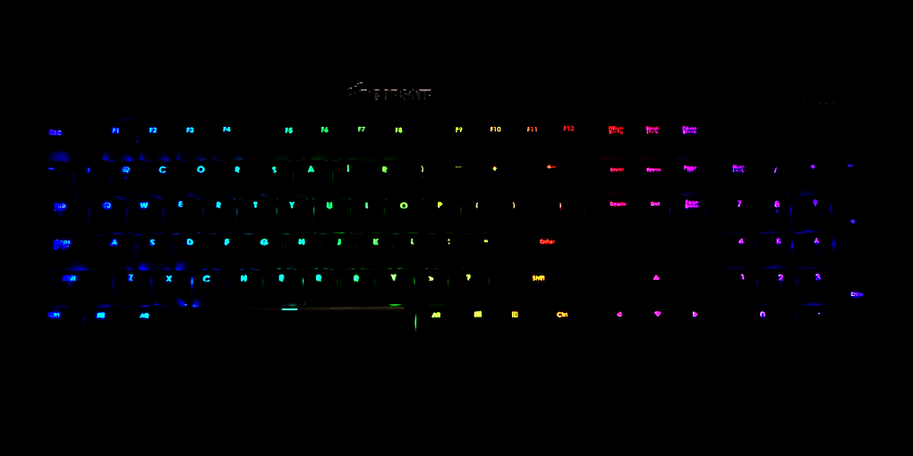
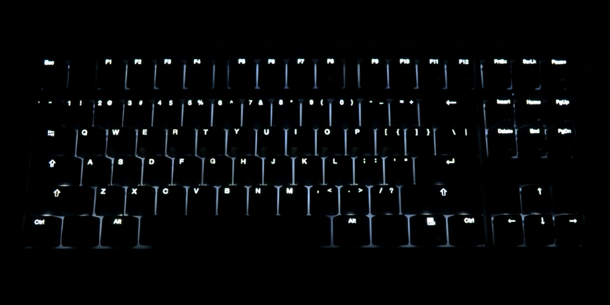
</Gallery>

<InfoBlock>Niektóre klawiatury mogą oferować specjalne efekty świetlne reagujące na klawisze wciskane przez użytkownika.</InfoBlock>

### Anti-ghosting

Technologia kryjąca się pod tą tajemniczą nazwą pozwala na wciskanie wielu klawiszy naraz. Tanie klawiatury często mają problem z rozpoznaniem wielu klawiszy, natomiast modele gamingowe są zwykle pozbawione tego problemu. Ilość rejestrowanych klawiszy można łatwo sprawdzić za pomocą [tego przykładowego testera](https://drakeirving.github.io/MultiKeyDisplay/).

### Wyróżniony WSAD

Na koniec, dla jednych błahostka, dla innych bardzo istotna, czyli wyróżniona sekcja klawiszy WSAD.

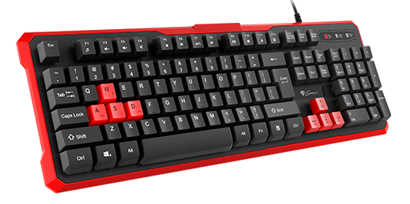

<ImageDescription>Klawiatura: GENESIS Rhod 110, źródło: genesis-zone.com</ImageDescription>

Czasami jest to jedynie zmieniony kolor plastiku, a czasami producent wykorzystuje fakturę lub inny materiał, co poprawia przyczepności palców i umożliwia łatwiejsze pozycjonowania palców gracza na klawiaturze.
