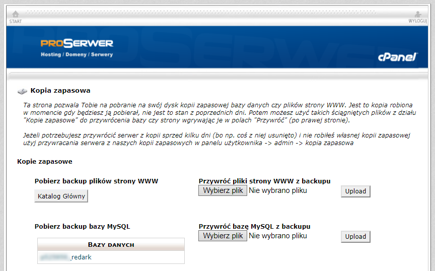
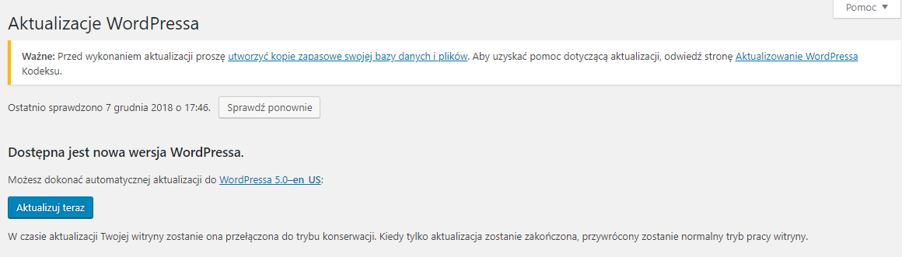
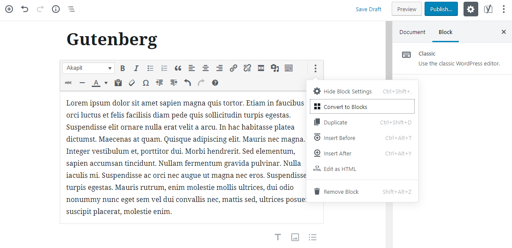
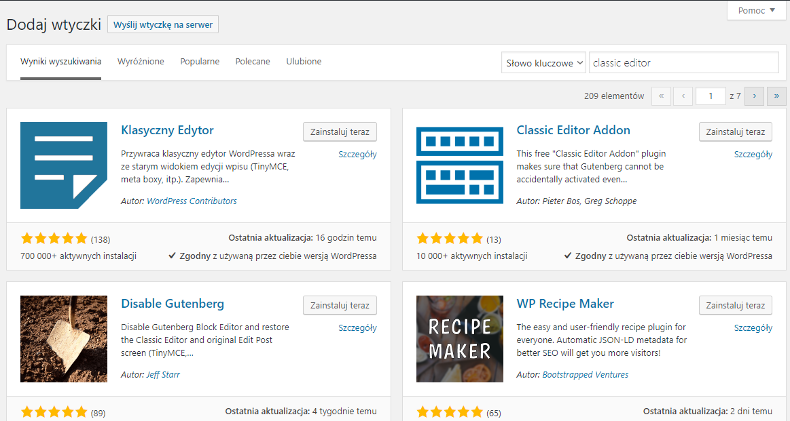

Najbardziej popularny system zarządzania treścią doczekał się właśnie nowej, dużej aktualizacji oznaczonej okrągłym numerkiem 5.0. Sprawdźmy, co przygotowali dla nas jego twórcy.

## Nowy edytor treści

Daniem głównym jest oczywiście nowy edytor treści o nazwie Gutenberg, o którym pisałem już wiele razy. Ewidentnie, to na nim skupiła się cała uwaga, co jest zrozumiałe, ponieważ przez ostatnie 4 miesiące programiści zmagali się z licznymi problemami z Gutenbergiem. Spowodowane było to oficjalną prośbą ze strony twórców o przetestowanie ich dzieła, a co za tym idzie, zwiększeniem liczby testerów. Całą sprawę opisałem szerzej [w tym artykule](/nadchodzi-gutenberg).

Edytor nie różni się bardzo od wersji, jaką mogli wypróbować użytkownicy, którzy zdecydowali się na przedpremierowe testowanie Gutenberga. Edytor pracuje w miarę stabilnie i cały czas jest dopracowywany. Osoby, które nie miały jeszcze z nim styczności, mogą czuć się zagubione w nowym systemie publikowania treści i żeby trochę rozjaśnić ideę tworzenia treści w postaci bloków [zapraszam do przeczytania tego artykułu tutaj](/gutenberg-nowy-edytor-tresci-wordpressa). Opisałem w nim ogólny zarys pracy w nowym interfejsie.

## Zmiana domyślnego motywu

Drugą dużą nowością (oprócz Gutenberga) jest zmiana domyślnego motywu pokazującego się po instalacji WordPressa. Nakładka nazywa się "Twenty Nineteen", a użytkownicy raczej ciepło ją przyjęli.

Ja nie będę się wypowiadał na jej temat, ponieważ domyślne motywy to nie moja bajka. REDARK od początku działa na motywie stworzonym przeze mnie specjalnie na potrzeby tego serwisu. Domyślne rozwiązania są raczej kierowane dla osób potrzebujących stworzyć sobie na szybko mało rozbudowaną stronę www, a nie spersonalizowany pod siebie serwis.

## Proces aktualizacji

Zainstalowanie najnowszych zmian nie wymaga szczególnego przygotowania. Twórcy WP zapewnili bardzo dobrą kompatybilność ze starszym edytorem. Niemniej jednak, tak jak przed każdą aktualizacją, a zwłaszcza przed tak dużą, należy pamiętać O WYKONANIU KOPII BEZPIECZEŃSTWA. Tyczy się to zarówno plików na serwerze jak i zawartości bazy MySQL. Obie kopie możecie wykonać za pomocą gotowych wtyczek lub bezpośrednio z poziomu panelu administracyjnego waszego hostingu.

<ImageDescription>Strona kopii bezpieczeństwa hostingu PROSERWER.pl</ImageDescription>

Gdy wykonaliśmy już kopię bezpieczeństwa nie pozostaje już nic jak kliknąć przycisk "Aktualizuj teraz". WordPress w przeciągu paru sekund pobierze i zainstaluje potrzebne pliki. Po zakończeniu instalacji w menu wtyczek pozycja dodająca przedpremierowo Gutenberga zostanie wyłączona z działania i można ją już ręcznie usunąć.

<ImageDescription>Jeden przycisk i gotowe!</ImageDescription>

## Co z moimi dotychczasowymi wpisami?

Wszystkie wpisy, które zostały dotychczas opublikowanie w Internecie pozostaną bez zmian. Ich otwarcie w menu wpisów oczywiście spowoduje otwarcie nowego Gutenberga, ale całość treści wpisu zostanie ujęta w blok o nazwie "Classic", który zachowuje się identycznie jak poprzedni edytor.

Jeśli chcesz przełożyć swoje wpisy na nowy edytor to nie ma z tym większego problemu. WordPress nie wymaga żmudnego przepisywania treści, a oferuje opcję automatycznej konwersji. Dostępna jest ona w menu podręcznym (przycisk z trzema kropkami) bloku "Classic".

<ImageDescription>Opcja "Convert to Blocks" umożliwia łatwe przejście na nowy sposób tworzenia treści</ImageDescription>

Po podziale starej treści na bloki i sprawdzeniu poprawności całej konwersji można zapisać wpis w nowym edytorze i cieszyć się jego nowymi opcjami.

<ImageDescription>W sklepie WordPressa dostępna jest wtyczka umożliwiająca przywrócenie starego edytora</ImageDescription>

Osoby, które chcą powrócić do poprzedniego edytora powinny udać się do oficjalnego sklepu z wtyczkami. Mogą tam znaleźć pozycję o nazwie "Klasyczny edytor" lub w oryginale "Classic editor". Po zainstalowaniu tej wtyczki WordPress pozwoli ponownie wybierać między dwoma edytorami treści.
