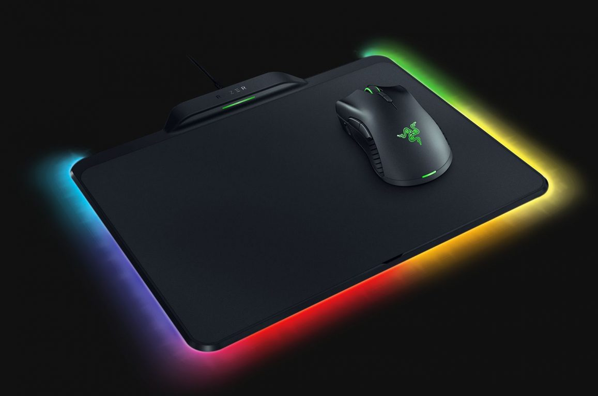
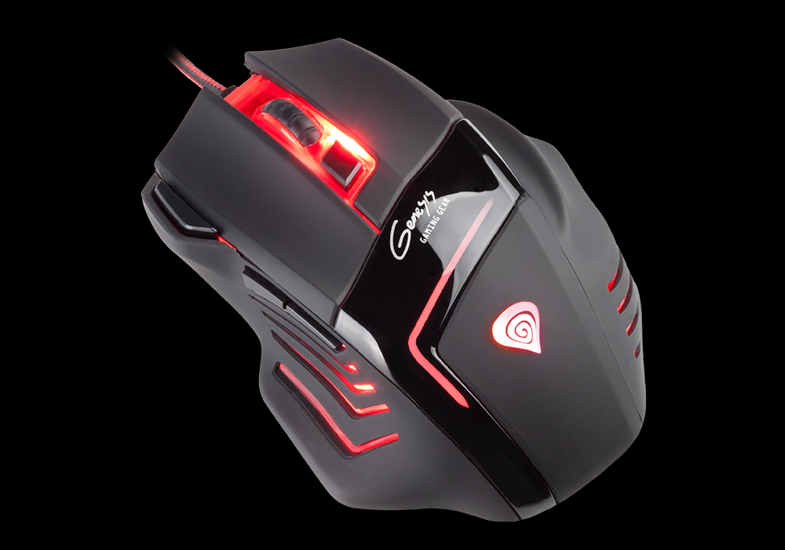
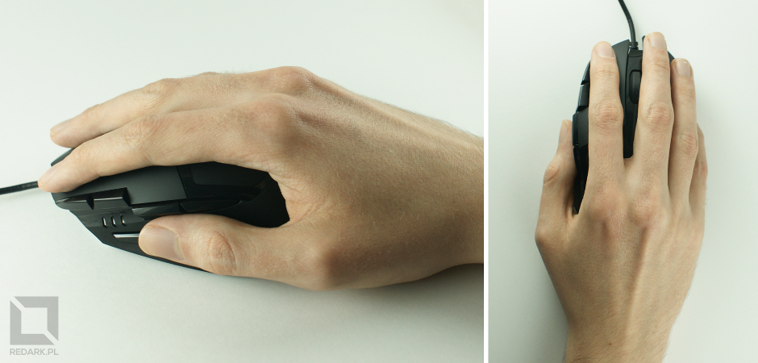
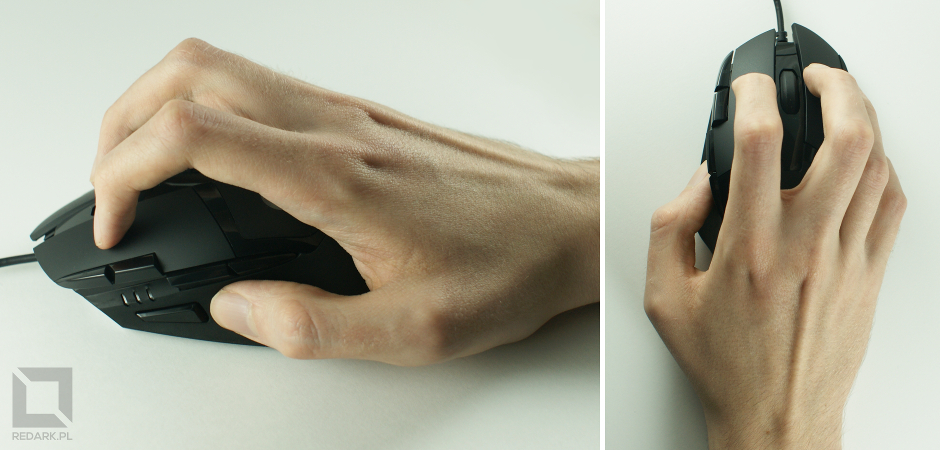
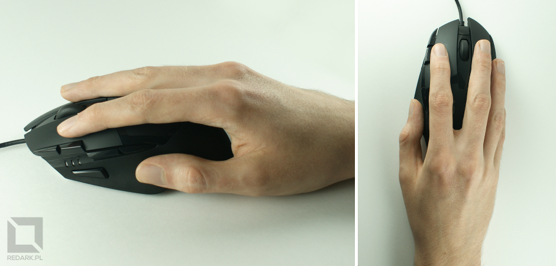
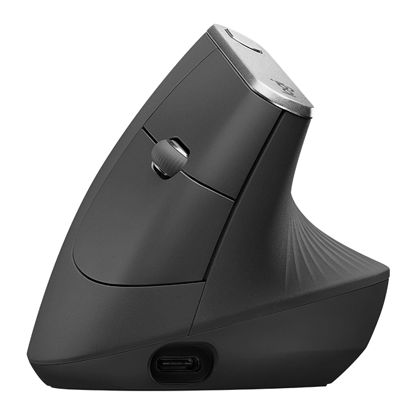
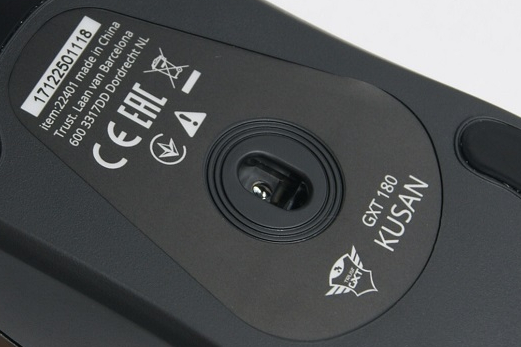
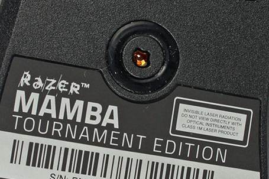

Kiedyś komputerem sterowało się jedynie za pomocą klawiatury, ponieważ systemy pracowały w trybie tekstowym i nie wymagały wskazywania konkretnych miejsc na ekranie. Jednakże te czasy odeszły już w zapomnienie, a na każdym stanowisku, oprócz klawiatury, leży poczciwy "gryzoń", bez którego obecnie nie wyobrażamy sobie pracy. Czas omówić parametry tego urządzenia.

## Przeznaczenie myszy

Na początku należy zadać sobie pytanie do jakiego sprzętu mysz jest nam potrzebna. Pod tym względem wyróżniamy trzy główne kategorie myszy:

- **mobilne** - charakteryzują się bardziej kompaktowymi rozmiarami oraz najczęściej komunikacją bezprzewodową
- **do codziennej pracy** - standardowe i duże, przystosowane do zwykłej, niewymagającej pracy na komputerze
- **dla graczy** - urządzenia charakteryzujące się znacznie lepszymi parametrami technicznymi oraz większą ilością przycisków

## Komunikacja

Tutaj tradycyjnie mamy do wyboru dwa rozwiązania.

### Komunikacja przewodowa

Najpopularniejsza opcja umożliwiająca podłączenie urządzenia do komputera za pomocą kabla zakończonego najczęściej gniazdem USB lub rzadziej portem PS/2. Myszy wyposażone w kabel zwykle oferują znacznie więcej funkcji oraz charakteryzują się znacznie mniejszą ceną. Osoby szukające myszy mobilnej mogą zainteresować modele ze zwijanym kablem do lub wokół obudowy.

### Komunikacja bezprzewodowa

Dobrodziejstwo fal radiowych umożliwia nieograniczone operowanie myszą, która nie jest już krępowana wijącym się kablem. Do wyboru mamy trzy technologie:

- **odbiornik radiowy** - do urządzenia dołączony jest miniaturowy odbiornik na USB, który należy podłączyć do komputera. Modele mobilne powinny także umożliwiać schowanie odbiornika w obudowie myszki oraz automatyczne wyłączenie urządzenia.
- **Bluetooth** - popularny standard komunikacji radiowej rozpowszechniony w telefonach i laptopach. Nie jest to najlepsze rozwiązanie dla komputerów PC, ponieważ większość z nich nie posiada wbudowanego modułu Bluetooth.
- **Wi-Fi** - komunikacja z wykorzystaniem domowej sieci bezprzewodowego Internetu. Synchronizacja urządzeń odbywa się poprzez chwilowe podłączenie myszy do komputera za pomocą kabla USB. To rozwiązanie może nie sprawdzić się w przypadku urządzeń takich jak telefony, tablety czy smartTV, ponieważ mogą one nie obsługiwać komunikacji tego typu.

Zakup myszy bezprzewodowej nie jest prosty. Tanie modele są często bardzo słabo wykonane i nie pozwalają na komfortową pracę. Ponadto jedną z głównych wad tego rozwiązania jest potrzeba wymiany/ładowania baterii oraz mocno zwiększona waga samego urządzenia (słabe wyważenie i prowadzenie myszy po podkładce).

<ImageDescription>Ładowana indukcyjnie mysz RAZER MAMBA HYPERFLUX, źródło: razer.com</ImageDescription>

Niektórzy producenci postanowili zwalczyć ten problem stosując zasilanie indukcyjne. Prąd dostarczany jest za pomocą specjalnej podkładki podłączonej do USB komputera. Sama mysz posiada jedynie lekki kondensator magazynujący prąd na wypadek podniesienia myszy lub wyjechaniu poza obszar podkładki. Urządzenie jest dzięki temu lekkie i dobrze wyważone. Niestety cena zestawu myszy i indukcyjnej podkładki jest dość wysoka.

<InfoBlock>Na rynku obecne są także myszy wyposażone w oba typy komunikacji. Podłączenie do komputera za pomocą odłączanego kabla USB myszy bezprzewodowej najczęściej umożliwia też naładowanie jej wewnętrznego akumulatora.</InfoBlock>

## Kształt i ergonomia urządzenia

Mysz komputerowa powinna przede wszystkim umożliwiać komfortową pracę, która nie nadwyręży zbytnio naszego nadgarstka. Wybór jej kształtu, wymiarów oraz wyprofilowania powinien zależeć od sposobu w jaki trzymamy gryzonia.

### Wyprofilowanie

Wyróżniamy myszy o budowie symetrycznej oraz takie, przystosowane do konkretnej dłoni (lewej lub prawej). Wyprofilowanie sprawia, że nasza dłoń męczy się znacznie wolniej. Jest to zasługa bardziej pionowej postawy dłoni zamiast poziomej, która jest dla nas nienaturalna.

<ImageDescription>Mysz GENESIS GX77 przystosowana do osób praworęcznych, źródło: genesis-zone.com</ImageDescription>

### Chwyty myszy

Wyróżniamy trzy ułożenia dłoni na urządzeniu:

**palm grip** - cała dłoń spoczywa płasko na myszy zapewniając odciążenie stawu. Szybkie ruchy wykonywane są głównie przedramieniem. Jest to najpopularniejsze i najbardziej wygodne ułożenie dłoni.

**claw grip** - nazywany często szponem. Polega na trzymaniu myszy za pomocą zagiętych palców. Ruch wykonywany jest głównie przez nadgarstek, a przyciski wciskane są jedynie za pomocą opuszków palców.

**fingertip grip** - hybryda dwóch powyższych chwytów. Dłoń ułożona jest płasko na powierzchni myszy, ale nadgarstek znajduje się za myszą i nie ma z nią styczności. Przyciski wciskane są końcówkami palców.

<AdSense/>

Do chwytu palm grip najlepiej nadaje się duża, wyprofilowana mysz, która pozwoli komfortowo podeprzeć całą powierzchnię dłoni. Claw grip wymaga średniego rozmiaru myszy, który pozwoli na oparcie śródręcza o tył urządzenia. W przypadku fingertip grip najlepszy będzie mały lub średni gryzoń o symetrycznej konstrukcji.

### Materiały

Dobra myszka nie może wydawać dźwięków uginającego się plastiku. Powinna dobrze wytrzymywać nacisk oraz zapewniać dobrą przyczepność do dłoni. Wielu producentów stosuje na bokach urządzenia gumowe podkładki z dodatkową fakturą. Niestety, nie zawsze to działa, a nawet może doprowadzić do zmniejszenia przyczepności i gromadzenia się martwego naskórka.

### Myszy ergonomiczne

Posiadają bardzo nietypowy kształt i umożliwiają prawie pionowe ułożenie dłoni. Nie nadadzą się do gier, ale będą idealne do biura, gdzie komputer użytkuje się przez wiele godzin.

<ImageDescription>Mysz ergonomiczna Logitech MX Vertical, źródło: logitech.com</ImageDescription>

## Sensor

Mysz odczytuje swój ruch za pomocą sensora optycznego umieszczonego na spodzie urządzenia. Wykonuje on wiele zdjęć powierzchni naszego blatu na sekundę, a następnie za ich pomocą oblicza przesunięcie myszy w przestrzeni. Dawniej rolę detekcji wykonywała ciężka gumowa kula, której ruch był rejestrowany przez zestaw rolek z silniczkami. Zostały one już całkowicie wyparte, a na rynku królują obecnie myszy optyczne i laserowe.

### Mysz optyczna czy laserowa

Najpopularniejsze są myszy optyczne. Posiadają one (najczęściej czerwoną) diodę LED oraz soczewkę połączoną z sensorem optycznym, który wykonuje zdjęcia oświetlonej przez diodkę powierzchni.

<ImageDescription>Klasyczny sensor optyczny zamontowany w myszy GXT 180 Kusan</ImageDescription>

Drugi typ, trochę droższy, to mysz laserowa. Zamiast diody LED występuje tu laser generujący niewidzialną wiązkę światła, która po odbiciu od powierzchni blatu jest analizowana przez sensor optyczny. Zaletą takich myszek jest większa dokładność i możliwość pracy na wszystkich powierzchniach, z wyjątkiem szkła.

<ImageDescription>Sensor laserowy myszy Razer Mamba Tournament Edition</ImageDescription>

<InfoBlock>W domach często można usłyszeć zdanie "nie patrz się na myszkę bo oślepniesz!". Jest to błąd wynikający z niewiedzy, ponieważ zapewne 95% tych myszy to urządzenia optyczne, a tym samym ten czerwony "promień śmierci" to zwyczajna dioda LED. Myszy laserowe to wszystkie te, które nie emitują światła. Ponadto posiadają one, przy sensorach, naklejkę ostrzegawczą. Należy jednak wspomnieć, że moc takiego lasera nie jest duża i ryzyko uszkodzenia nim wzroku jest minimalne.</InfoBlock>

### Czułość myszy, czyli wartość DPI

Kolejny zabobon, który mocno wrósł w rynek myszek komputerowych: "im więcej DPI, tym mysz jest lepsza". Oczywiście jest w tym ziarno prawdy, ponieważ droższe myszy, wyposażone w lepsze sensory posiadają wysokie DPI, ale nie jest to wyznacznikiem jakości.

DPI to angielski skrót informujący o ilości rejestrowanych punktów na cal powierzchni. Mówiąc w skrócie: wartość tego parametru wskazuje z jaką prędkością będzie poruszać się kursor na ekranie komputera. Standardowe myszy posiadają najczęściej 800 DPI. Myszy dla graczy będą umożliwiały ustawienie znacznie większych wartości, aby móc wykonywać szybkie ruchy w grach sieciowych.

Wiedząc już czym jest DPI można powiedzieć, że stwierdzenie więcej DPI = lepsza mysz jest w pełni poprawne, ale mysz wyposażona nawet w dziesiątki tysięcy DPI nie zapewnia zarejestrowania tak szybkiego ruchu. Tutaj wkracza parametr IPS.

### Szybkość myszy - parametr IPS

IPS po angielsku oznacza ilość cali na sekundę czasu. Jego wartość określa jak szybkie ruchy mysz może zarejestrować. Dopiero połączenie wysokiego parametru IPS oraz DPI może zapewnić o dobrej jakości myszy do gier. Więcej informacji na ten temat podam w sekcji parametrów dla graczy w drugiej części artykułu.

<ActionButton to='/myszy-komputerowe-czesc-2'>II część artykułu</ActionButton>
