<ActionButton to='/myszy-komputerowe-czesc-1'>I część artykułu</ActionButton>

Kontynuujemy temat z poprzedniej części artykułu. Czas dokładniej omówić różne warianty przycisków myszy oraz przyjrzeć się parametrom ważnym dla graczy.

## Przyciski

Oprócz sensora optycznego mysz musi być wyposażona w przyciski umożliwiające zatwierdzenie wskazanego obiektu oraz kółko, tzw. scroll, służący do przewijania treści niemieszczącej się na ekranie. Podstawowe modele wyposażone są w trzy przyciski. Lewy, prawy i środkowy, który jest aktywowany naciśnięciem scrolla. Jednakże producenci chętnie dodają dodatkowe przyciski ułatwiające wykonywanie określonych czynności na komputerze. Przyjrzyjmy się im.

### Przyciski nawigacji

Wiele modeli, oprócz standardowej trójki, posiada dwa przyciski umiejscowione na boku myszy, tuż nad kciukiem użytkownika. Służą one do wykonywania operacji "wstecz" oraz "dalej" w przeglądarce WWW lub eksploratorze plików. Jeśli przeglądasz dużo stron internetowych lub przerzucasz duże ilości plików, kup myszkę wyposażoną w te przyciski, a zapomnisz o monotonnym sięganiu do rogu ekranu w celu naciśnięcia strzałki powrotu.

<ImageDescription>Przyciski boczne myszy Asus UX300 służące do nawigacji po stronach WWW, źródło: asus.com</ImageDescription>

### Przyciski dedykowane

Niekiedy można spotkać myszki posiadające przyciski dedykowane dla jednej, niezmiennej funkcji jak np. uruchomienie przeglądarki, poczty czy kalkulatora. Dla przykładu, pewna linia myszy od Microsoftu, wyposażona jest w duży niebieski przycisk z logo Windows, który odpowiada za otwarcie menu Start. Nie jest to popularna opcja, ponieważ mało kto chce korzystać z tego typu gotowych rozwiązań.

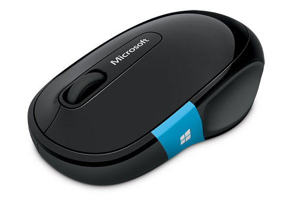

<ImageDescription>Microsoft Sculpt Comfort Mouse, źródło: microsoft.com</ImageDescription>

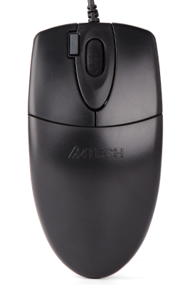

<ImageDescription>Mysz A4TECH OP-620D posiada specjalny przycisk odpowiedzialny za wykonywanie tzw. dwukliku lewym przyciskiem myszy</ImageDescription>

### Przyciski programowalne

Bardzo użyteczne i cenione przez wszystkich, którzy chcą zoptymalizować swoją pracę na komputerze. Producent dostarcza mysz z zestawem przycisków, których funkcję użytkownik może określić za pomocą oprogramowania na komputerze. Niektóre aplikacje umożliwiają nawet automatyczną zmianę konfiguracji w zależności od uruchomionego programu czy gry.

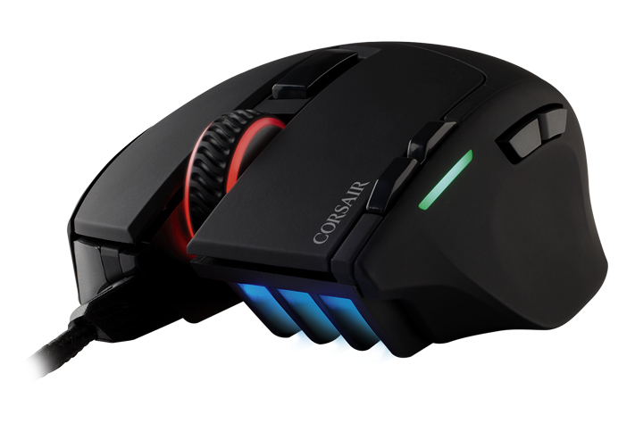

<ImageDescription>Mysz Corsair Sabre RGB wyposażona jest w 8 programowalnych przycisków, źródło: corsair.com</ImageDescription>

<WarningBlock>Jeśli w specyfikacji technicznej myszy producent podaje ilość 6 programowalnych przycisków oznacza to, że mysz posiada trzy podstawowe (lewy, prawy, środek) i trzy dodatkowe przyciski.</WarningBlock>

### Przewijanie w poziomie

Osoby pracujące dużo w edytorach grafiki często potrzebują przewinąć obszar roboczy nie tylko w pionie, ale i w poziomie. Pierwsze z rozwiązań tego problemu to zaprogramowanie do tego celu dwóch przycisków bocznych, zaś drugim jest kupienie myszy z:

- **dwoma kółkami** - najwygodniejsze rozwiązanie. Dodatkowy scroll znajduje się na boku urządzenia lub u góry, pod podstawowym.
- **panelem dotykowym** - podstawowy kołowrotek zastępowany jest przez mały panel dotykowy. Do tego rozwiązania trochę trudniej się przyzwyczaić.
- **pochylanym kółkiem** - podstawowy scroll posiada dwa dodatkowe przyciski aktywowane poprzez pochylenie kółka w lewo lub prawo.

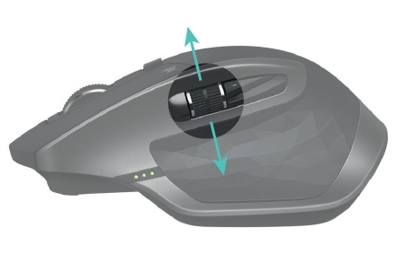

<ImageDescription>Mysz Logitech MX Master 2S na swoim boku posiada poziomy scroll obsługiwany kciukiem, źródło: support.logitech.com</ImageDescription>

## Strefa gracza

W tym rozdziale omówię cechy myszy, na które powinny zwrócić uwagę osoby chcące grać w bardziej wymagające gry.

### Predykcja ruchów

Predykcja ruchów użytkownika polega na wygładzaniu jego ruchów. Objawia się to ułatwionym rysowaniem prostych linii w edytorze graficznym. Ta technologia ma swoich zwolenników i przeciwników. Dobre myszy gamingowe pozwalają włączać i wyłączać tą funkcję w aplikacji sterującej.

### Szybkość myszy i akceleracja wsteczna

O tym parametrze wspominałem już w [pierwszej części artykułu](/myszy-komputerowe-czesc-1). Teraz doprecyzuję, jaki wpływ na gracza ma zbyt niska wartość tego parametru oraz co to jest "**akceleracja negatywna i pozytywna**".

<AdSense/>

Podczas wykonywania szybkich ruchów myszą może dojść do zjawiska nazywanego akceleracją negatywną. Objawia się ona zatrzymaniem kursora lub nieoczekiwanym "wystrzeleniem go w kosmos". Zjawisko akceleracji pozytywnej też wcale nie jest pozytywne. Polega ono na zmianie dystansu jaki pokonuje kursor na danym odcinku powierzchni biurka. Dla przykładu: 10 centymetrów blatu podczas wolnego ruchu wystarczy do przesunięcia kursora po całym ekranie, natomiast szybki ruch myszą sprawi, że kursor pokona jedynie 3/4 długości ekranu.

Oba te zjawiska uniemożliwiają precyzyjne odwzorowanie ruchów myszy na ekranie, co jest szczególnie uciążliwe dla graczy, którzy opierają swoją grę na tzw. pamięci mięśniowej, czyli np. potrafią obrócić kamerę sterowanej postaci o 180 stopni jednym, precyzyjnym ruchem myszy.

### Dodatkowe przyciski

Rozwijając temat z początku artykułu należy wspomnieć o programowalnych przyciskach znajdujących się w pobliżu kciuka użytkownika. Dobra mysz gamingowa powinna zapewniać następujące opcje:

- możliwość zmiany akcji na każdym przycisku (nawet na lewym, prawym i środkowym),
- możliwość zapisania kilku konfiguracji,
- automatyczną zmianę profili po uruchomieniu konkretnej gry lub aplikacji.

Niektóre modele, takie jak pokazana poniżej mysz Razer Naga Trinity, posiadają trzy wymienne panele boczne: standardowy z 2 przyciskami, kołowy z 7 przyciskami i mini klawiaturę z 12 przyciskami, które docenią gracze lubujący się w grach MMO.

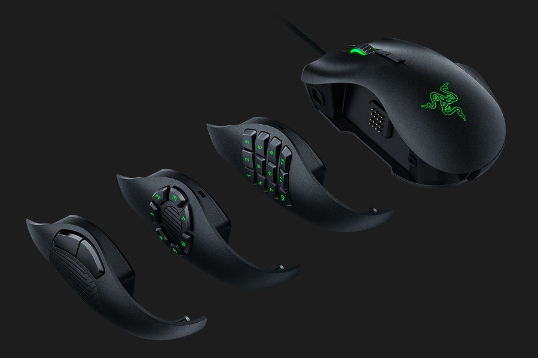

<ImageDescription>Mysz Razer Naga Trinity z wymiennymi bokami, źródło: razer.com</ImageDescription>

### Zmiana poziomu DPI

Ustaliliśmy wcześniej, że szybkość poruszania się kursora na ekranie komputera zależna jest od wartości parametru DPI. W standardowych myszach wartość ta jest niezmienna, a regulację można przeprowadzić jedynie w ustawieniach systemu operacyjnego. Jednakże w przypadku graczy może zajść potrzeba dynamicznej zmiany DPI mająca na celu chwilowe zmniejszenie szybkości kursora, np. podczas celowania z karabinu snajperskiego.

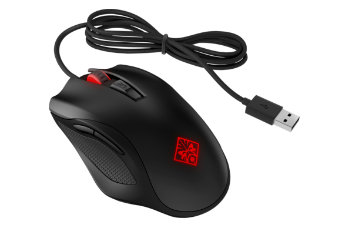

<ImageDescription>Mysz OMEN by HP 600 posiada na górze przycisk z napisem DPI, źródło: hp.com</ImageDescription>

Przycisk zmiany DPI najczęściej jest umieszczony między lewym i prawym przyciskiem myszy. Umożliwia on wybranie następnej wartości DPI z listy predefiniowanych lub zaprogramowanych poziomów. Modele umożliwiające zmianę poziomów przycisku DPI są znacznie lepsze, ponieważ nie jesteśmy zdani na wartości czułości narzucane przez producenta. Najlepsze modele posiadają dwa oddzielne przyciski służące do zwiększania i zmniejszania DPI. Umożliwia to łatwiejsze posługiwanie się wieloma poziomami czułości. Miłym dodatkiem do myszy jest zestaw diod LED, które swoją liczbą lub kolorem informują o aktualnie wybranym poziomie.

Podsumowując, rzeczy na jakie warto zwrócić uwagę, to czy:

- mysz posiada pojedynczy przycisk do kołowej zmiany DPI lub
    dwa przyciski do zmiany góra/dół,
- producent pozwala na zmianę predefiniowanych poziomów DPI,
- urządzenie informuje w jakiś sposób, który poziom DPI jest aktualnie wybrany?

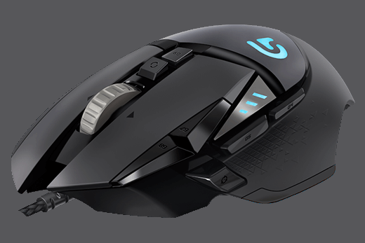

<ImageDescription>Mysz Logitech G502 Proteus Spectrum posiada przycisk do przełączania czułości DPI, przyciski do jej zmiany góra/gół oraz boczny przycisk trybu snajperskiego, który obniża na chwilę DPI do ustawionego wcześniej poziomu.</ImageDescription>

### Częstotliwość raportowania (Polling rate)

Parametr podawany w Hz (hercach), który określa jak często mysz wysyła do komputera informacje o swoim położeniu i naciśniętych przyciskach. Standardowe myszy przesyłają dane do komputera średnio około 100 razy na sekundę (100 Hz). Mogłoby się wydawać, że to dużo, ale rozgrywki sieciowe to często walka na milisekundy. Dlatego też modele gamingowe posiadają zwiększoną częstotliwość raportowania do 500, a nawet 1000 Hz, co daje czas reakcji na poziomie 1 milisekundy.

### Regulowane wyważenie i wymiary myszy

Mysz jest za krótka i przez to twoja dłoń nie leży idealnie? Niektóre myszy, takie jak prezentowana poniżej MAD CATZ CYBORG R.A.T. 7 umożliwiają regulację długości gryzonia za pomocą pokrętła.

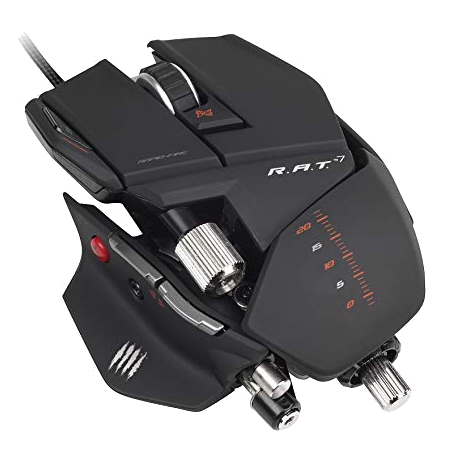

<ImageDescription>Mysz MAD CATZ CYBORG R.A.T. 7, źródło: amazon.com</ImageDescription>

Każdy, kto używał taniej bezprzewodowej myszy, wie jak istotną rolę w tym urządzeniu odgrywa rozłożenie ciężaru podzespołów. Gracze, aby móc wykonywać precyzyjne ruchy, potrzebują myszy o określonej wadze. Jedni lubią lekkie i szybkie modele, a inni cięższe, umożliwiające precyzyjniejsze celowanie. Jak zadowolić wszystkich użytkowników? Dodać do myszy pudełko z odważnikami, którymi można dociążać urządzenie.

<ImageDescription>Mysz Gigabyte Aivia Krypton wyposażona w zestaw odważników, źródło: gigabyte.com</ImageDescription>

Dołączone do urządzenia odważniki (najczęściej o wadze około 4 gramów) umieszcza się w przeznaczonych do tego miejscach zasłoniętych ochronną klapką. Pozwala to nie tylko na zwiększenie ogólnej masy urządzenia, ale też na dociążenie konkretnej jego strony.

<AdSense/>

### Wbudowana pamięć na ustawienia

Na koniec dodatkowa funkcja współpracująca z oprogramowaniem dostarczonym przez producenta. Mowa tutaj o małej, wbudowanej w mysz pamięci flash. Zapisuje ona całą konfigurację myszy tak, aby można było ją podłączyć do innego komputera bez utraty własnych ustawień.

## Opcjonalne funkcje

### Podświetlenie LED

Temat wszechobecnych LEDów postanowiłem umieścić w kategorii opcjonalnych funkcji, ponieważ w klawiaturach stanowi to chociaż funkcję ułatwiającą pisanie w nocy. W przypadku myszy, funkcja ta nie ma zastosowania praktycznego i stanowi jedynie ozdobę. Niemniej jednak warto omówić kilka parametrów takiego podświetlenia, które można sklasyfikować pod dwoma względami.

Kolor podświetlenia (od najtańszego do najdroższego):

- **stały, jednokolorowy** – mysz świeci tylko jednym kolorem,
- **wielokolorowy** – podświetlenie RGB mogące świecić wieloma kolorami.

Typ podświetlenia (od najtańszego do najdroższego):

- **jednostajne** – cała mysz świeci lub nie,
- **strefowe** – mysz podzielona jest na strefy lub elementy, które mogą świecić niezależnie,
- **dynamiczne** – mysz wyposażona jest w pasek z adresowalnymi diodami RGB LED umożliwiającymi tworzenie przeróżnych iluminacji świetlnych (przykład poniżej).

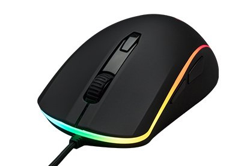

<ImageDescription>Mysz HyperX Pulsefire Surge wyposażona w adresowalny pasek LED REG 360°, źródło: hyperxgaming.com</ImageDescription>

### Wyświetlacz, wibracje i wymienna obudowa z sensorem

Mysz z wyświetlaczem? Czemu nie! Tak chyba powiedzieli twórcy myszki Steelseries Rival 700 (zdjęcie poniżej) do której włożono wszystkie z wymienionych w tytule bajerów. Mały wyświetlacz OLED znajdujący się na boku urządzenia pokaże ilość zdrowia czy zabójstw, a wbudowany system wibracji pomoże lepiej odczuć pole walki. Jakby jeszcze było tego mało mysz umożliwia zmianę sensora (z optycznego na laserowy) oraz górnej części obudowy.

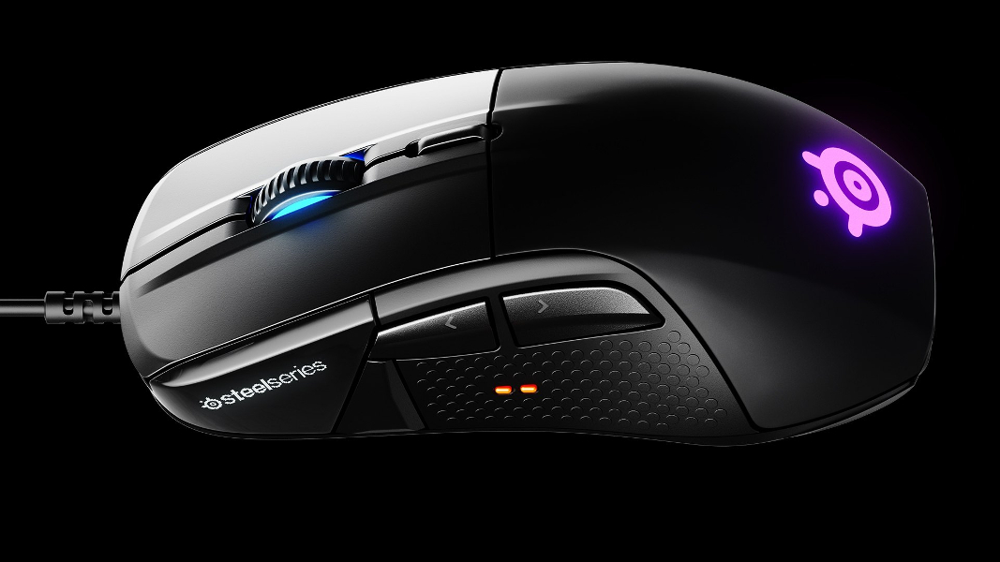

<ImageDescription>Mysz SteelSeries Rival 700, źródło: steelseries.com</ImageDescription>

### Multi device

Tak jak w przypadku klawiatur, istnieją modele myszek umożliwiających łatwą pracę na kilku komputerach. Przykładem takiego urządzenia jest mysz Logitech M720.

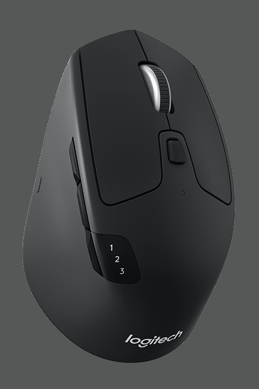

<ImageDescription>Mysz wielokomputerowa Logitech M720, źródło: logitech.com</ImageDescription>

## Rozwiązania alternatywne

Na zakończenie, wymienię kilka alternatyw dla klasycznej myszki i krótko je omówię:

- **Trackball** - inaczej manipulator kulkowy. Wygląda dosyć dziwnie, ale pracuje on na zasadach dawnych myszek kulkowych z tą różnicą, że kulka jest operowana palcem.
- **Manipulator 3D** - jest to urządzenie bardzo często przypominające panel żywcem wyjęty z Audi lub statku kosmicznego. Pomaga przy operacjach na obiektach 3D.
- **Tablet graficzny** - płaskie urządzenie obsługiwane rysikiem w kształcicie długopisu. Jest bardzo cenione przez grafików komputerowych.
- **Touchpad** - urządzenie dobrze znane z laptopów. Jest to mała płytka dotykowa wyposażona w dwa fizyczne przyciski u dołu. Panel dotykowy pozwala na obsługę wielu gestów.
- **Trackpoint** - znany głównie za sprawą laptopów z serii ThinkPad. Ma postać małego joysticka umieszczonego między klawiszami klawiatury. Siła odchylenia joysticka jest przekładana na szybkość kursora.

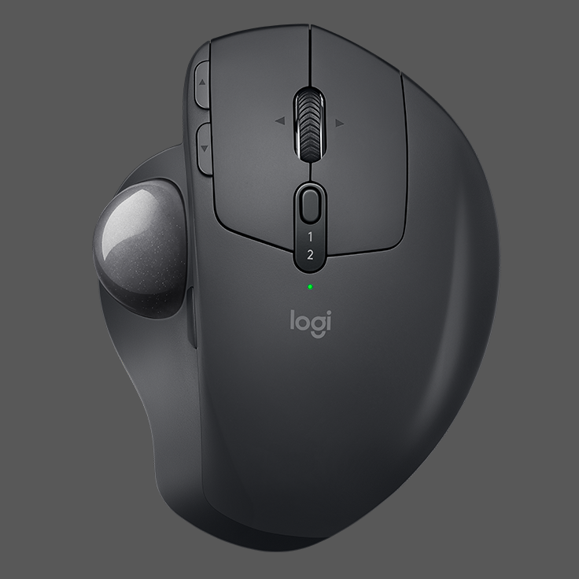

<ImageDescription>Trackball Logitech MX Ergo, źródło: logitech.com</ImageDescription>

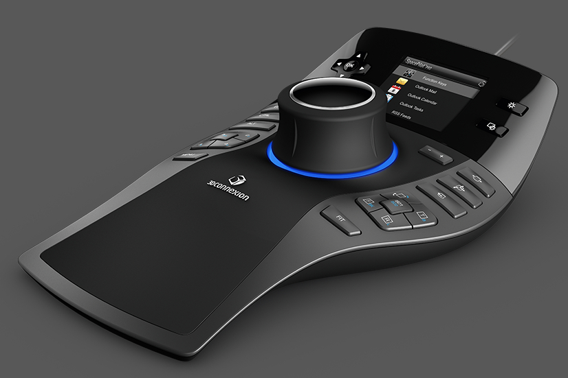

<ImageDescription>Manipulator 3D SpacePilot Pro, źródło: 3dconnexion.pl</ImageDescription>
