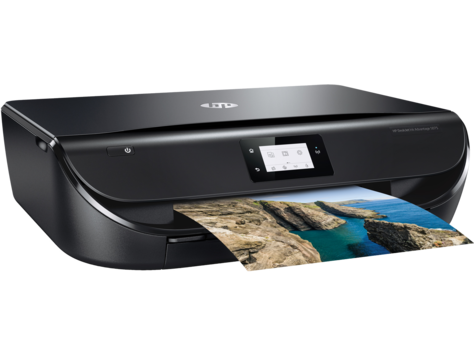
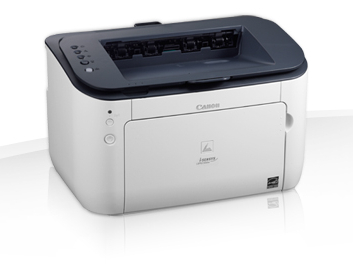
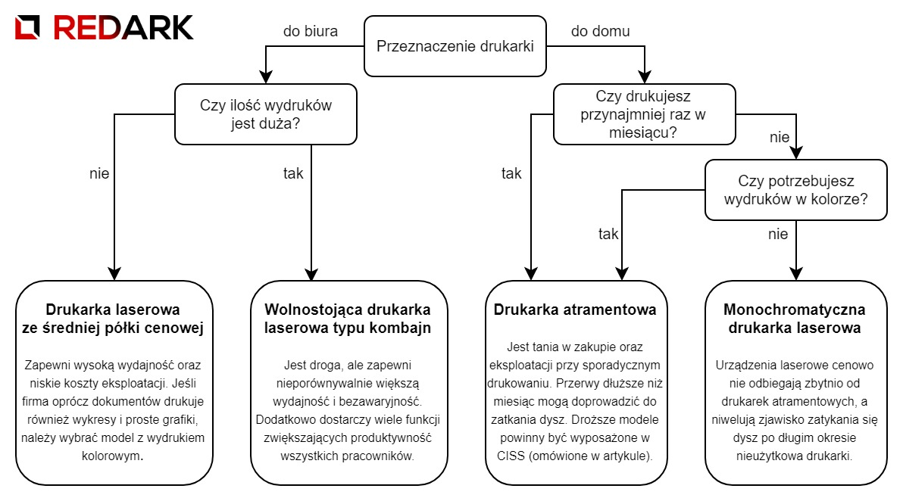
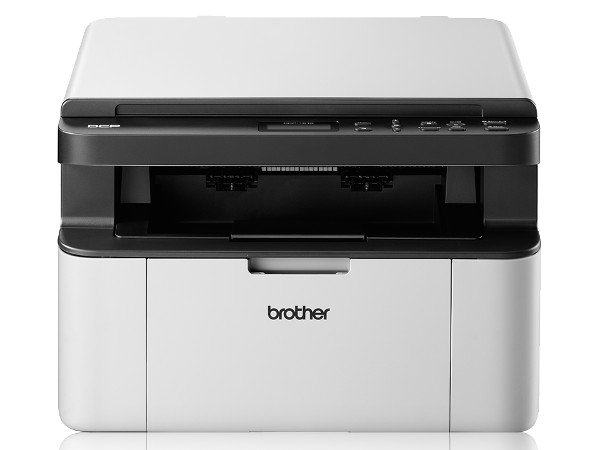
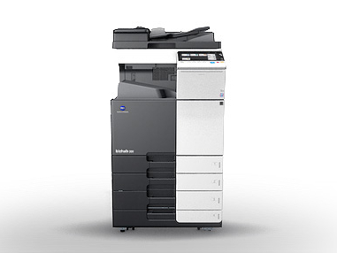
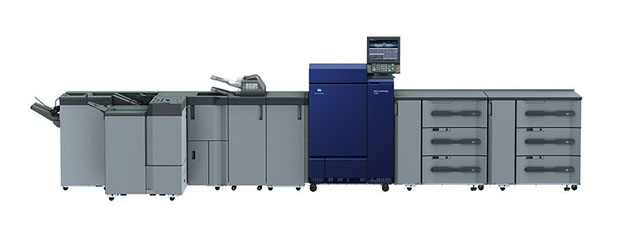
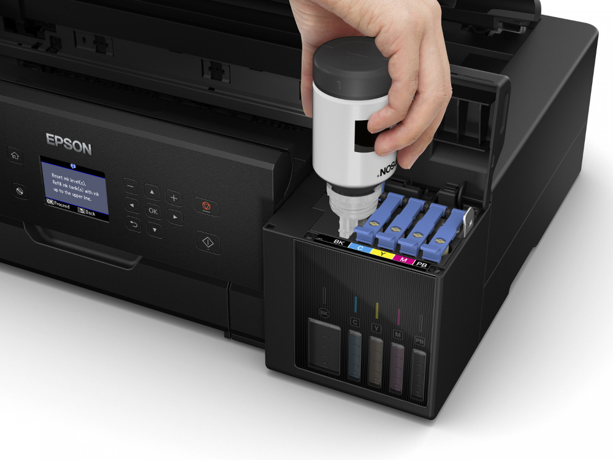
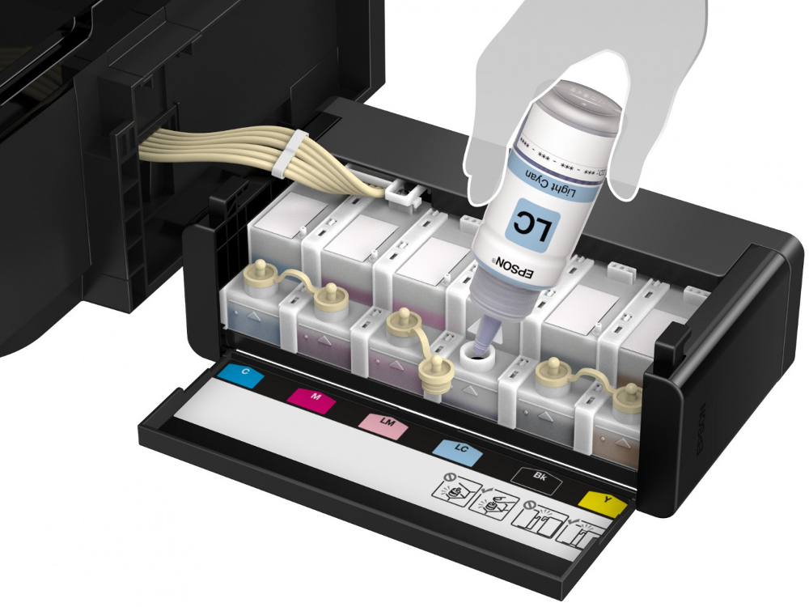
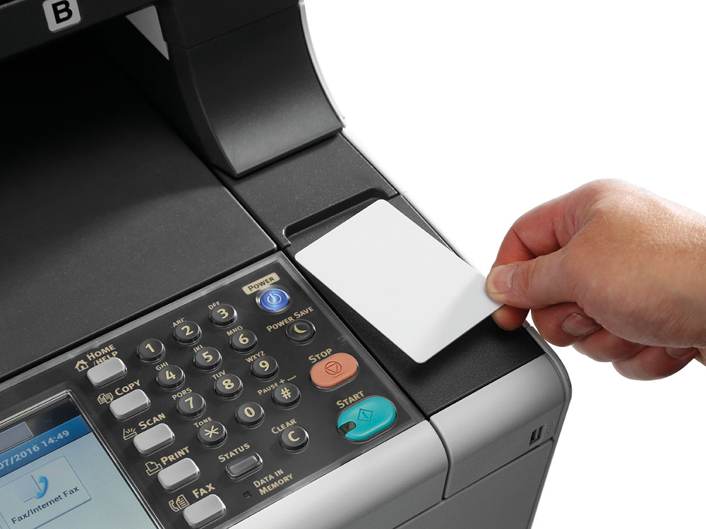

Choć nie każdy jej potrzebuje i nie każdy posiada, to jednak drukarka odgrywa ważną rolę przy stanowisku komputerowym. Potrafi przenieść zawartość naszego ekranu na kartkę papieru oraz doprowadzić do istnego szału, gdy się popsuje. Dziś przyjrzymy się modelom domowym oraz ich większym odpowiednikom, które instaluje się w miejscach pracy.

## Jaki typ drukarki wybrać?

Zanim zaczniemy przyglądać się kolejno wszystkim funkcjom tych urządzeń należy zadecydować, jakiego typu drukarki potrzebujemy. Mowa tutaj o dwóch podstawowych technologiach: laserowej i atramentowej. Dodatkowo należy zastanowić się, czy będziemy drukować w kolorze, czy zadowoli nas wydruk czarno-biały.

<InfoBlock>Oprócz atramentowych i laserowych istnieje jeszcze wiele innych typów drukarek. Jednakże w artykule skupię się jedynie na tych dwóch typach, ponieważ są one najczęściej wybierane.</InfoBlock>

### Drukarki atramentowe

<ImageDescription>HP DeskJet Ink Advantage 5075, źródło: hp.com</ImageDescription>

Budowa i zasada działania tej drukarki jest bardzo prosta. Jak sama nazwa wskazuje, wykorzystuje ona płynny tusz, który transportowany jest do poruszającej się nad powierzchnią kartki głowicy drukującej. Głowica posiada zestaw mikroskopijnych dysz, których zadaniem jest precyzyjne wyrzucanie kropli tuszu.

<GoodList>
- prostą budowę i niską cenę
- dobre odwzorowanie kolorów (zwłaszcza przy wykorzystaniu dobrej jakości pigmentów)
- niski pobór prądu i stosunkowo cichą pracę
- możliwość druku na większej ilości powierzchni (również na folii)
</GoodList>

<BadList>
- zjawisko zatykania dysz zaschniętym atramentem (drukarka po dłuższej przerwie może mieć problemy z działaniem)
- wolny proces drukowania, zwłaszcza w kolorze (strona jest zatrzymywana i zadrukowywana linijka po linijce)
</BadList>

### Drukarka laserowa

<ImageDescription>Canon i-SENSYS LBP6230dw, źródło: canon.pl</ImageDescription>

Konkurencją dla urządzeń atramentowych jest drukarka laserowa. Tym razem nazwa może być zwodnicza, ponieważ laser znajdujący się w urządzeniu nie służy do wypalania tekstu na powierzchni kartki. Materiałem eksploatacyjnym tego urządzenia jest toner przechowywany w podłużnych pojemnikach, kartridżach, w postaci proszku. Nanoszony jest on na powierzchnię obrotowego, światłoczułego wałka. Nie przywiera on do całej powierzchni wałka, tylko do powierzchni wcześniej naświetlonych wiązką wspomnianego wcześniej lasera. Tak wygląda uogólniona zasada działania drukarki laserowej. Szczegóły tego procesu zostaną omówione w innym artykule.

<GoodList>
- bardzo szybki wydruk w czerni i bieli oraz trochę wolniejszy w kolorze (ruch kartki w urządzeniu jest jednostajny)
- niski koszt eksploatacji przy druku wielu kartek
- wydruk jest bardziej odporny na czynniki atmosferyczne
</GoodList>

<BadList>
- często słabe odwzorowanie kolorów
- wysoki pobór prądu przy rozruchu (drukarka musi być nagrzana)
- kolorowe drukarki laserowe mają znacznie większe rozmiary od atramentowych odpowiedników
- komplet nowych, oryginalnych tuszy jest często droższy od całego urządzenia, ale starcza na znacznie dłużej niż małe opakowania z tuszem
</BadList>

### Drukarka atramentowa czy laserowa?

Wybór nie jest taki trudny. Obie technologię porównałbym do silników spalinowych w autach. Silnik benzynowy jest idealny do krótkich tras, tani w zakupie, ale drogi w eksploatacji. Podobnie drukarka atramentowa sprawdza się przy niezbyt dużej ilości wydruków, ale tusze potrafią się kończyć jak szalone. Drukarki laserowe, tak jak diesel, do swojego rozruchu potrzebują dużo energii i ciepła co sprawia, że nie są dobrym rozwiązaniem do sporadycznego wydruku paru kartek. Ten typ sprawdzi się lepiej u osób wykonujących dużo wydruków, gdzie liczy się niezawodność i szybkość działania. Duża pojemność kartridży pozwala na wydrukowanie tysięcy kartek, lecz ich cena zmrozi każdego domowego użytkownika. Jeśli nadal nie jesteś pewny(a) wyboru możesz skorzystać z poniższego schematu:

## Urządzenia wielofunkcyjne

Drukarki, których jedynym zadaniem jest wyłącznie wydrukowanie tego, co przysłał komputer, stopniowo znikają z rynku. Dzisiejsze urządzenia potrafią być prawdziwą multimedialną maszyną umożliwiającą nie tylko wydruk z różnych urządzeń, ale także prostą edycję zdjęcia lub tekstu bezpośrednio w drukarce.

<ImageDescription>Drukarka 3w1 Brother DCP-1510E, źródło: brother.pl</ImageDescription>

Obecnie najpopularniejszą opcją są tzw. urządzenia wielofunkcyjne, czyli drukarki z wbudowanym skanerem płaskim. Umożliwia to łatwą digitalizację dokumentów oraz szybkie wykonanie kopii bez udziału komputera. Oprócz tego, można spotkać urządzenia 4w1: drukarka + skaner + kopiarka + faks. Są to prawie takie same urządzenia, ale wyposażone w dodatkową funkcję wysyłania i odbierania faksów.

<AdSense/>

W dużych firmach i przedsiębiorstwach stosuje się duże, wolnostojące drukarki nazywane potocznie kombajnami. U dołu urządzenia znajdują się szuflady z podajnikami różnego rodzaju papieru. Po środku odbiornik papieru, na którym mogą być składowane ogromne ilości wydruków. Góra urządzenia to skaner płaskie z automatycznym podajnikiem dokumentów (o tym później) oraz duży (zazwyczaj dotykowy) panel sterowania, na którym możemy zrobić praktycznie wszystko. Od ustalenia wszystkich parametrów wydruku po wysłanie dokumentów przez Internet.

<ImageDescription>Konica Minolta bizhub 308, źródło: konicaminolta.pl</ImageDescription>

Dodatkowym atutem takiego urządzenia jest modułowa budowa. Do drukarki można dołączyć na przykład tzw. finisher umożliwiający automatyczne zszywanie i dziurkowanie wydrukowanych dokumentów albo sorter transportujący wydruki do odpowiedniej tacki przeznaczonej dla pracownika zlecającego wydruk. Są to jedynie przykłady i możliwości tego typu urządzeń są o wiele większe, ale nie jest to tematem tego artykułu.

<ImageDescription>Konica Minolta AccurioPress-C6100, źródło: konicaminolta.ca</ImageDescription>

## Komunikacja z urządzeniem

### Łączność z komputerem

Standardowa, najtańsza drukarka będzie wyposażona, tylko i wyłącznie, w gniazdo USB, natomiast nieco droższe modele (o około 50-60 złotych) będą posiadać kartę sieciową (przewodową lub bezprzewodową Wi-Fi) umożliwiającą podłączenie urządzenia do sieci lokalnej. Zapewni to możliwość wydruku z wielu różnych komputerów i urządzeń bez potrzeby "podawania" sobie kabla USB - wystarczy, że dane urządzenie połączone jest z naszym routerem.

### Łączność mobilna

Dotycząca głównie smartfonów i tabletów. Do technologii umożliwiających obsługę tych urządzeń można zaliczyć:

- **kartę sieciową** - tak jak wspominałem powyżej, podłączenie drukarki do sieci umożliwia wydruk z każdego urządzenia podłączonego do sieci.
- **Wi-Fi Direct** - jest to technologia pozwalająca na łączność bezprzewodową, działająca na tej samej zasadzie, co zwykła sieć Wi-Fi. Jedyna różnica polega na tym, że rolę routera pełni tutaj sama drukarka. Pozwala to na drukowanie dokumentów z urządzeń, które nie mają dostępu do lokalnej sieci bezprzewodowej.
- **Bluetooth** - dobrze znana komunikacja radiowa obecna w telefonach.
- **NFC** - moduł komunikacji zbliżeniowej. Telefony wyposażone w tą funkcję mogą przesłać zdjęcie lub dokument do drukarki poprzez zbliżenie urządzenia do określonego miejsca drukarki.

<InfoBlock>Drukarki sieciowe dają dużo możliwości, a ich cena nie jest dużo większa od modeli wyposażonych tylko w USB. Na rynku istnieją tzw. serwery druków, które umożliwiają podłączenie zwykłej drukarki do sieci, ale generuje to duże problemy z kompatybilnością i często uniemożliwia korzystanie ze specjalnych funkcji danego urządzenia.</InfoBlock>

### Wydruk bezpośrednio z urządzenia

Modele z bogatym wyposażeniem mogą posiadać wbudowany port USB i czytnik kart SD służący do podłączenia przenośnych nośników pamięci. Dobre urządzenie, oprócz wyboru pliku z nośnika, powinno umożliwiać podgląd jego wydruku oraz pozwalać na prostą edycję.

## Parametry druku

Kupując drukarkę chcemy żeby drukowała ona jak najlepiej. Oto kilka parametrów, które o tym decydują:

- **format i gramatura papieru** - należy sprawdzić jaki rozmiar papieru może przyjąć drukarka (najczęściej A5, A4 oraz A3 w większych urządzeniach). Gramatura określa masę, a tym samym grubość papieru. Typowy papier biurowy posiada wartość 80 gramów na metr kwadratowy, jednakże im większy zakres gramatury obsługuje drukarka, tym bardziej jest uniwersalna.
- **rozdzielczość wydruku** - określa z jaką szczegółowością drukarka jest w stanie pracować. Im ten parametr jest wyższy, tym lepiej, ale do wydruku tekstu wystarczy wartość 600 dpi, a do dobrej jakości zdjęć 1200 dpi.
- **automatyczny duplex** - jest to funkcja, dzięki której drukarka bez pomocy użytkownika potrafi obrócić kartę papieru i zadrukować jej drugą stronę. Jeśli często wykonujesz dwustronne wydruki koniecznie zainteresuj się tą opcją. Bardzo zwiększy ona wydajność procesu drukowania oraz pozwala zaoszczędzić papier.
- **dodatkowy podajnik** - niektóre modele drukarek posiadają drugi podajnik papieru, który umożliwia zassanie kartki bez potrzeby umieszczania jej w szufladzie z czystym papierem.
- **normatywne obciążenie drukarki** - bardzo ważny parametr określający orientacyjnie, jaki przerób dokumentów jest w stanie wytrzymać drukarka. Oczywiście, w warunkach domowych ten parametr nie ma dużego sensu, ale w firmach, gdzie drukarka wykonuje tysiące wydruków ważne jest, aby nie ulegała awariom.
- **szybkość wydruku** - ponownie parametr, który powinien zostać zignorowany przez użytkowników domowych. Sprawne drukowanie kartek ważne jest jedynie w firmach w których przerób papieru jest wysoki, a czas bardzo cenny.
- **głośność pracy** - na koniec parametr, który nie jest zawsze podawany i ciężko go opisać. Mowa tutaj o głośności pracy urządzenia, która oczywiście powinna być jak najmniejsza. Niemniej jednak niektóre drukarki mogą wydawać głośniejsze dźwięki, ale za to przyjemniejsze dla ucha. Tą cechę najlepiej sprawdzić za pośrednictwem opinii użytkowników, którzy wcześniej kupili rozpatrywany przez nas model.

<AdSense/>

## Parametry skanera

Mówiłem już o parametrach druku i wspominałem o popularności urządzeń wielofunkcyjnych wyposażonych w skaner. Dlatego też pokrótce opiszę jego parametry:

- **rozdzielczość skanu** - naturalnie im wyższa, tym lepszy obraz możemy uzyskać. Do standardowej pracy ze zdjęciami wystarczy nawet skaner z rozdzielczością 600 dpi.
- **automatyczny podajnik** - posiadają go droższe modele domowych drukarek oraz wszystkie kombajny instalowane w firmach. Umożliwia on hurtowe skanowanie dokumentów bez potrzeby ręcznego kładzenia ich na powierzchni skanera (zdjęcie poniżej).
- **skaner dwustronny** - to także rzadka opcja umożliwiająca jednoczesne skanowanie obu stron umieszczonego obiektu. Idealne do szybkiego kserowania/skanowania dwustronnych dokumentów oraz różnego rodzaju kart czy ulotek.
- **technologia OCR** - najczęściej ma ona postać dołączonego do urządzenia oprogramowania. Jej głównym zadaniem jest przekształcenie zeskanowanego dokumentu na edytowalny plik tekstowy.
- **zapis do nośnika, poczty, katalogu sieciowego** - modele wyposażone w port USB i karty sieciowe powinny umożliwiać zapis zeskanowanych dokumentów na zewnętrznych nośnikach oraz możliwość przesłania pliku na dysk sieciowy lub pocztę e-mail.

<ImageDescription>Drukarka Canon PIXMA TR8550 z automatycznym podajnikiem dokumentów do skanera, źródło: canon.pl</ImageDescription>

## Dodatkowe funkcje

Na koniec garść dodatkowych funkcji występujących w drukarkach, którymi warto się zainteresować.

### Ekran dotykowy

Ten temat już kilkakrotnie przewijał się przez artykuł. Mnogość funkcji najnowszych urządzeń sprawia, że coraz więcej modeli posiada ekran dotykowy wyposażony w mini system operacyjny. Umożliwia to zmniejszenie i uproszczenie panelu oraz na wykonywanie prostej edycji dokumentu bądź zdjęcia tuż przed wydrukowaniem.

### Druk etykiet na płytach CD

Dosyć rzadka funkcja, ale nadal spotykana. Wyposażone są w nią drukarki atramentowe. Jak sama nazwa wskazuje urządzenie pozwala, za pomocą specjalnego oprogramowania dostarczonego przez producenta, zaprojektować etykietę płyty, a następnie nadrukować ją na powierzchnię krążka.

### System stałego zasilania atramentem (CISS)

<ImageDescription>Drukarka Epson EcoTank L7180 wyposażona w pojemne zbiorniki na atrament, źródło: epson.pl</ImageDescription>

Bardzo ciekawa funkcja polegająca na zastąpieniu małych, szybko kończących się kartridży dużymi napełnialnymi zbiornikami montowanymi na zewnątrz urządzenia. Chyba każdy, kto uważnie przeczytał ten artykuł, widzi już część z zalet tego rozwiązania. Pełną ich listę prezentuję poniżej:

- **zbiorniczki może uzupełniać każdy** - koniec ze wstrzykiwaniem atramentu do zużytych kartridży.
- **brak ryzyka wyczerpania się tuszu podczas drukowania** - wszystko jest widoczne!
- **brak ryzyka zapowietrzenia głowicy drukującej** podczas wymiany kartridży, co przekłada się na większą niezawodność drukarki.
- **możesz uzupełnić dokładnie ten kolor, który ci się kończy** - część modeli drukarek posiada łączony kartridż z wszystkimi trzema kolorami atramentu. Zmusza to do zakupu wszystkich trzech kolorów, nawet jeśli skończył się tylko jeden z nich!
- **zero blokad w kwestii używanego atramentu** - Producenci drukarek nie lubią kupowania nieoryginalnych kartridży, więc blokują zamienniki odpowiednim oprogramowaniem. W przypadku CISS drukujesz tym, czym chcesz.
- możliwość stosowania **dodatkowych kolorów atramentu** (o tym za chwilę).
- **maksymalnie zmniejszone koszty eksploatacji urządzenia** - płacisz wyłącznie za tusz, który zużywasz.
- przede wszystkim **ochrona środowiska** - nie musisz martwić się, że wyrzucasz kolejny kartridż zużyty tego miesiąca. Kupujesz dużą butelkę tuszu i kontrolujesz, który kolor kończy Ci się najczęściej!

Wad tego rozwiązania jest bardzo mało (i moim zdaniem są niczym, w porównaniu do plusów CISSa):

- nieznacznie zwiększone gabaryty drukarki (zewnętrzny bank ze zbiorniczkami).
- utrudnione przenoszenie drukarki (należy uważać, aby nie zerwać wężyków i wylać atramentu).
- wyższa cena urządzenia (rekompensowana niskimi kosztami eksploatacji).

### Dodatkowe kolory atramentu

<ImageDescription>Epson L810 oprócz 4 podstawowych kolorów posiada także jasną wersję cyjanu i magenty, źródło: epson.pl</ImageDescription>

W zaletach systemu CISS wspomniałem o możliwości stosowania większej liczy kolorów atramentu. Standardowa kolorowa drukarka, czy to laserowa, czy atramentowa, wykorzystuje kolory CMYK, czyli cyjan, magenta, żółty i czarny. Drukarki atramentowe przeznaczone do drukowania wysokiej jakości zdjęć wyposażone są w dodatkowe jasne wersje tych kolorów oznaczone literką L (LC, LM, LY i LK). Pozwala to na uzyskanie znacznie lepszych kolorów niż z procesu łączenia różnych tuszy na powierzchni kartki. Modele do zastosowań domowych najczęściej posiadają jedynie rozjaśnioną wersję cyjanu oraz magenty (w sumie 6 kolorów).

<AdSense/>

### Szyfrowanie danych

Funkcja przeznaczona głównie dla firm, które obracają poufnymi danymi. Zapewnia ona brak możliwości przechwycenia drukowanych dokumentów, zwłaszcza przez sieć bezprzewodową.

### System nadzoru i dostępu

<ImageDescription>Drukarka OKI MC573dn wyposażona została w czytnik kart zbliżeniowych, źródło: oki.com</ImageDescription>

Kolejna funkcja stworzona z myślą o firmach zatrudniających dużo pracowników. Mowa tutaj o wbudowanych w drukarkę usługach identyfikacji pracownika za pomocą karty zbliżeniowej, odcisku palca czy loginu i hasła. Pozwala to na zabezpieczenie dokumentów przed dostępem w niepowołane ręce oraz kontrolę ilości wykorzystanych przez pracownika kartek papieru (minimalizacja kosztów). Dodatkowo takie urządzenia zazwyczaj posiadają dysk twardy, na którym zapisywana jest kopia bezpieczeństwa drukowanych plików.
