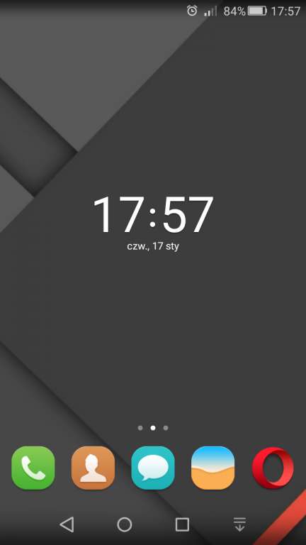
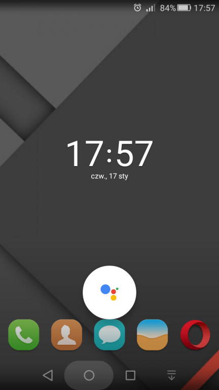
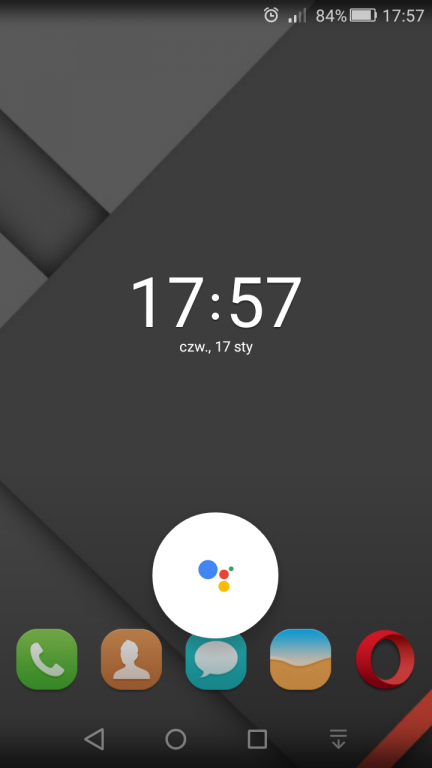
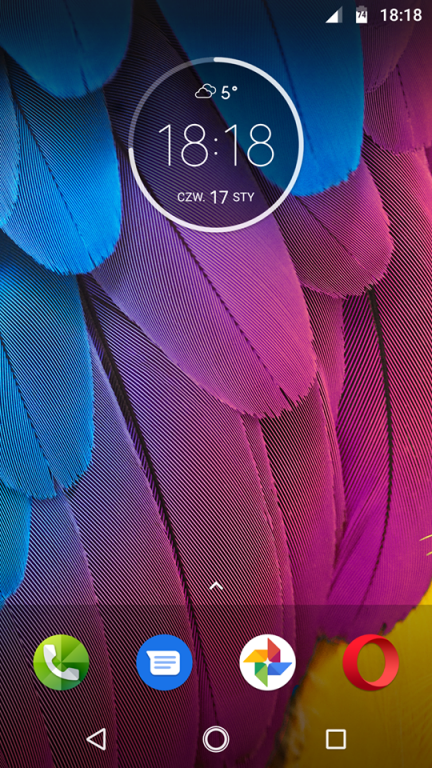
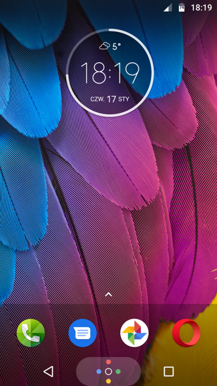

Dzisiaj, czyli 15 stycznia 2019 roku, miała się odbyć konferencja zorganizowana przez Google, na której tej gigant z Mountain View miał najprawdopodobniej zaprezentować swojego [głosowego asystenta](/testowalem-google-assistant-po-polsku). Niestety, konferencja nie odbędzie się.

Smutne wydarzenia jakie ostatnio miały miejsce w Gdańsku, spowodowały, że Google postanowił w ostatniej chwili odwołać swoją imprezę, nazywaną przez wielu spóźnionym spotkaniem karnawałowym. Tragiczna śmierć prezydenta Gdańska i ogłoszona w związku z tym trzydniowa żałoba w stolicy z pewnością nie pasuje do hucznego świętowania.

## Co z asystentem?

Google oficjalnie potwierdził, że konferencja miała dotyczyć właśnie tego produktu. Dodał także, że mimo odwołania spotkania, plany wdrożenia asystenta nie zmieniły się. Wszelkie informacje oraz materiały promocyjne zostaną rozesłane mediom za pomocą maili. Nie znamy jeszcze dokładnych dat, ale należy pamiętać, że proces wdrażania tej usługi nie będzie natychmiastowy. Dodatkowo, należy też mieć na uwadze fakt, że asystent nie pojawi się na wszystkich telefonach i wersjach systemu Android.

Moim zdaniem Google dobrze zrobił odwołując konferencję. Media są aktualnie pochłonięte innymi, ważniejszymi sprawami. Jurek Owsiak, założyciel Wielkiej Orkiestry Świątecznej Pomocy, postanowił zrezygnować z funkcji prezesa fundacji. Do corocznego hejtu kierowanego w jego stronę doszły zarzuty, że jakoby przyczynił się do tego, że ktoś był w stanie posunąć się do morderstwa. Nasz kraj przechodzi teraz przez trudny okres, w którym musi zdecydować, czy nadal będzie godzić się na szerzącą się nienawiść.

## Aktualizacja (17 stycznia 2019)

Zgodnie z informacjami podanymi przez Google, w ciągu najbliższych dni asystent będzie pojawiał się na telefonach Polaków. Jedynym wymaganiem technicznym jest wersja Androida 5.0 lub nowsza. Proces instalacji asystenta jest automatyczny, a po zainstalowaniu można go wywołać za pomocą przycisku "Home".

W przypadku systemu Lollipop, który ja posiadam, aktywacja odbywa się poprzez gest przesunięcia do góry. Należy go wykonać od przycisku "Home" do okrągłego symbolu asystenta (zdjęcie poniżej):

<Gallery>

</Gallery>

Natomiast posiadacze Nougata, czyli Androida z numerkiem 7.0, mogą zauważyć podwójny okrąg przycisku "Home". Jego przytrzymanie spowoduje uruchomienie krótkiej animacji z kolorowymi kuleczkami i pokazanie się okna asystenta:

<Gallery>

</Gallery>

Posiadacze telefonów napędzanych systemem iOS także będą mogli wypróbować polskiego asystenta. Jednakże w ich przypadku proces instalacji nie będzie automatyczny. Konieczne będzie pobranie odpowiedniej aplikacji Google ze sklepu.

Jeśli zaś chodzi o wszelkiego rodzaju inteligentne głośniki i wyświetlacze to musimy na razie obejść się ze smakiem. Zadebiutują one u nas trochę później, ponieważ Google chce całkowicie skupić się na dopracowaniu samego asystenta, zanim trafi on na inne urządzenia.

Na zakończenie, ponownie przypomnę, że termin 15 stycznia jest jedynie datą prezentacji produktu. Nie oznacza to, że tego wieczoru asystent miał się magicznie pojawić na wszystkich urządzeniach. Google, dla bezpieczeństwa, podzielił ten proces na etapy i użytkownicy muszą cierpliwie czekać na swoją kolej.
