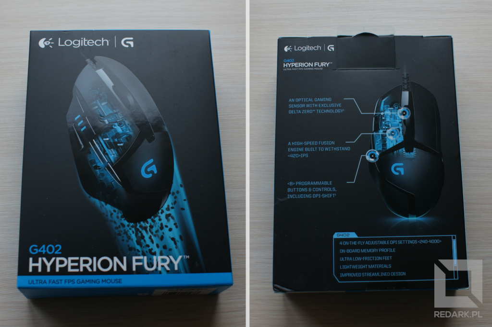
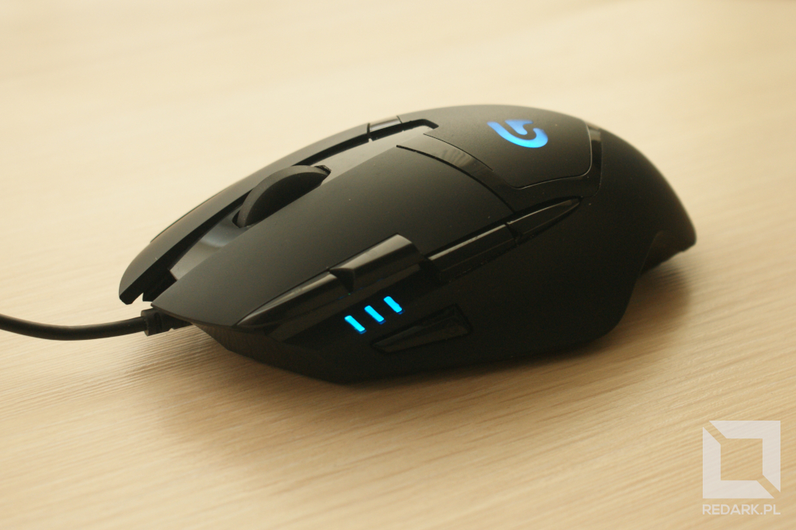
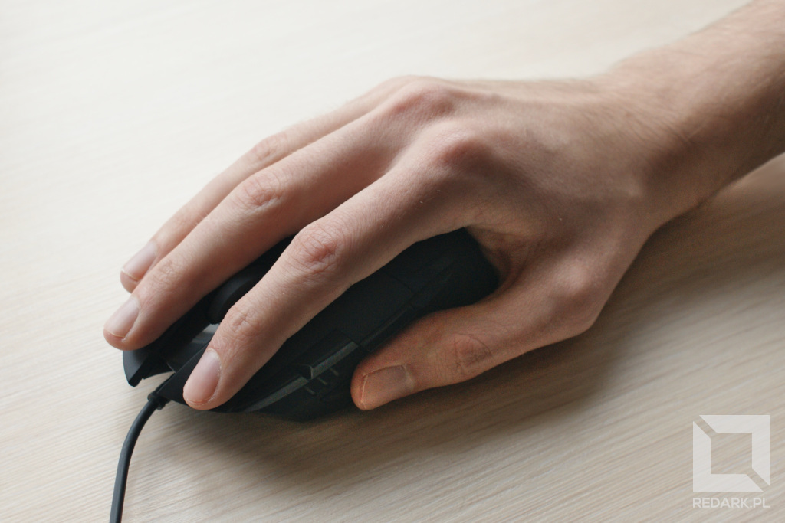
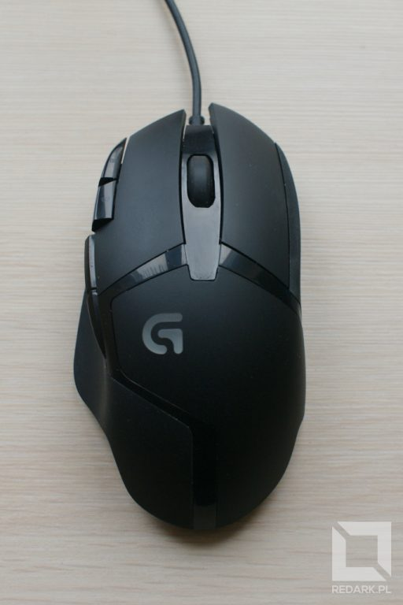
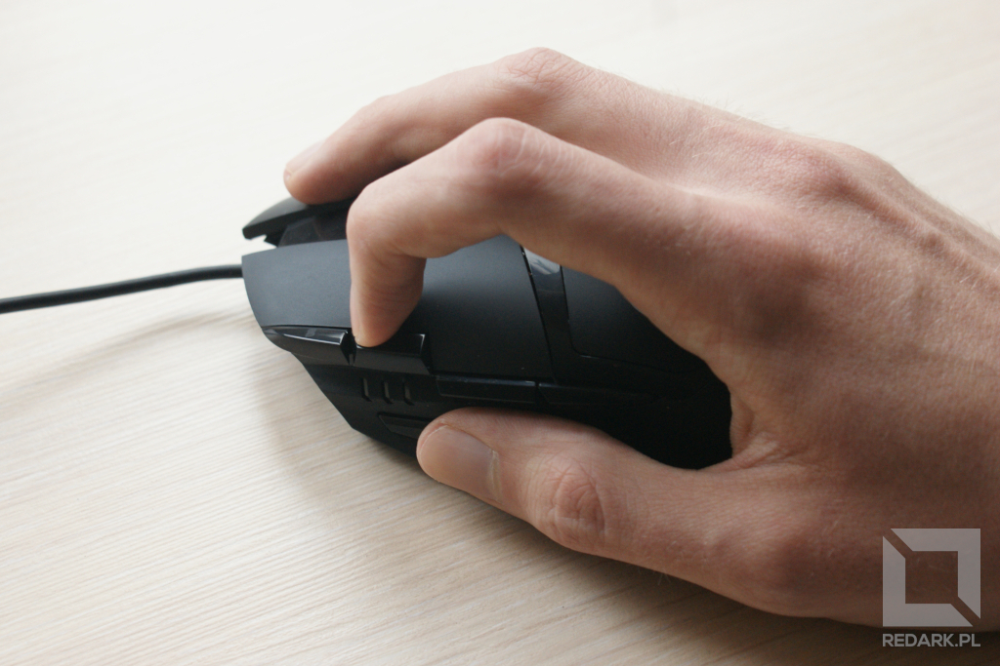
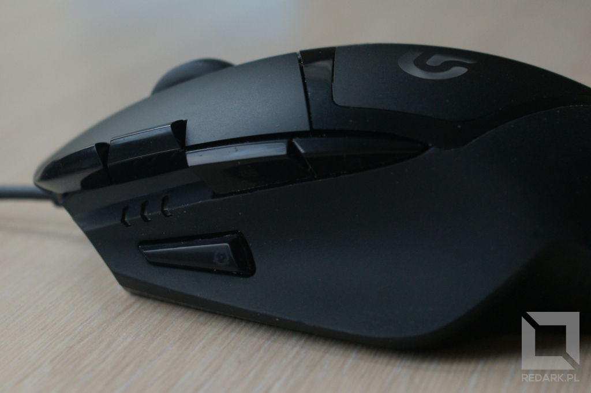

8 programowalnych przycisków, nowoczesny i elegancki wygląd i to wszystko połączone z hybrydowych sensorem Fusion potrafiącym zarejestrować ruch o prędkości nawet 500 IPS! Tak w skrócie można opisać mysz Logitech G402 Hyperion Fury, jaką ostatnio udało mi się nabyć na promocji. Przyjrzyjmy się jej bliżej.

W ofercie Logitecha znajdziemy wiele modeli różnego rodzaju sprzętu komputerowego. Niejednokrotnie używałem sprzętu tego producenta, ale nie ze wszystkich zakupionych egzemplarzy byłem zadowolony. Jednakże bogata oferta Logitecha powoduje, że kolejny raz sięgnąłem ręką na ich półkę. Zobaczmy jakie wrażenie wywrze na mnie tym razem.

## Unboxing

Mysz otrzymujemy w eleganckim czarnym pudełku z charakterystycznymi dla serii G niebieskimi akcentami. Nie zobaczymy tutaj [nachalnego chwalenia się ilością DPI](/myszy-komputerowe-czesc-1), jaką dysponuje urządzenie - widzimy jedynie znaczek producenta, model i grafikę mającą podkreślić innowacyjność wcześniej wspomnianego sensora.

Z tyłu pudełka znajdziemy krótką informację o najważniejszych funkcjach gryzonia, a na boku pozostałą część specyfikacji oraz wymagania sprzętowe komputera. Przejdźmy do zawartości.

Po otwarciu opakowania, na błękitnej tekturce, wyjeżdża nasz nowy gryzoń. Umieszczony jest "do góry nogami" na przeźroczystej, plastikowej wytłoczce. Jego kabel nie jest połamany i związany na siłę, tak żeby zajmował jak najmniej miejsca. Został ułożony wokół całej wytłoczki, przez co otrzymujemy prosty przewód bez zagięć.

Oprócz myszy, w pudełku znajdziemy jedynie dwie małe karteczki. Jedna zawiera zasady bezpiecznego użytkowania, a druga krótką informację o tym skąd należy pobrać oprogramowanie potrzebne do wykorzystania pełni możliwości tego urządzenia. Żadnej zbędnej makulatury.

<AdSense/>

## Pierwsze wrażenia

### Budowa

Logitech od zawsze miał swój niepowtarzalny styl. Łączył nowoczesny wygląd z elegancją, bez niepotrzebnych świecących elementów. Tak jest i tym razem. Obudowa myszy wykonana została z trzech różnych materiałów. Dominuje matowy plastik, z którego wykonane są główne przyciski, góra, tył i lewy bok urządzenia. Matowe powierzchnie oddziela błyszczący plastik, z którego wykonane są też boczne przyciski myszy. Nadaje to urządzeniu nowoczesnego wyglądu. Prawy bok, na którym użytkownik trzyma m.in. mały palec swojej dłoni jest podgumowany oraz posiada delikatną fakturę w postaci poziomych linii, które poprawiają chwyt myszy.

Górę urządzenia zdobi podświetlane na niebiesko logo serii Logitech G. Drugim świecącym elementem jest wskaźnik wybranego poziomu DPI. Ma on postać trzech niebieskich kresek znajdujących się na lewym boku myszy, tuż obok miejsca na kciuk użytkownika.

### Przyciski główne

Mysz jest duża (13,6 cm długości) i ciężka, a jej boki są lekko profilowane pod użytkowników praworęcznych. Jest to idealna mysz do chwytu palm grip, zwłaszcza dla osób posiadających duże dłonie, takie jak moje. Najwygodniejszym dla mnie ułożeniem palców okazał się 1 + 3 + 1, czyli trzymanie palca serdecznego razem ze środkowym na prawym przycisku myszy. Przyciski główne są oddzielone od reszty obudowy, chodzą lekko i wydają przyjemny dźwięk. Rolka znajdująca się między nimi wykonana jest z twardej gumy zapewniającej dobrą przyczepność. Środkowy przycisk rolki klika się bardzo pewnie. Moim zdaniem sama rolka mogłaby chodzić odrobinę ciszej, ale może jest to tylko kwestia przyzwyczajenia do poprzedniczki.

### Przyciski dodatkowe

W przypadku dodatkowych przycisków pierwsze wrażenie jest mieszane. Dwa przyciski znajdujące się obok lewego przycisku myszy służą domyślnie [do regulacji DPI góra/dół](/myszy-komputerowe-czesc-2). Mimo, że producent przewidział dużą przestrzeń na palec wskazujący, zauważyłem że może pojawiać się tutaj problem przypadkowego naciśnięcia wyżej usytuowanego przycisku. Ten niżej, jest trudniej dostępny i wymaga mocnego zgięcia palca, ale też nie mam większych problemów z jego dosięgnięciem.

Do dyspozycji kciuka oddano trzy przyciski. Dwa standardowe, służące do nawigacji np. po stronach WWW oraz jeden aktywujący tryb snajperski (obniża chwilowo poziom DPI). Znajduje się on bezpośrednio pod końcem opuszka kciuka. Obawiałem się, że będę go przypadkowo wciskać podczas użytkowania myszy, ale o dziwo, nawet mocniejsze złapanie gryzonia nie powodowało jego aktywacji. Duży plus!

Jeśli chodzi o dwa przyciski nawigacji to uważam je za dobrze zaprojektowane. Nie przeszkadzają w pracy, choć uważam, że powinny stawiać większy opór podczas naciskania. Ciekawostką jest to, że przedni przycisk, czyli ten odpowiedzialny domyślnie za akcję "dalej" jest lepiej dostępny niż usytuowany bardziej z tyłu "wstecz" i prawdopodobnie będę musiał podmienić ich rolę w oprogramowaniu dołączonym przez producenta.

## Podsumowanie

Myszka jest już rozpakowana i podłączona do komputera. Nadszedł czas na zainstalowanie jej oprogramowania i rozpoczęcie testów. Na pierwszy rzut oka, nie wszystko przypadło mi w niej do gustu. Jednak jestem świadomy, że nie bez znaczenia jest tu moje przyzwyczajenie do poprzedniej myszy (średniej wielkości, symetryczna mysz od HP). Dlatego też, za jakiś czas, przedstawię Wam pełną recenzję myszy Logitech G402 Hyperion Fury oraz jej oprogramowania.
