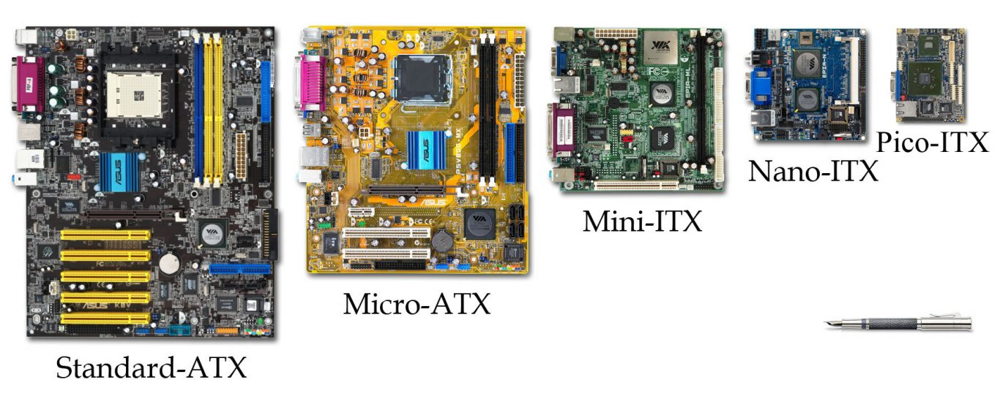
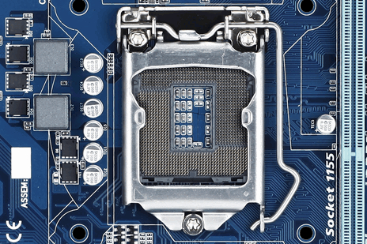
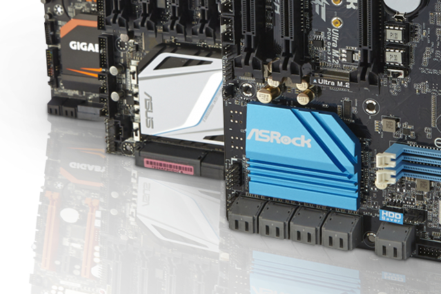
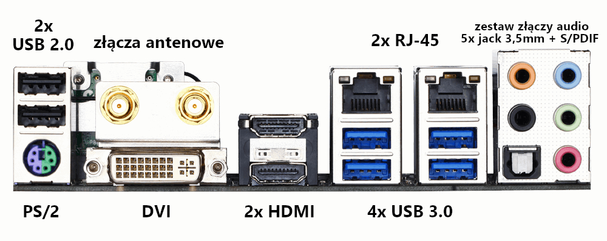

Często mówi się, że to procesor jest najważniejszym elementem w komputerze. Jednak ja nie podzielam tej opinii, bo czym byłby [procesor](/procesory), serce naszego komputera, gdyby nie arteria jaką jest płyta główna? To ona łączy wszystkie podzespoły w całość i kieruje przepływem informacji. Jej wybór często jest trudny, ponieważ od parametrów tego podzespołu zależy co będziemy mogli dodać do naszego zestawu komputerowego.

Kształt samej płyty i układ wszystkich jej elementów jest bardzo różny, dlatego w przypadku tego podzespołu ważne jest posiłkowanie się instrukcją obsługi, która dołączona jest do każdego egzemplarza. Dodatkowo należy pamiętać, że powierzchnia samej płyty pokryta jest wieloma napisami i oznaczeniami opisującymi wszystkie elementy i złącza, przez co wprawione oko potrafi odczytać większość parametrów płyty bez zerkania do specyfikacji.

## Główne parametry

Tak jak już wspominałem, płyta główna decyduje o tym, co może zostać podłączone do zestawu. Tyczy się to przede wszystkim procesora i pamięci RAM. Dodatkowo istnieje wiele standardów płyt różniących się rozmiarami i możliwościami rozbudowy, jakimi dysponują.

### Standard płyt głównych

Typów płyt głównych jest cała masa, ale najpopularniejszym obecnie standardem jest **ATX** i jego mniejsza wersja **microATX**. Pełna wersja tego standardu pozwala na szeroką rozbudowę jednostki o wiele sztuk kart rozszerzeń, kości RAM i [pamięci masowych](/nosniki-pamieci-dyski-hdd-ssd). Do jej zamontowania potrzebna jest obudowa typu midi tower lub większa. Więcej informacji o obudowach i ich typach pojawi się wkrótce w osobnym artykule.

Wersja microATX (mATX) jest nieco mniejsza od poprzednika, dzięki czemu zmieści się w mniejszych obudowach, takich jak mini tower. Główną różnicą w wersji micro jest mniejsza liczba slotów na karty rozszerzeń. Może ona także posiadać mniejszą ilość slotów na kości pamięci RAM oraz oferować mniej wyprowadzeń gniazd takich jak USB czy SATA.

<ImageDescription>Porównanie rozmiarów płyt głównych, źródło: wikipedia.org</ImageDescription>

Na rynku można też często spotkać standard ITX w wersji mini oraz nano. Ich możliwości jednak są bardzo ograniczone i stosuje się je jedynie do budowy [komputerów typu "mini PC"](/komputer-w-roznej-formie).

### Gniazdo procesora

Gniazdo procesora (ang. CPU socket) ma postać kwadratowej powierzchni wypełnionej małymi blaszkami stykowymi. Ich ilość oraz umiejscowienie decyduje o tym jaki procesor możemy zamontować na danej płycie. Pełną listę gniazd można znaleźć między innymi na [stronie Wikipedii](https://pl.wikipedia.org/wiki/Lista_gniazd_procesorowych). Jedyną zasadą jest to, żeby procesor był kompatybilny z gniazdem na płycie głównej.

<ImageDescription>Gniazdo LGA1155 przeznaczone do procesorów firmy Intel</ImageDescription>

### Gniazda pamięci operacyjnej RAM

W przypadku pamięci RAM trzeba zwrócić uwagę na kilka parametrów:

- **ilość gniazd (tzw. slotów)** - określa ile modułów pamięci możemy podłączyć naraz do komputera. Zazwyczaj są to 2 lub 4 gniazda.
- **typ/generacja pamięci** - modele kolejnych generacji pamięci RAM nie są ze sobą kompatybilne, dlatego też płyta główna może obsługiwać tylko jeden typ pamięci. Oznaczane są one skrótami DDR, DDR2, DDR3, DDR4 itd.
- **maksymalna pojemność** - każda płyta główna posiada limit pamięci jaką jest w stanie obsłużyć. Zazwyczaj jest to rozmiar, który ciężko przekroczyć (np. 64GB), ale warto sprawdzić ten parametr w specyfikacji.
- **dopuszczalne taktowanie pamięci** - pamięci montowane w komputerze muszą pracować z prędkością dopuszczaną przez płytę. Należy sprawdzić w specyfikacji listę dopuszczalnych taktowań pamięci i porównać ją z częstotliwością jaką oferują nasze pamięci RAM.
- **praca wielokanałowa** - kości RAM potrafią pracować w parach w celu zwiększenia wydajności ("dual channel"), a wydajne płyty potrafią grupować kości RAM nawet po 4 sztuki ("quad channel"). Warto sprawdzić, czy płyta obsługuje tryb "dual channel", który stał się już standardem.

<ImageDescription>Sloty pamięci RAM zawsze znajdują się obok gniazda procesora. Kolor oznacza pary modułów potrzebnych do trybu "dual channel"</ImageDescription>

Więcej informacji na temat tych parametrów można znaleźć w [osobnym artykule](/pamieci-ram) poświęconym w całości pamięciom RAM.

<AdSense/>

### Chipset

Chipset jest dużym układem scalonym znajdującym się na powierzchni płyty głównej. Steruje on przepływem danych w systemie i nadzoruje urządzenia peryferyjne komputera. To od niego zależy ogólna wydajność, a także możliwość rozbudowy zestawu komputerowego. Układy chipsetów oznaczone są literą i liczbą. Litera określa przeznaczenie komputera, a liczba generację układu (wyższy numer = nowszy model).

<ImageDescription>Chipset znajduje się pod metalowym radiatorem, zwykle ozdobionym logo producenta płyty głównej</ImageDescription>

Oznaczenia serii chipsetów Intel:

- **seria "H"** - przeznaczona do ogólnego użytku, umożliwia standardową pracę na komputerze oraz granie w gry, nie pozwala na podkręcanie procesora,
- **seria "B"** - przeznaczona do biznesu, jej parametry zbliżone są do serii "H",
- **seria "Z"** - przeznaczona do wydajnych zestawów komputerowych, umożliwia podkręcanie podzespołów,
- **seria "X"** - najbardziej zaawansowana seria chipsetów, umożliwia współpracę z procesorami serii i9 oraz ich podkręcanie.

Oznaczenia serii chipsetów AMD:

- **seria "A"** - przeznaczona dla niewymagających użytkowników,
- **seria "B"** - przeznaczona dla użytkowników oczekujących wysokiej wydajności, umożliwia podstawowe pokręcanie procesora,
- **seria "X"** - zaawansowana seria chipsetów przeznaczona dla wymagających, umożliwia pokręcanie procesorów oraz łączenie kilku kart graficznych.

<WarningBlock>Najnowsze, wydajne procesory często mogą współpracować tylko z jednym dedykowanym gniazdem oraz chipsetem. Należy zwrócić szczególną uwagę na wymagania danych modeli procesorów podczas ich zakupu.</WarningBlock>

## Zintegrowane podzespoły

Płyta główna to nie tylko zestaw ścieżek łączących wszystkie elementy ze sobą. Praktycznie zawsze posiada ona na swojej powierzchni zintegrowane podzespoły odbarczające nas z potrzeby kupowania osobnych urządzeń takich jak np. karta sieciowa. Omówione poniżej urządzenia zapewniają jedynie podstawową funkcjonalność. Użytkownicy potrzebujący większej wydajności oraz możliwości konfiguracji i tak powinni zaopatrzyć się w zewnętrzne urządzenia montowane w postaci np. kart PCI.

### Karta graficzna

Czy trzeba kupować [kartę graficzną](/karty-graficzne) do komputera? Nie! Wiele płyt głównych posiada tzw. zintegrowane karty graficzne (nazywane potocznie "integrami") umożliwiające podłączenie [monitora](/monitory-czesc-1) bezpośrednio do tylnych portów płyty. Przy takim rozwiązaniu musimy wziąć pod uwagę dwa aspekty.

Po pierwsze procesor musi posiadać wbudowany układ graficzny. Takie układy posiada większość procesorów produkowanych przez firmę Intel, ale w przypadku procesorów AMD sprawa wygląda odwrotnie. Tylko nieliczne modele posiadają zintegrowaną grafikę. To sprawia, że procesory Intela są droższe, ale umożliwiają zbudowanie komputera bez kupowania karty graficznej, a procesory AMD, za zaoszczędzone pieniądze, pozwalają za zakup mocniejszej karty. Drugim aspektem jest niska wydajność takiego układu, która nie pozwala na komfortowe granie w gry komputerowe. Dodatkowo, to rozwiązanie obciąża nasz procesor oraz rezerwuje sobie fragment [pamięci RAM](/pamieci-ram) zainstalowanej na płycie głównej.

Które rozwiązanie jest lepsze? Oba są dobre, ale dla określonych celów. Decyzję jaki wariant wybrać pozostawiam użytkownikowi. Do parametrów jakimi możemy kierować się podczas wyboru należą:

- **model zintegrowanego układu procesora** - to procesor odpowiada za przetwarzanie grafiki. Im lepszy układ posiada tym lepiej. Jeśli nie planujemy zakupu karty graficznej warto zakupić odrobinę lepszy procesor posiadający wydajniejszy układ graficzny.
- **wyjścia audio-wideo** - płyta główna na swoim tylnym panelu posiada zestaw złącz. Część z nich są to wyprowadzenia obrazu pochodzącego ze zintegrowanej karty graficznej. Należy sprawdzić jakie złącza posiada płyta i czy będą one pasować do naszego monitora. Najczęściej jest to **D-SUB, DVI i HDMI**.

### Karta dźwiękowa

To kolejny przykład zintegrowanej technologii na płycie głównej. Każdy potrzebuje dźwięku w komputerze. Czy to do cieszenia się grą, czy do obejrzenia filmiku w serwisie YouTube. Gdyby nie dobrodziejstwo zintegrowanej karty dźwiękowej, żeby usłyszeć jakikolwiek dźwięk z komputera, zmuszeni byśmy byli do zakupu dodatkowego interfejsu audio.

Dominującym producentem zintegrowanych układów dźwiękowych jest firma Realtek. Tak samo jak w przypadku zintegrowanych grafik tutaj także nie ma co liczyć na fajerwerki. Karty tego typu zapewniają podstawową funkcjonalność, która nie zadowoli żadnego audiofila. W przypadku karty dźwiękowej jedynym praktycznym parametrem jest liczba kanałów audio, które obsługuje. Standardowe modele zapewniają możliwość podłączenia tylko słuchawek lub [głośników](/glosniki-komputerowe) w **systemie 2.1**. Lepsze modele umożliwią wygenerowanie **dźwięku 7.1**. Więcej informacji na temat złączy audio znajdujących się na płycie głównej można [znaleźć tutaj](/kablologia-pajeczyna-za-biurkiem).

### Karta sieciowa

Komputer bez dostępu do Internetu jest nudny. Dostęp do sieci stał się dziś tak powszechny, że płyty główne posiadają zintegrowane karty sieciowe pozwalające na podłączenie do nich standardowego przewodu zakończonego wtyczką RJ-45 lub, jak ktoś woli, 8P8C.

Karty znajdujące się na płytach głównych zazwyczaj są standardowymi "setkami", czyli układami pozwalającymi na przesył danych z prędkością 100 Mbps, co daje prędkość na poziomie 12 MB na sekundę. Osoby wysyłające dużo informacji przez Internet powinny zaopatrzyć się w zewnętrzne karty na PCI lub poszukać droższych płyt posiadających **interfejsy gigabitowe**. Jak sama nazwa wskazuje oferują one 1Gbps, czyli 128 MB na sekundę.

### Komunikacja radiowa

Niektóre modele płyt głównych posiadają wbudowane karty bezprzewodowe, które umożliwiają połączenie się z lokalną siecią komputerową za pomocą **Wi-Fi**. W takich płytach, na tylnym panelu, zazwyczaj znajdują się wyjścia koncentryczne do zamontowania anteny nadawczo-odbiorczej.

Drugą technologią bezprzewodową, niechętnie montowaną w komputerach PC, jest **Bluetooth**. Pozwala on na połączenie się z bezprzewodową myszą lub klawiaturą oraz na przerzucenie zdjęć z telefonu bądź aparatu.

### Kontroler RAID

Zapewne wielu użytkowników o nim nie słyszało i wielu go nie potrzebuje. Kontroler RAID jest ściśle związany z [twardymi dyskami](/nosniki-pamieci-dyski-hdd-ssd) montowanymi w komputerze. Pozwala on na łączenie ich w grupy (macierze) o przeróżnych celach. Dla przykładu: **RAID w trybie 0** dzieli w locie dane na części i zapisuje je równolegle na dwóch, różnych dyskach. Pozwala to na zwiększenie przepustowości zapisu i odczytu danych. Natomiast **RAID w trybie 1**, także potrzebuje dwóch dysków do pracy, ale zapisuje na nich lustrzane kopie danych użytkownika. Pozwala to na odzyskanie danych po awarii jednego z nośników.

Istnieje znacznie więcej trybów działania tego kontrolera, ale są one przeznaczone dla firm i instytucji, gdzie nie może dojść do utraty danych. Natomiast tryby 0, 1 oraz **hybrydowy 0+1** może być spokojnie używany w domowym zaciszu. Zwłaszcza gdy użytkownik operuje cennymi danymi.

<AdSense/>

## Złącza tylnego panelu

Wspominałem już o nich wiele razy. Nic dziwnego. Dzięki nim jesteśmy w stanie podłączyć komputer do zewnętrznych peryferiów. Nie będę się tu zbytnio rozwodził na ich temat. Osoby, które chcą dowiedzieć się o nich czegoś więcej [zapraszam do artykułu](/kablologia-pajeczyna-za-biurkiem) omawiającego wszelkie kable i wtyczki komputera. Tu jedynie przedstawię listę gniazd, jakie powinien posiadać typowy komputer klasy PC, ale jednocześnie zaznaczam, że użytkownicy mają różne potrzeby i nie można jednoznacznie podać, jakich modeli płyt powinni szukać.

<ImageDescription>Złącza płyty głównej Gigabyte GA-Z97N-WIFI, źródło: gigabyte.com</ImageDescription>

### Podłączenie monitora

W przypadku korzystania z zintegrowanej karty graficznej należy sprawdzić czy płyta główna posiada te same porty co nasz monitor.

### Podłączenie sprzętu audio

Zazwyczaj chodzi tu o [głośniki](/glosniki-komputerowe) i mikrofon. Jeśli płyta główna posiada zintegrowaną kartę dźwiękową (a praktycznie zawsze tak jest) to umożliwia podłączenie tych urządzeń. Chcących sprawdzić czy płyta jest kompatybilna z konkretnym sprzętem audio odsyłam [tutaj](/kablologia-pajeczyna-za-biurkiem).

### Podłączenie do sieci Internet

Czyli możliwość przewodowego podłączenia komputera do sieci za pomocą skrętki. Nawet jeśli nasz sprzęt ma pracować bezprzewodowo lub nawet nigdy nie korzystać z Internetu to i tak warto posiadać taką możliwość.

### Podłączenie peryferiów komputerowych

Najważniejsze porty znajdujące się z tyłu komputera to głównie **porty USB**, którymi podłączymy większość urządzeń. Należy pamiętać, że porty tego typu występują w 2 generacjach. [Wersja 2.0](/kablologia-zlacza-usb) charakteryzuje się wolnym transferem i przeznaczona jest do podłączania myszy, klawiatur i innych urządzeń, które nie przesyłają dużej ilości danych. [Wersja 3.0](/kablologia-zlacza-usb), oznaczona kolorem niebieskim, rozwija dużo większe prędkości i spokojnie obsłuży wydajne pamięci masowe takie jak pendrive'y i dyski HDD/SSD.

Należy też pamiętać, że 3. generacja USB **jest w pełni kompatybilna** z poprzedniczką. Sprawia to, że płyta wyposażona wyłącznie w niebieskie gniazda 3.0 nadal jest w stanie obsłużyć starsze urządzenia wyposażone w wtyczkę w wersji 2.0. Ilość gniazd, jakie powinna posiadać płyta główna, zależy od preferencji użytkownika i ilości urządzeń, które posiada.

Oprócz USB, dużo modeli płyt wyposażona zostaje w starsze **gniazda PS/2** oznaczone kolorem zielonym i fioletowym. Służą one do podłączenia starszych typów [mysz](/myszy-komputerowe-czesc-1) i [klawiatur](/klawiatury). Nawet jeśli nie posiadamy już urządzeń tego typu, obecność gniazda PS/2 w niczym nie przeszkadza.

<ActionButton to='/plyty-glowne-czesc-2'>II część artykułu</ActionButton>
