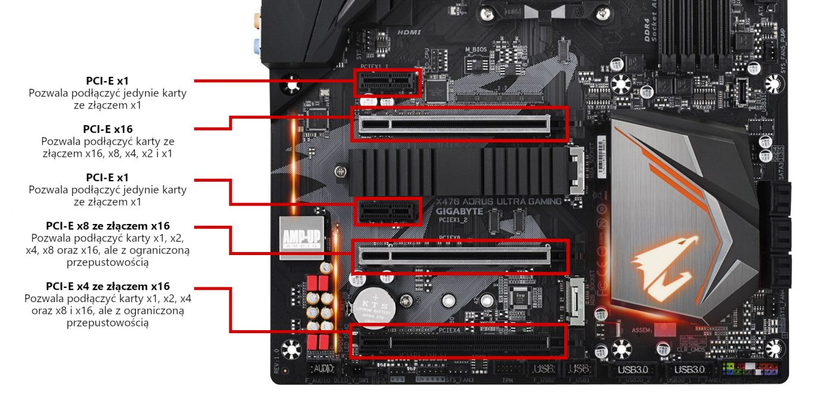
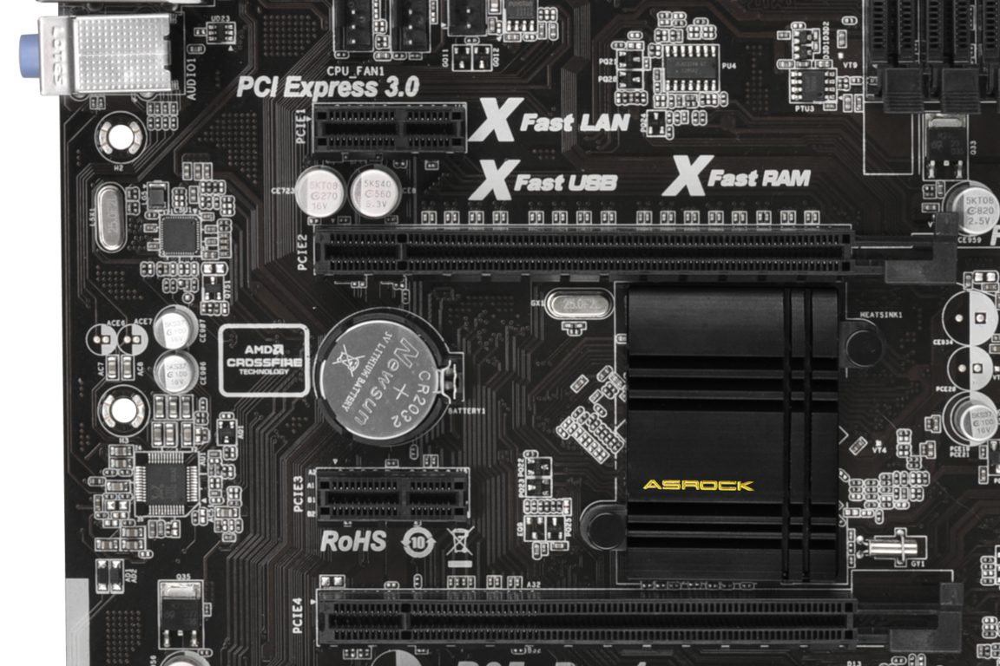
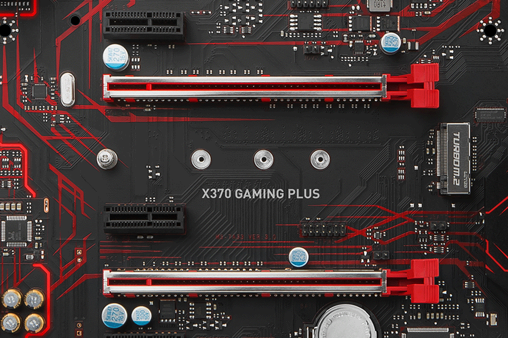
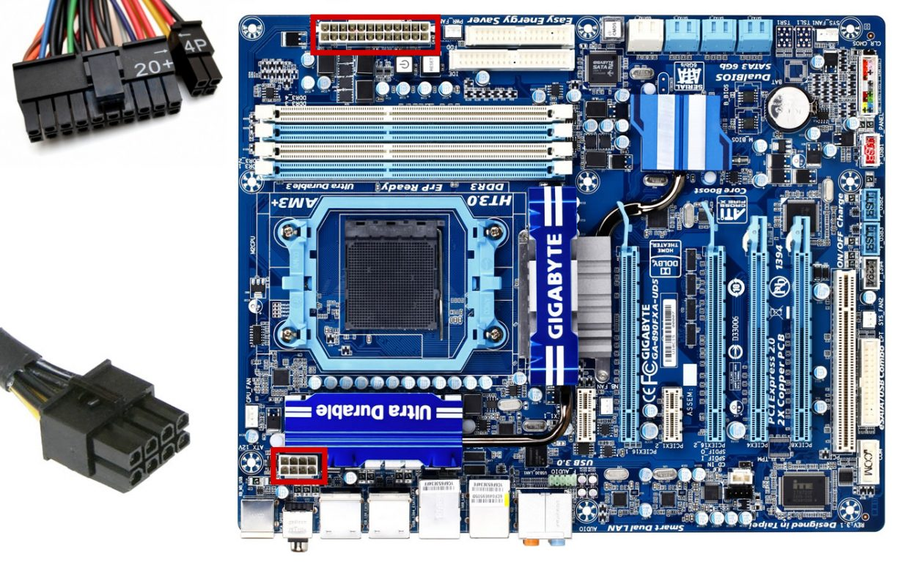
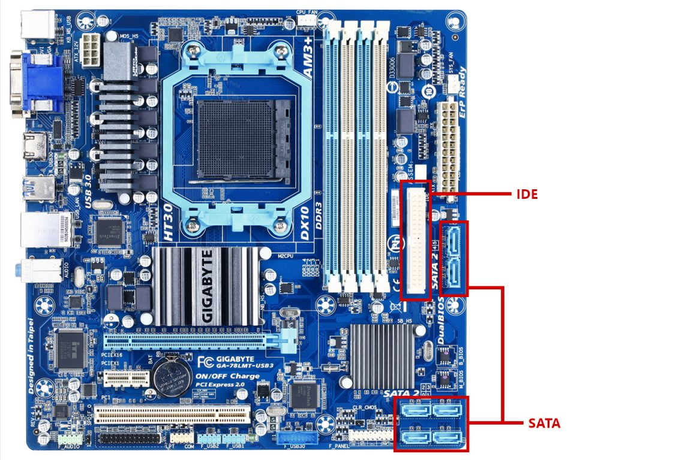
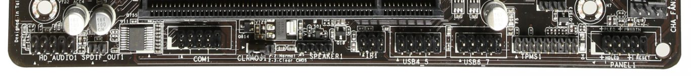
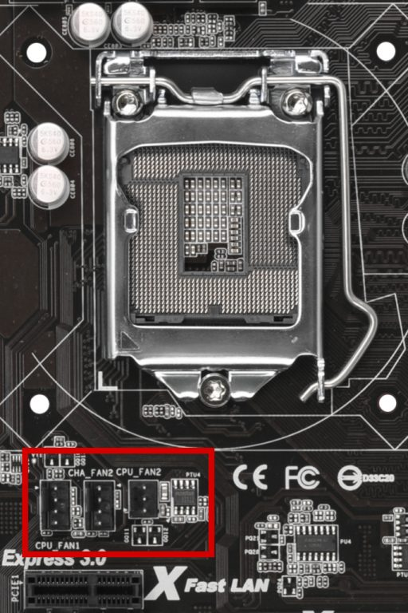
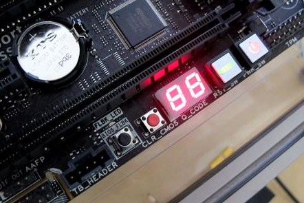
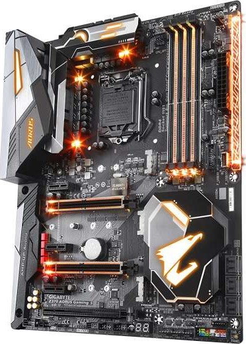

<ActionButton to='/plyty-glowne-czesc-1'>I część artykułu</ActionButton>

## Gniazda i złącza na powierzchni płyty

Dzięki tylnym portom, płyta główna pozwala na podłączenie zewnętrznych urządzeń, ale oprócz tego, musi jeszcze łączyć ze sobą wszystkie podzespoły jednostki centralnej. Dlatego też na swojej powierzchni posiada zestaw przeróżnych złączy i gniazd, które teraz omówię.

### Gniazda PCI i PCI Express

Gniazda PCI (o których wielokrotnie wspominałem w poprzedniej części artykułu) to ułożone równolegle porty znajdujące się pod procesorem. Służą one do podłączania kart rozszerzeń montowanych z tyłu obudowy komputera. Od ich ilości zależy, ile kart rozszerzeń możemy zamontować w komputerze. Stąd też wynika różnica w rozmiarach obudów do poszczególnych standardów płyt.

Gniazdo PCI występuje tylko w jednym rodzaju, natomiast PCI Express (PCIe) dzieli się już na **generacje** (1.0, 2.0, 3.0 itd.) oraz **ilość linii sygnałowych** (x1, x2, x4, x8, x16). Obie te cechy można odczytać ze specyfikacji płyty lub z napisów znajdujących się w sąsiedztwie portów. Dodatkowo, karty o mniejszej liczbie linii sygnałowych (np. x1) można montować w gniazdach posiadających więcej linii (x2, x4, x8, x16). Działa to również w drugą stronę, aczkolwiek gniazdo musi pozwalać na instalację kart o wyższej liczbie linii. Oczywiście, taki zabieg ma skutek uboczny, jakim jest ograniczenie przepustowości danego urządzenia. Wątpliwości powinna rozwiać poniższa analiza gniazd przykładowej płyty głównej:

<ImageDescription>Opis gniazd PCI Express na przykładzie płyty Gigabyte X470 AORUS ULTRA GAMING</ImageDescription>

<InfoBlock>Poprzednikiem gniazd PCI-E dla kart graficznych był interfejs AGP, ale został on już całkowicie wyparty z rynku.</InfoBlock>

Najczęściej podłączanym do tych gniazd akcesorium jest karta graficzna, która zazwyczaj posiada złącze PCIe x16. Montowana jest w najwyższym gnieździe, obok procesora. Poniżej takiego gniazda czasami pozostawiona jest pusta przestrzeń (bez kolejnego złącza PCI), która umożliwia bezproblemowy montaż kart graficznych zajmujących dwa "sloty" z tyłu komputera.

<ImageDescription>Płyta Asrock B85 Pro4. Poniżej gniazda PCIe x16 znajduje się bateria, zamiast kolejnego gniazda PCI, źródło: asrock.com</ImageDescription>

Ilość oraz rodzaj złączy, jakie powinna posiadać płyta, zależy od wymogów użytkownika. Przy standardowym zestawie komputerowym spokojnie wystarczy płyta microATX pozwalająca na podłączenie karty graficznej wraz z jedną lub dwoma kartami rozszerzeń.

### Gniazda M.2

Jest to stosunkowo nowe złącze dedykowane głównie dla dysków SSD. Umożliwia ono osiągnięcie bardzo dużych transferów dzięki bezpośredniemu połączeniu z magistralą PCI Express. Moduły montowane w tym gnieździe występują w różnych rozmiarach. Przy wyborze płyty głównej z tym złączem ważne są dwa parametry:

- **lista kompatybilnych rozmiarów** - moduły pamięci M.2 występują w różnych rozmiarach. Płyty główne posiadają listę modułów możliwych do zainstalowania.
- **gniazdo B, M oraz B+M** - na rynku występują dwa różne typy styków modułów M.2. Płyta główna musi posiadać gniazd takiego samego typu co moduł lub typ B+M, który pozwala na montaż obu rodzajów.

<InfoBlock>Powyższe parametry zostały dokładnie omówione w osobnym artykule poświęconym dyskom SSD M.2. Link do tego artykułu znajduje się poniżej.</InfoBlock>

<ActionButton to='/dyski-ssd-m2'>Dyski SSD M.2</ActionButton>

<ImageDescription>Płyta MSI X370 GAMING PLUS. Gniazdo M.2 znajduje się pomiędzy gniazdami PCIe oraz posiada 4 śruby umożliwiające montaż 4 różnych rozmiarów modułu, źródło: msi.com</ImageDescription>

<AdSense/>

### Gniazda zasilania płyty głównej

Jednym z zadań płyty głównej jest dostarczenie energii elektrycznej do wszystkich podzespołów znajdujących na jej powierzchni. Głównym łącznikiem płyty z [zasilaczem](/zasilacze) jest [24-pinowa wtyczka ATX](/kablologia-przewody-jednostki-centralnej). Jej gniazdo znajduję się blisko prawej krawędzi płyty i nie da się go pomylić z żadnym innym. Starsze modele mogą posiadać złącze 20-pinowe, ale ciężko jest je dzisiaj spotkać. Dodatkowo, zasilacze posiadają specjalną rozłączaną wtyczkę, która spokojnie obsłuży oba typy gniazd.

<ImageDescription>Płyta GIGABYTE GA-890FXA-UD5 potrzebuje wtyczki ATX 24pin oraz dodatkowego 8-pinowego zasilania procesora, źródło: gigabyte.com</ImageDescription>

Druga wtyczka dostarcza zasilanie do procesora i zawsze znajduje się w jego pobliżu. W tym przypadku należy sprawdzić jaki typ gniazda posiada płyta (4 lub 8 pinów) i sprawdzić, czy nasz zasilacz posiada odpowiednią wtyczkę.

<InfoBlock>Niektóre płyty główne, wyposażone w rozbudowane sterowniki wentylatorów i oświetlenia, mogą potrzebować dodatkowego zasilania dostarczanego z gniazda MOLEX. Jego podłączenie nie jest wymagane do prawidłowej pracy komputera, a jedynie do wymienionych wcześniej funkcji.</InfoBlock>

### Kontrolery pamięci masowych

Każdy komputer wymaga dysku z danymi i systemem operacyjnym. Nieważne, czy jest to [dysk HDD czy SSD](/nosniki-pamieci-dyski-hdd-ssd), ale musi zostać podłączony do płyty głównej. Dominującym tutaj interfejsem jest SATA. Występuje on najczęściej w ilości sztuk 4, 6 lub 8 oraz w dwóch generacjach: SATA II i SATA III. Trzecia generacja zaspokoi potrzeby dysków SSD, natomiast klasycznym modelom talerzowym wystarczy druga generacja. Ilość gniazd zależy od ilości dysków, jakimi będzie operować użytkownik.

<ImageDescription>Gniazda SATA oraz IDE na płycie Gigabyte GA-78LMT-USB3, źródło: gigabyte.pl</ImageDescription>

Starsze płyty główne mogą posiadać także gniazda [taśm IDE](/kablologia-przewody-jednostki-centralnej) - poprzednika technologii SATA. Dzisiaj interfejs ten wyszedł już całkowicie z użytku i coraz trudniej spotkać to gniazdo. Osoby potrzebujące podłączyć stare dyski twarde pracujące na tych taśmach powinny raczej wyposażyć się w zewnętrzne kontrolery montowane w gniazdach PCI.

## Gniazda w postaci pinów

Nie wszystkie gniazda na płycie głównej mają postać dużych, otoczonych plastikiem otworów. Wiele z nich występuje na niej w postaci gniazd szpilkowych typu goldpin (zdjęcie poniżej). Mają one znacznie mniejsze rozmiary, a ich wykorzystanie zależy od potrzeb użytkownika.

<ImageDescription>Złącza szpilkowe znajdujące się na dole płyty głównej</ImageDescription>

### Złącza USB i audio

Mają one ścisły związek z panelem przednim obudowy komputera. Oprócz przycisków i diod należy podłączyć też gniazda: słuchawek, mikrofonu oraz USB. W przypadku [gniazd USB](/kablologia-zlacza-usb), płyta główna musi pozwalać na podłączenie wszystkich kabli wychodzących z panelu przedniego obudowy. Informacje o ilości potrzebnych złącz można znaleźć w specyfikacji obudowy.

### Złącza wentylatorów

Do schłodzenia komputera potrzebne są wentylatory zapewniające odpowiednią cyrkulację powietrza. Jednym ze sposobów ich zasilenia jest podłączenie ich do płyty głównej. Wyróżniamy dwa rodzaje gniazd, które temu służą:

- **CPU\_FAN** - 4-pinowe gniazdo do chłodzenia procesora. Pozwala na płynne regulowanie prędkością obrotową wentylatora dzięki wbudowanemu w niego czujnikowi.
- **SYS\_FAN** lub **CHA\_FAN** - 3-pinowe gniazdo chłodzenia obudowy. Do tego złącza mogą być podpinane wszelkiego rodzaju wentylatory znajdujące się w obudowie jednostki centralnej. Wzrost temperatury procesora nie będzie powodował u nich skoków prędkości.

Ilość potrzebnych złącz zależy od ilości wentylatorów, jakie posiada obudowa i chłodzenie procesora. W przypadku obudów z dużą liczbą wentylatorów może okazać się, że sama obudowa posiada własny kontroler umożliwiający ich podłączenie. Innym rozwiązaniem jest wyposażenie komputera w kontroler obrotów z wyświetlaczem i termometrem, montowany z przodu obudowy w slocie 5,25 cala.

<ImageDescription>W pobliżu procesora można znaleźć gniazdo wentylatora przeznaczonego do jego chłodzenia</ImageDescription>

### Kontroler LED RGB

Niektóre, droższe płyty główne posiadają na swojej powierzchni wbudowany kontroler obsługujący taśmy diod RGB LED. Pozwala to na stworzenie oświetlenia komputera i biurka, które może zostać zsynchronizowane z tym co aktualnie dzieje się na ekranie. Przykładem takiej technologi jest Asus Aura Sync.

### Gniazda rzadko używane lub wychodzące z użytku

Pewne gniazda, z powodu małej popularności, nie znajdują miejsca na tylnym panelu komputera. Mimo to, wiele płyt głównych nadal daje możliwość skorzystania z ich funkcjonalności dzięki szeregowi goldpinów znajdujących się przy dolnej krawędzi płyty. Są to m.in. porty [COM, LPT, FireWire](/kablologia-pajeczyna-za-biurkiem) czy Thunderbolt.

<AdSense/>

<InfoBlock>Wśród gniazd szpilkowych można znaleźć tego gniazdo oznaczone literami TPM. Jest to gniazdo specjalnego układu scalonego odpowiedzialnego za usługi kryptograficzne, czyli szyfrowanie danych. Umożliwiają one m.in. lepsze zabezpieczenie danych znajdujących się na dysku komputera.</InfoBlock>

## Pozostałe elementy

### Moduł BIOS/UEFI

Wbudowany system BIOS znajdujący się na płycie głównej odpowiedzialny jest za sprawdzenie poprawności działania komputera zaraz po jego uruchomieniu. Jeśli wszystko jest dobrze, inicjalizuje ładowanie systemu operacyjnego (np. Windows). Jeśli któryś z podzespołów jest niesprawny komunikuje awarię za pomocą małego brzęczyka wewnątrz komputera.

Obecnie system ten zastępowany jest przez UEFI, którego zasada i cel działania są takie same. Oferuje on jednak dużo więcej funkcji i konfiguracji. Dzisiejsze systemy operacyjne bez problemu z nim współpracują, a nawet wymagają go do poprawnej pracy. Dlatego też **należy wybierać płyty posiadające UEFI**.

Wiele modeli płyt posiada podwójny układ scalony odpowiedzialny za działanie BIOSu i UEFI. Oznaczane jest to najczęściej nazwą **"DualBIOS"**. Technologia ta umożliwia poprawne działanie komputera nawet w przypadku uszkodzenia podstawowego chipu. W takim wypadku całą kontrolę przejmuje zapasowy układ, który może także podjąć się naprawy uszkodzenia. W przypadku braku tej technologii, awaria chipu oznacza potrzebę udania się do profesjonalnego serwisu komputerowego.

### Diody i wyświetlacz do komunikowania błędów

Tak jak wspominałem, domyślnym sposobem komunikowania błędów przez komputer jest brzęczyk. Droższe modele płyt, umożliwiające podkręcanie podzespołów komputera, posiadają dodatkowe możliwości komunikowania błędów, co ułatwia diagnostykę. Do takich rozwiązań należą diody LED i wyświetlacze segmentowe. Te pierwsze, zwykle przypisane są do konkretnych podzespołów - dla przykładu dioda z napisem CPU sygnalizuje wyłącznie problemy związane z procesorem. Wyświetlacz segmentowy natomiast pokazuje dwucyfrowy komunikat błędu, który należy odczytać z instrukcji dołączonej do płyty głównej.

<InfoBlock>Istnieją także zewnętrzne rozwiązania w postaci testerów płyt głównych. Posiadają one wyświetlacz segmentowy i montowane są w gnieździe PCI.</InfoBlock>

### Fizyczne przyciski

Dopiero podłączenie przedniego panelu obudowy umożliwia uruchomienie całego zestawu za pomocą przycisku power. A co, gdyby uruchomić system bezpośrednio z płyty głównej? Do tego służą fizyczne przyciski **START** i **RESET**. Jest to idealne rozwiązanie dla urządzeń, które z jakiegoś powodu nie będą wkładane do standardowych obudów.

<ImageDescription>4 fizyczne przyciski wraz z omawianym wcześniej wyświetlaczem segmentowym</ImageDescription>

<InfoBlock>Komputer można uruchomić nawet i bez przycisków na płycie czy obudowie. Jedyne co trzeba zrobić to zewrzeć odpowiednie piny na płycie np. za pomocą śrubokręta. Jednak nie jest to zbyt wygodne rozwiązanie :)</InfoBlock>

### Podświetlenie RGB LED

Płyta główna stanowi centralny element każdego komputera. Nic dziwnego, że producenci wyposażają je w przeróżne podświetlenia RGB LED. Tak samo jak w przypadku wcześniej omawianych kontrolerów taśm, tak i tu, za pomocą specjalnego oprogramowania, możemy dostosować kolor poszczególnych elementów oraz zsynchronizować je z ekranem lub muzyką.

<ImageDescription>Płyta główna Gigabyte Aorus Intel Z370 Gaming 5, źródło: gigabyte.pl</ImageDescription>

### Łączenie kart graficznych

Komputer nie musi pracować tylko z jedną kartą graficzną. Może on wykorzystywać kilka na raz, łącząc ich moc obliczeniową. Takie rozwiązanie wymaga jednak wspierania przez płytę główną technologii **Crossfire** (dla kart AMD) lub **SLI** (dla kart Nvidii). Jeśli użytkownik planuje tworzenie zestawów kart, musi sprawdzić, czy płyta to umożliwia.

<AdSense/>

<InfoBlock>W przypadku płyt umożliwiających łączenie kart graficznych, na ich powierzchni znajduję się zworka lub przełącznik, który ustala tryb pracy GPU. Wszelkie informacje dotyczące aktywacji technologii Crossfire i SLI zawsze znajdują się w instrukcji płyty głównej.</InfoBlock>

### Technologie producentów

Na zakończenie specjalne technologie oferowane przez producentów płyt głównych. Ich funkcje są przeróżne, podobnie jak ich nazwy. Ich wymienianie i opisywanie nie ma większego sensu. Najważniejsze jest to, żeby nie bać się (często kosmicznych) nazw i sprawdzać ich zadanie na stronie producenta. Dla przykładu płyty główne od Gigabyte z serii "Ultra Durable" wykonane są z lepszych jakościowo elementów przez co mają one wytrzymywać dłuższy okres eksploatacji.

## Podsumowanie

Najważniejsze aspekty i parametry podczas wyboru płyty głównej:

<OkList>
- Wybierz płytę posiadającą gniazdo (socket) odpowiadające Twojemu procesorowi.
- Sprawdź, ile i jakiego typu pamięci RAM możesz podłączyć do płyty oraz jakie częstotliwości taktowania są przez nią wspierane.
- Sprawdź, czy chipset wspiera Twój procesor oraz czy nie wymaga innych dodatkowych czynności (np. aktualizacja BIOSu).
- Zastanów się, czy potrzebujesz zintegrowanego układu graficznego czy wystarczy ci jedynie możliwość podłączenia karty graficznej.
- Zrób listę portów jakich potrzebujesz z tyłu komputera.
- Jakie karty rozszerzeń będziesz instalować? Jakich gniazd PCI i PCI-E potrzebujesz?
- Iloma dyskami będzie operować komputer? Ile złączy SATA jest potrzebnych?
- Jakich gniazd potrzebuje płyta główna do podłączenia przedniego panelu twojej obudowy?
- Ile wentylatorów będzie chłodzić obudowę? Czy chłodzenie procesora posiada jeden czy dwa wentylatory?
</OkList>

Moje rady:

<StarList>
- Płyta główna decyduje o tym jakie elementy można zamontować w komputerze. Jeśli jest szansa, że dane gniazdo będzie w przyszłości potrzebne należy zdecydować się na nie już teraz.
- Złe działanie płyty głównej odbija się na całym zestawie komputerowym. Nie wybieraj modeli posiadających dużo negatywnych opinii.
- Wymiana płyty głównej jest kłopotliwa. Trzeba demontować wszystkie podzespoły oraz wymieniać pastę na procesorze. Dodatkowo, do tego podzespołu często przypisywane są klucze licencyjne do oprogramowania. Wymiana płyty może np. unieważnić aktywację systemu Windows. Najlepiej żeby ten podzespół nigdy nie musiał być wymieniany.
</StarList>
