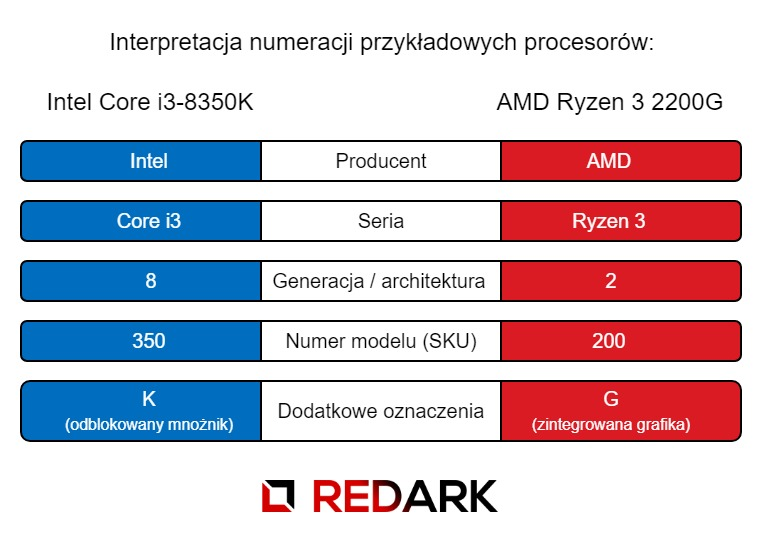

Procesor (CPU - Central Processing Unit) to najmniejszy, a zarazem jeden z najdroższych podzespołów w komputerze. Od jego parametrów zależy ogólna wydajność i moc obliczeniowa jednostki. Rynek procesorów przeznaczonych do komputerów osobistych jest obecnie zdominowany przez dwie firmy: Intel oraz AMD. Na początku przedstawię najważniejsze parametry, jakimi cechują się te układy, a następnie pokrótce omówię sprzedawane obecnie serie procesorów tych firm.

## Najważniejsze parametry

### Częstotliwość pracy

Jest to parametr definiujący ilość operacji, jakie procesor wykonuje w czasie jednej sekundy. Obecne modele bez problemu osiągają wartości kilku gigaherców (GHz), czyli kilku miliardów operacji na sekundę. Dodatkowo, niektóre procesory mogą posiadać tzw. tryb turbo polegający na chwilowym zwiększeniu tego taktowania. Dzieje się to w momencie dużego zapotrzebowania na moc obliczeniową. Niemniej jednak, większą uwagę należy zwrócić na częstotliwość podstawowej pracy, ponieważ praca w trybie turbo jest chwilowa i nie musi dotyczyć wszystkich rdzeni.

### Ilość rdzeni i wątków

Zaraz po częstotliwości to chyba najbardziej rozpoznawalny parametr procesorów. Ma on ścisły związek z budową układu oraz sposobem, w jaki przetwarza on dane.

**Rdzenie,** mówiąc krótko, są to niezależne, pełnoprawne procesory zamknięte we wspólnej obudowie. Taka organizacja jednostek obliczeniowych umożliwia łatwą i szybką komunikację między nimi oraz brak potrzeby stosowania kilku gniazd procesora.

**Wątek** jest to pojedynczy ciąg instrukcji wykonywanego programu. Normalne procesory posiadają ilość wątków równą ilości rdzeni, ponieważ każdy rdzeń może pracować nad innym zadaniem. Modele obsługujące tzw. wielowątkowość mają podwojoną liczbę wątków, ponieważ ich rdzenie potrafią pracować na dwóch jednocześnie. Ma to związek z przetwarzaniem potokowym oraz z faktem, że nie wszystkie elementy rdzenia są jednocześnie wykorzystywane.

Podsumowując, rdzenie są to fizyczne jednostki obliczeniowe, a wątki są wirtualnymi rdzeniami. Z tego powodu procesor posiadający 4 rdzenie i 4 wątki będzie lepszy niż procesor z 2 rdzeniami i 4 wątkami. Naturalnie nasuwa się myśl, że im więcej rdzeni, tym procesor jest wydajniejszy. Jest to prawdziwe twierdzenie, ale trzeba mieć na uwadze, że nie wszystkie aplikacje wykorzystują wiele rdzeni procesora. Jeśli programiści nie zaimplementują w niej wielozadaniowości to pomimo posiadania w komputerze 16 rdzenia aplikacja będzie pracować tylko na jednym z nich.

### Rozmiar pamięci cache

Oprócz pamięci operacyjnej RAM montowanej przez użytkownika na płycie głównej procesor potrzebuje swojego własnego magazynu danych. Jest to bardzo szybka i mała pamięć podręczna nazywana słowem "cache". Występuje ona w trzech poziomach oznaczanych skrótami L1, L2 i L3. Ostatnia z wymienionych jest największa i wspólna dla wszystkich rdzeni znajdujących się w procesorze. Jej rozmiar ma duży wpływ na wydajność całego układu, ale ze względu na inny proces technologiczny jest bardzo droga w produkcji. Rozmiar pamięci L3 waha się między kilkoma a kilkunastoma megabajtami. Naturalnie, im większa jest ta pamięć, tym lepiej.

<AdSense/>

### Układ graficzny

Procesor może posiadać w sobie zintegrowany układ odpowiadający za przetwarzanie i generowanie grafiki. W takim przypadku możliwe jest zrezygnowanie z zakupu osobnego podzespołu w postaci karty graficznej montowanej w gnieździe PCI Express. Oczywiście, takie układy nie są mocno wydajne, a ich obecność zwiększa koszt zakupu procesora. Ciężko jest tutaj porównać parametry tych układów. Do codziennych prac oraz mało wymagających gier wystarczą one w zupełności, natomiast osoby chcące grać w nowsze gry raczej nigdy się nimi nie zainteresują. Ogólnie, układy te można porównywać kierując się ich numeracją - im wyższy numer układu, tym bardziej jest on wydajny.

### Wersja BOX i OEM

W specyfikacji produktów dostępnych w sklepach internetowych można spotkać pozycję "wersja opakowania". Podawane są tam dwie wartości: **BOX** oraz **OEM**. Ta pierwsza ma postać kartonowego pudełka, w którym znajduje się procesor, krótka dokumentacja oraz standardowy, dostarczony przez producenta radiator z wentylatorem (często z nałożoną fabrycznie pastą termiczną). Natomiast wersja OEM jest to najczęściej sam "goły" procesor dostarczony w plastikowej wytłoczce. Dodatkowo mogą one posiadać skrócony okres gwarancji np. z 36 do 12 miesięcy.

<ImageDescription>Standardowe chłodzenie dołączane do procesorów Intel</ImageDescription>

Decyzja o tym, jakie chłodzenie zamontować procesorowi, należy do użytkownika. Jeśli chodzi o np. standardowe chłodzenie dołączane do procesorów Intela, części z użytkowników ono wystarcza (nawet podczas grania w gry), a część narzeka na głośną i mało wydają pracę. Ile osób, tyle opinii. Nic oczywiście nie stoi na przeszkodzie, żeby zakupić wersję BOX i osobny zestaw chłodzący. W takim przypadku należy jednak pamiętać o zakupie pasty termoprzewodzącej (o ile producent chłodzenia jej nie dołączył).

### Socket (gniazdo procesora)

Na koniec kluczowy parametr decydujący o tym, czy dany procesor będzie współpracować z resztą podzespołów. Mowa tutaj o układzie wyprowadzeń procesora, które muszą zgadzać się z tymi na płycie głównej. Obie firmy prowadzą własne serie podstawek i nie są one ze sobą w żaden sposób kompatybilne. Należy zakupić taką płytę główną, aby jej gniazdo umożliwiało montaż wybranego procesora.

<InfoBlock>Numer występujący w oznaczeniach gniazd procesorów Intel jest też liczbą styków znajdujących się na jego powierzchni. Dla przykładu: LGA1151 posiada 1151 styków.</InfoBlock>

## Pozostałe parametry

Teraz trochę mniej istotne parametry, na które należy zwrócić uwagę tylko w przypadku nietypowych konfiguracji.

### TDP

TDP, czyli Thermal Design Power jest to parametr informujący ile ciepła jest w stanie wydzielić nasz procesor w ciągu sekundy. Ma on duże znaczenie w przypadku doboru odpowiednio wydajnego, niestandardowego chłodzenia. Oczywiście im niższa wartość tego parametru, tym lepiej dla nas.

Niestety, sposoby pomiaru wartości tego parametru wyglądają inaczej u poszczególnych producentów. Niebiescy (Intel) podają tą wartość w warunkach standardowego obciążenia procesora kilkoma aplikacjami. Czerwony producent (AMD) jako wartość TDP podaje maksymalną ilość ciepła, jaką jest w stanie wytrzymać. Oczywiście osiągnięcie takiej wartości jest praktycznie niemożliwe.

AMD zaczął zauważać ten dysonans oraz to, że nie jest korzystny dla swoich produktów. Stąd czerwoni zaczęli stosować nowy parametr o skrócie ACP oznaczający uśrednioną moc procesora. Jest on znacznie bardziej zbliżony pomiarowi przeprowadzanemu przez Intela, ale nie identyczny. Dlatego też **nie należy porównywać wartości tych parametrów między procesorami różnych producentów!**

### Architektura

Zapewne podczas instalowania aplikacji zdarzyło się wam spotkać wersję przeznaczoną dla 32 lub 64-bitowego systemu operacyjnego. To samo tyczy się procesorów. Parametr ten podaje jaką ilością bitów jednocześnie operuje nasz procesor. **Obecnie wszystkie procesory posiadają architektury 64-bitowe**, ale starsze modele nadal mogą posiadać 32 bity. Na komputerach z takim procesorem nie można zainstalować 64-bitowego systemu operacyjnego ani uruchomić aplikacji napisanych z myślą o tej architekturze.

### Odblokowany mnożnik

Częstotliwość pracy płyty głównej jest kilkadziesiąt razy mniejsza od procesora. Aby móc pracować z większą prędkością, CPU musi posiadać tzw. mnożnik, który zwielokrotnia sygnał płynący z zegara płyty głównej. Standardowe modele posiadają fabrycznie zablokowany mnożnik i nie można go zmienić. Modele przygotowane do przetaktowywania posiadają odblokowany mnożnik, który może zostać zwiększony przez użytkownika. Sposób oznaczania takich modeli zostanie podany później.

<AdSense/>

### Litografia

Parametr kryjący się też pod nazwą "procesu technologicznego" oznacza rozmiar pojedynczego tranzystora (podstawowej jednostki budulcowej) znajdującego się w procesorze. Podawany jest w nanometrach, czyli w miliardowych częściach metra. W związku z rosnącą liczbą tranzystorów w procesorach ten parametr coraz bardziej maleje. Do cech istotnych dla użytkownika zaliczyć można zmniejszony pobór prądu oraz lepsze odprowadzanie ciepła.

<InfoBlock>Obecnie technologia zbliża się do granic możliwości miniaturyzacji. Obecny materiał produkcyjny, czyli kwarc już nie wystarcza i powoduje pojawianie się negatywnych zjawisk takich jak np. przesłuchy (czyli pojawianie się napięcia w sąsiednich ścieżkach sygnałowych) przy próbach obniżenia procesu technologicznego.</InfoBlock>

## Aktualny rynek procesorów

### Oznaczenia procesorów

Produkty obu producentów dzielą się na **serie** przeznaczone dla konkretnych użytkowników docelowych. Wewnątrz jednej serii mamy do czynienia z **generacjami** o różnych architekturach (budowach). Ich numer poznamy po pierwszej cyfrze zawartej w numerze modelu procesora. Reszta cyfr jest to indywidualny numer przyznawany każdemu modelowi. Zazwyczaj wyższy numer oznacza wyższą wydajność. Po cyfrach mogą pojawić się też dodatkowe litery oznaczające specjalne cechy danego modelu jak np. odblokowany mnożnik. Taka numeracja stosowana jest jedynie w przypadku aktualnie rozwijanych serii procesorów. W przypadku starszych serii, takich jak Intel Core 2 lub AMD FX, numeracja modeli wygląda zupełnie inaczej.

### Procesory Intel

Serie procesorów Intel:

- **i9** - najnowsza seria przeznaczona jedynie dla osób wymagających super wydajnego komputera,
- **i7** - poprzednia, najbardziej wydajna seria procesorów przeznaczonych dla graczy, streamerów i montażystów wideo,
- **i5** - seria wydajnych procesorów przeznaczonych dla graczy oraz osób wykonujących złożone operacje na komputerze,
- **i3** - seria przeznaczona dla mało wymagających gier i aplikacji,
- **Pentium** - procesory przeznaczone do domowego użytku, z naciskiem na operowanie multimediami takimi jak filmy i zdjęcia,
- **Celeron** - procesory pozwalające jedynie na podstawowe użytkowanie takie jak przeglądanie stron www, praca z dokumentami itp.,
- **Atom** - seria przeznaczona dla urządzeń mobilnych takich jak tablety i smartfony.

Specjalne oznaczenia:

- **H** - wydajny układ graficzny,
- **K** - odblokowany mnożnik (możliwość podkręcania),
- **M** - procesor dla urządzeń mobilnych
- **Q** - czterordzeniowy procesor do urządzeń mobilnych,
- **T** - modele o zwiększonej mocy obliczeniowej,
- **U** - procesor ultraniskonapięciowy,
- **Y** - procesor niskonapięciowy.

### Procesory AMD

Serie procesorów AMD:

- **Ryzen Threadripper** - seria superwydajnych procesorów kosztujących kilka tysięcy, które posiadają po kilkadziesiąt fizycznych rdzeni,
- **Ryzen 7** - rodzina wydajnych procesorów dla graczy, grafików i montażystów wideo,
- **Ryzen 5** - obecnie najpopularniejsza seria procesorów skierowana głównie u graczy,
- **Ryzen 3** - niedrogie procesory przeznaczone do codziennej pracy oraz mniej wymagających gier,
- **Athlon, Epyc, FX** - poprzednie serie procesorów producenta, ale zostały zepchnięte na drugi plan przez nową architekturę Ryzen.

Specjalne oznaczenia:

- **E** - procesor energooszczędny,
- **G** - zintegrowany układ graficzny,
- **U** - procesor dla urządzeń mobilnych,
- **X** - podwyższona wydajność.

## Podsumowanie

Najważniejsze aspekty i parametry podczas wyboru procesora:

<OkList>
- W przypadku wymiany procesora w komputerze, sprawdź jakie gniazdo posiada twoja płyta główna.
- Procesor musi też być kompatybilny z chipsetem płyty głównej. Sprawdź listę kompatybilnych procesorów oraz upewnij się, że nie jest wymagane żadne dodatkowe działanie jak np. aktualizacja BIOS-u.
- Zastanów się, czy potrzebujesz zintegrowanego układu graficznego. Jego obecność podniesie cenę procesora, ale pozwoli na zrezygnowanie z zewnętrznej karty graficznej (choć jej instalacja dalej będzie możliwa).
- Najlepszym porównaniem mocy obliczeniowej procesorów są benchmarki.
</OkList>

Moje rady:

<StarList>
- Kup procesor najnowszej generacji, na jaką pozwala Ci Twój budżet. Pamiętaj, że wybór najnowszych generacji CPU wiąże się też z zakupem droższych modeli płyt głównych oraz pamięci RAM.
- Jeśli cenisz sobie cichą pracę komputera zainwestuj w zewnętrzne chłodzenie z dużymi, wolnoobrotowymi wentylatorami.
- Wersje BOX procesorów są o wiele bardziej popularne w sklepach. Koszt takiej wersji jest zwykle większy od OEM-a o 40-50 złotych. W zamian za to oferuje standardowe chłodzenie z już nałożoną pastą. Dodatkowym plusem jest też znacznie dłuższa gwarancja.
- Wydajny procesor w urządzeniach mobilnych może znacząco skrócić ich czas pracy na baterii. Tutaj bardziej sprawdzą się energooszczędne modele o niskiej wartości TDP (urządzenie nie będzie się aż tak przegrzewać).
</StarList>
