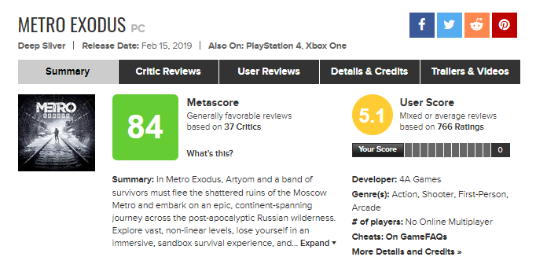
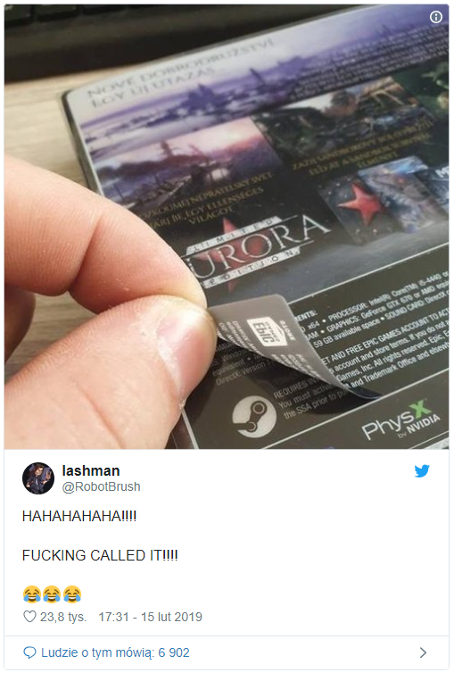

W ostatnim czasie w świecie gier komputerowych doszło do swego rodzaju rewolucji. Mowa tutaj o akcji masowego bojkotu najnowszej gry studia 4A Games, czyli Metro Exodus. Tym razem winna nie jest sama gra, ale fakt, że przez rok jest ona dostępna tylko i wyłącznie na nowej platformie dystrybucyjnej Epic Games Store, a nie na Steamie. Czy faktycznie jest to powód do hejtu? Czemu gracze tak bardzo kochają Steam? Postanowiłem zabrać w tej sprawie głos.

## Na czym polega wojna platform wydawniczych?

Czasy sprzedaży gier na płytach zaczynają przemijać. Dzisiejszy rynek idzie w stronę cyfrowej dystrybucji, która daje twórcom oraz graczom wiele więcej możliwości. Wówczas to właściciel platformy dystrybucyjnej dyktuje warunki, na jakich sprzedawana jest gra, a także ustala procent zysków ze sprzedaży, który trafia do twórców.

Największą platformą wydawniczą dla komputerów klasy PC jest Steam. Został on stworzony w 2003 roku przez firmę Valve i aktualnie posiada niemalże monopol w świecie dystrybucji cyfrowej. Efektem rośnięcia marży pobieranej przez giganta jest utworzenie przez wielu wydawców własnych platform, na których mogą oni powiększyć swoje zyski. Od tamtej pory rozpoczęła się żonglerka na wyłączności. Dla przykładu gry EA są obecne tylko na platformie Origin. Gry Ubisoftu pojawiają się zarówno na ich autorskiej platformie Uplay, a także na Steamie, choć i tak wymuszają uruchmienie Uplay'a.

Tak oto doszło do sytuacji, gdzie osoba chcąca skorzystać ze wszystkich dostępnych gier musi posiadać na komputerze kilka różnych aplikacji. Faktycznie powoduje to lekki chaos, ale czy coś poza tym? No właśnie nic, ale gracze PCMR jednak nie potrafią tego zrozumieć.

## Dlaczego gracze tak zażarcie bronią Steama?

Choć pochodzę jeszcze z pokolenia, które pamięta czasy tradycyjnej (fizycznej) dystrybucji gier w pełni rozumiem dlaczego jest ona wypierana. Nie rozumiem jednak tak wielkiego przywiązania graczy do Valve i Steama. Rozumiem, że ma ono swoje zalety, a wspomniana wcześniej wojna platform nie jest korzystna dla grania na PC. Niemniej jednak nie zmienia to faktu, że Steam nie jest bez skazy i stał się monopolistą tego rynku.

Monopol nigdy nie jest dobry, niezależnie od dziedziny, w jakiej się pojawi. Takim sztandarowym przykładem jest moim zdaniem firma Microsoft, czyli twórca najpopularniejszego systemu operacyjnego Windows. Fakt, że z jego produktu ciężko jest zrezygnować, a konkurencja nie posiada niczego, co mogłoby znacząco zagrozić ich pozycji, sprawił, że Microsoft przestał przejmować się odbiorcami. Ten sam proces zauważam w świecie konsol. Po tym, gdy stało się pewne, że konsola od Sony wygrała obecną generację tych urządzeń, firma pozwoliła sobie na gorsze (moim zdaniem) gry za darmo oraz podniesienie ceny abonamentu PS Plus. Czy Sony zrobiłoby to, gdyby Xbox deptał mu po piętach? NIE! Kto na tym cierpi? Oczywiście my, odbiorcy, ponieważ brak rywalizacji na rynku sprawia, że producenci mogą pozwolić sobie na podniesienie kosztów produktu.

Wracając do tematu, nie rozumiem, dlaczego gracze chcą dominacji Steama. Ta platforma dawno zatrzymała się w rozwoju i spoczęła na laurach. Czy gracze nie zauważają jaki wielki śmietnik tam się znajduje? Gdzie się podziały te genialne gry, dzięki którym Valve zdobyło taką przewagę?

## Co jest nie tak z Epic Games Store?

To jest bardzo ciekawe zjawisko. Epic Games, twórcy popularnego Fortnite'a jako pierwsi na dużą skalę postanowili zrezygnować ze Steama. Przenieśli oni swoją grę na osobną aplikację, która z czasem przekształciła się w pełnoprawną platformę wydawniczą.

Śmieszne jest to, że powodem hejtu tej platformy nie jest wyłącznie fakt powstania kolejnego programu potrzebnego do zainstalowania na komputerze w celu kupna gry, ale sama firma, która stworzyła platformę. Wiele osób wciąż nie może zrozumieć, dlaczego Fortnite zyskał tak dużą popularność, a prawda jest taka, że jest ona w pełni zasłużona.

## Kto jest winny tego zamieszania?

Gdy już wiemy, z czym mamy do czynienia, czas zastanowić się nad sensem całej tej krytyki. Wybuchła ona na przełomie stycznia i lutego, po opublikowaniu oświadczenia, w którym wydawca gry (Koch Media) poinformowało, że przez pierwszy rok gra dostanie wyłączność na platformę Epic Games Store. Duża część społeczność od razu chwyciła za broń, jaką jest system opinii i komentarzy. Zalali oni Internet falą krytyki, która nie była skierowana tylko i wyłączenie w stronę wydawcy, ale też w stronę niewinnych twórców gry.

<AdSense/>

Taki obrót spraw spowodował odzew jednego z deweloperów pracujących w 4A Games. Stwierdził on, że takie zachowanie PC-towych graczy sprawi, że następna część serii Metro ominie komputery osobiste i trafi tylko i wyłącznie na konsole. Nie trzeba było długo czekać na odpowiedź wydawcy gry:

<Quote source='Koch Media'>Ostatnia decyzja o przeniesieniu Metro Exodus ze Steam do Epic Game Store została podjęta tylko przez Koch Media / Deep Silver. Ostatni komentarz członka zespołu do spraw rozwoju gier 4A Games nie odzwierciedlają poglądów Deep Silver oraz 4A Games na temat przyszłości marki. Są one wyłącznie wyrazem zranienia i rozczarowania pasjonata, który wcześniej spotykał się tylko z życzliwymi reakcjami wobec swojej pracy, a teraz w wyniku decyzji biznesowej, znajdującej się poza jego kontrolą, zmieniły się w kontrowersyjne komentarze."</Quote>

Stąd wiemy, że decyzja o tym, na jakich urządzeniach oraz platformach dystrybucyjnych pojawi się gra, zależy wyłącznie od wydawcy. W tym przypadku twórcy odpowiedzialni są jedynie za stworzenie gry, która sama w sobie jest bardzo dobra, co pokazują opinie recenzentów.

<ImageDescription>Strona z oceną gry Metro Exodus na stronie Metacritic. Oceny recenzentów dobre, a użytkowników (niekoniecznie graczy) wahają się w okolicach 5/10, czyli bardzo mało</ImageDescription>

Winnym całej tej sytuacji jest wydawca, który zdecydował się (czasowo) odwrócić od Steama. Nie jest to dziwny ruch, ponieważ wydawca, jak każda inna firma, dąży do ciągłego zwiększania swoich zysków. Oczywiście, gracze też mają słuszność w swoim działaniu, zwłaszcza że wydawca poinformował o zmianie platformy w ostatniej chwili, tuż przed premierą gry. To sprawiło, że gracze poczuli się oszukani, a oliwy do ognia dolały specjalne naklejki na pudełkach zakrywające znaczek Steama:

<ImageDescription>Zmiana platformy została przeprowadzona tak szybko, że logo Steam-a zostało zakryte naklejką, źródło: twitter.com (@RobotBrush)</ImageDescription>

## Kto najbardziej ucierpi na tym wszystkim?

Jeśli myślicie, że wydawca, to jesteście w wielkim błędzie. Wiem, że celem tej akcji jest pokazanie niezadowolenia z przyjętej polityki, ale to do niczego nie prowadzi. Jedynym poszkodowanym będzie tutaj 4A Games.

Wydawca nie prowadzi sprzedaży tylko jednej gry. Niższa sprzedaż, czy złe opinie nie odbiją się na nim aż tak mocno, jak na twórcach. To oni często dopinają budżet na ostatni guzik z przekonaniem, że zarobione ze sprzedaży pieniądze pozwolą im nie popaść w bankructwo. Powstały hejt może pogrzebać studio wraz z pracownikami oraz całą serię Metro. Czy to było celem tej akcji? Chyba nie.

Podsumowując, nie rozumiem tego, co aktualnie dzieje się na rynku gier komputerowych. Mam nadzieje, że sytuacja się uspokoi, a przede wszystkim, że nie ucierpi na tym niewinna, dobrze zrobiona gra i jej twórcy.
