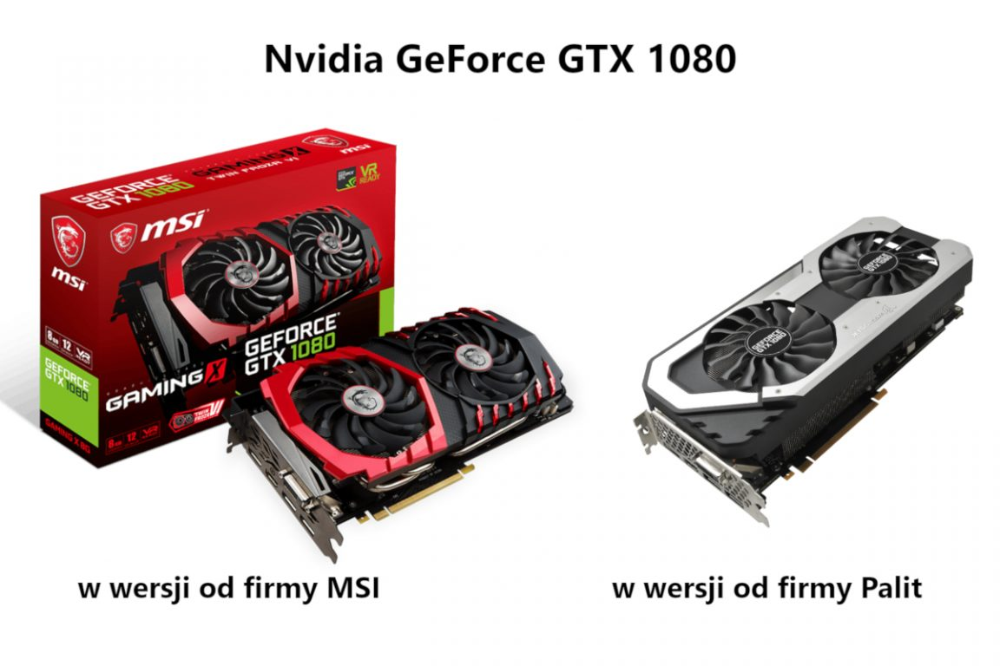
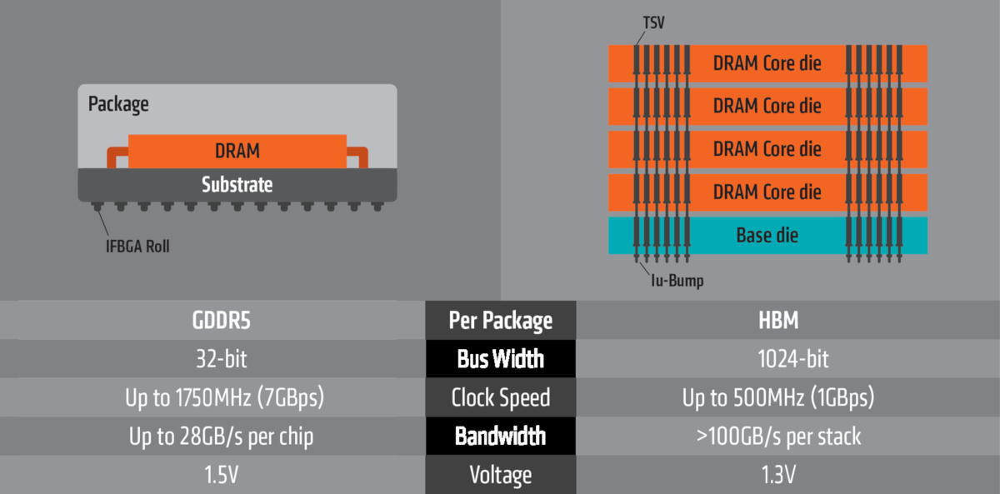
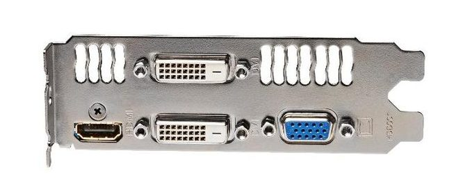
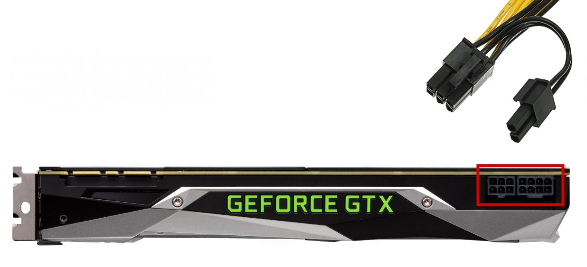
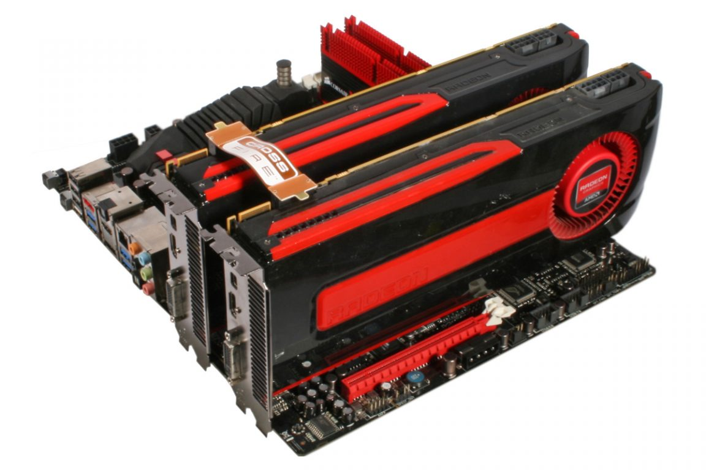

Karta graficzna (GPU - Graphics Processing Unit) jest podzespołem cenionym głównie przez graczy oraz osoby pracujące przy obróbce multimediów. Jednakże jej obecność nie jest obowiązkowa, a to dzięki zintegrowanym układom graficznym, które bezpośrednio znajdują się w wielu [procesorach](/procesory).

## Parametry kart graficznych

### Producent chipsetu a producent karty graficznej

Rynek kart graficznych jest obecnie zdominowany przez dwie firmy: Nvidia oraz AMD. Jednak w najbliższej przyszłości może się to zmienić, ponieważ producent procesorów Intel chce powiększyć swoją działalność również na GPU (na wzór swojego konkurenta AMD).

Dlaczego jednak nazw tych firm nie znajdziemy na pudełkach kart? Ponieważ są oni jedynie producentami chipsetów, czyli układów graficznych. Projektowaniem pozostałego osprzętu zajmują się producenci tacy jak np. Gigabyte lub MSI i to oni decydują o takich parametrach jak ilość pamięci operacyjnej czy system chłodzenia układu.

<ImageDescription>Karta Nvidia GeForce GTX 1080. Porównanie wersji od firmy MSI i Palit</ImageDescription>

Na nazwę chipsetu karty graficznej składa się nazwa serii oraz numer modelu układu graficznego. W przypadku kart Nvidia mamy do czynienia z serią GeForce z trzema oznaczeniami: **GT**, **GTX** oraz **RTX**. Pierwszy rodzaj skierowany jest do małowymagających użytkowników, a drugi do bardziej wymagających. Do trzeciej grupy należą najnowsze karty graficzne wspierające technologie raytracingu, czyli dynamicznego generowania oświetlenia i odblasków. Firma AMD natomiast rozwija serię kart **Radeon** dla małowymagających użytkowników oraz serię **Radeon RX** przeznaczoną dla graczy i montażystów.

Tak samo, jak w przypadku procesorów, podstawowe porównanie wydajności układów graficznych można przeprowadzić na podstawie ich numeru, ale tylko w obrębie jednej serii. Wydajność tego podzespołu najlepiej porównywać za pomocą dostępnych w Internecie benchmarków, ponieważ dużą rolę odgrywa tutaj osprzęt, który omówię za chwilę.

### Taktowanie rdzenia

Rdzeń, czyli układ graficzny pracuje z określoną częstotliwością. Naturalnie im jest ona wyższa, tym karta działa wydajniej. Droższe modele mogą posiadać także częstotliwość trybu "turbo", który aktywowany jest podczas dużego zapotrzebowania na moc obliczeniową.

### Pamięć operacyjna

Dane przetwarzane przez procesor zostają zapisywane w [pamięci RAM](/pamieci-ram) zainstalowanej na płycie głównej. Karta graficzna także potrzebuje takiej pamięci, ale wbudowanej w powierzchnię jej płytki drukowanej. Do określających ją parametrów można zaliczyć:

- Pojemność
- Typ pamięci
- Szerokość magistrali
- Taktowanie magistrali

Pierwszy parametr podawany jest w gigabajtach (GB), a jego wielkość definiuje, nad jaką ilością danych może operować karta. Modele, które mają "uciągnąć" wymagające gry lub pracę na wielu monitorach muszą posiadać większą pamięć. Minimalna ilość pamięci zawsze podawana jest w wymaganiach sprzętowych gier i aplikacji komputerowych. Typ pamięci oznaczany jest skrótem **GDDR**. Jest to specjalna odmiana pamięci DDR zoptymalizowana pod kątem wykonywania operacji graficznych. Im wyższy numer generacji pamięci, tym lepiej. Dodatkowo 5. generacja, czyli GDDR5 może występować także z literą X na końcu, co oznacza podwyższoną przepustowość układu.

Szerokość oraz taktowani magistrali ma bezpośredni wpływ na przepustowość całego banku pamięci. Doskonale widać to na przykładzie pamięci HBM. Jest to specjalny typ pamięci opracowany przez AMD, który polega na układaniu modułów pamięci w stosy (jeden na drugim). Moduły te posiadają bardzo niskie taktowanie, ale dzięki bardzo szerokim magistralom osiągają zawrotne prędkości, które biją na głowę moduły GDDR (porównanie poniżej).

<ImageDescription>Porównanie parametrów pamięci GDDR5 i HBM</ImageDescription>

### Chłodzenie

Największą różnicą pomiędzy kartami poszczególnych producentów, jest widoczny na nich [system chłodzenia](/chlodzenie-komputera). Może on przybierać różne formy:

- **Aktywne** - najpopularniejszy sposób chłodzenia. Polega on na odprowadzaniu ciepła z radiatora za pomocą dużych wentylatorów lub jednego małego działającego na zasadzie turbiny.
- **Pasywne** - chłodzenie odbywa się tutaj jedynie za pomocą radiatora. Takie chłodzenie jest bezgłośne, ale i też mało wydajne. Dlatego też znajduje zastosowanie jedynie w tanich, słabych modelach.
- **Półpasywne** - jest to wariacja dwóch powyższych typów. Karta z chłodzeniem tego typu posiada zestaw wentylatorów oraz rozbudowany radiator. Wentylatory w tej konfiguracji uruchamiają się jedynie wtedy, gdy temperatura przekroczy określoną wartość (zazwyczaj 60 stopni).

<ImageDescription>Karta Gigabyte AORUS GeForce GTX 1080Ti X11G z chłodzeniem aktywnym wyposażonym w 3 wentylatory, źródło: gigabyte.com</ImageDescription>

<InfoBlock>Istnieją także modele kart graficznych wyposażonych w chłodzenie wodne, ale jest to rzadkie i drogie rozwiązanie.</InfoBlock>

<AdSense/>

### Wspierane technologie

Na koniec tego rozdziału należy jeszcze wspomnieć o technologi **OpenGL** oraz **DirectX**. Są to dwie konkurujące ze sobą zestawy bibliotek służących do generowania obrazu 2D i 3D. Specyfikacja techniczna karty zawsze podaje, z jaką najnowszą biblioteką może współpracować ten model. Brak wsparcia najnowszych technologii może skutkować zablokowaniem możliwości uruchomienia najnowszych gier i aplikacji graficznych. Stąd im wyższy numer znajduje się przy nazwach tych technologi, tym lepiej.

## Kompatybilność z resztą podzespołów

Tak jak każdy podzespół w komputerze, tak samo karta graficzna musi spełniać pewne kryteria, by mogła zostać użyta do budowy jednostki centralnej. Tyczy się to przede wszystkim wysokowydajnych modeli, które mają dodatkowe wymagania dla [monitora](/monitory-czesc-1), [obudowy](/obudowy-czesc-1) i [zasilacza](/zasilacze).

### Interfejs PCI-Express

Karta graficzna wymaga bezpośredniego połączenia z procesorem za pomocą gniazda PCI-Express. Najczęściej wykorzystywana jest wersja x16, która na płycie głównej zazwyczaj znajduje się tuż pod gniazdem procesora. Więcej informacji na temat złącz PCI, można znaleźć w [artykule poświęconym płytom głównym](/plyty-glowne-czesc-2).

### Złącza monitorów

Każda karta graficzna, na widocznym z tyłu obudowy śledziu, posiada zestaw gniazd umożliwiających przekazywanie wygenerowanego przez nią obrazu do monitora (wraz z opcjonalnym dźwiękiem). Do najczęściej stosowanych złącz należą:

- **D-SUB (potocznie VGA)** - niebieskie gniazdo przekazujące analogowo obraz. Jest to stare złącze powoli wypierane przez cyfrową transmisję danych, która jest odporna na zakłócenia elektromagnetyczne.
- **DVI** - cyfrowo/analogowe złącze wideo. Występuje w wielu wersjach różniących się tym, jaki typ sygnału może przesyłać. DVI-D tylko cyfrowy, DVI-A tylko analogowy, a DVI-I cyfrowy oraz analogowy.
- **HDMI** oraz **DisplayPort** - cyfrowe interfejsy umożliwiające przesyłanie wysokiej jakości obrazu i dźwięku. Obecnie dominujące na rynku.

<ImageDescription>Tył karty Gigabyte GT640. Model ten posiada złącze D-SUB, HDMI oraz 2x DVI</ImageDescription>

Złącza karty graficznej powinny umożliwiać podłączenie wszystkich monitorów na naszym stanowisku. Ważną cechą tych gniazd są też parametry obrazu, jakie przesyłają. Dla przykładu, niektóre potężne karty graficzne umożliwiają wygenerowanie 144 klatek na sekundę, ale ich przesył może być możliwy tylko przez DisplayPort, a przez HDMI już nie. Producenci niechętnie podają te informacje, ale **osoby zainteresowane wysokim klatkażem powinny zwrócić na to uwagę**.

<WarningBlock>Zakup drogiej karty graficznej do taniego monitora wyposażonego tylko w złącze D-SUB to lekka profanacja. Takie karty wyposażone są już jedynie w cyfrowe interfejsy, które uniemożliwiają bezpośrednie podłączenie takich ekranów. Na rynku dostępne są konwertery cyfrowo-analogowe, ale nie zawsze chcą one współpracować, a w dodatku przesyłają jedynie obraz o bardzo podstawowych parametrach.</WarningBlock>

### Wymiary karty graficznej

Ten parametr może spędzać sen z powiek każdej osobie kupującej duży, wydajny model lub posiadającej małą [obudowę](/obudowy-czesc-1) typu Mini Tower, Cube czy Slim. Głównym problemem jest długość podzespołu, który może zawadzić o jakiś element obudowy lub przysłonić ważne gniazdo na płycie głównej. By temu zaradzić, należy sprawdzić **podawaną przez producenta obudowy maksymalną długość karty graficznej**, jaką jest w stanie pomieścić.

Jeśli chodzi o wysokość karty, sprawa jest prosta. Występują one w wersjach zajmujących w obudowie jeden lub dwa sloty kart rozszerzeń. Szerokość podzespołu jest standardowa, choć można spotkać tzw. modele **LOW PROFILE**. Są one węższe od normalnych modeli (8 cm kontra 12 cm) oraz przeznaczone są do obudów typu Slim i Desktop.

<ImageDescription>Karta Evga GT730 w wersji low profile, źródło: graphicscardhub.com</ImageDescription>

### Dodatkowe zasilanie

Niektóre modele kart graficznych do swojego poprawnego działania wymagają dodatkowego zasilania pobieranego bezpośrednio z [zasilacza](/zasilacze) (a nie za pośrednictwem płyty głównej). Gniazda zasilania takiej karty najczęściej znajdują się w pobliżu jej narożnika. Ich niepodłączenie może skutkować ograniczoną mocą urządzenia lub całkowitym brakiem obrazu.

Zasilanie dostarczane jest do podzespołu za pomocą 6 lub 8 pinowych kabli PCI-E. Przed zakupem takiej karty graficznej należy sprawdzić, czy nasz [zasilacz](/zasilacze) posiada odpowiednie kable. Mogą to być też uniwersalne wtyczki 6+2 widoczne na zdjęciu poniżej.

<ImageDescription>Karta graficzna GeForce GTX1080 Ti posiada jedno gniazdo 6-pinowe oraz drugie 8-pinowe</ImageDescription>

### Pobór prądu

Tak jak wspominałem w poprzednim podrozdziale, wydajne karty graficzne posiadają zwiększone zapotrzebowanie na energię elektryczną. Zasilacz musi sprostać takiemu poborowi mocy przez kartę oraz resztę podzespołów komputera. Aby obliczyć potrzebną moc zasilacza, należy skorzystać z jednego z wielu dostępnych w Internecie [kalkulatorów mocy](https://www.enermax.outervision.com/), które na podstawie wprowadzonych przez nas modeli podzespołów, oszacują minimalną moc zasilacza.

<AdSense/>

## Wysoka wydajność w grach

W tym rozdziale chciałbym omówić parę aspektów, które przydają się podczas budowy wydajnych jednostek do gier i innych wymagających aplikacji.

### Łączenie kilku kart graficznych

Droższe modele płyt głównych potrafią obsłużyć kilka kart graficznych naraz. Najczęściej odbywa się to poprzez obliczanie parzystych linii obrazu przez jedną kartę i nieparzystych przez drugą. Oprócz płyty głównej same karty graficzne muszą umożliwiać taki zabieg poprzez wsparcie technologii **SLI** (dla kart Nvidia) lub **CrossFire** (dla kart AMD). Takie karty posiadają na swoim grzbiecie dodatkowe złącze służące do montażu tzw. mostków, czyli małych taśm lub płytek drukowanych, których zadaniem jest bezpośrednie połączenie współpracujących ze sobą kart.

<ImageDescription>Dwie karty AMD Radeon złączone mostkiem CrossFire, źródło: outletpc.com</ImageDescription>

### Synchronizacja odświeżania obrazu monitora

Karty graficzne nie zawsze generują stałą liczbę klatek na sekundę. Bardziej złożone obliczenia 3D lub zwiększona liczba obiektów (np. drzew w lesie) może doprowadzić do znacznych wahań w pracy tego podzespołu. Ciągłe zmiany ilości generowanych klatek przy stałym odświeżaniu ekranu powoduje negatywne zjawisko "rozrywania obrazu".

<ImageDescription>Zjawisko rozrywania obrazu, źródło: wikipedia.org</ImageDescription>

Aby przeciwdziałać temu zjawisku, gry posiadają opcję tzw. **synchronizacji pionowej (V-Sync)**. Polega ona na dostosowywaniu szybkości pracy karty graficznej do szybkości odświeżania zawartości ekranu [monitora](/monitory-czesc-1). Niestety nie jest tu rozwiązanie idealnie, ponieważ moc karty jest ograniczana przez monitor, a spadki klatek poniżej częstotliwości odświeżania monitora skutkują sztucznemu zmniejszeniu FPS-ów np. z 60 do 30.

Rozwiązaniem wad V-Sync'a są technologie oferowane przez obydwu producentów kart. Nvidia oferuję **G-Sync**, a AMD **FreeSync**. Obydwie technologie działają na podobnej zasadzie oraz wymagają specjalnych monitorów obsługujących dane rozwiązanie. Tutaj w przeciwieństwie do standardowej synchronizacji pionowej to monitor podporządkowuje się szybkości karty graficznej, a nie na odwrót. W kwestii kupna kart graficznej ważny jest jeden aspekt: technologia G-Sync jest płatna, co sprawia, że wspierające ją monitory są znacznie droższe.

<InfoBlock>Niedawno firma Nvidia ogłosiła, że jej technologia G-Sync będzie też współpracować z niektórymi monitorami wspierającymi FreeSync. Pełna lista wspieranych monitorów znajduje się na stronie producenta.</InfoBlock>

### Oznaczenie OC

Niektóre modele kart graficznych w swojej nazwie mogą posiadać oznaczenie literowe OC. Są to modele o podkręconych przez producenta parametrach pracy. Takie karty charakteryzują się zwiększoną, w porównaniu ze zwykłymi odpowiednikami, wydajnością oraz umożliwiają własną "zabawę" częstotliwościami i napięciami pracy.

## Podsumowanie

Najważniejsze aspekty i parametry podczas wyboru karty graficznej:

<OkList>
- Sprawdź jakich złączy potrzebujesz do podłączenia swoich monitorów.
- Sprawdź, czy karta graficzna zmieści się do obudowy komputera oraz, czy zasilacz ma potrzebne wtyczki oraz wystarczającą moc znamionową.
- Najlepszym porównaniem mocy obliczeniowej kart graficznych są benchmarki.
</OkList>

Moje rady:

<StarList>
- Najcichszą, a zarazem najwydajniejszą metodą chłodzenia karty graficznej jest system półpasywny. Jeśli natomiast kupujesz kartę z chłodzeniem aktywnym, zadbaj, aby miała ona wentylatory o jak największej średnicy.
- Karta graficzna wymaga dobrego przepływu powietrza. Jeśli możesz, nie instaluj kolejnej karty rozszerzeń zaraz pod wentylatorami karty graficznej, a zrób jedno miejsce przerwy.
- Kupowanie wydajnej karty graficznej do słabej jakości monitora mija się z celem. Jeśli nadal używasz starego, analogowego kabla D-SUB przejdź jak najszybciej na cyfrowy interfejs.
</StarList>

## Bonus

Firma ZOTAC udostępniła jakiś czas temu film pokazujący proces wytwarzania karty graficznej napędzanej układem RTX 2070. Materiał dostępny jest poniżej:

<YouTube id='BIi36PvZojE' title='produkcja kart graficznych'></YouTube>
