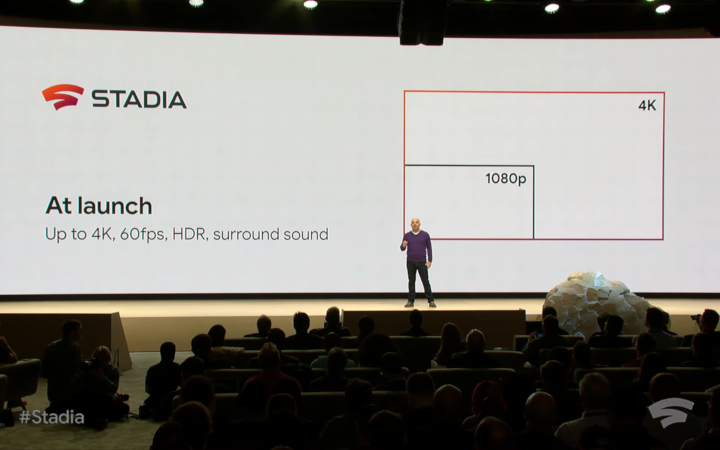
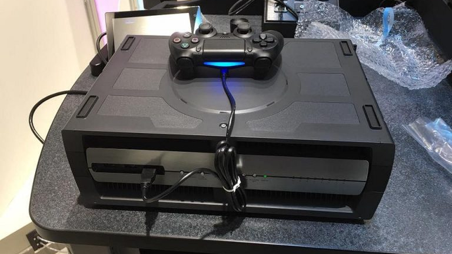
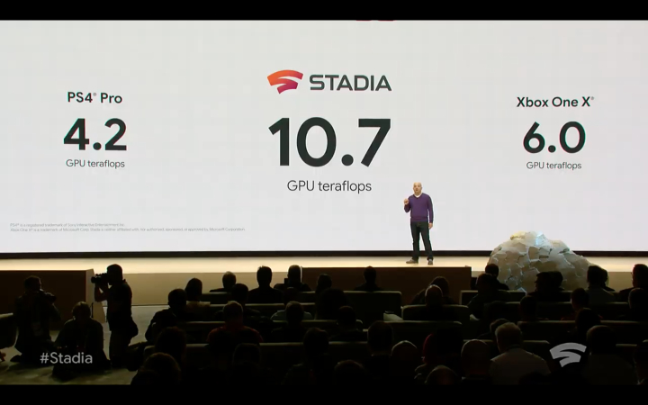
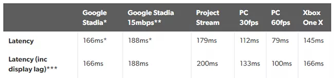

Oczy całego świata IT przedwczoraj były skierowane na konferencję zorganizowaną przez Google, gdzie gigant przedstawił swoją najnowszą usługę o nazwie Stadia. Jest to platforma do streamingu gier w czasie rzeczywistym, a jej założenia oraz płynące z tego korzyści są bardzo interesujące. Postaram się omówić wszystkie aspekty tej technologii oraz dodać co nieco od siebie.

## Granie na każdym sprzęcie

Głównym celem całego przedsięwzięcia streamingu gier jest **możliwość uruchomienia gier komputerowych na każdym urządzeniu** wyposażonym w ekran i dostęp do Internetu. W takim przypadku złożone obliczenia nie są wykonywane na urządzeniu klienta, a na zdalnym, superkomputerze znajdującym się w serwerowni. W efekcie **użytkownik nie musi posiadać wydajnej jednostki za kilka tysięcy**, a wystarczy jedynie standardowy laptop, a nawet smart TV.

<ImageDescription>4K 60fps teraz, a w przyszłości 8K 120fps. Czy to jest realne?</ImageDescription>

**Parametry graficzne nie będą zależne od posiadanego przez gracza sprzętu**. Google oferuje rozdzielczość FullHD oraz 4K przy 60 klatkach na sekundę. Dodatkowo obiecuje, że w przyszłości usługa ta umożliwi granie w rozdzielczości 8K przy 120 klatkach na sekundę.

## Obliczenia w chmurze

Wydawanie urządzeń elektronicznych to zawsze balans między wydajnością a ceną produkcji. Rozwój technologiczny pozwala obecnie tworzyć super wydajne komputery, tylko że ich koszt sięga kilkunastu tysięcy złotych, co nie służy masowej sprzedaży urządzenia. Widać to na przykładzie konsol do gier i ich odpowiednikach w wersjach deweloperskich (tzw. dev kitów). Konsole konsumenckie są to okrojone wersje urządzeń przeznaczonych dla twórców oprogramowania. Specjalnie wykonywane są ze słabszych podzespołów tak, by ich cena umożliwiała zakup typowemu Kowalskiemu.

<ImageDescription>Wersja deweloperska konsoli PlayStation 4, źródło: psu.com</ImageDescription>

Z tą wiedzą można zauważyć już kolejną zaletę streamingu gier. Zamiast masowej produkcji małych i przystępnych cenowo urządzeń można postawić superwydajny serwer przewyższający je pod każdym aspektem. Dodatkowo scentralizowane prowadzenie obliczeń można podzielić na kilka użytkowników i skrócić tym samym wykonywanie wielu operacji. Sama zmiana sprzętu także będzie prostsza. Modernizacja serwera wpłynie na wydajność gier wszystkich graczy, którzy nie będą już zmuszeni do kupowania kolejnej wersji konsoli lub modelu komputera o podwyższonej mocy.

<ImageDescription>Porównanie mocy obliczeniowej Google Stadia z konsolami od Sony i Microsoftu</ImageDescription>

Sam Google chwali się tym aspektem na prezentacji, porównując moc obliczeniową usługi Stadia do najnowszych konsol. Urządzenie Sony z 2013 roku posiada 4,2 teraflopa, a o 4 lata młodszy Xbox One X posiada 6 teraflopów. **Google za to deklaruje moc 10,7 teraflopów**. Jest to zasługa nie tylko postępu technologicznego, ale także braku ograniczeń co do ceny i rozmiarów urządzenia.

## Granie multiplayer

Skoro granie w trybie multiplayer wymaga połączenia z serwerem, to co się stanie, gdy serwer stanie się naszą grą? Tutaj Google Stadia możne przynieść wiele ciekawych rozwiązań. Przeniesienie obliczeń związanych z grą bezpośrednio do serwera kontrolującego rozgrywkę znacznie usprawni ruch sieciowy.

Gra multiplayer w określonych odstępach czasu łączy się z serwerem i pobiera z niego informacje o położeniu wszystkich graczy. Gdy jeden z graczy odda strzał w przeciwnika, gra musi zweryfikować czy przeciwnik faktycznie był w tym miejscu w momencie naciśnięciu spustu. Gdy odpowiedź serwera jest pozytywna, trafienie zostaje zaliczone. Ruch graczy w czasie między pobieraniami tych informacji jest symulowany, by ukryć niedoskonałość tego rozwiązania. Uruchomienie gry na centralnym serwerze zniwelowałoby ten problem prawie do zera. **Serwer mógłby dzięki temu widzieć pozycję graczy na bieżąco**, a komputer klienta przestać bawić się w "przewidywanie przyszłości". Kolejną zaletą takiego rozwiązania byłaby **możliwość tworzenia wirtualnych światów o większej liczbie graczy naraz**. Jest to szczególnie ważne w przypadku popularnego ostatnio trybu Battle Royale.

<AdSense/>

## Koniec z oszustwami

Kolejną zaletą, która z pewnością ucieszy wielu graczy, jest **zablokowanie możliwości oszukiwania w trybach multiplayer**. Dotychczas gracz dostawał w swoje ręce pełny kod źródłowy gry. Jego modyfikacja pozwalała operować danymi otrzymywanymi z serwera i odblokować takie możliwości jak widzenie przez ściany czy automatyczne celowanie we wrogów. Stadia przesyła do gracza jedynie obraz i nic więcej. Użytkownik dostaje gotowy produkt, którego nie może zmodyfikować. Oczywiście nadal istnieje możliwość skorzystania ze zmodyfikowanych kontrolerów, myszek i klawiatur, ale to i tak duża poprawa w walce z oszustami. Streaming usług dodatkowo pozwoli na **wyeliminowanie piractwa oraz owianych złą sławą zabezpieczeń antypirackich, takich jak np. Denuvo**. Ten problem częściowo rozwiązało zastosowanie dystrybucji cyfrowej przez platformy takie jak Steam czy Origin, ale nadal umożliwiają one pobieranie i modyfikowanie kodu gry.

## Wady strumieniowania rozgrywki

Jednak projekt Stadia nie posiada wyłącznie zalet. Razem z wymienionymi powyżej plusami strumieniowania idzie też szereg problemów, które jeśli nie zostaną rozwiązane, mogą przesądzić o szybkiej porażce usługi.

Największą barierą jest łącze internetowe. Do standardowego grania po sieci nie było potrzebne szybkie, a stabilne połączenie z serwerem. Streamowanie gier na żywo potrzebuje obu tych aspektów. Szybkości do pokazywania na bieżąco obrazu z gry, a także stabilności do przekazywania danych z kontrolera. Problemy z prędkością spowodują opóźnienia i sztuczne obniżanie rozdzielczości, a problemy ze stabilnym i sprawnym przekazywaniem informacji spowodują opóźnienia na kontrolerze.

<ImageDescription>Wartości opóźnień podawane przez Google, jednak teoria teorią, a jak będzie w praktyce to zobaczymy...</ImageDescription>

To drugie jest szczególnie niebezpieczne i może doprowadzić do niegrywalności. Każdy, kto grał w gry sieciowe, zna ten moment, kiedy postać na ekranie wykonuje nasze ruchy np. dopiero po sekundzie. Jest to oczywiście spowodowane dużą odległością od serwera oraz zatorami w transmisji danych. W przypadku Stadii ten problem może być znacznie bardziej odczuwalny i dotyczyć nawet gier singleplayer.

Google podał wstępnie minimalne wymagania. Do grania w 1080p przy 60 klatkach potrzebne będzie łącze 25 Mbps, a w przypadku obrazu 4K wymaganie to wzrośnie jedynie do 30 Mbps. Należy zaznaczyć, że są to wartości minimalne i wiele zależy też od ustawionej wartości bitrate'u. Wartość tego parametru definiuje jak duża ilość zer i jedynek jest używana do zapisu jednej sekundy filmu. Jeśli parametr ten będzie za niski, przy dynamicznych scenach może dojść do zjawiska rozmazywania obrazu. Efekt ten mogą dobrze kojarzyć osoby korzystające z platformy Twitch.

## Podsumowanie

Ciężko nie nazwać Google Stadia rewolucją w świecie gier. Wywraca ona do góry nogami pojęcie operowania cyfrową dystrybucją. Jednak uważam, że jest to przyszłość gier i nie da się już od tego uciec. Głównym problemem wprowadzenia tej technologii może okazać się właśnie transfer dużych danych przez Internet. Nie każdy w Polsce (jak i poza nią) ma dostęp do szybkiego i stabilnego łącza. Dodatkowym problemem stają się grupy społeczne próbujące zahamować rozwój infrastruktury Polski, szykanując wprowadzanie łączności 5G. Przepustowość telekomunikacji w naszym kraju szybko się wyczerpuje i nie możemy pozwolić sobie na odstawanie od reszty świata. Niemniej jednak możliwość zagrania w najnowsze tytuły bez posiadania drogiego sprzętu jest bardzo kusząca.

Ja sam będę bacznie śledził rozwój tej technologi oraz to, jak Google poradzi sobie ze zwalczaniem opóźnień w przesyle danych. Osobiście jestem zwolennikiem tradycyjnej dystrybucji, ale zalety Stadii mówią same za siebie i wiem, że cyfrowej dystrybucji nie da się już zatrzymać. Na zakończenie muszę jeszcze dodać, że Google Stadia nie jest jeszcze dostępna na terenie Polski, ale ten fakt mnie nie dziwi. Na [asystenta głosowego](/testowalem-google-assistant-po-polsku) również kazano nam trochę poczekać.

A jakie jest wasze zdanie na temat Google Stadia? Czy skorzystacie z niej, gdy będzie to możliwe? Dajcie znać w komentarzach.
