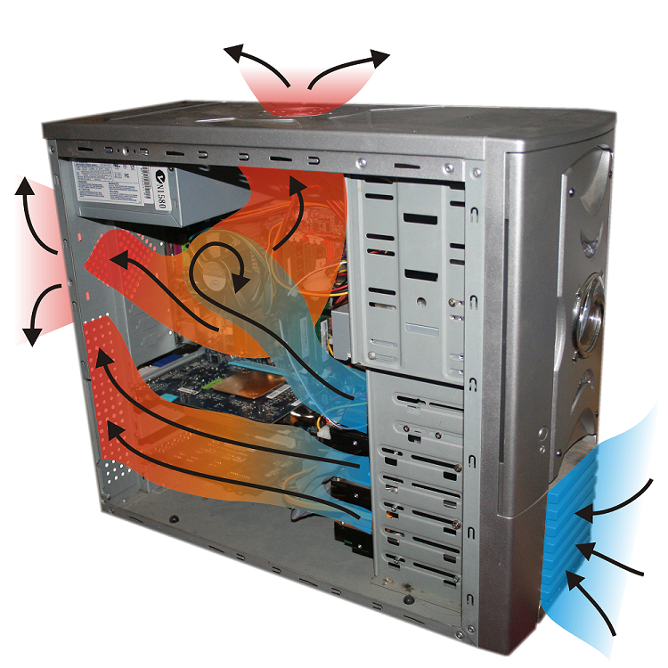
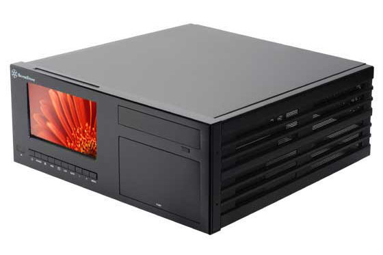
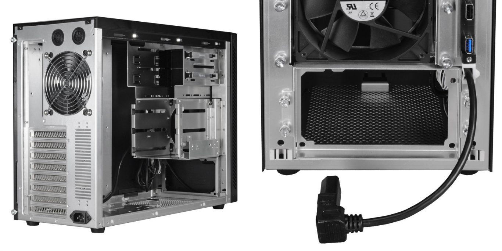
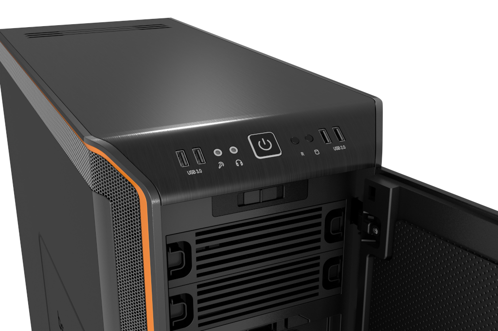
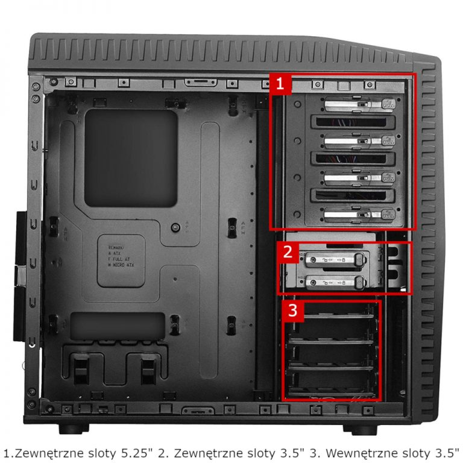
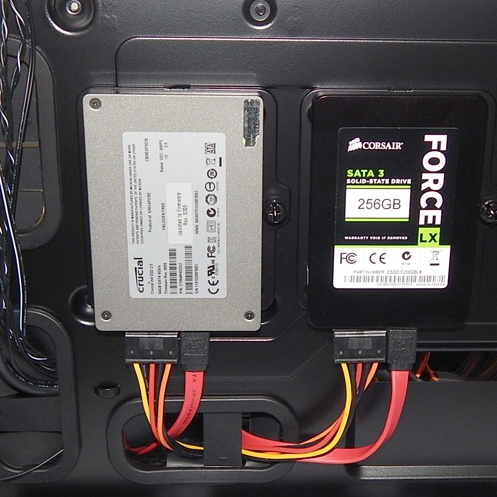
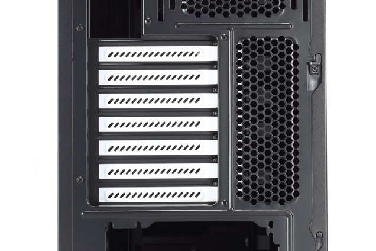

Każdy komputer potrzebuje obudowy. Przyjmują one przeróżne kształty i rozmiary, tak by dopasować się do potrzeb użytkownika. Na rynku można też spotkać nietypowe modele tworzone przez majsterkowiczów. Temat wyboru obudów jest na tyle istotny, że podzieliłem ten materiał na dwie części.

## Zadania obudowy komputera

Przed omówieniem wszystkich parametrów obudowy komputera należy najpierw dowiedzieć się, za jakie zadania jest odpowiedzialna. Ich poznanie tłumaczy też, dlaczego nie warto oszczędzać na tym zakupie i nie wybierać najtańszego modelu.

### Ochrona oraz spójna organizacja podzespołów

Części elektroniczne są małe, a przez to bardzo łatwo jest je uszkodzić. Głównym zadaniem obudowy komputera jest umożliwienie łatwego montażu podstawowych podzespołów oraz ich ochrona przed fizycznym uszkodzeniem. Tyczy się to też ochrony przed przypadkowym porażeniem prądem elektrycznym w przypadku przebicia w zasilaczu komputerowym.

### Prawidłowa wentylacja podzespołów

Komputer podczas swojej pracy wydziela duże ilości ciepła. Zadaniem obudowy jest prawidłowe ukierunkowanie przepływu powietrza tak, aby najefektywniej schładzało ono wszystkie podzespoły jednostki. Tyczy się to zarówno naturalnej (unoszenie się ciepłego powietrza ku górze), jak i wymuszonej cyrkulacji powietrza (wentylatory).

<ImageDescription>Przepływ powietrza w obudowie komputera, źródło: extremetech.com</ImageDescription>

### Organizacja okablowania

Podzespoły muszą być ze sobą połączone za pomocą kabli. Ich znacząca ilość może utrudnić przepływ powietrza, a co za tym idzie powodować przegrzewanie się urządzenia. Obudowa musi umożliwiać dobre zgrupowanie kabli tak, by zajmowały one jak najmniej miejsca i nie zasłaniały wentylatorów chłodzących komputer.

### Łatwa rozbudowa jednostki

Tyczy się to zarówno elementów wewnętrznych, jak i tych dostępnych na powierzchni obudowy. Chodzi tutaj o możliwość dołożenia kolejnej karty rozszerzeń czy nowych portów z przodu jednostki centralnej.

### Redukcja hałasu

Chłodzenie za pomocą wentylatorów, tak samo jak pracujący dysk talerzowy, generuje niepożądany hałas. Zadaniem obudowy jest pochłanianie tych dźwięków, by nie obniżały one komfortu pracy przy komputerze.

### Wygląd i estetyka

Ostatnim, aczkolwiek bardzo ważnym zadaniem obudowy jest prezentacja komputera. Obudowa jest jedynym elementem jednostki centralnej, który jest z daleka widoczny na stanowisku. Stąd istotne jest, aby jej widok sprawiał użytkownikowi przyjemność.

<AdSense/>

## Typy obudów

Tak jak wspominałem we wstępie, obudowa może przybierać różne kształty. Od egzemplarzy rozmiarów średniej wielkości psa po małe jednostki spokojnie mieszczące się na biurku użytkownika.

### Tower

Najbardziej popularny na rynku typ obudów. Ich cechą jest łatwa modernizacja oraz pionowa pozycja. Istnieje kilka odmian tego typu:

- **Big/Full tower** - największa odmiana przeznaczona dla osób budujących rozbudowane zestawy wyposażone w takie elementy jak: zaawansowane chłodzenie wodne, duża ilość pamięci masowych, płyty główne eATX.
- **Midi tower** - najpopularniejszy typ oferujący dobre możliwości rozbudowy. Sprawdza się dobrze zarówno podczas budowy komputera do pracy, jak i do gier. Może pomieścić płyty główne maksymalnie w formacie ATX.
- **Mini tower** - mniejsza wersja przeznaczona do stanowisk gdzie miejsce na jednostkę jest ograniczone. Umożliwia zamontowanie płyty głównej maksymalnie w standardzie microATX, a co za tym idzie posiada mniejszą ilość slotów rozszerzeń.
- **Slim tower** - wąska odmiana pionowych obudów. Możliwości rozbudowy są bardzo ograniczone m.in. przez przymus stosowania kart rozszerzeń typu LOW PROFILE. Ich zaletą jest bardzo małe gabaryty.

### Desktop

Typ obudowy przeznaczony do poziomego ułożenia na biurku. Niska oraz wytrzymała konstrukcja umożliwia bezproblemowe postawienie monitora na wierchu obudowy. Dziś ten typ nie jest aż tak popularny, jak kiedyś, ale nadal można go spotkać w wielu miejscach pracy oraz instytucjach.

<ImageDescription>Obudowa Chieftec FI-01B-U3 typu desktop, źródło: chieftec.eu</ImageDescription>

### SFF (Small Form Factor)

Zyskująca na popularności rodzina małych obudów. Ich rozmiary zostały znacząco zmniejszone dzięki zastosowaniu kompaktowych standardów płyt głównych (np. mini-ITX) oraz dzięki ułożeniu podzespołów warstwowo (np. zasilacz nad płytą). Dwójką przedstawicieli tego typu są obudowy "**Cube**" oraz "**HTPC**" (Home Theater Personal Computer).

<ImageDescription>Obudowa SilverStones Crown CW03 przeznaczona do budowy HTPC, źródło: silverstonetek.com</ImageDescription>

## Najważniejsze aspekty podczas wyboru obudowy

### Standard płyty głównej

Wspominałem o tym w poprzednim rozdziale. Każda obudowa posiada listę możliwych do zamontowania płyt głównych. Jeśli dany model umożliwia montaż płyty ATX, to zazwyczaj umożliwia także montaż mniejszych standardów takich jak micro-ATX czy mini-ITX.

### Zasilacz komputerowy

Tutaj należy zwrócić uwagę na dwie rzeczy: miejsce montażu oraz standard zasilacza. Podzespół ten może znajdować się w kilku miejscach:

- **U góry** - standardowe miejsce, w którym zasilacz jest podwieszany nad płytą główną. Wadą tego rozwiązania jest ciepłe i zanieczyszczone powietrze zaciągane przez zasilacz z wnętrza obudowy.
- **U dołu** - rozwiązanie bardzo zyskujące popularność, które rozwiązuje opisany wyżej problem. Zasilacz tym razem pobiera świeże powietrze bezpośrednio przez kratkę wentylacyjną na dole obudowy. Przekłada się to na dłuższą cichą i bezawaryjną pracę tego podzespołu.
- **Z przodu** - rzadkie rozwiązanie stosowane w małych obudowach, by zaoszczędzić cenne miejsce. Gniazdo zasilania nadal znajduje się z tyłu komputera za sprawą krótkiego przedłużacza łączącego omawiane gniazdo z zasilaczem.

<ImageDescription>Obudowa Lian-Li PC-A05FN. Zasilacz montowany jest za frontem obudowy, źródło: lian-li.com</ImageDescription>

Oprócz standardowego zasilacza **ATX** istnieją też modele oznaczane skrótem **SFX**. Posiadają one mniejsze rozmiary i znajdą zastosowanie w małych obudowach np. typu Slim tower.

Niektóre modele obudów mogą mieć **dołączone w zestawie zasilacze**. Należy do nich podchodzić z dużym dystansem, ponieważ nie jesteśmy pewni ich jakości. Na pewno nie są to bardzo wydajne zasilacze, a jedynie podstawowe modele przeznaczone do tworzenia komputerów biurowych.

<InfoBlock>W niektórych modelach obudów, u dołu można spotkać metalowy tunel osłaniający miejsce na zasilacz i całe dno obudowy. Nazywany jest on potocznie piwnicą i jego głównym celem są walory estetyczne (ukrycie przewodów).</InfoBlock>

### Przedni panel

Każda obudowa na swoim froncie posiada tzw. przedni panel zawierający zestaw gniazd szybkiego dostępu oraz przyciski od uruchamiania i resetowania komputera. Ważne jest więc, żeby dobrze spełniał on swoją funkcję. Do gniazd, które najczęściej możemy spotkać z przodu komputera, należą:

- **USB 2.0** - uniwersalne złącze szeregowe o niskiej prędkości. Idealne do podłączania peryferiów komputerowych, a także pamięci i telefonów niewyposażonych w nowszy interfejs.
- **USB 3.0** - nowsza generacja złącza szeregowego oznaczana kolorem niebieskim. Umożliwia osiągnięcie wysokiej przepustowości, a co za tym idzie, jest idealna do podłączania wszelkiego rodzaju pamięci masowych.
- **3-pinowe złącze jack 3.5 mm** - standardowy wtyk audio służący do podłączenia mikrofonu lub słuchawek (wbudowany mikrofon w słuchawkach nie będzie tutaj działać).
- **4-pinowe złącze jack 3.5 mm** - gniazdo umożliwiające podłączenie headset'ów, czyli słuchawek ze zintegrowanym mikrofonem mono. Umożliwia także podłączenie klasycznych słuchawek, ale nie samego mikrofonu (chyba że przy użyciu przejściówki).
- **Czytnik kart SD/microSD** - niektóre modele obudów mogą posiadać wbudowany czytnik kart pamięci stosowanych powszechnie w telefonach i aparatach.

Oprócz gniazd, na powierzchni przedniego panelu mogą znaleźć się:

- **Przyciski Power i Reset** - pierwszy obowiązkowy, a drugi opcjonalny. Jego działanie można za symulować też poprzez długie przytrzymanie przycisku zasilania.
- **Diody LED** - występują najczęściej w dwóch sztukach. Jedna informuje o uruchomieniu komputera, a druga (zazwyczaj czerwona) informuje o pracy dysku twardego. Jeśli jej mruganie będzie denerwować, zawsze można jej nie podpinać do płyty głównej.
- **Suwaki regulacji wentylatorów** - duże obudowy, posiadające rozbudowany system chłodzenia mogą posiadać na swoim panelu specjalne potencjometry służące do kontrolowania prędkości obrotowej wentylatorów wewnątrz jednostki (więcej informacji w drugiej części artykułu).

<ImageDescription>Panel obudowy bequiet! DARK BASE 900 jest łatwo dostępny i nie wymaga schylania się do niego, źródło: bequiet.com</ImageDescription>

W przypadku wyboru obudowy ważne jest, aby posiadała ona na panelu wszystkie potrzebne nam złącza oraz żeby sam panel znajdował się w tym miejscu, gdzie będzie nam najłatwiej do niego sięgnąć. Jeśli obudowa ma stać na podłodze, lepszym wyborem będzie model posiadający panel na górze obudowy. Natomiast, jeśli obudowa ma stać na biurku, to panel powinien znajdować się w dolnej części frontu.

<AdSense/>

### Zatoki wewnętrzne oraz zewnętrzne

W świecie komputerów istnieją trzy ustandaryzowane rozmiary dysków oraz urządzeń. Są to: 5.25 cala, 3.5 cala oraz 2.5 cala. Wymienione tutaj wielkości mają związek z tzw. zatokami, czyli szufladami zewnętrznymi (widocznymi na froncie obudowy) oraz wewnętrznymi (nie posiadają odpowiadającym im otworów w obudowie).

**Szuflady 5.25"** znajdują się u samej góry obudowy, a jej najpopularniejszym zastosowaniem jest montaż napędów optycznych. Można je także wykorzystać do montażu stacji dokującej dysków twardych lub wyświetlaczy LCD pokazujących temperaturę komputera (omówione zostaną one później). Występują zawsze w wersjach zewnętrznych.

**Szuflady 3.5"** występują zarówno w wersjach wewnętrznych, jak i zewnętrznych. Wewnętrzne służą do montażu dysków talerzowych (o rozmiarze 3.5"), a zewnętrzne do montażu czytników kart pamięci lub napędów dysków miękkich, czyli zapomnianych już dzisiaj dyskietek.

**Szuflady 2.5"** przeznaczone są do montażu półprzewodnikowych dysków SSD. Znajdują się one wewnątrz obudowy komputera i nie zawsze muszą mieć one postać klasycznych szuflad. Wielu producentów pozwala na montaż dysków SSD na powierzchni blachy obudowy, a nawet po jej drugiej stronie, czyli na "plecach" płyty głównej (zdjęcie poniżej). W tym samym rozmiarze istnieją także wolniejsze modele dysków talerzowych, ale mają one zastosowanie raczej tylko w laptopach, a nie w komputerach stacjonarnych.

<ImageDescription>Dwa dyski SSD zamontowane za płytą główną, źródło: pcper.com</ImageDescription>

<InfoBlock>Na rynku istnieją specjalne adaptery, które umożliwiają montaż dysków 3.5 i 2.5 cala w slotach 5.25. Ciekawą opcją są też specjalne ramki wyposażone w zestaw elastycznych gum. Służą one do wyciszania głośnych dysków talerzowych dzięki zawieszeniu takiego urządzenia w powietrzu za pomocą elastycznego tworzywa.</InfoBlock>

### Sloty kart rozszerzeń

Ten parametr związany jest ze standardem płyty głównej montowanej w obudowie. Standardowe modele pozwalają wykorzystać maksymalną ilość slotów kart PCI. Dla standardu ATX jest to 7 slotów, a dla microATX 4 sloty. W przypadku obudów leżących oraz typu slim ilość slotów zależy od producenta. Istnieją także modele, w których sloty kart rozszerzeń są obrócone o 90 stopni w stosunku do płyty głównej (sposób podłączenia takich kart zostanie pokazany w drugiej części artykułu).

<ImageDescription>Siedem standardowych slotów przeznaczonych na karty PCI-E i PCI</ImageDescription>

<ActionButton to='/obudowy-czesc-2'>II część artykułu</ActionButton>
