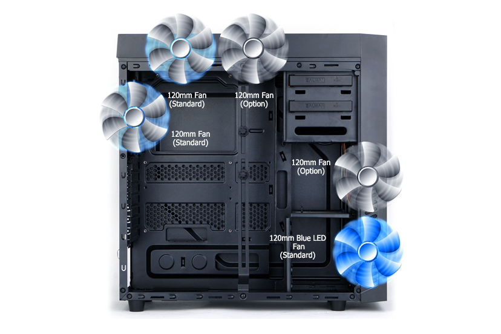
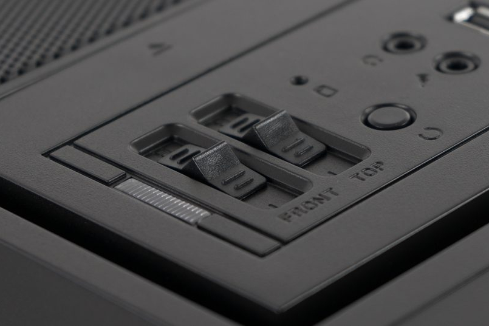
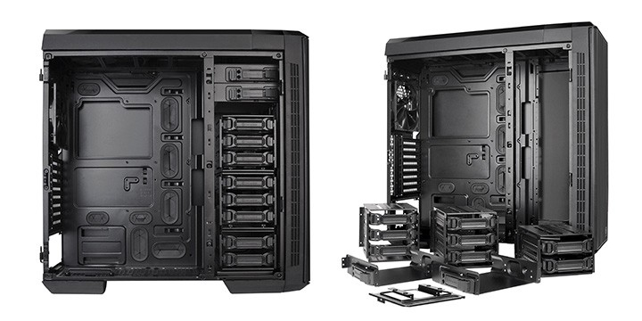
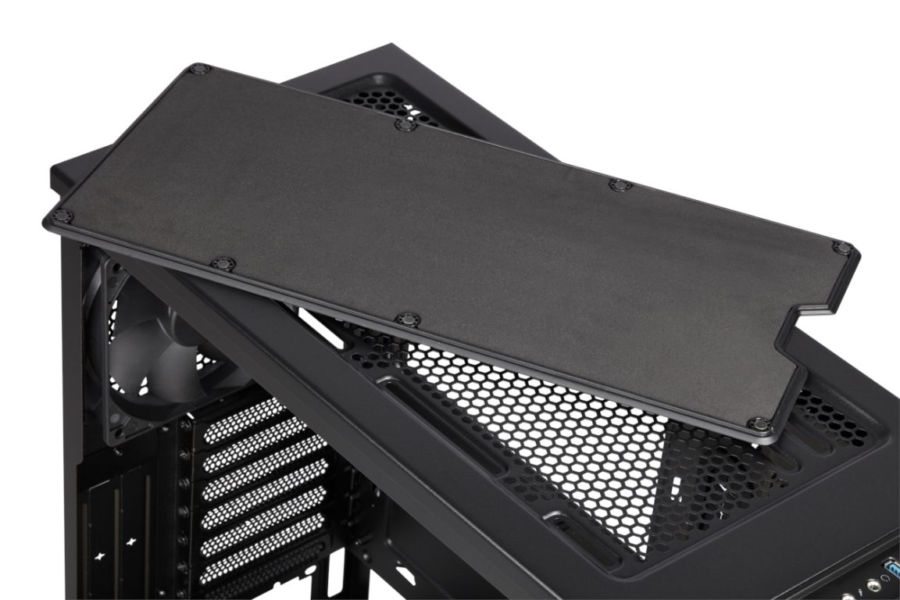
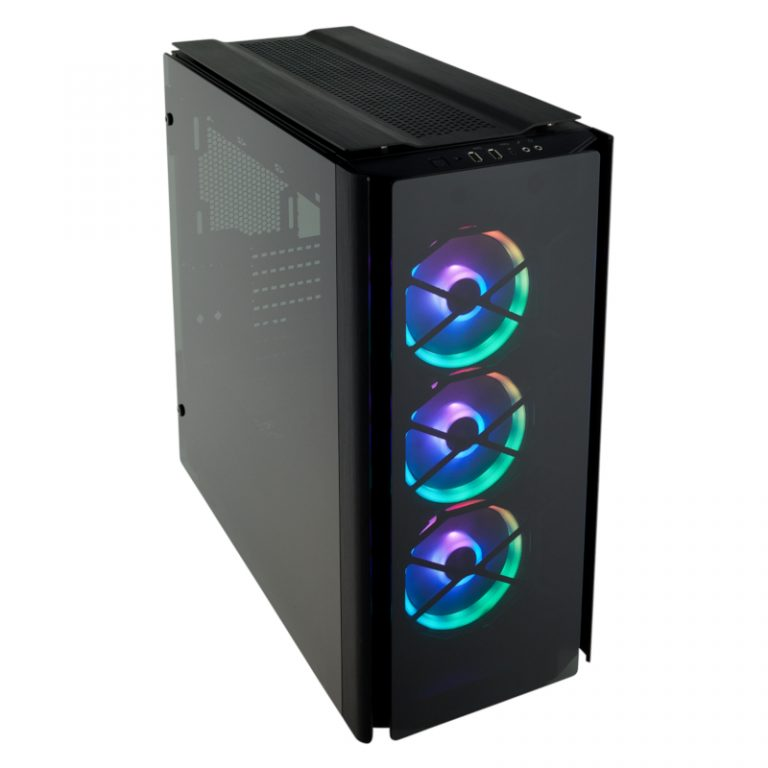
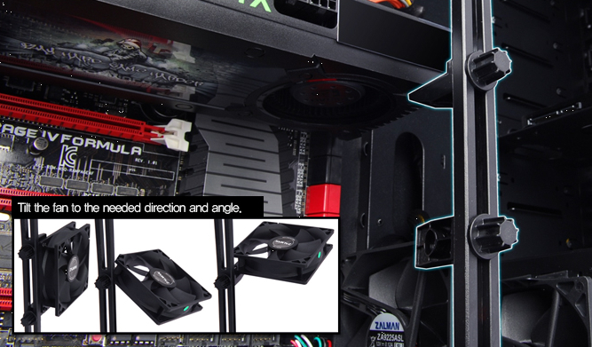
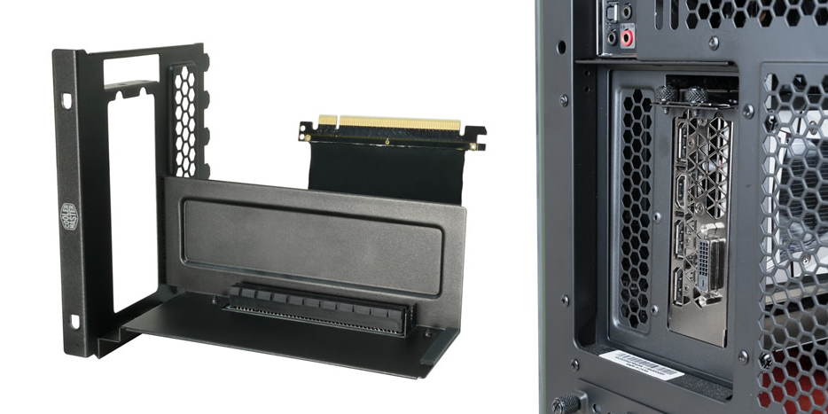
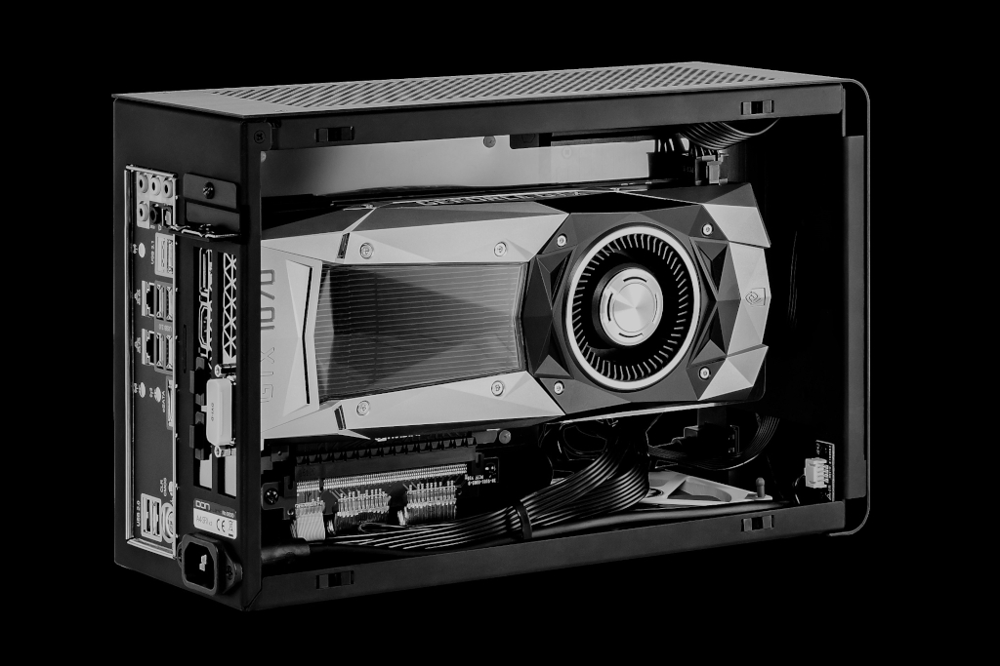

<ActionButton to='/obudowy-czesc-1'>I część artykułu</ActionButton>

## Rozbudowane systemy chłodzące

### Wentylatory

Podstawowym sposobem chłodzenia komputera są wentylatory tłoczące do obudowy chłodne i wyrzucające z niej ciepłe powietrze. Każda obudowa posiada zestaw miejsc, w których możliwy jest ich montaż. W specyfikacji danego modelu zawsze można odnaleźć informacje o ilości takich miejsc oraz o średnicy wentylatora, jaki powinien być tam zamontowany. Wiele obudów posiada w zestawie kilka standardowych wentylatorów. Mogą zostać one użyte lub wymienione na inne, lepsze egzemplarze.

<ImageDescription>Zalman R1 posiada 5 miejsc na wentylatory, ale tylko 3 są dołączone do obudowy, źródło: zalman.com</ImageDescription>

### Wbudowany kontroler obrotów

Duże obudowy często posiadają wbudowany kontroler obrotów wentylatora. W przypadku wyboru takiego modelu należy sprawdzić:

- Ile maksymalnie wentylatorów może obsłużyć kontroler.
- W jaki sposób jest on zasilany. Najczęściej jest to wtyk MOLEX, stąd należy upewnić się, czy nasz zasilacz posiada taką wtyczkę.
- Czy regulacja odbywa się wspólnie dla wszystkich podłączonych wentylatorów, czy można sterować każdym z osobna.
- Czy regulacja jest płynna, czy stopniowa. Droższe modele posiadają potencjometry pozwalające na płynną regulację obrotów w całym zakresie, a tańsze posiadają jedynie prosty przełącznik typu: wyłącz/wolno/szybko.

<ImageDescription>Obudowa SilentiumPC Aquarius X70W Pure Black posiada 2-kanałowy 3-pozycyjny kontroler obrotów, źródło: silentiumpc.com</ImageDescription>

Czasami na froncie komputera można spotkać też mały wyświetlacz LCD. Jest on najczęściej zintegrowany z kontrolerem obrotów, a na jego powierzchni wyświetlane są informacje takie jak: temperatura kilku podzespołów komputerowych, prędkość obrotowa wentylatorów czy data i godzina. Często dodatkową funkcją jest możliwość ustawienia alarmu dźwiękowego po przekroczeniu określonej temperatury.

<InfoBlock>Na rynku istnieją uniwersalne kontrolery obrotów połączone najczęściej z wyświetlaczem LCD i kilkoma termometrami. Montuje się je z przodu komputera w slocie 5.25 cala.</InfoBlock>

### Maksymalny rozmiar GPU i chłodzenia CPU

Obudowa posiada określoną szerokość, a co za tym idzie, może nie pomieścić wszystkich zestawów chłodzenia procesora. Nie chodzi tutaj o standardowe układy dostarczane wraz z procesorem, a o rozbudowane radiatory z rurkami cieplnymi i kilkoma wentylatorami. W ich przypadku należy sprawdzić, czy zamknięcie obudowy będzie w ogóle możliwe .

Karta graficzna także nie może przekroczyć pewnego rozmiaru. Należy sprawdzić, jaką maksymalną długość może mieć GPU i czy nie zahaczy ona np. o dyski twarde zamontowane z przodu obudowy. Limit ten można niekiedy obniżyć, jeśli obudowa wyposażona jest w funkcję opisaną poniżej.

<AdSense/>

### Demontowalne szuflady wewnętrzne

Niektóre drogie modele pozwalają na zmodyfikowanie swojej przestrzeni wewnątrz jednostki. Jednym z takich rozwiązań jest możliwość zdemontowania znajdujących się wewnątrz obudowy szuflad 3.5 i 2.5 cala. Co prawda tracimy wówczas dużo miejsca na montaż pamięci masowych, ale takie obudowy zazwyczaj posiadają jeszcze dodatkowe sposoby montażu dysków.

<ImageDescription>Obudowa Thermaltake Urban T81 pozwala na całkowity demontaż wewnętrznych szuflad, źródło: thermaltake.com</ImageDescription>

### Miejsce na montaż chłodzenia wodnego

Chłodzenie wodne, choć ciche i wydajne, dużo kosztuje oraz potrzebuje sporo miejsca. Jednym z elementów, które muszą zmieścić się w obudowie, jest chłodnica z zestawem wentylatorów. Najczęstszym miejscem jej montażu jest góra obudowy. Modele przystosowane do takiego sposobu chłodzenia w górnej ściance posiadają kratki wentylacyjne i miejsca do przykręcenia śrub montażowych. Wspomniane otwory można oczywiście wykorzystać też do zainstalowania zwykłych wentylatorów, ale ich prawdziwym przeznaczeniem jest montaż chłodnicy.

<ImageDescription>Klapka u góry obudowy ukrywa miejsce montażu chłodnicy (Corsair Carbide Series 275Q), źródło: corsair.com</ImageDescription>

Wspomniane w poprzednim podrozdziale demontowalne szuflady pozwalają też na łatwą instalację dużego rezerwuaru (zbiornika na płyn chłodniczy) oraz pompy. Bez ich usunięcia zbudowanie w obudowie własnego systemu chłodzenia wodnego może okazać się niemożliwe.

## Dodatki

### Łatwe przenoszenie jednostki

Mimo że komputer stacjonarny z racji swoich gabarytów i nazwy powinien być stacjonarny, czasami potrzeba go przenieść. Uniesienie metalowej konstrukcji ważącej wiele kilogramów nie jest łatwe i przyjemne, dlatego też niektóre modele posiadają u góry **rączkę**. Co więcej, by ułatwić przemieszczanie komputera (np. między pokojami) można poszukać modeli **wyposażonych w kółka zamiast nóżek**.

### Organizacja kabli w obudowie

Wijące się w obudowie kable podzespołów nie tylko brzydko wyglądają, ale też powodują utrudnioną cyrkulację powietrza. Ważne jest więc, żeby zadbać o ich staranne ułożenie. Najlepiej w tym zadaniu sprawdzą się obudowy wyposażone w przeróżne uchwyty i korytka na kable. Pozwalają one na ukrycie przewodów po drugiej stronie blachy, za płytą główną.

### Filtry przeciwkurzowe

Aby utrzymać komputer w dobrym stanie, należy go co jakiś czas wyczyścić z kurzu. Nie jest to łatwe ze względu na dużą ilość drobnym elementów, które podatne są na wyładowania elektrostatyczne. Aby ograniczyć osadzanie się kurzu, wiele obudów na swoich kratkach wentylacyjnych posiada filtry przeciwkurzowe. Naturalnie im są one gęstsze, tym lepiej zatrzymają kurz, ale też znacząco ograniczą przepływ powietrza. Niemniej jednak dobra obudowa powinna je posiadać oraz umożliwiać ich łatwy demontaż i umycie.

### Montaż beznarzędziowy

Do wykonania wielu prac wewnątrz jednostki centralnej będziemy potrzebowali zestawu podstawowych narzędzi. Istnieją jednak obudowy posiadające tzw. montaż beznarzędziowy. Polega to na możliwości wymiany części podzespołów bez używania chociażby prostego śrubokręta. Jest to oczywiście dla wielu zbędna opcja, ale osoby, które często muszą wyjmować dysk z komputera, mogą być zadowolone z takiego dodatku.

### Wyciszenie obudowy

Jednym z zadań obudów jest tłumienie hałasu. Droższe modele mogą posiadać wnętrze wyłożone przeróżnymi gumami i piankami, których zadaniem jest rozpraszanie tworzącego się tam dźwięku. Oczywiście, jak w przypadku filtrów przeciwkurzowych, tak samo tutaj cierpi na tym wydajność chłodzenia, ale czego nie robi się dla ciszy podczas pracy?

<InfoBlock>Na rynku dostępne są też gotowe zestawy mat do samodzielnego wyciszenia obudowy.</InfoBlock>

### Przeźroczyste drzwiczki

To rozwiązanie zrobiło się bardzo modne i nie ma się czemu dziwić. Dzisiejsze podzespoły coraz mocniej stawiają na ładny wygląd bądź oświetlenie LED. Stąd też pojawiła się potrzeba wyeksponowania wnętrza jednostki bez jej otwierania, w efekcie czego drzwiczki serwisowe znajdujące się po lewej stronie obudowy mogą posiadać okienko wykonane z plastiku lub szkła.

### Oświetlenie LED

Tak jak już wspomniałem powyżej, wewnątrz jednostki centralnej coraz częściej pojawia się wielokolorowe oświetlenie LED. Nikogo więc nie powinno dziwić, że i obudowy zaczęły posiadać własne instalacje świetlne. Mogą one przyjmować różne postacie: od prostych świecących wentylatorów po zaawansowane adresowalne paski sterowane za pomocą oprogramowania.

<ImageDescription>Corsair Obsidian Series 500D RGB SE - a to tylko wentylatory :), źródło: corsair.com</ImageDescription>

### Akcesoria do karty graficznej

Na sam koniec pozostawiłem dwa małe akcesoria, które bezpośrednio tyczą się GPU i innych kart rozszerzeń. Pierwszą z nich jest **wspornik**, którego zadaniem jest odciążenie płyty głównej. Ma to spore znaczenie w przypadku dużych kart graficznych, które swoim ciężarem mogą wyrwać gniazdo PCI-Express z powierzchni płyty. Dodatkowo, w pokazanej poniżej obudowie Zalman R1, zamontowany wspornik pełni jeszcze jedną funkcję: umożliwia zainstalowanie "w powietrzu" dodatkowego wentylatora, który może pomóc w chłodzeniu przegrzewających się elementów.

<ImageDescription>Wspornik GPU w obudowie Zalman R1, źródło: zalman.com</ImageDescription>

Drugim akcesorium jest **uchwyt 90 stopni do kart graficznych**. Umożliwia on pionową instalację karty graficznej i połączenie jej z płytą główną za pomocą elastycznej taśmy. Po co coś takiego? By móc lepiej wyeksponować w obudowie podzespół, którego cena często wynosi kilka tysięcy. Wadą tego rozwiązania jest zablokowanie sobie możliwości zainstalowania innej karty rozszerzeń. Specjalny śledź karty graficznej zasłania wszystkie miejsca z tyłu obudowy.

<ImageDescription>Uchwyt wertykalny do kart graficznych marki Cooler Master, źródło: coolermaster.com</ImageDescription>

Podobne rozwiązanie z elastyczną taśmą jest stosowane w poziomych obudowach i innych modelach SFF. Producenci, by dać możliwość zainstalowania w takiej obudowie pełnowymiarowej karty graficznej, stosują właśnie elastyczne taśmy PCI-Express.

<ImageDescription>Obudowa DAN A4-SFX - tutaj każdy milimetr miejsca się liczy, źródło: dan-cases.com</ImageDescription>

<AdSense/>

## Podsumowanie

<OkList>
- Określ, ile miejsca możesz przeznaczyć na jednostkę centralną i jaki typ obudowy będzie najlepiej sprawdzał się na Twoim stanowisku.
- Sprawdź, czy obudowa umożliwia zamontowanie Twojego standardu płyty głównej.
- Jaki zasilacz zmieści się w tej obudowie? A może jest już dołączony w zestawie?
- Zrób listę gniazd, jakich potrzebujesz podczas normalnej pracy przy komputerze. Wybierz obudowę z dobrze umiejscowionym (dla Twojego stanowiska) panelem przednim.
- Oszacuj ile kart rozszerzeń, dysków twardych, dysków SSD oraz urządzeń 5.25" będziesz montować w obudowie.
- Sprawdź ilość i miejsca montażu wentylatorów w obudowie. Pamiętaj, że część z nich może zostać dołączona do zestawu.
- Wbudowane kontrolery obrotów pozwalają na łatwe sterowanie wentylatorami w obudowie bez zakupu zewnętrznych rozwiązań lub stosowania specjalnego oprogramowania.
- W przypadku posiadania rozbudowanego chłodzenia CPU lub długiej karty graficznej sprawdź maksymalne wymiary tych podzespołów.
- Sprawdź, czy obudowa posiada jakiekolwiek filtry przeciwkurzowe oraz organizery okablowania.
</OkList>

Moje rady:

<StarList>
- Nie oszczędzaj na obudowie. Stanowi ona szkielet całej jednostki centralnej.
- Złożenie komputera w małej obudowie jest droższe i bardziej skomplikowane, ale małe gabaryty zapewnią więcej miejsca na stanowisku oraz umożliwią łatwy transport.
- Obudowa pełni też rolę prezentacyjną. Wybierz ten model, który Ci się podoba, a nie ten, który podoba się Twojemu znajomemu.
- Jeśli chodzi o modyfikacje, obudowa daje duże pole do popisu. Eksperymentuj i ulepszaj ją!
</StarList>
