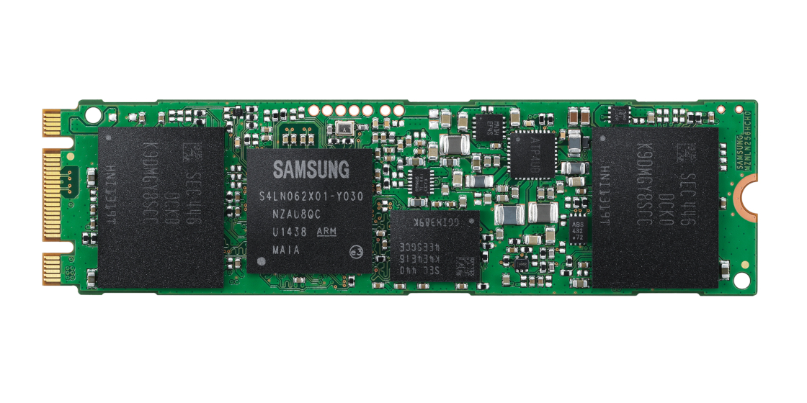
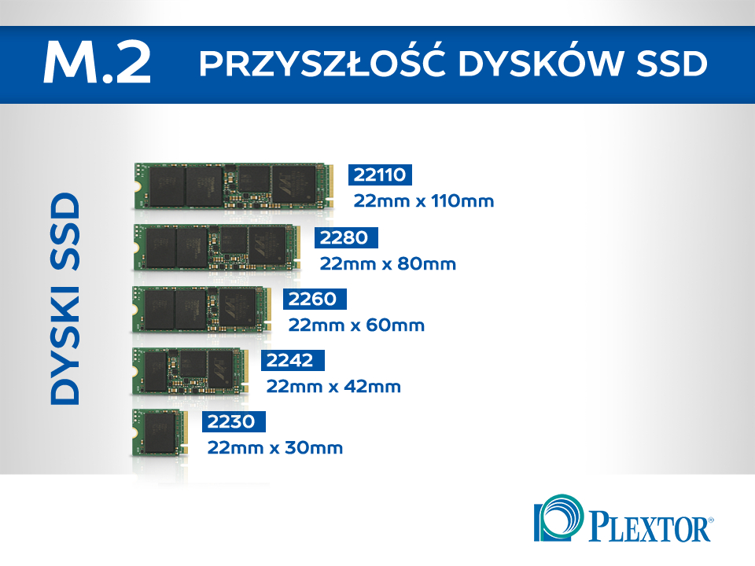

Oprócz dysków SSD przypominających swoim kształtem [standardowe dyski talerzowe](/nosniki-pamieci-dyski-hdd-ssd) istnieją także specjalne moduły instalowane w gnieździe M.2. Mają one postać małych płytek drukowanych instalowanych płasko na powierzchni płyty. W tym artykule postaram się omówić ich zalety i wady, a także przedstawić najważniejsze parametry.

## Zalety i wady technologii

Dyski M.2 (ponieważ tak mówi się na nie w skrócie) posiadają kilka ważnych zalet, dzięki którym zyskują dużą popularność zarówno w komputerach, jak i w laptopach. Pierwszą, najbardziej rzucającą się w oczy zmianą w stosunku do tradycyjnych dysków, są **niewielkie gabaryty podzespołu.** Umożliwia to montaż w małych [obudowach](/obudowy-czesc-1), w których nie ma miejsca na dyski 2,5-calowe oraz kable od zasilania i sygnału.

<ImageDescription>Samsung 850 EVO 500GB, źródło: samsung.com</ImageDescription>

Drugą zaletą jest sposób komunikacji takiego dysku z resztą podzespołów. W przypadku standardowych dysków był to interfejs SATA, który choć szybki, to jednak ograniczał możliwości wielu topowych modeli dysków półprzewodnikowych. Moduły M.2 są natomiast **podłączone bezpośrednio do magistrali PCI-Express**, czyli mogą przesyłać od kilku do nawet kilkudziesięciu gigabitów danych na sekundę.

Wadą tego rozwiązania jest chyba wyłącznie nieco wyższa cena. Technologia jeszcze jest stosunkowo młoda i występuje jedynie w niewielu modelach płyt głównych (zwykle w tych droższych). Koszt zakupu dysków dedykowanych pod to złącze też jest wyższy, ale szybkości odczytu i zapisu raczej to rekompensują.

## Parametry dysków M.2

### Prędkość zapisu i odczytu

Zacznę od najbardziej oczywistego. Im te dwa parametry będą wyższe, tym bardziej wydajny będzie nośnik. W przypadku dysków M.2 nawet najsłabsze modele będą osiągały wysokie prędkości, które znacząco przyspieszą pracę komputera.

### Rozmiar modułu

Moduły wpinane w gniazdo M.2 mogą posiadać różne rozmiary. Ich wymiar zakodowany jest w 4 lub 5 cyfrowym numerze identyfikacyjnym np. 2242. Pierwsze dwie cyfry zawsze oznaczają szerokość modułu. Mogą one przyjmować takie wartości jak 12, 16, 22 i 30, ale najpopularniejsze w komputerach są 22 milimetry. Pozostałe cyfry oznaczają długość modułu, która może wynosić od 16 do nawet 110 milimetrów. [Płyty główne](/plyty-glowne-czesc-1) posiadają listę rozmiarów modułów, jakie obsługują. Muszą one zapewnić wystarczająco dużo miejsca przed gniazdem M.2, a także otwory umożliwiające przykręcenie modułu do powierzchni płyty.

### Typ klucza

Terminem klucza określa się typ gniazda znajdującego się na płycie głównej komputera. Występuje on w trzech wersjach: w wersji M, w wersji B, a także w uniwersalnej M+B umożliwiającej zainstalowanie obu typów modułu. Ich rodzaj można rozróżnić na podstawie wcięć w stykach gniazda, które dobrze pokazuje poniższa grafika.

### Szerokość i typ magistrali PCI-Express

Tak jak wspominałem na początku, dyski M.2 wykorzystują do komunikacji magistralę PCI-Express. Aby móc w pełni wykorzystać przepustowość kupowanego nośnika, należy zadbać, aby gniazdo M.2 płyty głównej obsługiwało generację oraz szerokość magistrali, których potrzebuje dysk.

<AdSense/>

### Protokół NVMe

Podczas przeglądania modeli dysków M.2 można natknąć się na tajemniczy skrót "NVMe". Jest to protokół komunikacyjny, który został stworzony specjalnie dla superwydajnych dysków SSD. Jego zadaniem było zniwelować problemy z małowydajnym protokołem AHCI, który kontroluje działanie współczesnych dysków. Podsumowując: dyski ze wsparciem protokołu NVMe znacznie sprawniej wymieniają dane z systemem, a co za tym idzie, oferują znacznie wyższe prędkości odczytu i zapisu.

## Intel Optane

Na koniec muszę wspomnieć o technologi Intel Optane, która jest mocno związana z dyskami SSD na M.2. Głównym celem tej technologi jest znaczące przyspieszenie odczytu danych z tradycyjnego [dysku talerzowego](/nosniki-pamieci-dyski-hdd-ssd). Podczas pracy komputera, zainstalowany w gnieździe M.2 moduł Intel Optane cały czas uczy się przyzwyczajeń użytkownika i tego, jakich plików potrzebuje najczęściej. Następnie pobiera te dane z dysku HDD i zapisuje je wewnątrz swojej, superszybkiej pamięci półprzewodnikowej.

<YouTube id='tcKCBwEPXZc' title='intel optane'></YouTube>

Powyższy filmik w zabawny sposób tłumaczy działanie rozwiązania opatentowanego przez popularnego producenta procesorów. Moduły pamięci Optane pozwalają dyskom talerzowym osiągnąć prędkość porównywalną do [dysków SSD](/nosniki-pamieci-dyski-hdd-ssd) przy zachowaniu dużej pojemności. Jakiś haczyk? Niestety tak. Aby móc wykorzystać tą technologię, komputer musi spełniać szereg wymagań:

- Procesor Intel 7. generacji (Kaby Lake),
- chipset z serii 200,
- system Windows 10 64-bit w trybie UEFI,
- dysk SATA z partycją GPT,
- gniazdo M.2 PCIe 3.0 x2 z obsługą NVMe.

Dlatego też technologia Intel Optane nie jest dla wszystkich. Jednostki niespełniające powyższych wymagań muszą zadowolić się zwykłymi rozwiązaniami w postaci zakupu [dysku HDD i SSD lub ratować się hybrydami SSHD](/nosniki-pamieci-dyski-hdd-ssd).
