Pod koniec kwietnia bieżącego roku firma Samsung bez ostrzeżenia postanowiła wycofać aplikację Twitch TV ze swojego sklepu z aplikacjami dla telewizorów smart TV. Spotkało się to z dużą falą krytyki ze strony graczy oraz innych osób ceniących sobie tę fioletową platformę streamingową.

Mnie, jako posiadacza telewizora tej marki, również dotknęła ta informacja. Ideą smart TV jest to, aby użytkownik nie musiał korzystać z zewnętrznych urządzeń i pilotów. Dlatego też nie zadowala mnie rozwiązanie polegające na uruchamianiu PlayStation 4 i czekaniu na załadowanie całego systemu, nie wspominając już o zwiększonym poborze prądu. Przeglądając Internet, można natknąć się na pewien poradnik pokazujący ciekawą alternatywę dla utraconej aplikacji. Postanowiłem więc pokazać krok po kroku instalację oraz konfigurację nowej aplikacji, ponieważ nie sprowadza się ona tylko do naciśnięcia jednego przycisku.

## Dlaczego aplikacja została wycofana?

Na początku chciałbym jeszcze wyjaśnić prawdopodobną przyczynę wycofania aplikacji Twitch'a. Pewnie większość osób, które jej używały, nie zdawała sobie sprawy, że nie jest to oficjalna aplikacja dla tej platformy. Kod dotychczas używanej przez wielu aplikacji jest [dostępny na platformie GitHub](https://github.com/nikitakatchik/smarttv-twitch). Niestety projekt został już dawno porzucony, co objawiało się coraz gorszą współpracą z usługą.

<AdSense/>

Aplikacja od jakiegoś czasu nie potrafiła już obsługiwać czatu podczas transmisji na żywo oraz nie radziła sobie z obsługą streamów nadawanych w innych proporcjach niż 16:9. Jednak największą niedziałającą funkcją było wyświetlanie reklam, co oczywiście dla nas, użytkowników to był wielki plus, ale Twitch zdecydowanie nie podzielał naszego zdania. Bloki reklamowe wyświetlane okresowo w transmisjach razem z płatnymi subskrypcjami są głównym dochodem tej platformy. Dlatego też najbardziej prawdopodobną przyczyną zaistniałej sytuacji jest interwencja Twitch'a, w efekcie której Samsung został zmuszony do wycofania możliwości nielegalnej transmisji. Sam producent telewizorów komentuje sprawę następująco:

<Quote source='Samsung Support USA (Twitter)'>I'm sorry for the inconveniences. Please contact Twitch support team for they will be your best option for direct assistance with this matter. If you need any technical assistance in the future, feel free to contact us back. Have a great day! ^Lisa</Quote>

Jak widać, firma prosi o bezpośredni kontakt z fioletowym usługodawcą, a Twitch jak dotąd nie wypowiedział się w tej kwestii. Moim zdaniem wina bardziej leży po stronie Samsunga. Twitch miał prawo zabronić takiej transmisji, a Samsung przez tyle lat powinien zatroszczyć się o oficjalne wsparcie dla swojego autorskiego systemu operacyjnego o nazwie "Tizen".

## Cała nadzieja w aplikacji Smart IPTV

W społeczności Reddit'a siła! To tam po raz pierwszy spotkałem się z informacją o tym rozwiązaniu, które polega na wykorzystaniu telewizji IPTV. Sposób ten ma jednak parę wymagań i ograniczeń:

- Telewizor nie może mieć wybranego regionu "Polska", ponieważ uniemożliwia to zainstalowanie aplikacji. Zmiana regionu może wiązać się z przywróceniem ustawień fabrycznych telewizora.
- Użytkownik musi posiadać konto w serwisie Twitch.
- Rozwiązanie to pozwala jedynie na wyświetlanie obserwowanych streamerów. Nie ma możliwości wyszukania użytkownika w aplikacji, a także przeglądania proponowanych transmisji.
- Aplikacja odtwarza jedynie transmisję i nie podaje informacji takich jak tytuł streamu, nazwa gry czy liczby aktualnie oglądających.
- Program udostępniamy jest w wersji trial.

Zabierzmy się do pracy!

### Zmiana regionu

Aby móc wymazać z naszego urządzenia ustawioną wcześniej lokalizację należy skorzystać z kreatora konfiguracji SmartHub - tego samego, który uruchamiany jest po pierwszym załączeniu telewizora. Należy pamiętać, że sposób znalezienia tej opcji może się różnić w zależności od rocznika, z jakiego pochodzi Wasze urządzenie. W moim przypadku należało wejść do okna ustawień i przejść do menu Pomoc techniczna > Diagnostyka > Resetuj.

<Gallery>
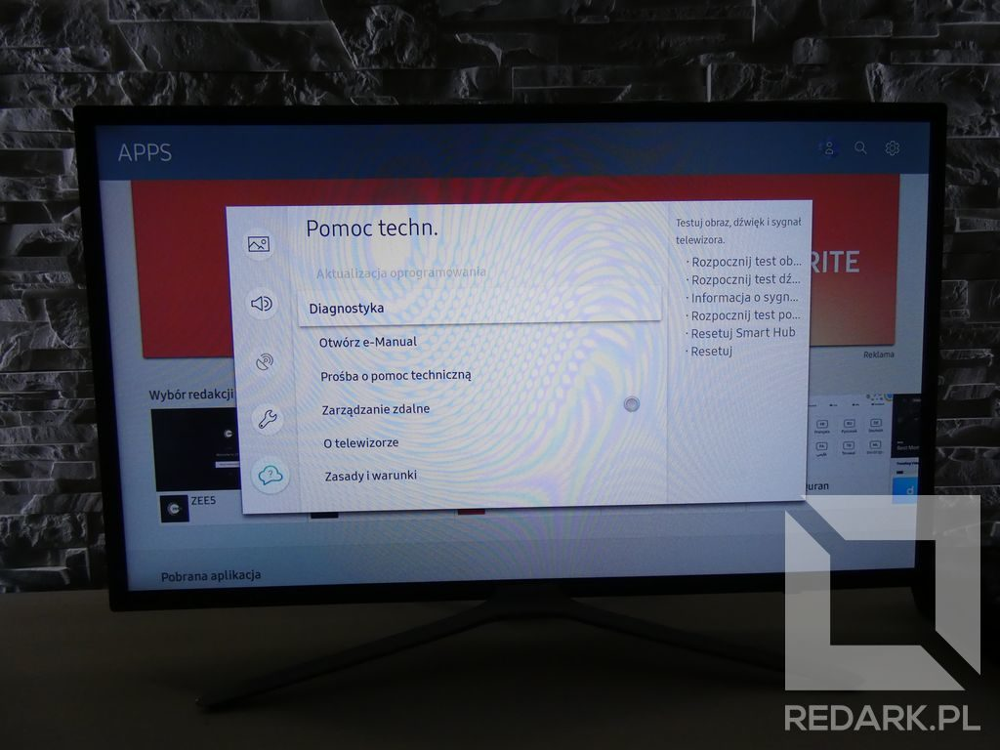
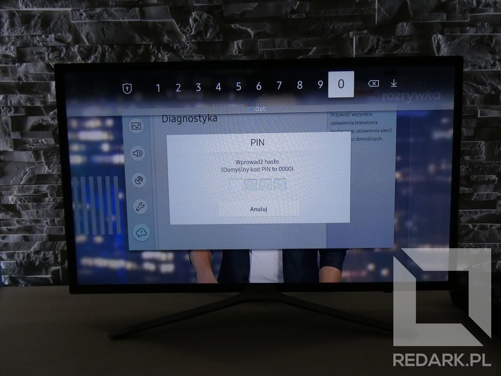
</Gallery>

Po wpisaniu kodu dostępu (domyślnie: 0000) i zatwierdzeniu ostrzeżenia o wymazaniu danych naszym oczom ukaże się kreator konfiguracji. Z listy dostępnych regionów zalecam wybrać pozycję "Pozostałe", ponieważ nie określa ona dokładnie naszego kraju i na 100% pozwoli zainstalować potrzebną aplikację. Resztę konfiguracji przeprowadź standardowo.

<Gallery>
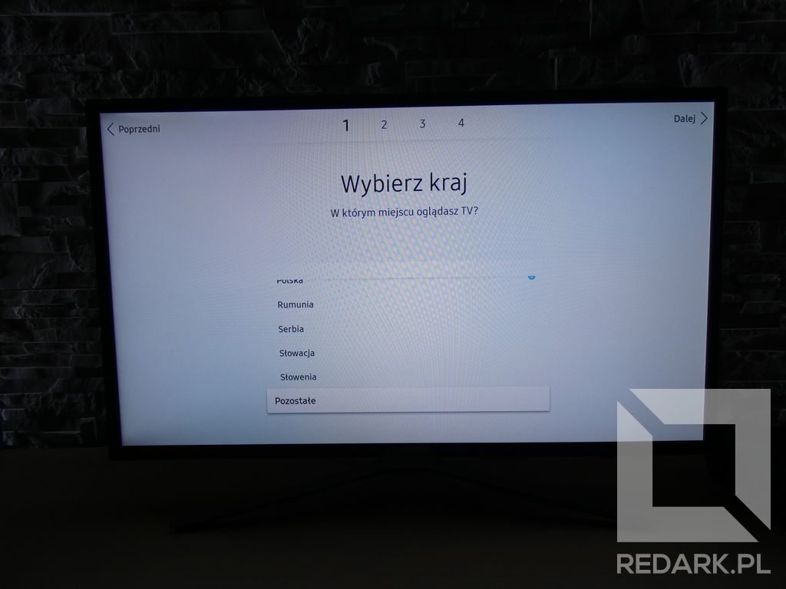
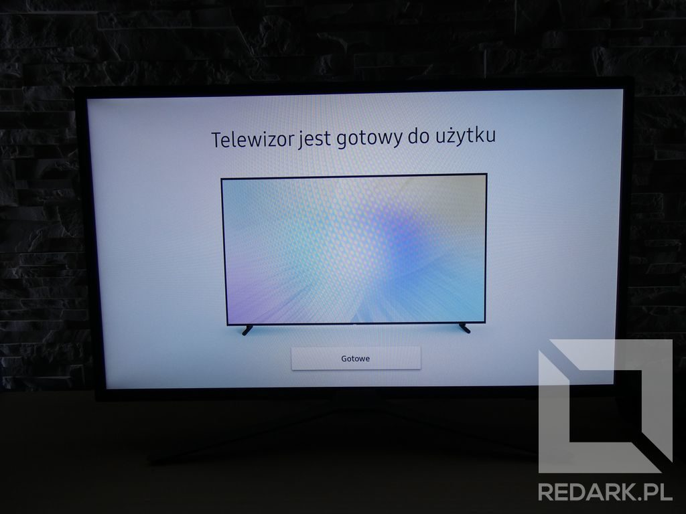
</Gallery>

### Instalacja aplikacji

Po ponownym skonfigurowaniu telewizora, źródeł sygnału oraz listy kanałów można przystąpić do zainstalowania aplikacji "Smart IPTV". W tym celu otwieramy pasek SmartHub, a następnie pozycję APPS, by przejść do sklepu z aplikacjami. Następnie przy użyciu wyszukiwarki należy odnaleźć zaprezentowaną poniżej aplikację:

<Gallery>
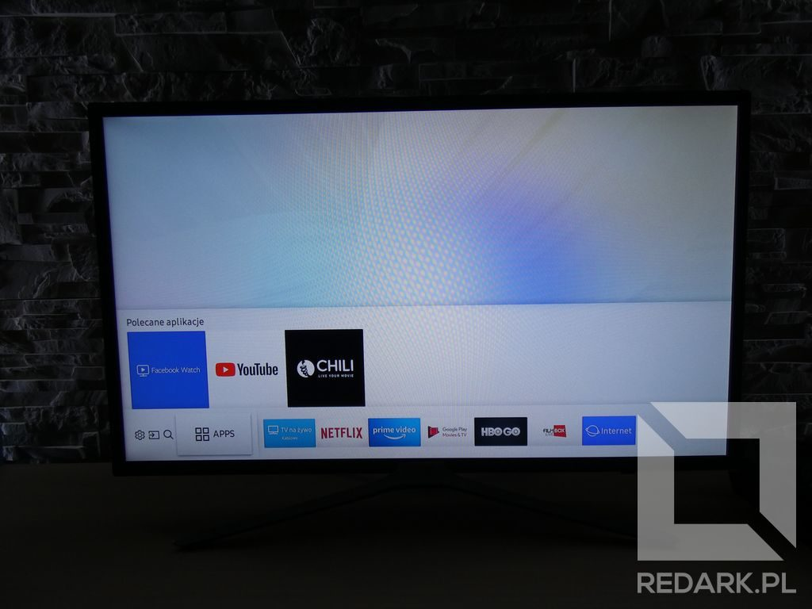
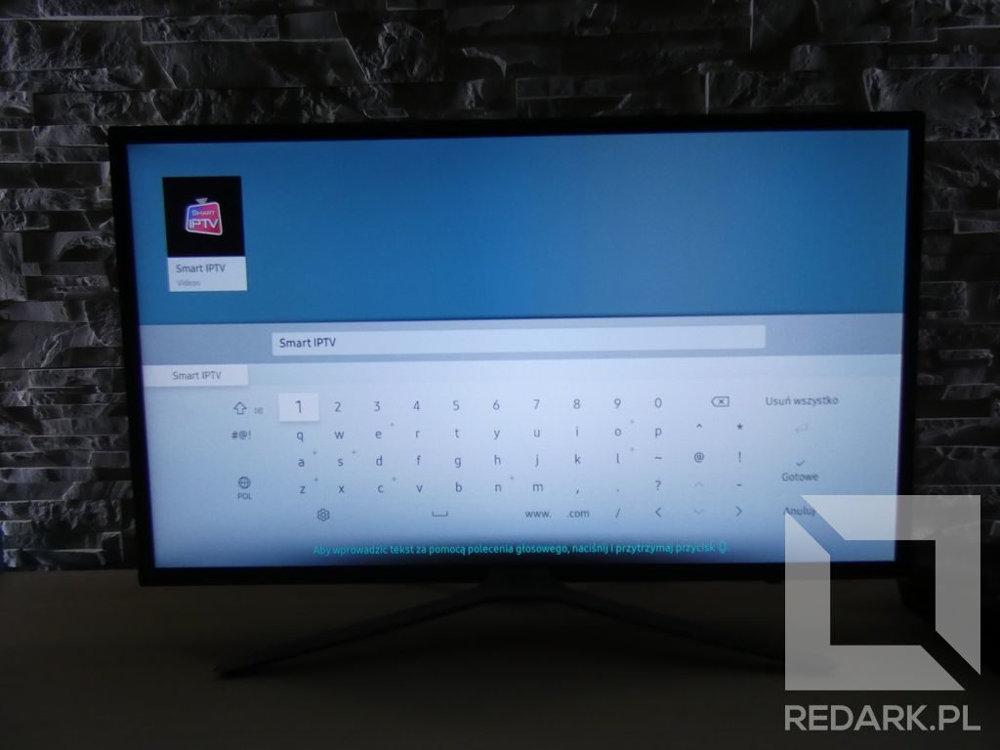
</Gallery>

Po zainstalowaniu aplikacji musimy ją uruchomić, a następnie spisać adres fizyczny MAC pokazany na jej głównym ekranie. Będzie on miał postać zbliżoną do: "00:0A:E6:3E:FD:E1".

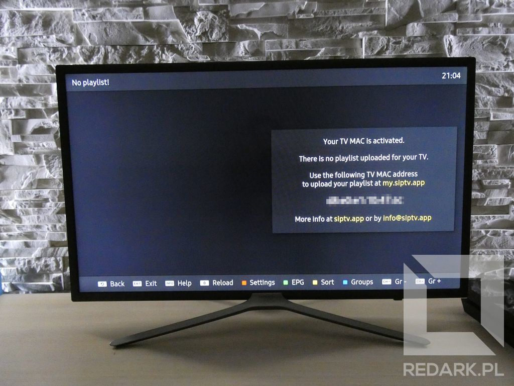

<AdSense/>

### Podłączenie konta Twitch

Ostatnim krokiem jest podłączenie konta serwisu Twitch z zainstalowaną aplikacją. Do tego celu będziemy potrzebowali komputera lub smartfona z dostępem do Internetu. Przechodzimy do [tej strony](http://146.185.158.123/twitch/playlist.php) i podajemy na niej swój nick z platformy streamingowej.

<Gallery>
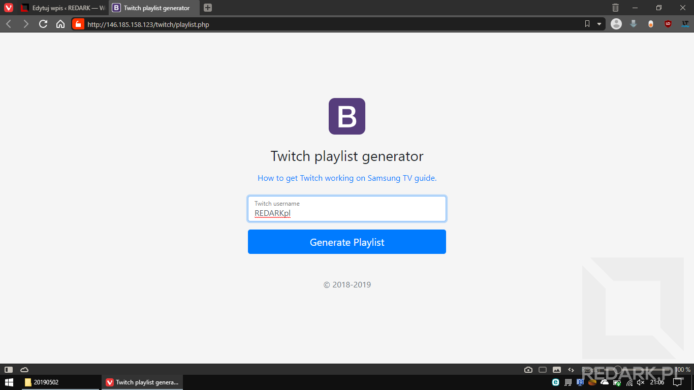
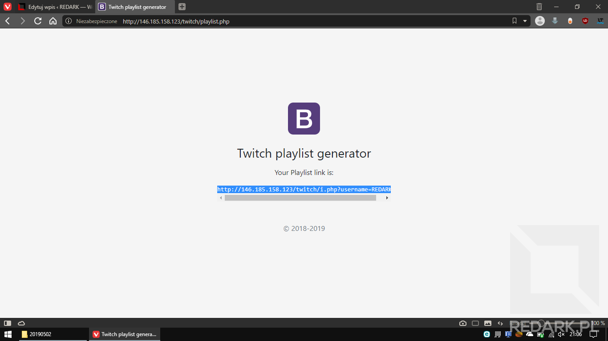
</Gallery>

Formularz zwróci nam link do strony, która odpowiedzialna będzie za generowanie listy obserwowanych przez nas streamerów, którzy obecnie prowadzą transmisję. Następnie kopiujemy wygenerowany link i przechodzimy do [strony producenta aplikacji](https://siptv.app/mylist/). W formularzu podajemy adres MAC widniejący na naszym telewizorze, a w polu URL wpisujemy link wygenerowany w poprzednim kroku.

Na koniec, za pomocą zaznaczonej powyżej listy rozwijanej, należy wybrać opcję "Override app logos", następnie przejść poprawnie weryfikację "reCaptcha" oraz na koniec kliknąć przycisk "Send". Jeśli wszystko poszło dobrze, aplikacja zwróci komunikat o potrzebie zrestartowania aplikacji w telewizorze. W moim modelu wymuszenie zamknięcia aplikacji (nie zminimalizowania!) wykonuje się poprzez długie przytrzymanie przycisku wstecz. Po ponownym uruchomieniu aplikacji po jej lewej stronie powinna ukazać się lista obserwowanych, aktualnie nadających streamerów. Miłego oglądania :)

<Gallery>
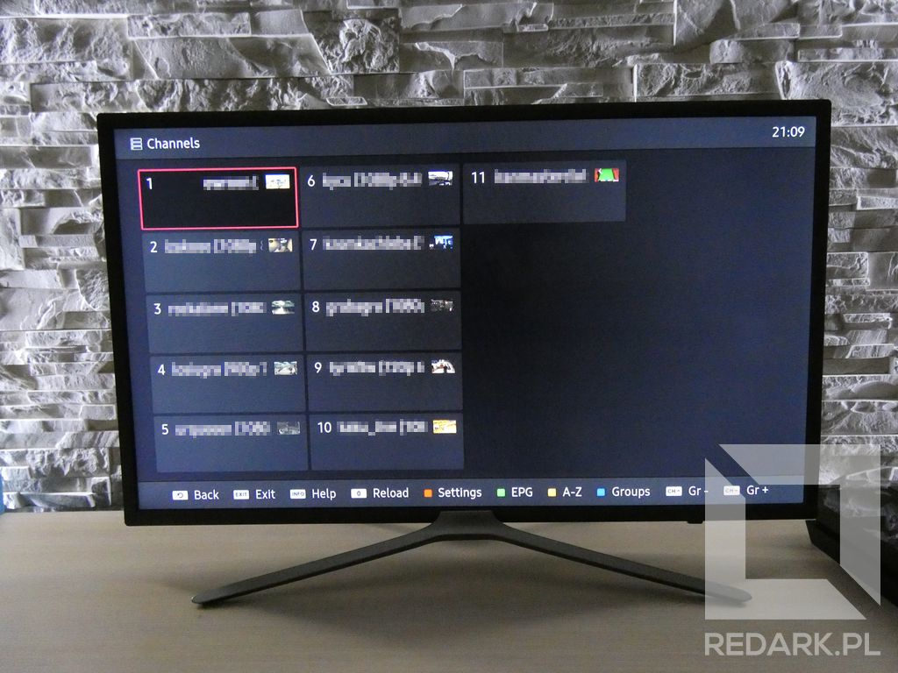
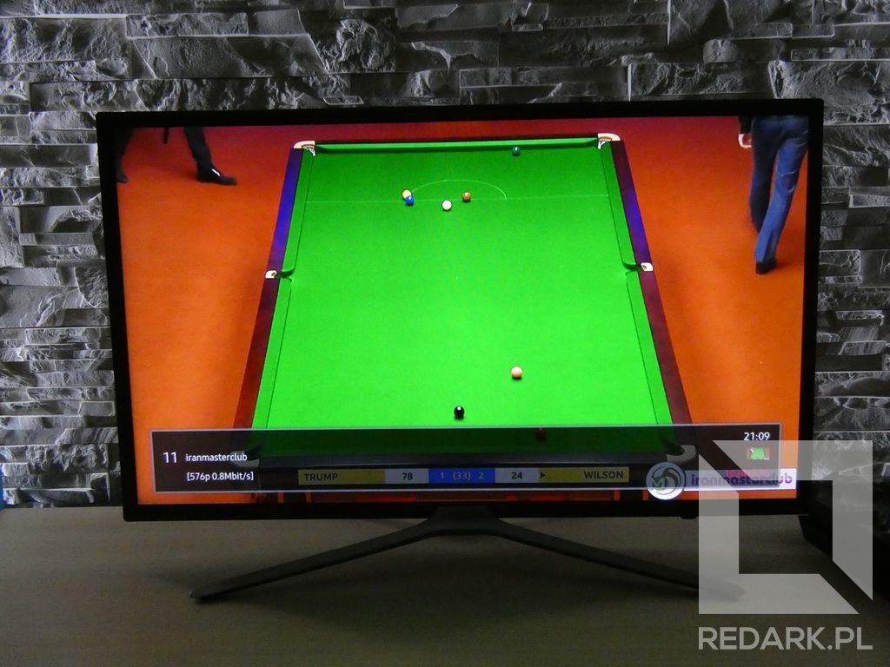
</Gallery>

## Aktualizacja

W sekcji komentarzy pod tym postem jeden z czytelników poinformował mnie, że omówiony w artykule sposób oglądania streamów Twitcha przestał działać. Spowodowane jest to wyrzuceniem Smart IPTV z oficjalnego sklepu z aplikacjami Samsung. Na szczęście, na stronie producenta programu pojawił się poradnik manualnej instalacji.

Procedura nie jest trudna i polega jedynie na [pobraniu paczki z aplikacją](http://siptv.app/howto/sammy/files/siptv_tizen.zip) i rozpakowaniu jej w głównym katalogu pendrive’a. Po włożeniu przenośnej pamięć do gniazda USB w telewizorze i odczekaniu kilku sekund aplikacja Smart IPTV powinna ponownie się pojawić na ekranie "Apps" telewizora.

Komunikat producenta wraz z pełną instrukcją instalacji możecie [znaleźć tutaj](https://siptv.app/howto/sammy/).
