Wczoraj, 7 maja 2019 r. o godzinie 19 czasu polskiego odbyła się coroczna konferencja internetowego giganta. Google przedstawił wiele nowości z różnych dziedzin technologii. W tym artykule pokrótce je omówię.

## Wyszukiwarka Google

### Podcasty

Na pierwszy ogień poszedł największy produkt tej firmy, czyli dobrze wszystkim znana wyszukiwarka Google. Firma postanowiła ulepszyć prezentację wiadomości zamieszczonych w sieci. Sundar Pichai (Google CEO) podkreślił znaczenie podcastów w dzisiejszym świecie oraz oznajmił, że od teraz wyszukiwarka będzie znajdować słowa kluczowe również w ścieżkach audio.

### Wirtualna rzeczywistość

Następnie konferencja skupiła się na swojej technologii rozszerzonej rzeczywistości. Na prezentacji pokazano obsługę modeli 3D w telefonie oraz możliwość umieszczania modelu w prawdziwym świecie. Technologia została zaprezentowana na modelu anatomicznym człowieka, bucie ze sklepu obuwniczego oraz za pomocą modelu żarłacza białego, który został umieszczony na scenie obok prezenterki.

<Gallery>
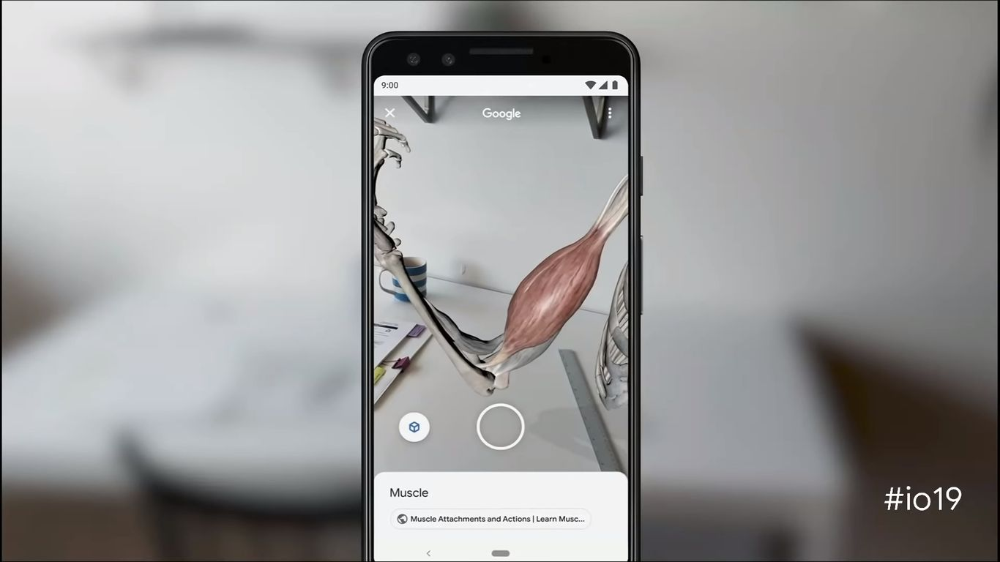
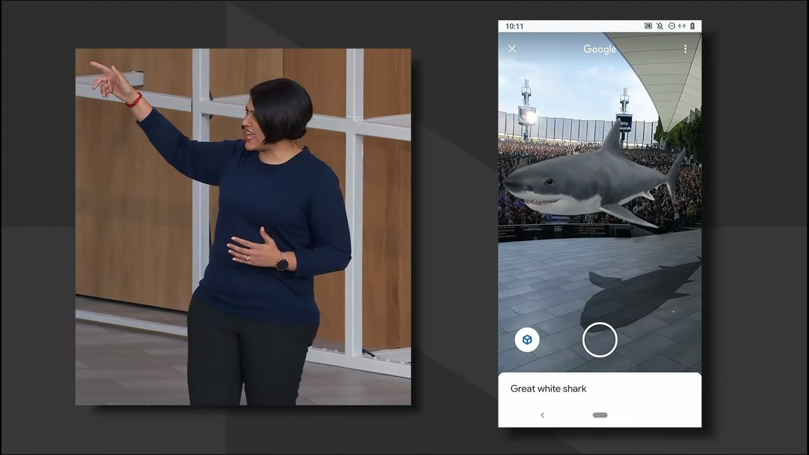
</Gallery>

### Google Lens

Aplikacja Lens zostanie jeszcze lepiej zintegrowana z asystentem oraz przeglądarką zdjęć Google Photos. Jest to aplikacja analizująca rejestrowany obiekt, by na podstawie jego wyglądu, określić czym jest i dostarczyć o nim jak najwięcej informacji. Pierwszą nowością jest wyszukiwanie informacji o potrawach dostępnych w restauracji, klikając na nie bezpośrednio w filmowanym przez nas menu. Następnie pokazano możliwość animowania nieruchomych obrazków na papierze (coś na kształt gazet w Harrym Potterze).

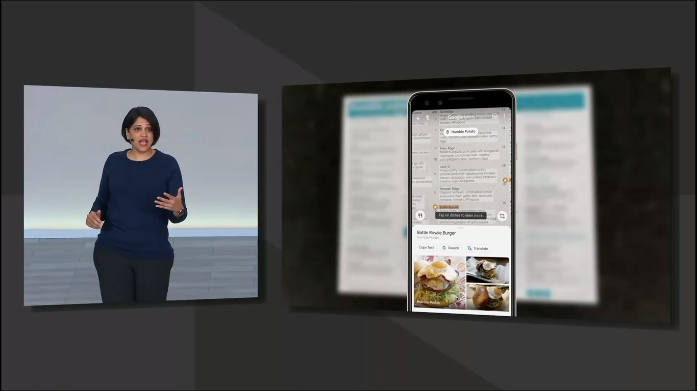

Najważniejszą funkcję zostawiono jednak na koniec. Jest to technologia analizy tekstu z rejestrowanych przez nas przedmiotów, ogłoszeń czy plakatów. Aplikacja wyodrębnia ze zdjęcia cały widoczny tekst, a następnie umożliwia jego odczytanie na głos lub szybkie przetłumaczenie na nasz język. W tym przypadku tekst jednak nie jest kopiowany do translatora Google, a wyświetlany bezpośrednio na zdjęciu.

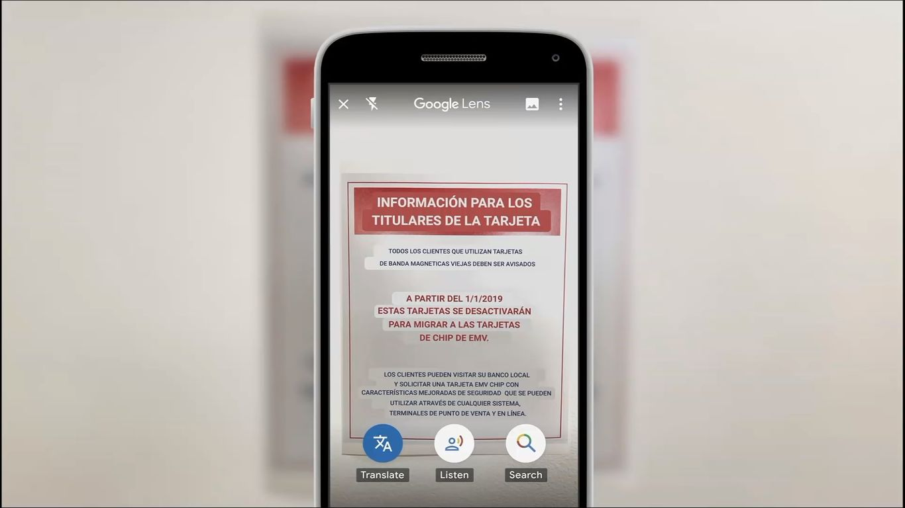

<ImageDescription>Oryginalny tekst był w języku angielskim</ImageDescription>

## Google Assistant

### Google Duplex

Google Duplex jest technologią, o której zrobiło się głośno już na zeszłorocznej konferencji. Technologia ta jest ściśle związana z Google Assistant i pozwala na samoczynne załatwianie dla nas rezerwacji czy zakupów. Poprzednio została zaprezentowana za pomocą telefonicznej rezerwacji fryzjera. Asystent w telefonie, bez żadnej interakcji ze strony właściciela urządzenia, przeprowadził rozmowę z pracownikiem salonu fryzjerskiego.

<YouTube id='D5VN56jQMWM' title='Google Duplex'></YouTube>

W tym roku firma postanowiła zaprezentować Duplex na przykładzie rezerwacji samochodu. Jednakże asystent nie prowadził rozmowy telefonicznej, a uzupełniał formularz dostępny na stronie internetowej. Aczkolwiek w tym przypadku użytkownik obserwował cały proces wprowadzania danych i weryfikował, czy zostały one wprowadzone poprawnie. Ma to sens, ponieważ wiele formularzy w Internecie jest źle stworzona, o czym przekonałem się testując autouzupełnianie w Google Chrome (przeglądarce zdarzało się wpisywać mój adres w pole nazwiska).

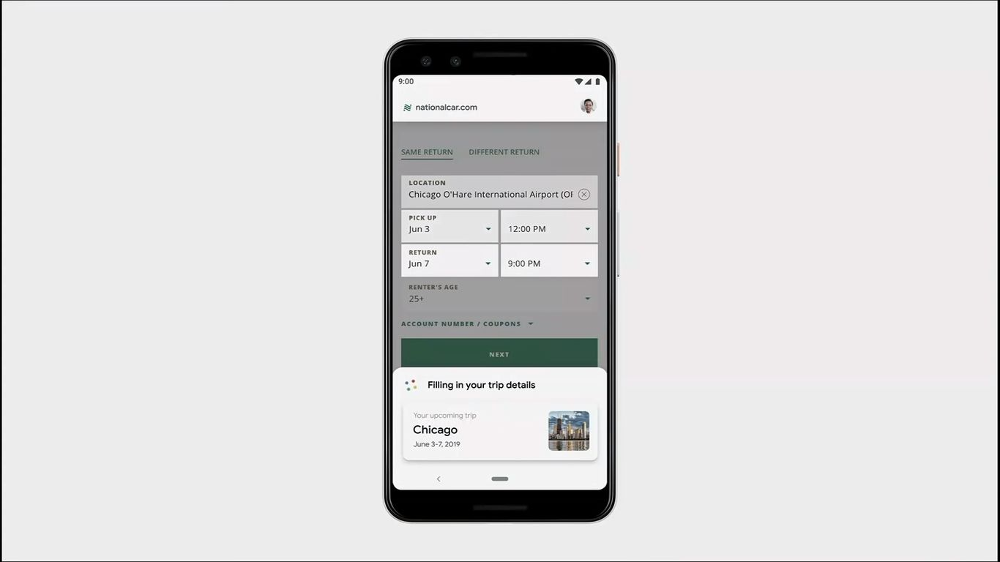

### AI w telefonie

CEO firmy Google poinformował też o rozmiarze plików potrzebnych do poprawnego działania sztucznej inteligencji napędzającej wirtualnego asystenta. Miały one zajmować około 100 GB. Po dwóch latach firmie udało się skompresować te dane do 0,5 GB, co pozwoli na przeniesienie tych plików bezpośrednio do telefonów użytkownika. Oznaczać to będzie znacznie szybsze działanie usługi oraz zniesienie potrzeby włączania transmisji danych.

<VideoViewer file='images/Google-I_O-_19-23˸30.3-24˸23.3-lyRPyRKHO8M.mp4'></VideoViewer>

Szybkość działania została pokazana na żywo podczas konferencji. Prezenterka, mówiąc bez przerw, potrafiła uruchomić każdą aplikację. Czasy oczekiwania na reakcję asystenta były praktycznie zerowe. Robi wrażenie, nie?

### Płynniejsze wprowadzanie tekstu

Następną nowością, która zrobiła na mnie ogromne wrażenie, było ulepszenie płynnego wprowadzania tekstu dzięki technologii Google Duplex. Prezenterka, bez używania frazy aktywacyjnej “Hey Google” potrafiła odpisać na SMS, a następnie uruchomić Google Photos, by po chwili szybko sprecyzować, że zależy jej tylko na zdjęciach, na których są zwierzęta.

<VideoViewer file='images/Google-I_O-_19-25˸00.9-25˸31.3-lyRPyRKHO8M.mp4'></VideoViewer>

Druga prezentacja odbyła się w aplikacji Gmail. Asystent "w locie" rozpoznawał mówiony tekst oraz prawidłowo zareagował, gdy prezenterka w połowie dyktowania tekstu rozkazała mu zmienić tytuł maila. Wysłanie wiadomości również zostało wykonane na końcu głosowo.

<VideoViewer file='images/Google-I_O-_19-26˸15.3-26˸46.7-lyRPyRKHO8M.mp4'></VideoViewer>

### Personalizowana pomoc

Google Assistant ma też lepiej rozumieć kontekst oraz poprawnie interpretować używane przez nas frazy. Podczas prezentacji użyta została fraza “Mom’s house”, która może zostać źle zinterpretowana jako np. nazwa restauracji. Asystent ma teraz dostrzegać więcej zależności między danymi oraz umożliwiać ich wykorzystanie.

<AdSense/>

### Driving mode

Google nadal pragnie rozwijać się w dziedzinie motoryzacji. Asystent zostanie wyposażony w "driving mode", który zamieni telefon w łatwy w obsłudze system multimedialny. Znajdą się tam opcje takie jak: wybór miejsc docelowych z kalendarza, najczęściej używane numery telefonów czy ulubione stacje muzyczne. Włączenie nawigacji ma także umożliwiać łatwe zarządzanie innymi funkcjami, które teraz będą pojawiały się w wąskim pasku na dole ekranu.

## Bezpieczeństwo i prywatność

### Łatwiejszy dostęp do ustawień

Od teraz dostęp do ustawień konta Google będzie możliwy z każdej aplikacji giganta poprzez naciśnięcie zdjęcia profilowego znajdującego się w górnym prawym rogu ekranu. Firma pragnie cały czas ułatwiać użytkownikom zarządzanie swoimi danymi. Nową funkcją będzie możliwość ustawienia automatycznego czyszczenia wybranych przez nas danych.

### Incognito w Google Maps

Aplikacja map zyskała teraz tryb incognito znany z aplikacji Chrome czy YouTube. Po jego uruchomieniu Google nie będzie rejestrował naszej trasy oraz odwiedzanych sklepów i instytucji.

### Sieć neuronowa w telefonie

Google pragnie przenieść na telefony cały proces uczenia się sztucznej inteligencji. Dzięki temu nasze dane pozostaną na telefonie, a dopiero gotowy model sieci neuronowej ma być przesyłany na serwery Google. Tam zostanie użyty do ulepszania modelu globalnego, który zostanie rozesłany do innych urządzeń. Za przykład posłużyła tutaj klawiatura ekranowa giganta - Gboard. Aplikacja ma rozpoznawać nowe nazwy i skróty używane przez użytkowników, a następnie oferować je w podpowiedziach u innych.

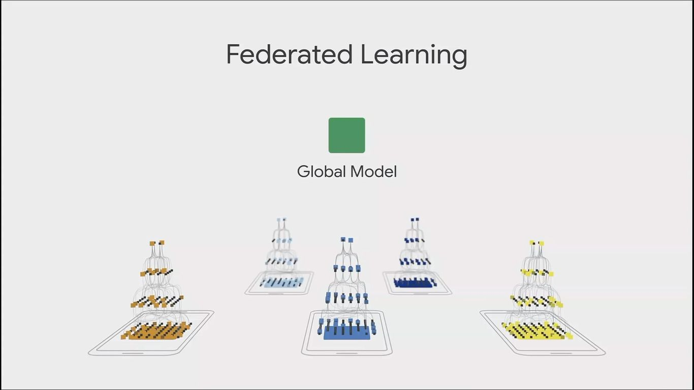

## Tłumaczenie na żywo

### Live Transcribe

Technologia umożliwiająca przekształcanie mowy w tekst na ekranie dla głuchych i niedosłyszących jest dostępna już w ponad 70 językach.

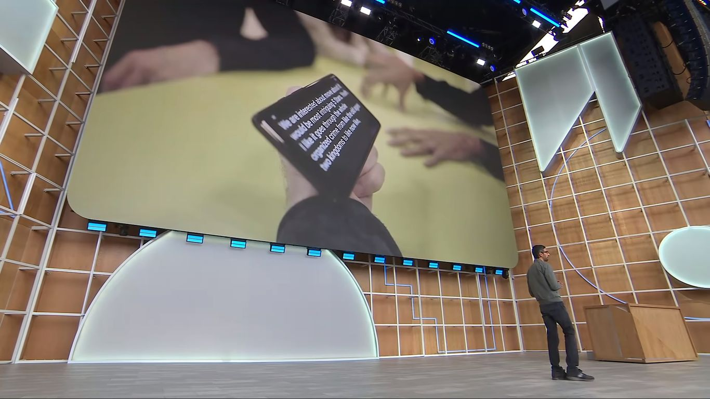

### Live Caption

Jest to nowa technologia, która odpowiedzialna będzie za automatyczne generowanie napisów do nagrań audio i wideo w dowolnej aplikacji.

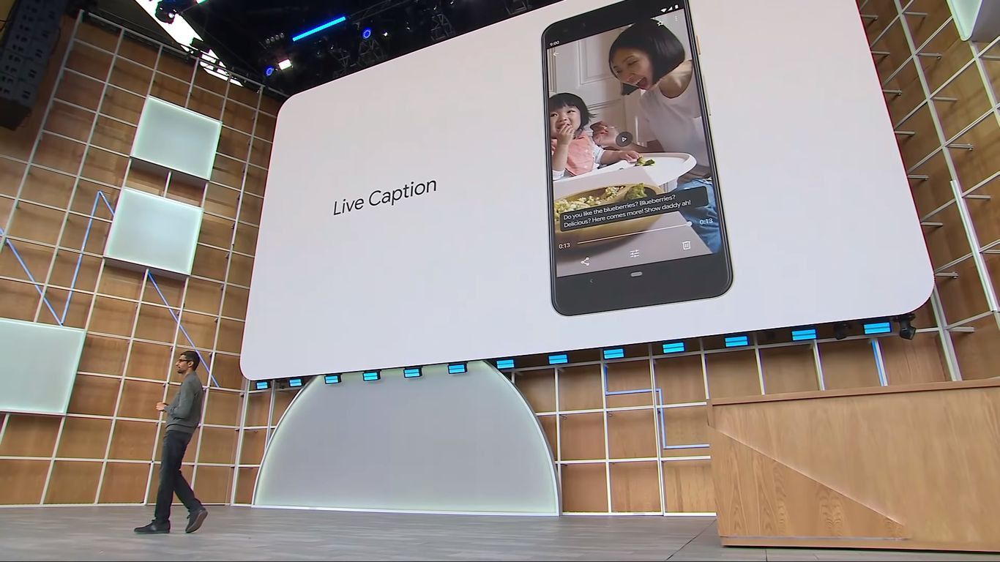

### Live Relay

Następna technologia umożliwi prowadzenie rozmowy telefonicznej za pomocą syntezatora głosu, który wypowie wpisany przez nas tekst. Może być używane zarówno przez osoby niepełnosprawne, jak i te, które z jakiegoś powodu nie mogą teraz prowadzić głosowo konwersacji.

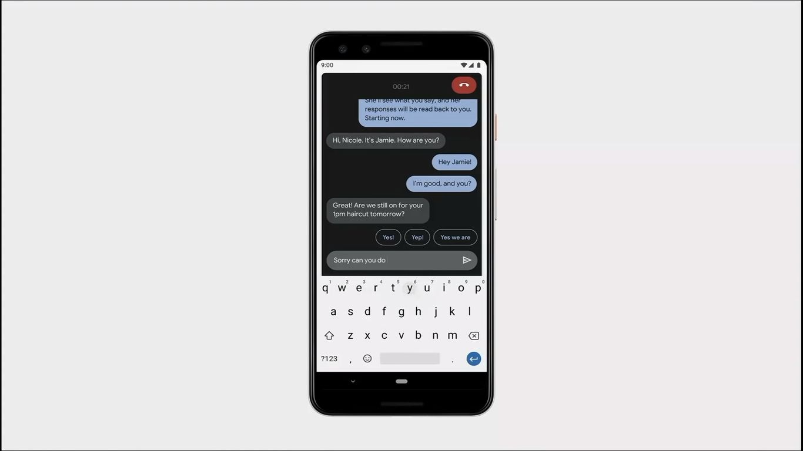

## Android Q

### Wsparcie składanych ekranów

Na konferencji nie mogło zabraknąć wzmianki o najnowszej wersji systemu operacyjnego od Google. Jako pierwszą nowość zaprezentowano wsparcie dla telefonów z rozkładanym ekranem. System umożliwi płynne przełączanie ekranu oraz otwieranie więcej niż 2 aplikacji jednocześnie.

### Wsparcie technologii 5G

Mimo że na razie brak jeszcze ściśle sprecyzowanej specyfikacji nowej sieci 5G Google zapewnia, że Android Q dostanie wsparcie tego standardu.

### Live Caption w trybie offline

Prezenter podczas konferencji zaprezentował działanie omówionej wcześniej technologii Live Caption, a także pokazał, że telefon cały czas znajdował się w trybie samolotowym (bez dostępu do sieci Internet).

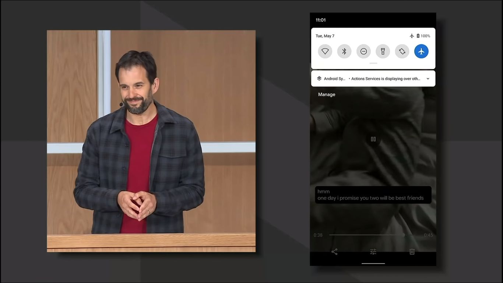

### Smart Reply

Nowy system ma oferować inteligentne odpowiedzi w dymkach z nowymi SMSami. Propozycje będą oferowane na podstawie analizy treści wiadomości. Wśród propozycji znajdą się też akcje takie jak szybkie uruchomienie Google Maps, by sprawdzić przesłany przez znajomego adres restauracji.

### Dark mode!

Nadchodzą ciemne czasy! System ma posiadać wbudowany ciemny motyw, który nie tylko zadba o nasze oczy, ale też i o baterię, jeśli nasze urządzenie posiada ekran OLED.

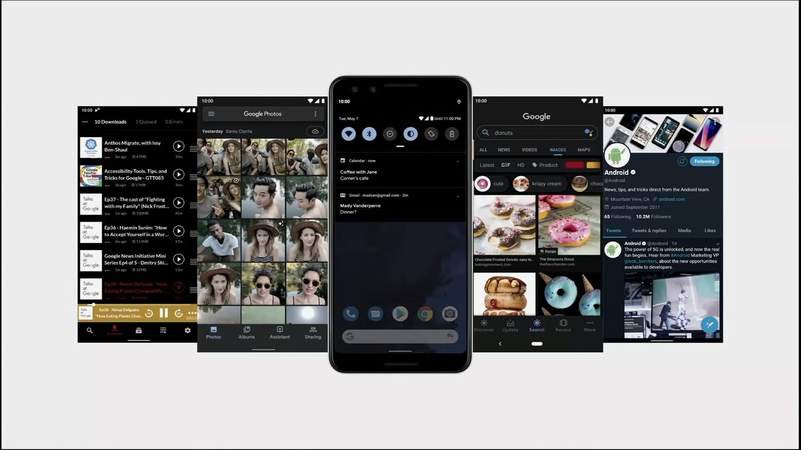

### Prywatność i bezpieczeństwo

Nowy system ma być oczywiście jeszcze bardziej bezpieczny od poprzedniego. Opcje uprawnień pozwolą teraz na jednorazowe udostępnienie naszej lokalizacji podczas uruchamiania aplikacji. Dodatkowo aktualizacje bezpieczeństwa nie będą już wymagały restartowania urządzenia.

### Focus mode

Google nadal rozwija funkcję pozwalającą na lepsze skupienie się na wykonywanej przez nas pracy. “Focus mode” pozwoli na ukrycie wybranych przez nas aplikacji oraz zostawienie tylko tych potrzebnych. Funkcja ta ma też pozwolić na łatwiejsze wyciszenie się przed snem. Tryb ten będzie dostępny na Androidzie P oraz Q.

<AdSense/>

## Google Nest

### Nest Hub oraz Nest Hub Max

Tak nazywają się dwa urządzenia typu “smart display”. Wersja max ma oferować 10-calowy ekran oraz wbudowaną kamerkę. Urządzenia mają dostać całkowicie przebudowany interfejs.

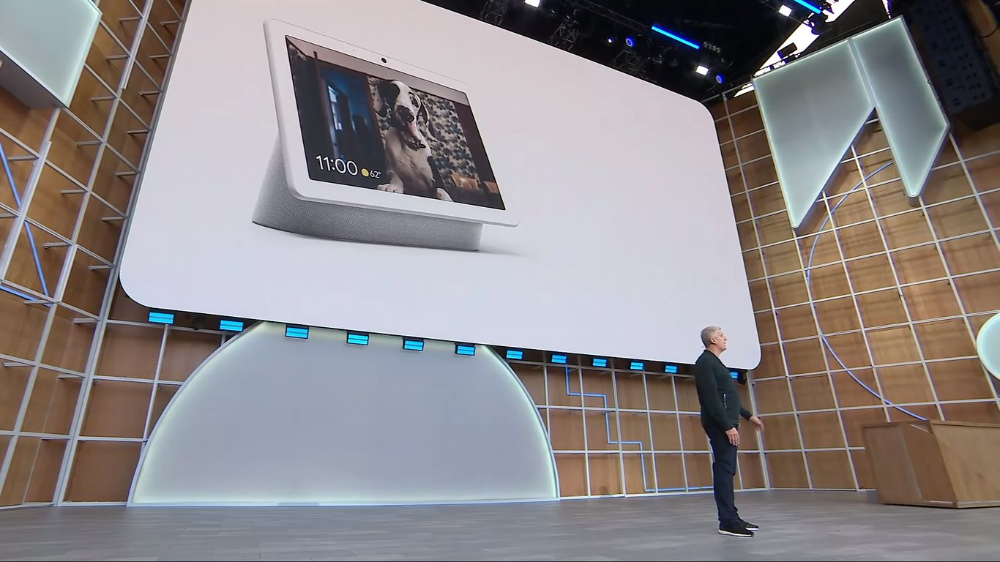

### Google Duo

Nest Hub Max ma wspierać rozmowy za pomocą usługi Google Duo, a wbudowana kamera ma zadbać oto, aby jak najlepiej uchwycić w kadrze poruszającego się po pokoju rozmówcę.

### Prywatność

Oba urządzenia będą posiadać z tyłu fizyczny przełącznik dezaktywujący mikrofon oraz kamerę. Na froncie, obok kamery znajdować się będzie też zielona dioda LED informująca o trwającej transmisji obrazu. Urządzenia będą oferować też opcję identyfikacji głosu rozmówcy. Dzięki temu asystent będzie w stanie rozróżnić mówiących do niego członków rodziny, a co za tym idzie przedstawić im spersonalizowane odpowiedzi. Rozpoznawanie będzie mogło się też odbywać za pomocą kamery i systemu rozpoznawania twarzy wbudowanego w urządzenie.

### Integracja z Google Photos

Google Nest będzie mógł służyć jako cyfrowa ramka wyświetlająca nasze ulubione zdjęcia zapisane w chmurze.

### Sterowanie gestami

Urządzenie dostanie obsługę gestów, które umożliwi na przykład szybkie wyciszenie odtwarzanej muzyki za pomocą gestu podniesionej dłoni. Jest to znacznie bardziej wygodne niż przekrzykiwanie muzyki, żeby wypowiedzieć frazę "Hey Google! Stop the music!".

Urządzenie w wersji Max będzie kosztowało 229$, a w wersji podstawowej 129$.

## Google Pixel

### Wersje

Najnowszy model Pixela będzie sprzedawany w dwóch wersjach: zwykłej oraz XL. Ten tańszy, ma kosztować jedynie 399$, co jest dość niską ceną w porównaniu z poprzednimi generacjami tego urządzenia. Do czarnej i białej wersji urządzenia dołączy trzeci zawodnik z kolorem "Purple-ish".

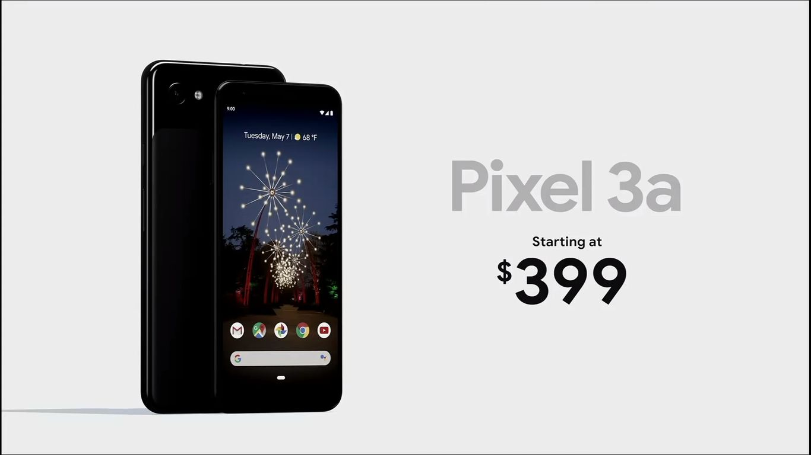

### Funkcje

Google Pixel zostanie wyposażony m.in. w Bluetooth 5.0, dobry dźwięk audio, złącze jack 3.5mm (Można? Można!) oraz niesamowity aparat. Niesamowity, ponieważ Google zapewnia, że zdjęcia z tego telefonu będą w stanie konkurować z fotografiami wykonanymi flagowymi modelami innych producentów. Dodatkowo telefon zaoferuje funkcję rozmywania tła w portretach oraz nielimitowaną chmura dla zdjęć w usłudze Google Photos. Pixel ma dostać adaptacyjną baterię napędzaną sztuczną inteligencją, która pozwoli wykrzesać z niego 30 godzin pracy na jednym ładowaniu oraz szybkie ładowanie (7 godzin pracy w 15 minut ładowania).

### Specjalne funkcje Google Assistant

Asystent w tym modelu będzie mógł być wywoływany poprzez ściśnięcie boków telefonu. Pixel dostanie też specjalną funkcję do prowadzenia rozmów z telemarketerami (wraz z możliwością oznaczenia jako spam), a także Google Maps wzbogacone o wirtualną rzeczywistość.

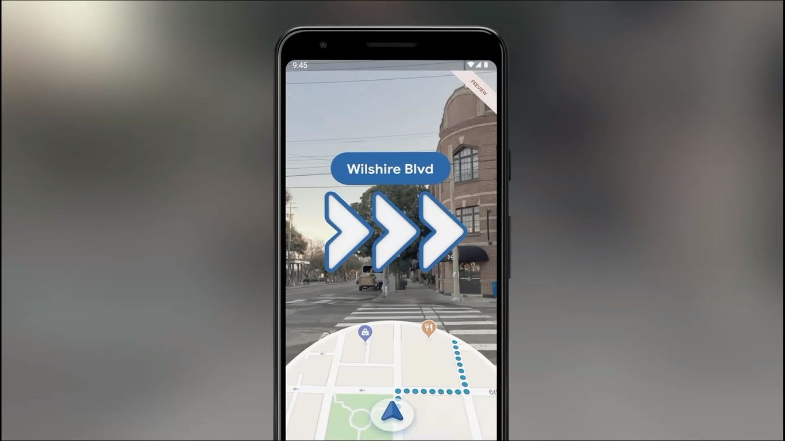

## Sztuczna inteligencja w służbie ludzkości

### Medycyna

Google stawia na szerokie zastosowanie sztucznej inteligencji w medycynie, a szczególnie w onkologii. Gigant pracuje nad sztuczną inteligencją, która dzięki skanom rezonansu magnetycznego różnych pacjentów uczy się prawidłowo i jak najszybciej wykrywać nowotwory. Pozwoli to zwiększyć szansę pacjentów nawet o 40%.

### Klęski żywiołowe

Google AI pomoże także w przewidywaniu klęsk żywiołowych takich jak powodzie. W przypadku ryzyka zalania danego terenu Google powiadomi o ryzyku wszystkich użytkowników mieszkających na tym terenie za pomocą swoich usług składowych.

## Podsumowanie

To już wszystkie z technologii zaprezentowanych na tegorocznej konferencji Google I/O. Mnie osobiście konferencja bardzo się podobała i pokazała, że w asystentach głosowych oraz sztucznej inteligencji jest przyszłością naszej technologii. Całość transmisji możecie [obejrzeć tutaj](https://www.youtube.com/watch?v=lyRPyRKHO8M).
