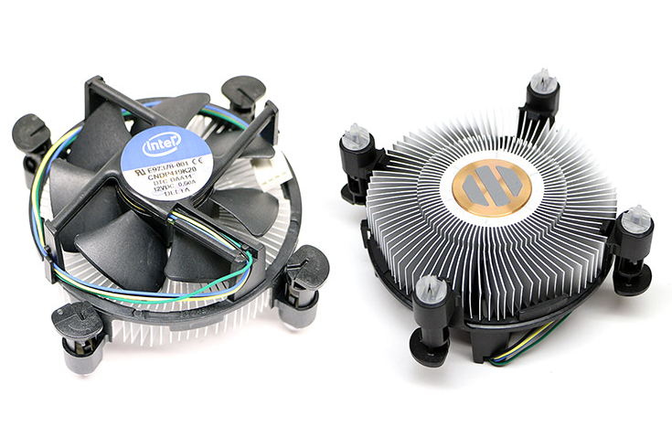
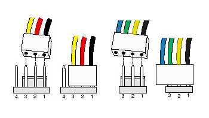
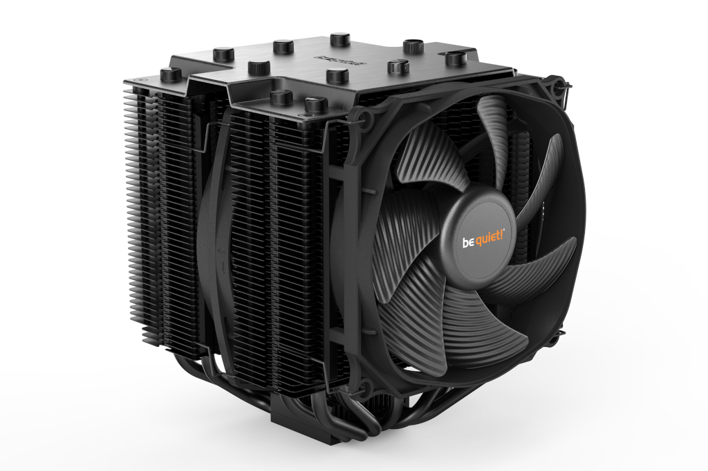
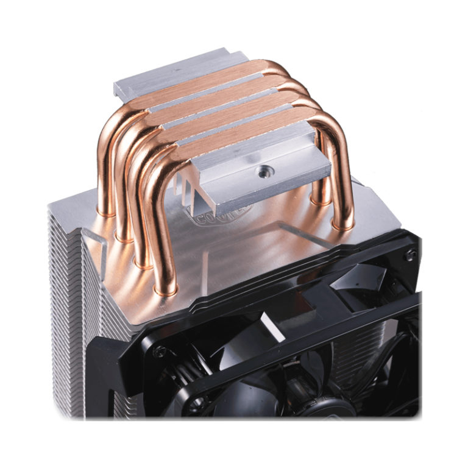
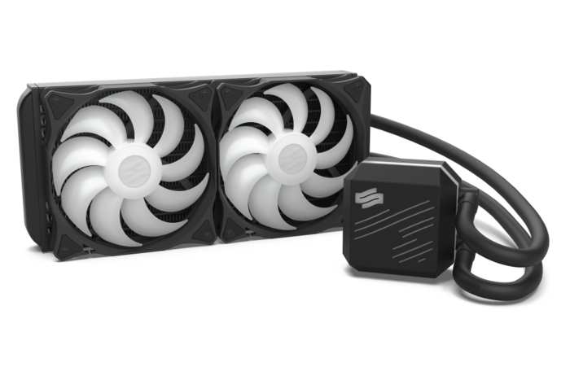

Komputer, jak każde urządzenie elektryczne, podczas swojej pracy wydziela ciepło, które musi zostać odprowadzone. By zapobiec przegraniu się elementów, BIOS stale monitoruje temperaturę kluczowych podzespołów komputera. Gdy temperatura jednego z elementów osiągnie wartość krytyczną, dojdzie do awaryjnego, chwilowego odcięcia zasilania jednostki tzw. resetu. Jest to najczęściej występująca oznaka tego, że nasz komputer nie jest w prawidłowy sposób chłodzony.

## Rodzaje chłodzenia podzespołów

### Aktywne

Zestawy do chłodzenia elementów komputera można podzielić na trzy główne kategorie. Najpopularniejszą metodą jest **aktywne chłodzenie powietrzem**, czyli wszelkiej maści wentylatory. W przypadku chłodzenia [procesorów](/procesory) i [kart graficznych](/karty-graficzne) wentylator jest wspomagany przez metalowy radiator, który odpowiada za rozproszenie ciepła podzespołu na większą powierzchnię. Sposób ten jest tani i zapewnia przyzwoitą wydajność. Niestety posiada też wady, do jakich należy hałaśliwa praca oraz osiadanie się dużej ilości kurzu (co wymusza okresowe czyszczenie).

<GoodList>
- Niski koszt wentylatorów
- Dobra wydajność
</GoodList>

<BadList>
- Głośna praca wentylatorów
- Osadzanie się kurzu na łopatkach wirnika oraz na radiatorze
</BadList>

Alternatywnym sposobem aktywnego chłodzenia komputera jest **wykorzystanie cieczy**. Jest to znacznie bardziej skomplikowane rozwiązanie, a co za tym idzie, jest też dużo droższe i zajmuje o wiele więcej miejsca w obudowie. Jednak rozwiązanie to charakteryzuje się znacznie większą wydajnością i cichszym trybem pracy.

<GoodList>
- Wysoka wydajność
- Cichsza praca układu (wszystko zależy od wentylatorów przy chłodnicy)
</GoodList>

<BadList>
- Wysoka cena zestawu
- Duże gabaryty wymagające odpowiedniej obudowy
- Ryzyko zalania podzespołów komputera
</BadList>

<AdSense/>

### Pasywne

Przeciwieństwem poprzedniego rozwiązania jest chłodzenie pasywne **składające się wyłącznie z nieruchomych elementów**. Należą do nich radiatory oraz rurki cieplne nazywane "heat pipe'ami". Chłodzenie to charakteryzuje się brakiem ruchomych elementów. Ruch powietrza, w tym przypadku, nie jest wymuszany i polega jedynie na zjawisku unoszenia się do góry ciepłych mas powietrza. Do zalet tego rozwiązania przede wszystkim można zaliczyć całkowicie bezgłośną pracę chłodzenia oraz umiarkowane osadzanie się kurzu, który można łatwo zetrzeć, ponieważ radiator nie jest zasłonięty wentylatorem. Powodem rzadkiego stosowania tego rozwiązania jest niska wydajność chłodnicza, co umożliwia wykorzystanie tego typu chłodzenia jedynie w małowydajnych jednostkach.

<GoodList>
- Całkowicie bezgłośna praca chłodzenia
</GoodList>

<BadList>
- Bardzo mała wydajność chłodzenia
- Radiatory przyjmują często duże rozmiary, co utrudnia montaż w małej obudowie
</BadList>

### Półpasywne

Trzecia odmiana jest wariacją dwóch powyższych rozwiązań. Swoją budową bardzo przypomina aktywne chłodzenie powietrzem, z tą różnicą, że może posiadać bardziej rozbudowany radiator wraz z rurkami cieplnymi.

Układ ten opiera się na płynnym przełączaniu się między standardowym chłodzeniem pasywnym a takim wspomaganym aktywnie. Układ taki najczęściej można spotkać na [kartach graficznych](/karty-graficzne). Zazwyczaj wentylatory uruchamiane są po przekroczeniu 60 stopni Celsjusza, czyli podczas grania w gry komputerowe. Takie rozwiązanie zapewnia cichą pracę przy normalnym użytkowaniu komputera i nieduże podwyższenie ceny urządzenia.

<GoodList>
- Cicha praca pasywnego układu chłodzenia podczas małowymagającej pracy
- Wysoka wydajność chłodzenia
</GoodList>

<BadList>
- Nieco podwyższona cena urządzenia
</BadList>

## Dobieranie chłodzenia CPU

Dwoma najbardziej grzejącymi się elementami jednostki komputera są procesor oraz karta graficzna. Drugi z tych podzespołów zawsze posiada swoje własne chłodzenie, które może zostać zamienione przez użytkownika, ale nie jest to często spotykane. Procesor natomiast zawsze posiada osobne chłodzenie montowane przez nas. Może to być tzw. [chłodzenie BOX-owe](/procesory), czyli dołączane do podzespołu przez producenta lub zakupione oddzielnie.

### Kupić box czy szukać na własną rękę?

To zależy od przeznaczenia komputera oraz od preferencji użytkownika. Dla komputerów, których zadaniem będzie przeglądanie Internetu, obsługa pakietu biurowego czy inne małowymagające rzeczy, standardowe chłodzenie producenta w zupełności wystarczy. Jest tanie i bardzo proste w montażu. Jeśli chodzi o głośność pracy, tutaj zdania są podzielone. Jedni uważają, że układy te są ciche i nie przeszkadzają w pracy, a inni uważają, że są stanowczo za głośne.

<ImageDescription>Standardowe chłodzenie dołączane do wszystkich wersji BOX procesorów Intela</ImageDescription>

Jeśli użytkownik chce jak najbardziej wyciszyć komputer, a w dodatku jego jednostka będzie wykonywać złożone operacje (gry, obróbka wideo), warto sięgnąć po zewnętrzne rozwiązania. Wybór jest bardzo duży. Począwszy od małych zestawów przypominających standardowe chłodzenie, po wielkie bloki metalu z kilkoma wentylatorami. Niezależnie jaki typ chłodzenia wybierzemy, należy zwrócić uwagę na kilka parametrów:

### Kompatybilność podstawki

Podczas wyboru procesora musieliśmy zwrócić uwagę na gniazdo, jakie posiada nasza [płyta główna](/plyty-glowne-czesc-1). W przypadku dobierania chłodzenia sprawa wygląda podobnie. Rozstaw otworów montażowych może różnić się w zależności od posiadanego przez nas gniazda procesora. Każde chłodzenie w swojej specyfikacji ma podaną **listę socketów, z jakimi jest kompatybilna**. Duże, rozbudowane zestawy chłodzące najczęściej posiadają uniwersalne mocowanie, które może zostać zamontowane na większości procesorów.

### Złącze zasilania wentylatora

By wentylator mógł się obracać, potrzebne jest zasilanie. Pobierane jest ono z płyty głównej, za pomocą specjalnie przeznaczonych do tego złącz. Posiadają one cztery lub trzy piny oraz występują w jednej albo dwóch sztukach. Znajdują się w pobliżu gniazda procesora, a oznaczone są skrótem "CPU\_FAN". Choć same gniazda najczęściej posiadają 4 piny, tak wtyczka wentylatora już nie musi. Na podstawie ilości kabli wychodzących z wentylatora można określić kilka jego właściwości:

- **2 piny** - Standardowy wentylator kręcący się zawsze ze stałą prędkością. Komputer nie jest w stanie go kontrolować, a nawet stwierdzić jego obecności. Może być używany tylko do chłodzenia obudowy.
- **3 piny** - Wentylator z czujnikiem obrotów. Komputer tym razem jest w stanie wykryć podzespół, a także obliczyć jego prędkość obrotową. Nie może jednak nadal sterować jego prędkością. Wentylator może być stosowany do chłodzenia CPU, ale nie będzie to efektywne.
- **4 piny** - Wentylator wyposażony w regulator obrotów. Komputer może obliczyć jego prędkość obrotową, a także płynnie ją modyfikować. Jest to najlepsze rozwiązanie, ponieważ zapewnia maksymalną wydajność i cichą pracę przy niskich temperaturach.

<ImageDescription>Uniwersalne złącze wentylatorów, źródło: allpinouts.org</ImageDescription>

Gniazda wentylatorów są na tyle uniwersalne, że pozwalają na podłączenie wtyczek 4 pinowych do gniazd z trzema bolcami i na odwrót. Oczywiście wiąże się to z utratą części funkcjonalności, które zostały przed chwilą omówione.

<WarningBlock>Złe podłączenie wentylatora procesora lub podłączenie wersji bez czujnika obrotów zakończy się natychmiastowym wyłączeniem komputera. Jest to mechanizm bezpieczeństwa, który nie dopuszcza do przegrzania się jednostki obliczeniowej.</WarningBlock>

### Ilość łopatek oraz średnica wentylatora

Wydajność oraz głośność pracy zestawu chłodzącego w dużej mierze zależy od łopatek wentylatora tłoczącego powietrze. Najważniejsza jest **średnica wentylatora**. Im jest on większy, tym może pracować z mniejszą prędkością obrotową. Drugim aspektem jest **ilość łopatek**, jaką posiada wentylator. Im ich więcej, tym wentylator jest w stanie wygenerować mocniejszy ciąg powietrza.

<ImageDescription>Chłodzenie be quiet! DARK ROCK PRO 4 posiada dwuwieżowy radiator oraz dwa wentylatory z siedmioma żebrowanymi łopatkami, źródło: bequiet.com</ImageDescription>

Producenci, chcąc zminimalizować hałas powstający podczas pracy wentylatora, wyposażają ich łopatki w szereg dodatkowych elementów. Są to wszelkiego rodzaju perforacje oraz żebrowania, które niwelują wibracje wywołane przepływem powietrza. Ich skuteczność najlepiej ocenić po opiniach wystawianych przez kupujących.

### Łożysko

Wentylator, by móc się swobodnie obracać, musi zostać wyposażony w łożysko. Istnieją dwa główne typy tych elementów:

- **Łożysko kulkowe** - Zbudowane jest z dwóch pierścieni, w których znajduje się specjalny koszyk trzymający metalowe kulki. Jest to bardzo wytrzymałe rozwiązanie, ale generuje wibracje oraz hałas.
- **Łożysko ślizgowe** - Zbudowane jest z trzpienia i panewki. Tarcie zmniejszane jest najczęściej za pomocą filmu olejowego. Rozwiązanie to ma mniejszą żywotność oraz źle znosi pracę w poziomie. Generuje za to mniej wibracji oraz hałasu.

<AdSense/>

### Wysokość zestawu

Gdy radiator jest bardzo rozbudowanych lub umieszczamy go w [obudowie typu SFF](/obudowy-czesc-1), ważna jest wysokość całego zestawu chłodzącego. Dopuszczalną wartość znajdziemy w specyfikacji obudowy. Jeśli nie, konieczne będzie ręczne zmierzenie dostępnego miejsca. Do małych obudów dobrze sprawdzą się zestawy niskoprofilowe. Posiadają one płaski radiator, który często okala cały wentylator.

Cooler Master GEMINII M4, źródło: coolermaster.com

### Wykonanie radiatora - aluminium czy miedź?

Wydajność radiatora zależy od rodzaju metalu, z jakiego jest wykonany. Najpopularniejszym materiałem jest aluminium, który można poznać po srebrnym kolorze. Nie ma ono bardzo dobrych właściwości przewodzących, ale jest tanie, więc idealnie nadaje się na żebrowania radiatora.

Znacznie lepszym materiałem jest miedź. Posiada ona bardzo dobre właściwości przewodzące, ale jej zastosowanie wiąże się z wyższą ceną. Z miedzi wykonywana jest podstawka radiatora łącząca go z procesorem oraz rurki cieplne zwane "heat pipe'ami". W przypadku rozbudowanych zestawów służą one do równomiernego rozprowadzenia ciepła po całym radiatorze (zdjęcie poniżej). Droższe modele mogą posiadać rurki miedziane pokryte warstwą niklu (rurki niklowane). Nadaje im to srebrny, połyskujący kolor, a także hamuje proces utleniania się miedzi.

<ImageDescription>Chłodzenie wieżowe Cooler Master HYPER H410R, źródło: coolermaster.com</ImageDescription>

### Dołączona pasta termoprzewodząca

Aby zapewnić sprawny transfer ciepła między obudową procesora a radiatorem potrzebna jest specjalna substancja, która wypełni luki między tymi elementami. Tą substancją jest tzw. pasta termoprzewodząca. Wielu producentów radiatorów dołącza do swoich produktów małą tubkę lub strzykawkę z tą pastą, ale lepiej się upewnić czy faktycznie tak jest. W przypadku zestawów BOX Intela pasta jest już od razu nałożona na radiator, co sprawia, że nie trzeba zaprzątać sobie nią głowy.

## Chłodzenie cieczą

Alternatywą dla tradycyjnego chłodzenia powietrzem jest chłodzenie cieczą. Występuje ono w dwóch wersjach. W postaci gotowych zestawów oraz zestawu części do samodzielnego skonstruowania układu.

### Gotowe zestawy

Jest to bardzo popularny sposób na zastosowane chłodzenia tego typu w komputerze. Dzięki gotowej, zamkniętej budowie jest łatwy w montażu oraz nie zabiera dużo miejsca w obudowie. Zestawy składają się z dwóch elementów połączonych parą elastycznych przewodów. Pierwszym z nich jest blok wodny przyczepiany do procesora jak klasyczne chłodzenie powietrzem. Drugim elementem jest chłodnica z zestawem wentylatorów.

<ImageDescription>SilentiumPC Navis RGB 240, źródło: silentiumpc.com</ImageDescription>

Całość działa na tej samej zasadzie co chłodzenie silnika w samochodzie. Płyn chłodzący krąży w układzie, odbierając ciepło z powierzchni procesora. Następnie wędruje do chłodnicy, gdzie dzięki rozproszeniu na dużej, żebrowanej powierzchni oddaje ciepło do otoczenia. Sama chłodnica może być zamontowana na zewnątrz, jak i [wewnątrz obudowy (poziomo do sufitu)](/obudowy-czesc-2).

### Niestandardowe zestawy

Chłodzenie cieczą można też skonstruować samemu od podstaw. Jest to bardzo drogie rozwiązanie, które zajmuje dużo miejsca w obudowie. Jego konstruowanie jest też bardzo niebezpieczne. Cały układ musi być odpowiednio dopasowany, całkowicie szczelny oraz dobrze odpowietrzony.

Proces składania takiego zestawu jest bardzo złożony i nie chciałbym go tutaj bardziej poruszać. Dodatkowo nigdy nie miałem styczności z jednostkami wyposażonymi w takie chłodzenie, dlatego też nie chcę zgrywać eksperta w dziedzinach, na których się nie znam.

## Wentylator z ANC

Na koniec chciałbym pokrótce przedstawić pewien nietypowy zestaw chłodzenia powietrzem. Wyposażony jest on w układ aktywnej redukcji hałasu. Jest to technologia bardzo popularna w słuchawkach, która pozwala prawie całkowicie zniwelować dźwięk otoczenia. Więcej informacji na temat tej technologii można znaleźć [w tym artykule](/sluchawki).

<YouTube id='AikMzJc9gcY' title='wentylator z anc'></YouTube>

Samo zastosowanie tej technologii w wentylatorze to nie wszystko. Firma RotoSub postanowiła nie używać do redukcji hałasu głośników, a łopatek wirnika. Tak, w połączeniu z firmą Noctua powstał prototyp wentylatora posiadający na końcach swoich łopatek małe magnesy. Specjalny układ ANC rejestruje dźwięk pracy wentylatora, a następnie wprowadza jego łopatki w odpowiednie drgania, które redukują niepożądane zawirowania powietrza. Jest to na razie tylko prototyp, a sam producent oznajmia, że dopracowanie tej technologii nie jest łatwe.

## Podsumowanie

Zapraszam na krótkie podsumowanie informacji zawartych w artykule:

<OkList>
- Najtańszym rozwiązaniem jest radiator z wentylatorem. Najbardziej wydajne jest chłodzenie cieczą. Pasywne chłodzenie radiatorem nadaje się tylko do małowydajnych jednostek.
- W przypadku kupowania wentylatorów ważna jest cena urządzenia. Tani model zazwyczaj jest bardzo słabej jakości oraz zapewnia słabe chłodzenie przy głośnej pracy.
- Im większa średnica wentylatora, tym lepiej - będzie mógł pracować z mniejszą prędkością obrotową.
- Choć wykonanie BOX-owych chłodzeń producentów procesorów pozostawiają wiele do życzenia, to jednak oferują przyzwoitą wydajność przy niskiej cenie. Plusem jest też bardzo łatwy montaż.
</OkList>
