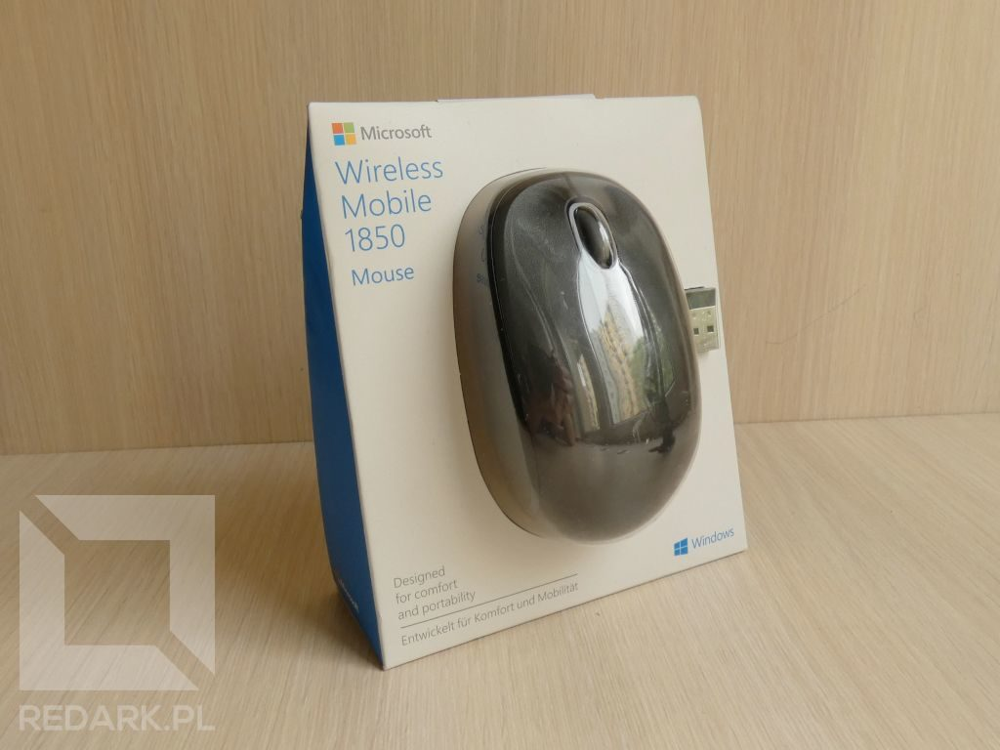
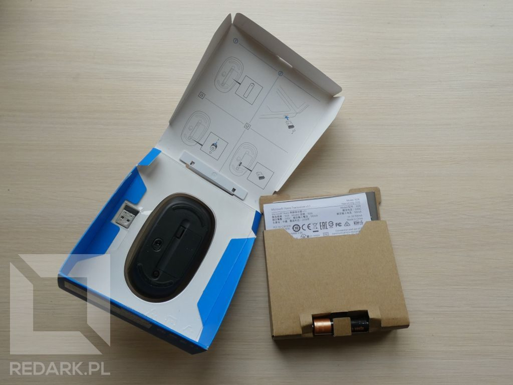
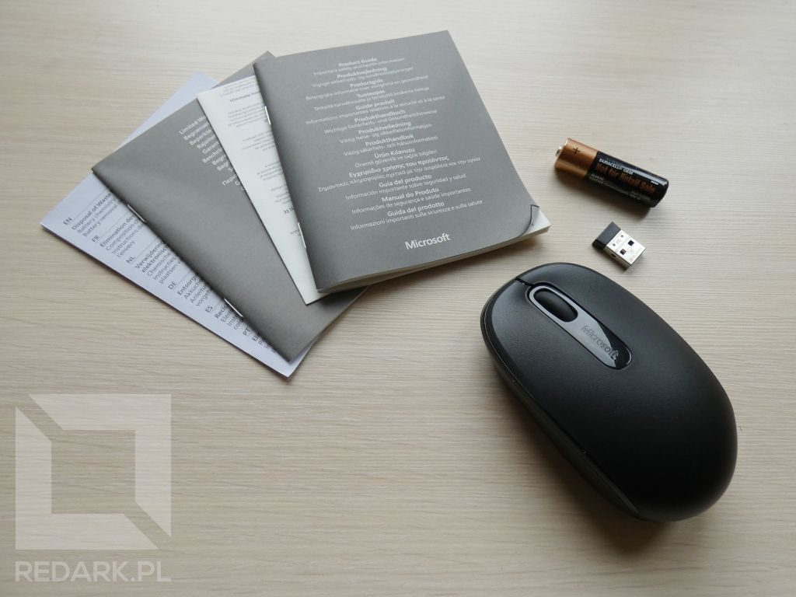
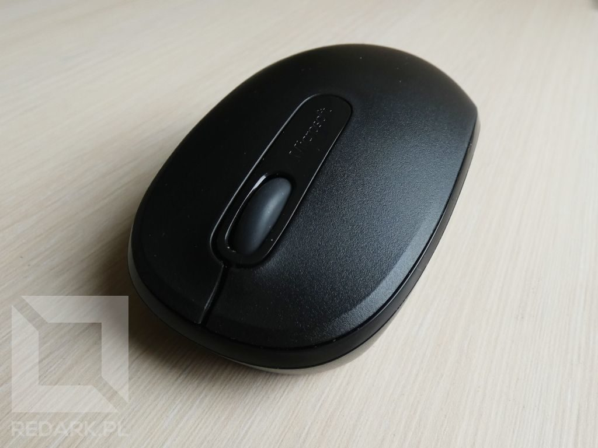
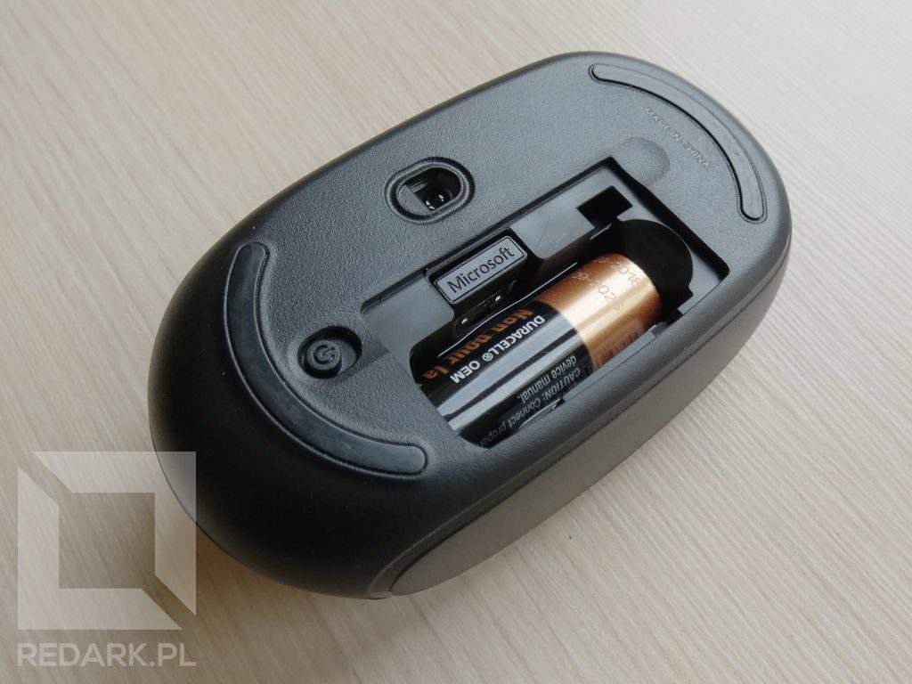
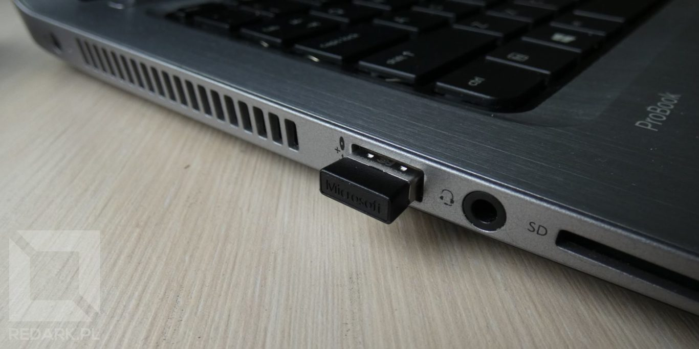

Minęły raptem trzy miesiące od [recenzji myszy Logitech G402](/logitech-g402-hyperion-fury-recenzja), a tu los chciał, że moja mobilna mysz do laptopa (od tego samego producenta) postanowiła dokonać żywota. Awaria bardzo pospolita - uszkodzenie mikro przełącznika lewego przycisku. Każdy, komu się to przydarzyło, wie, jak ciężkie staje się wtedy przeciągnięcie pliku czy okna. Sytuacja ta zmusiła mnie do szybkiego zakupu nowego gryzonia. Wymaganiami były: kompaktowe wymiary, dobre wykonanie, komunikacja radiowa oraz niewygórowana cena.

Batalia odbyła się między trzema producentami: Logitech'em, HP i Microsoftem. W ofercie pierwszego z nich znalazłem kilka modeli, które sprawiały wrażenie bardzo lichej konstrukcji, a w asortymencie HP solidny model X3000, ale połyskujący plastik trochę psuł jego wygląd. Natomiast Microsoft zaoferował mi szeroką gamę eleganckich i dobrze zrobionych gryzoni, a wśród nich model 1850.

## Unboxing

Mysz przychodzi do nas w plastikowej wytłoczce połączonej z kartonowym pudełkiem. Na froncie oprócz myszy widoczny jest też nano odbiornik USB służący do połączenia urządzenia z komputerem. Samo pudełko jest utrzymane w biało-niebieskiej kolorystyce, charakterystycznej dla tego producenta.

Pudełko po przecięciu plomb otwiera się z tyłu jak książka. Wewnątrz znajdziemy tekturowy organizer, do którego włożona jest dokumentacja oraz bateria AA potrzebna do zasilenia urządzenia. Na tylnej ściance opakowania znajdziemy też skróconą instrukcję przygotowania myszy do pracy.

## Recenzja

### Wykonanie myszy

Mysz wykonana jest prawie w całości z matowego plastiku dobrej jakości. Z jego błyszczącej odmiany wykonane są jedynie kanty oraz obszar wokół kółka. Mysz ma wymiary 970x54x35 mm oraz waży 84 gramy (wraz z baterią). Urządzenie dobrze leży w dłoni i nie sprawia wrażenia, że można by je uszkodzić przy mocniejszym ściśnięciu.

Model posiada trzy podstawowe przyciski. Lewy i prawy, choć trochę głośne, pracują bez zarzutu. Środkowy przycisk oraz kółko chodzą lekko i precyzyjnie. Niestety przy testach wyważenia gryzonia (które, swoją drogą, jest bardzo dobre) zauważyłem, że kółko myszy ma duże luzy. Nie czuć tego podczas obracania go, ale w trakcie poziomego ruchu myszy słychać obijanie się tego elementu w środku urządzenia.

<AdSense/>

### Spód urządzenia

W przypadku myszy bezprzewodowych ważny jest spód urządzenia, który daje nam dostęp do baterii, nadajnika oraz przełącznika umożliwiającego wyłączenie urządzenia. W tym modelu Microsoft umieścił wyłącznik na dole urządzenia, a miejsce na nano odbiornik znajduje się pod klapką baterii. Zarówno przełącznik, jak i zatrzask klapki jest dobrze zrobiony i nie sprawia wrażenia, że uszkodzi się przy częstym użytkowaniu.

### Codzienne użytkowanie

Pierwsze uruchomienie urządzenia oraz jego instalacja w systemie przebiegły bez problemu. Nano odbiornik można bezproblemowo szybko wyjąc z urządzenia i podłączyć do komputera. Mysz trzyma się pewnie w dłoni, a dwa półokrągłe ślizgacze zapewniają jej przyzwoity ruch na większości powierzchni.

Microsoft zapewnia, że jego mysz jest w stanie wytrzymać do 6 miesięcy bez wymiany baterii w przeciwieństwie do innych producentów, który zazwyczaj podają okres 12 miesięcy. Wartości te są tylko szacunkowe i nie przejmowałbym się nimi za bardzo, gdyby nie jeden podstawowy problem. Model 1850 ma problemy z trybem oszczędzania energii, co mocno obniża komfort pracy na niej.

Urządzenia tego typu po pewnym okresie bezruchu przełączają się w tryb zmniejszonego poboru prądu, który polega na obniżeniu czułości sensora optycznego. Problem tej myszy polega na zbyt szybkim przechodzeniu w ten tryb i dużej zwłoce czasu potrzebnej do wyjścia z niego. Czym to się objawia? Wystarczy, że pozostawiłem mysz w bezruchu tylko na czas wpisywania loginu i hasła na stronie internetowej. Jej ponowne chwycenie i przesunięcie skutkuje około półsekundowym opóźnieniem, po którym kursor teleportuje się w ciężkie do przewidzenia miejsce na ekranie.

## Podsumowanie

Microsoft Mouse 1850 jest dobrze wykonanym urządzeniem za nieduże pieniądze. Osoby ceniące sobie wygląd lub wygodę połączoną z mobilnością będą zadowolone. Wadą urządzenia będzie natomiast problem z prawidłowym odczytem ruchu w trybie oszczędzania baterii. Dla osób często "przełączających się" między klawiaturą a myszą komputera będzie to bardzo uciążliwe. Choć model nie jest idealny, to prezentuje dobrą jakość w stosunku do ceny (50 złotych) i moim zdaniem jest bardzo opłacalnym zakupem.
