Jak co roku, oczy wszystkich miłośników cyfrowej rozgrywki skierowane są na Los Angeles. To właśnie tam, 8 czerwca br. rozpoczął się cykl konferencji, na których prezentowany jest najnowszy sprzęt do gier oraz same gry. Postanowiłem na szybko podsumować najważniejsze elementy każdej konferencji w formie krótkich opisów zaprezentowanych nowości.

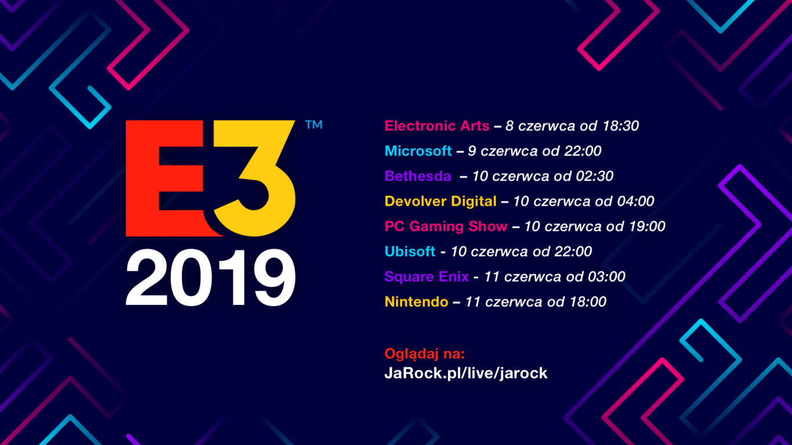

Konferencje można śledzić za pomocą oficjalnych transmisji udostępnionych na platformach takich jak YouTube czy Twitch. Ja ponownie skorzystałem z transmisji z polskim komentarzem zorganizowanych przez Ja, Rock'a. Polecam je wszystkim, którzy nie chcą oglądać transmisji "w pojedynkę" lub nie śledzą informacji o pokazywanych tytułach. Zapraszam na ich [Facebooka](https://www.facebook.com/jarockpl/), [stronę internetową](https://jarock.pl/) oraz [Twitch'a](https://www.twitch.tv/jarock), gdzie pojawiają się wszystkie transmisje z E3.

## EA Play

Cykl konferencji rozpoczął tradycyjnie amerykański producent i wydawca gier - Electronic Arts. Całość konferencji była podzielona na 30-minutowe panele poświęcone konkretnym grom. Znalazły się na nich:

- Star Wars Jedi Fallen Order,
- Apex Legends,
- Battlefield V,
- Fifa,
- Madden NFL,
- The Sims 4.

Konferencja "Elektroników" z każdym kolejnym panelem stawała się coraz bardziej nudna. Wszystko, oprócz Jedi Fallen Order oraz ewentualnie Apex Legends, są to już stare tytuły i ich panele przypominały czytanie "patch notes'ów", czyli listy zmian, jakie wprowadzono w ostatniej aktualizacji.

### Jedi Fallen Order uratował EA

Pierwsza gra okazała się najlepszym, co mogło zaoferować EA. Jest to bowiem trzecioosobowa gra akcji stawiająca na fabułę. Wydawca zapewniał też, że produkcja będzie wolna od trybu multiplayer, technik "pay to win" czy loot box'ów, co jest sporym zaskoczeniem, jeśli chodzi o EA.

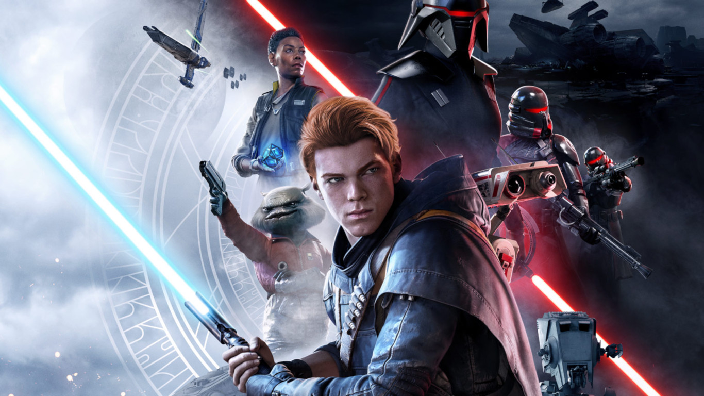

<ImageDescription>Jedi Fallen Order, połączenie Sekiro i Uncharted</ImageDescription>

Na konferencji otrzymaliśmy 15-minutowy gameplay z krótkimi przerywnikami filmowymi. Gra jest jeszcze w fazie alpha, więc graficznie w wielu aspektach nie spełniała jeszcze pożądanych standardów. Na plus należy zaliczyć rozbudowaną mechanikę walki przy użyciu mocy Jedi i miecza świetlnego.

Podczas seansu mogliśmy zauważyć, że bohater potrafi spowalniać pociski laserowe i elementy otoczenia, wyważać zniszczone drzwi oraz przyciągać i odpychać swoich przeciwników. Głównej postaci towarzyszy mały robot, który odpowiedzialny jest za pokazywanie mapy, leczenie oraz hackowanie stacji dokujących przy drzwiach i urządzeniach. Przypominało mi to bardzo funkcje drona znanego z gry Watch Dogs 2, choć z wyglądu bliżej mu do miniaturowego Metal Gear'a.

<AdSense/>

Gra bardzo przypomina połączenie Sekiro i Uncharted. Mechanika walki posiada blokowaną na przeciwniku kamerę, paski staminy oraz mini boss'ów. Pomiędzy walkami będziemy zajmować się zagadkami logicznymi, np. szukaniem właściwej drogi podczas wspinaczki, której towarzyszą filmowe ujęcia, do których przyzwyczaiło nas już Naughty Dog w grach o przygodach Nathana Drake'a. Gra wyjdzie 15 listopada tego roku.

### Apex Legends

Wolny rozwój tej produkcji sprawił, że liczba graczy Apex'a spadła tak szybko, jak urosła zaraz po premierze. Respawn, studio odpowiedzialne za tą grę zapowiedziało nowy sezon pt. "Battle Charge", nową złotą broń L-STAR, nowe skiny na bronie (stylizowane chyba na grę Destiny 2), tryb rankingowy oraz nową legendę - Watson. Jest to francuska wynalazczyni, która będzie posiadać ręcznie rozstawiany, wysoki pastuch elektryczny oraz urządzenie chroniące nas przed nalotami z powietrza. Było więc trochę treści, ale moim zdaniem można było to zaprezentować w 10 minut.

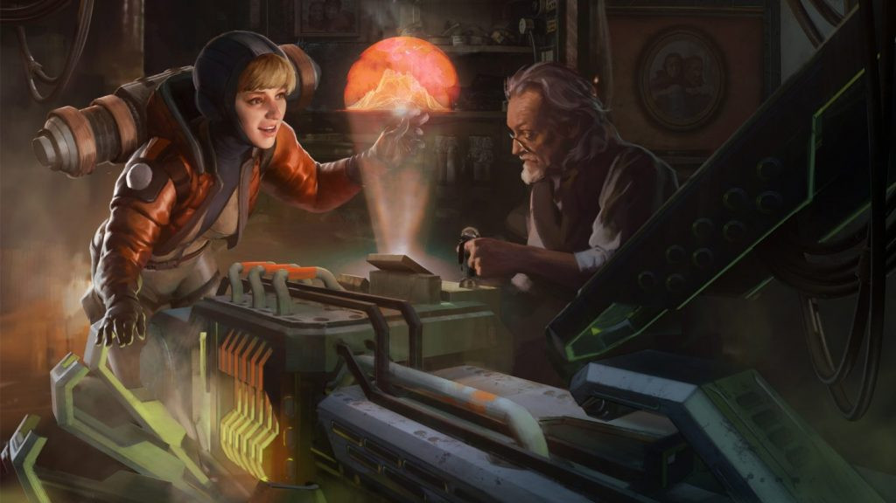

<ImageDescription>Nowa legenda dołącza do świata Apex!</ImageDescription>

### Dalszy ciąg konferencji

Później było już coraz słabiej. Battlefield? Jedynie omawianie nowych map. Fifa? Jest nowa osłona, powrót do gier na ulicy, nowe mechaniki. Niby coś nowego, ale raczej nie zainteresowałoby to osoby niegrającej w Fifę. Madden NFL? Tutaj już mój mózg całkowicie przestał rejestrować, co mówili prowadzący. Konferencję zamknęła gra The Sims 4 i jej nowe DLC poświęcone życiu na wyspie. Będzie sprzątanie śmieci z plaży, wulkan wyrzucający meteoryty, a także syreny.

<VideoViewer file='images/battlefieldv_phoneguy.mp4'></VideoViewer>

<ImageDescription>Mistrz drugiego planu</ImageDescription>

## Microsoft

Jedna z najciekawszych konferencji na E3. W tym roku swojej konferencji nie przygotowała największy konkurent zielonych, czyli Sony - firma postanowiła wycofać się z udziału w E3 na rzecz własnych imprez.

### Cyberpunk 2077

<YouTube id='qIcTM8WXFjk' title='cyberpunk 2077'></YouTube>

Konferencja rozpoczęła się z przytupem. CD Project, twórcy Wiedźmina, pokazali kolejny trailer ich nowej gry, jaką jest Cyberpunk 2077. Tego tytułu chyba nikomu nie muszę przedstawiać. Zaskoczeniem było jednak pojawienie się w trailerze oraz na scenie Keanu Reeves'a. Akor znany z filmów takich jak John Wick czy Matrix użyczy swojego wizerunku w grze autorstwa naszego rodzimego studia. Gra otrzymała datę premiery: 16 kwietnia 2020 roku.

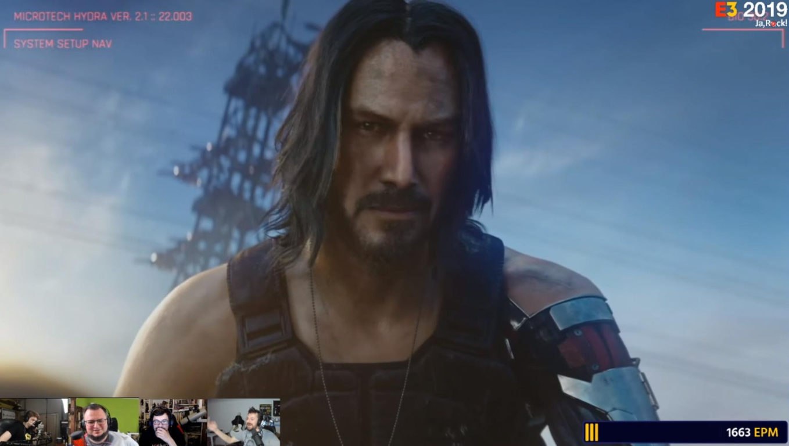

<ImageDescription>Keanu Reeves? Dlaczego nie Karolak?!</ImageDescription>

### Project Scarlett

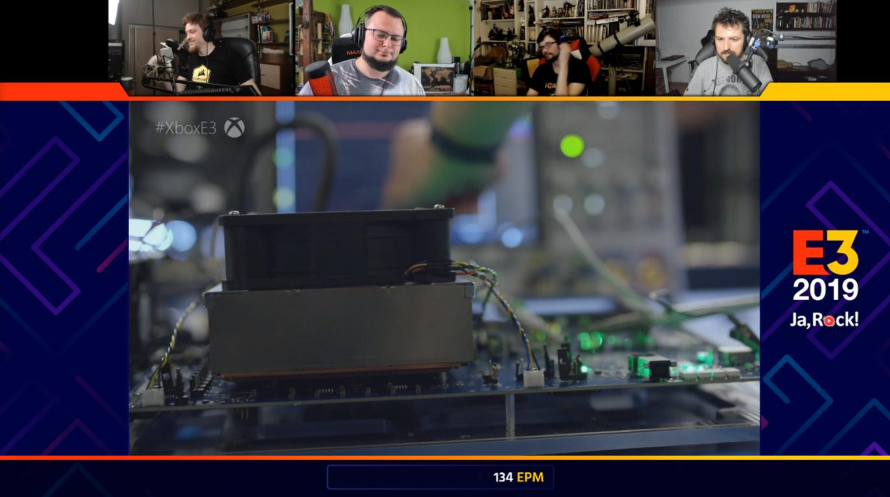

<ImageDescription>Czy to aby na pewno bebechy nowego Xbox'a?</ImageDescription>

Project Scarlett, czyli nazwa kodowa nowej konsoli Microsoftu. Niby się pojawiła na konferencji, ale jednak nie do końca. Całość prezentacji opierała się na pokazywaniu ujęć procesu jej projektowania i omawianiu, jaka to będzie cudowna. Jednak mamy garść informacji na temat jej specyfikacji:

- procesor AMD Zen 2,
- karta graficzna: Radeon Navi,
- pamięć RAM: GDDR6,
- Elite controler w standardzie,
- obsługa ray tracingu w rozdzielczości 8K i 120FPS,
- dysk SSD.

### Pozostałe produkcje

Na konferencji zobaczyliśmy również:

- nowy Microsoft Flight Simulator,
- trailer Dying Light 2 podkreślający znaczenie frakcji w grze,
- Forze Horizon 4 w świecie LEGO (CUDO!),
- Gears 5 z postacią Terminatora (premiera 10 września br.),
- widowiskowy trailer gry Crossfire X,
- Halo: Infinite - tytuł startowy na nowego Xbox'a,
- 12 minutes - ciekawa produkcja prezentująca historię za pomocą widoku sierowanego z góry na pokój w mieszkaniu (wygląda bardzo interesująco!).

<Gallery width='2'>
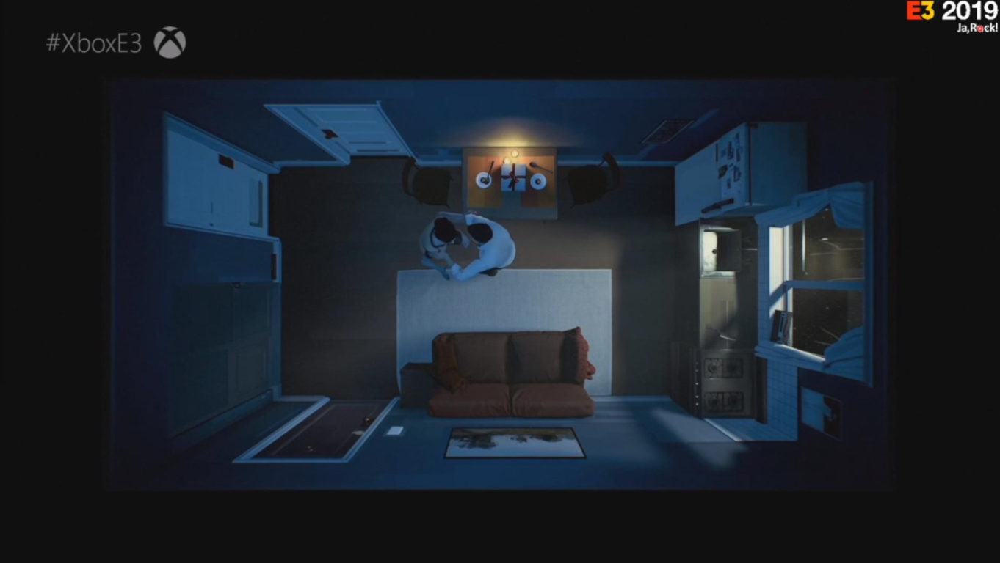
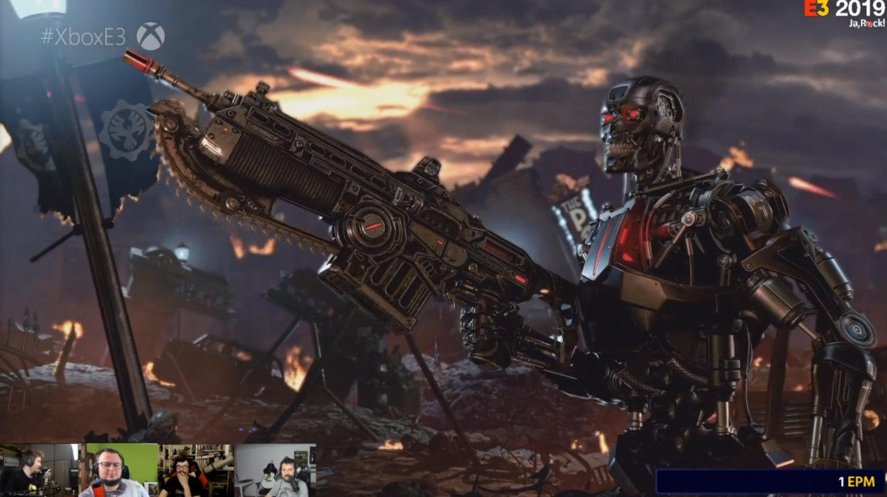
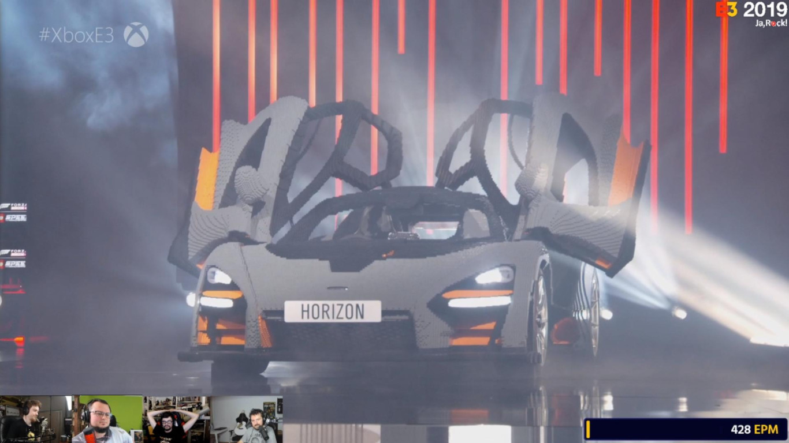
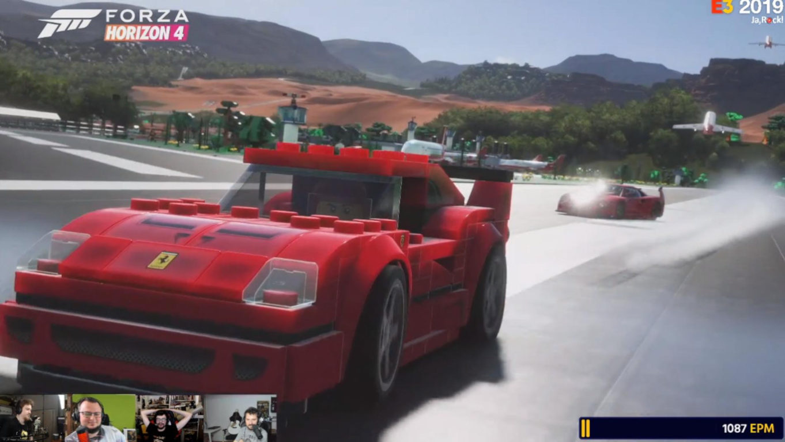
</Gallery>

<YouTube id='N1_7wjuzqwI' title='Dying Light 2'></YouTube>

<YouTube id='8SBDM-6XDIw' title='Forza Horizon 4 LEGO'></YouTube>

<YouTube id='n3ceoeubxxQ' title='Gears 5'></YouTube>

<YouTube id='gXpv5t42kQA' title='Halo Infinite'></YouTube>

<YouTube id='qQ2vsnapBhU' title='Twelve minutes'></YouTube>

## Bethesda

Tej konferencji nie oglądałem na żywo i uważam, że nie straciłem nic a nic. Firma nie pokazała niczego, co sprawiłoby, że nie żałowałbym straconych godzin snu. Na konferencji ujrzeliśmy dwie niezapowiedziane gry: Deathloop oraz GhostWire: Tokyo. Serdecznie zapraszam do obejrzenia ich trailerów, ponieważ są to ciekawe produkcje.

<YouTube id='k4NsBsUbSy8' title='Deathloop'></YouTube>

<YouTube id='9qrXLQqHkJk' title='GhostWire Tokyo'></YouTube>

Dodatkowo Bethesda podziękowała wszystkim za granie w Fallouta 76 (hehe) i ogłosiła nowe elementy, które zostaną do niej dodane. Będą to żywe NPC (no nareszcie), drzewka dialogowe i tryb Battle Royale (hehe x2).

## PC Gaming Show

Ponownie rynek komputerów osobistych chce zawładnąć E3 i znowu kiepsko mu to wychodzi. Tak samo jak rok temu, konferencja PCGS miała formę talk-show połączonego z krótkimi trailerami małych gier. Jedną z pierwszych gier była Vampire The Masquerade: Bloodlines 2, która dostała 10-sekundowy trailer. Następnie z bardziej znaczących tytułów pojawiło się Twin Mirror. Gra twórców Life is Strange ma opóźnienia w produkcji i za rok trafi ekskluzywnie do sklepu Epic Games Store.

Następnie Samsung zaczął przekonywać, jak to super jest mieć ich 240 hercowy monitor. Później można było zobaczyć trailer gry Chivalry 2 - to taki symulator średniowiecza z mechaniką ćwiartowania mieczem, który zadebiutuje w 2020 roku w Epic Games Store. Kolejna pozycja, czyli Last Oasis przykuła to moją uwagę, ale nic więcej.

<YouTube id='Atu3iiMuExE' title='Last Oasis'></YouTube>

W międzyczasie pojawił się także trailer gry Midnight Ghost Hunt. Jest to gra typu multiplayer, w której jeden z graczy wciela się w ukrywającego się w domu ducha. Później był ManEaster - gra o sterowaniu rekinem. Generalnie tegoroczną konferencję PC Gaming Show mogę podsumować tym zdjęciem:

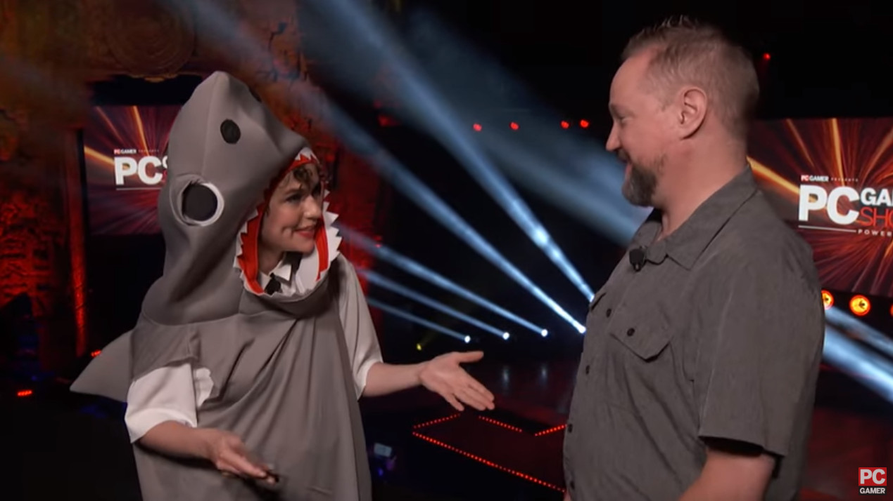

<ImageDescription>Konferencja PC Gaming Shark</ImageDescription>

## Ubisoft

Ubisoft'owi można zarzucać robienie bardzo średnich gier, jednak jest coś, co wychodzi im bardzo dobrze, a mianowicie prezentacja swoich perfekcyjnych trailerów. Ja było w tym roku?

### AC Symphony

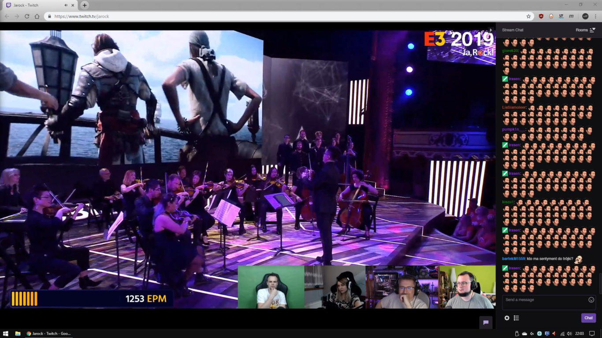

<ImageDescription>Początek orkiestrowy i szał na czacie</ImageDescription>

Nie, to nie jest niezapowiedziana, kolejna część Assasyna. Jest to trasa koncertowa, na której będą ogrywane soundtracki ze wszystkich części sagi. Niestety, atrakcja ominie Polskę.

<YouTube id='huUCIO3Sn2A' title='Assassins Creed Symphony'></YouTube>

### Watch Dogs Legion

Tutaj wypadałoby się na chwilę zatrzymać, ponieważ była to chyba główna atrakcja tej konferencji. Trzecia część serii Watch Dogs została pozbawiona numerka, który został zastąpiony słowem Legion. Akcja produkcji będzie dziać się w niedalekiej przyszłości w postbrexitowym Londynie, którego twórcu ewidentnie czerpali inspirację z Cyberpunk'a 2077. Jak widzieliśmy na trailerze, miasto znajduje się pod stałą obserwacją dronów, a prywatna firma strzeże porządku w mieście, często stosując przemoc fizyczną.

Potwierdziły się informacje, jakie wyciekły tuż przed rozpoczęciem targów E3. Nazwa Legion odnosi się do głównej mechaniki gry, która pozwali nam się wcielić w dowolnego NPC, który został zwerbowany do naszej organizacji hackerskiej DedSec. Gra więc będzie stawiała na to samo, co GTA V, tylko że bez ograniczonej liczby grywalnych postaci.

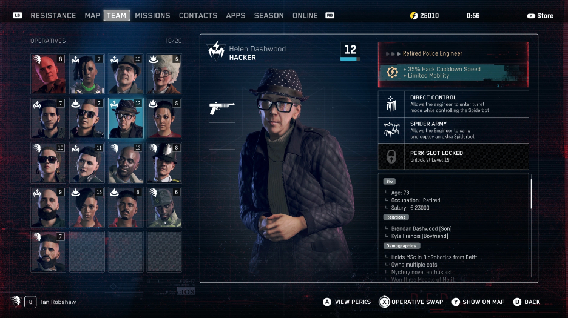

<ImageDescription>Emeryci też dają radę!</ImageDescription>

Najlepszym akcentem trailera połączonego z gameplay'em okazał się moment śmierci naszego pierwszego bohatera (zgon jest permanentny) i płynne przejście do drugiego sojusznika - staruszki. Jak się później okazało, emerytowaną płatną zabójczynią, no ale kto będzie podejrzewać starszą panią?! Więcej nie zdradzę, zobaczcie sami:

<YouTube id='cW5RVvOQm9o' title='Watch Dogs Legion'></YouTube>

Premiera gry odbędzie się 6 marca 2020 roku, a w sklepach już są dostępne preordery na wersje zwykłe i kolekcjonerskie.

<AdSense/>

### Ubisoft też chce mieć swój abonament

Podczas konferencji Ubisoft zaprezentował swój własny abonament o nazwie Uplay+. Za 14,99$ miesięcznie dostaniemy dostęp do ponad 100 gier ze stajni tego producenta. Ech, jak widać taka moda i każdy chce mieć swój abonament.

### Pozostałe atrakcje

Podczas konferencji zaprezentowane zostały również:

- nową operację w grze Rainbow Six Siege,
- Ghost Recon BreakPoint z postacią Terminatora (prezentacja z pieskiem, który skradł show na scenie),
- Elite Squad - mobilna gra zbierająca kilka postaci z różnych gier Tom Clancy,
- jubileuszowa, 10. odsłona gry Just Dance,
- Rainbow Six Quarantine - trzyosobowa kooperacja do walki z zombie,
- Roller Champions - nowa gra wyglądająca jak połączenie Overwatch'a, Fortnite'a i Rocket League.

<YouTube id='EbwDEoWX-70' title='Rainbow Six Siege'></YouTube>

<YouTube id='xGDQmzleuio' title='Ghost Recon Breakpoint'></YouTube>

<YouTube id='Gi31RjPCeHg' title='Ellite Squad'></YouTube>

<YouTube id='xBATKnTPu8M' title='Just Dance 2020'></YouTube>

<YouTube id='qh6-UB7SAtM' title='Rainbow Six Quarantine'></YouTube>

<YouTube id='6PYfi7DqJZ8' title='Roller Champions'></YouTube>

Jak podsumuję konferencję Ubisoftu? No nie był to ich najlepszy rok. Faktycznie, było słabiej niż rok i dwa lata temu, ale moim zdaniem i tak zaoferowali lepszą zabawę niż np. EA Play, choć słabszą od Microsoftu, ale to zapewne zasługa Cyberpunka 2077 i Keanu Reeves'a.

## Square Enix

Kolejna duża nocna konferencja japońskiego wydawcy. Główną atrakcją konferencji okazał się remake Final Fantasy VII, który zaprezentowano na samym początku wydarzenia. Pokazano również nowy trailer kooperacyjnej gry Marvel's Avengers - niestety bez jakiegokolwiek gameplay'a, ale za to z datą premiery przewidzianą na 15 maja 2020 roku.

<YouTube id='Z3xSGv3Hfio' title='Final Fantasy VII Remake'></YouTube>

<YouTube id='1zl-jT5QyoY' title='Marvels Avengers'></YouTube>

Konferencją rządziły wszelkiego rodzaju jRPGi, na których tle wyróżniały się dwa polskie tytuły: Dying Light od Techlandu oraz Outriders od studia People Can Fly. W przypadku pierwszej gry nie zaprezentowano nic nowego. Był to zlepek scen zaprezentowanych już na innych konferencjach. Natomiast druga z gier będzie kooperacyjnym FPS-em kładącym mocny nacisk na historię. Obie gry wyjdą wiosną przyszłego roku.

<YouTube id='RGMW8Wmqqw0' title='Outriders'></YouTube>

## Nintendo

Ciąg dużych konferencji zamknęła ta organizowana przez Nintendo. Krótko mówiąc, mieliśmy tutaj do czynienia z filmem nadawanym na żywo. Całość składała się prawie w 100% z trailerów, które przerywane były od czasu do czasu krótkim komentarzem prezesa firmy.

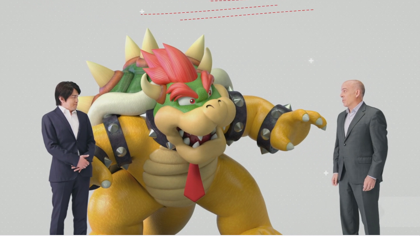

<ImageDescription>Bowser (postać fikcyjna) kontra Doug Bowser (CEO amerykańskiego oddziału Nintendo)</ImageDescription>

Pomijając drobne tytuły, na pierwszy ogień poszła gra Luigi's Mansion 3. Luigi ponownie wcieli się w członka drużyny Ghost Busters i wyłapie duchy panoszące się po hotelu, w którym się zameldował. Następnie przedstawiono remake gry The Legend of Zelda: Link's Awakening - premiera 20 września tego roku. Po tym nagle pojawił się CDP i pokazał to:

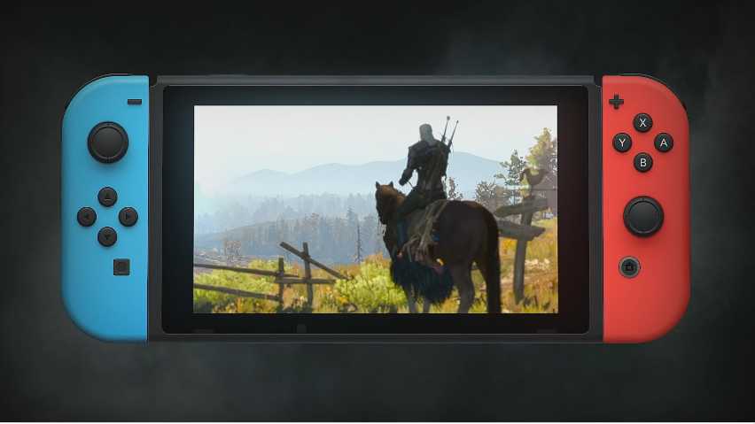

<ImageDescription>To co? Następny będzie Cyberpunk 2077?</ImageDescription>

Nawet u Nintendo nasi muszą zrobić zamieszanie. Po tym nieoczekiwanym zwrocie akcji zaprezentowano gry takie jak No More Heroes 3 (premiera w przyszłym roku), Empire of Sin (turowa strategia przewidziana na wiosnę 2020) oraz Animal Crossing: New Horizons (taki Minecraft w wersji japońskiej), który dostał datę 20 marca 2020 roku. Konferencję zamknęła zapowiedź sequela do Zeldy Breath of the Wild.

<YouTube id='QpW4cX1qxDk' title='No More Heroes 3'></YouTube>

<YouTube id='YcybAjnKYhU' title='Empire of Sin'></YouTube>

<YouTube id='n-McRVucI9Q' title='Animal Crossing New Horizon'></YouTube>

<YouTube id='DORfu-JZ_Mk' title='The Legend of Zelda'></YouTube>

Choć nie interesuję się zbytnio światem Nintendo, to jednak muszę przyznać, że była to dobra konferencja. Trochę zaskoczyli i pożartowali kilka razy, ale nie próbowali na siłę zrobić jakiegoś super show. Wszystko tak, jak na Japończyków przystało. Było krótko i treściwie.
