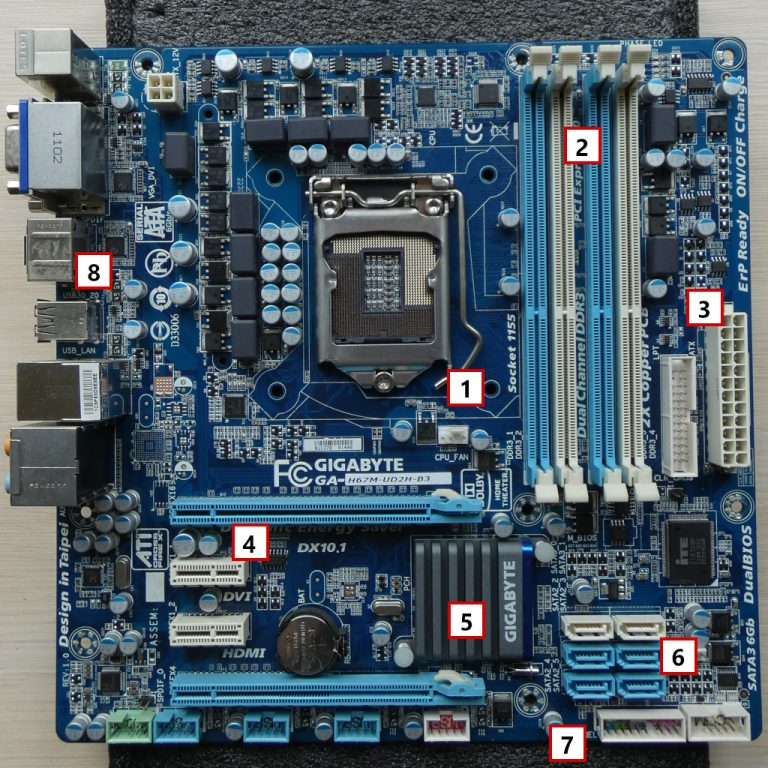
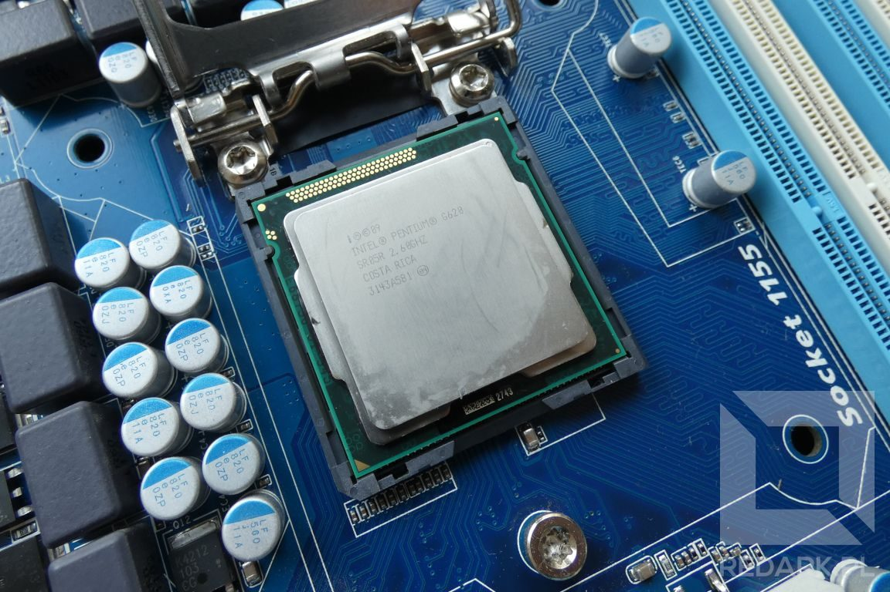
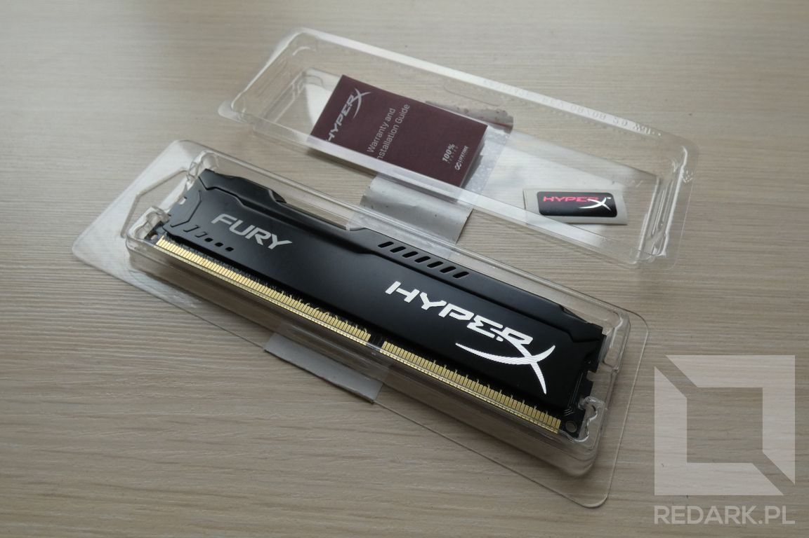
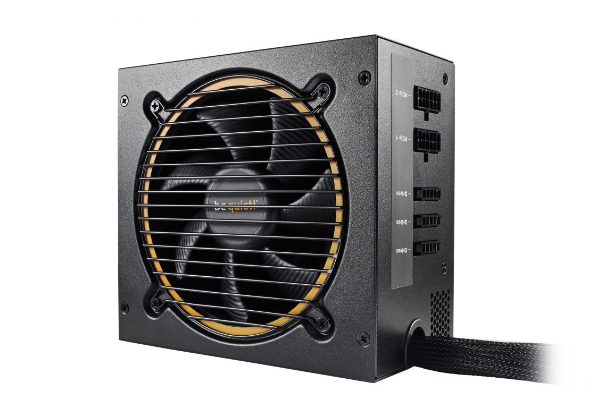
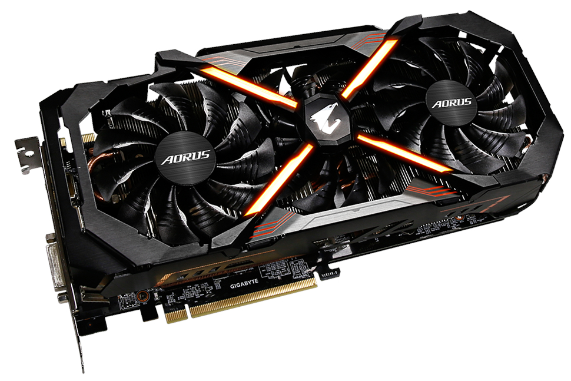
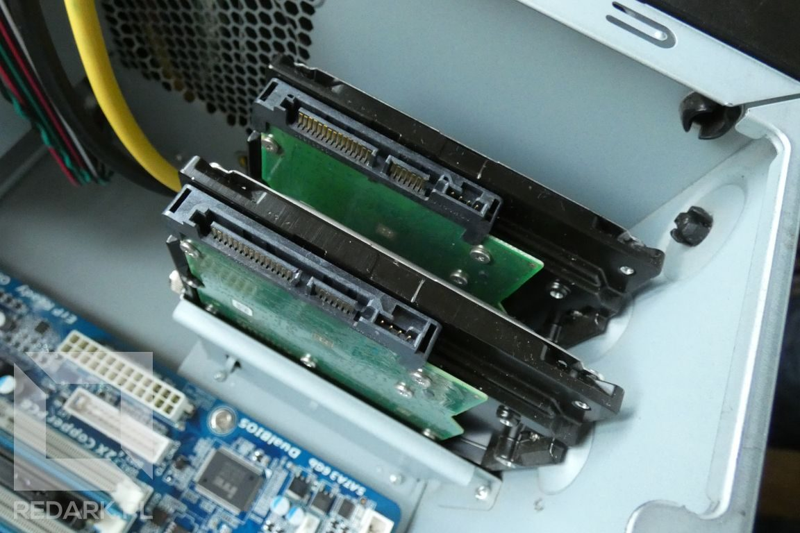

import AssemblingPcFooter from '../../typography/assemblingPcFooter'

Aby móc sprawnie składać komputer należy dobrze zaznajomić się z jego budową oraz sposobem działania. Wiedza zawarta w tym artykule pozwoli Ci poznać budowę standardowej jednostki centralnej oraz zrozumieć, jakie zadanie mają jej podzespoły. Informacje te będą również przydatne przy ewentualnym diagnozowaniu sprzętu po awarii następującej po jego złożeniu.

## Płyta główna (MB)

Podzespół ten jest centralnym elementem każdej jednostki komputera. Jest to [duża, płaska płytka drukowana](/plyty-glowne-czesc-1), na której zamontowane są podzespoły takie jak [procesor](/procesory), [pamięć RAM](/pamieci-ram) czy [karta graficzna](/karty-graficzne). Dochodzą do niej również wszystkie przewody znajdujące się w [obudowie](/obudowy-czesc-1). Odpowiedzialna jest za komunikowanie się ze sobą wszystkich podzespołów komputera. Jej awaria może dawać różne objawy. Może skutkować uszkodzeniem tylko jednej z funkcjonalności komputera, ale również całkowitym "unieruchomieniem" jednostki.

Choć płyty główne występują w wielu różnych formatach (różniących się wielkością), to jednak można wyróżnić na nich kilka charakterystycznych elementów:

- **Gniazdo procesora (1)** - mała kwadratowa lub prostokątna płytka zawierająca ponad 1000 mikroskopijnych styków. Znajduje się blisko górnej krawędzi płyty głównej. Poważne uszkodzenie powierzchni styków jest często nieopłacalne w naprawie.
- **Gniazda pamięci RAM (2)** - znajdują się w bliskim sąsiedztwie procesora. Mają formę cienkich, podłużnych gniazd i występują w ilości od 1 do 4 sztuk.
- **Zasilanie ATX 24-pin (3)** - jest to główne złącze zasilające jednostkę komputera. Posiada 24 piny i montowane jest blisko prawej krawędzi płyty głównej.
- **Gniazda PCI (4)** - poziome gniazda wyglądem przypominające sloty pamięci RAM. Znajdują się poniżej procesora i służą do zainstalowania kart rozszerzeń takich jak: karty graficzne, sieciowe czy dźwiękowe.
- **Chipset (5)** - jest to duży układ scalony odpowiedzialny za organizowanie przepływu danych na płycie głównej. Znajduje się pod radiatorem w prawej dolnej części jej powierzchni.
- **Gniazda SATA (6)** - służą do podłączania pamięci masowych oraz napędów optycznych posiadających złącze (interfejs) SATA.
- **Piny sterujące oraz konfiguracyjne (7)** - dolna krawędź płyty zarezerwowana jest w dużej części na gniazda szpilkowe (goldpiny) umożliwiające podłączenie elementów obudowy komputera takich jak: przyciski power i reset oraz gniazda audio i USB.
- **Tylny panel (8)** - zawiera gniazda służące do podłączenia wszystkich peryferiów komputera. Jeśli płyta główna posiada zintegrowany układ graficzny, zawiera też gniazda służące do podłączenia monitora.

## Procesor (CPU)

<ImageDescription>Procesor Intel Pentium leżący w gnieździe płyty głównej</ImageDescription>

Malutka metalowa płytka najeżona mikroskopijnymi nóżkami. Wewnątrz znajduje się zwykle kilka MILIARDÓW tranzystorów połączonych w jeden układ scalony zdolny do wykonywania obliczeń matematyczno-logicznych. Jest to bardzo mało awaryjny element. Praktycznie, jego uszkodzenie możliwe jest jedynie podczas montażu w gnieździe, jeśli jego styki zostaną zgięte. Od parametrów procesora zależy ogólna moc obliczeniowa jednostki. Mimo to, pozostałe podzespoły również muszą dotrzymywać mu kroku.

<AdSense/>

Ze względu na szybką pracę układu liczoną w Gigahercach, czyli miliardach operacji na sekundę, podzespół ten wymaga wydajnego chłodzenia. Po zamontowaniu w gnieździe [płyty głównej](/plyty-glowne-czesc-1) jest on pokrywany specjalną pastą termoprzewodzącą, a następnie najczęściej przykrywa się go [radiatorem połączonym z wentylatorem](/chlodzenie-komputera). Wydajne jednostki często stawiają na chłodzenie wodne oparte na cieczy transportującej ciepło procesora do chłodnicy zamontowanej na zewnątrz komputera.

## Pamięć operacyjna RAM

<ImageDescription>Moduł pamięci RAM typu DDR3 - HyperX Fury</ImageDescription>

Pamięć RAM jest stricte związana z [procesorem](/procesory). To duży bank pamięci na dane, którymi w obecnej chwili operuje nasz komputer. To tam jednostka trzyma dane systemu operacyjnego oraz otwartych przez nas aplikacji. Zapotrzebowanie na jego pojemność stale rośnie. Zbyt mała pojemność może bardzo obniżyć szybkość pracy urządzenia. Przy użytkowaniu wielu aplikacji oraz jednoczesnym otwieraniu dużej ilości kart w przeglądarce internetowej, procesor, widząc, że nie jest w stanie przechować tylu informacji, zaczyna przenosić ich część do wolnego dysku komputera. W efekcie zmiana używanej przez użytkownika aplikacji wiąże się z ponownym zwolnieniem części pamięci i przywróceniem danych aplikacji do [pamięci RAM](/pamieci-ram). Ta operacja zabiera bardzo dużo czasu i niepotrzebnie obciąża nasz nośnik pamięci masowej.

Ilość zainstalowanej na [płycie głównej](/plyty-glowne-czesc-1) pamięci RAM powinna być dostosowana do oprogramowania, jakiego będziemy używać na komputerze. Należy pamiętać, że nie jest to wymóg jedynie dla komputerów montażystów czy graczy. Przeglądarka internetowa jest jednym z najbardziej zasobożernych aplikacji, która na start może pochłonąć nawet 1 GB pamięci.

Moduły [pamięci RAM](/pamieci-ram) posiadają dożywotnią gwarancję producenta, a ich awarie, choć rzadkie, mogą objawiać się losowym pojawianiem się ekranów śmierci (BSOD - Blue Screen Of Death).

## Zasilacz (PSU)

<ImageDescription>Zasilacz be quiet! PURE POWER 10 600W CM, źródło: bequiet.com</ImageDescription>

[Zasilacz](/zasilacze) najczęściej przytwierdzony jest do tylnej ścianki obudowy. Montuje się go u góry lub u dołu jednostki - w zależności od jej konstrukcji. Odpowiedzialny jest za zamianę prądu przemiennego na prąd stały i doprowadzenie go do wszystkich podzespołów komputera. Od jakości zasilacza zależy stabilna i bezpieczna praca całego zestawu. W Internecie roi się od tanich, "chińskich" zasilaczy, których wykonanie woła o pomstę do nieba. Są to tzw. zasilacze z czarnej listy i należy wystrzegać się ich jak ognia, który zresztą często mogą wywołać podczas swojej pracy.

Najbardziej rozpoznawalnym parametrem każdego zasilacza komputerowego jest jego moc podawana w Watach. Wartość ta musi zostać dobrana do podzespołów, jakie będą zamontowane w obudowie.

<AdSense/>

## Karta graficzna (GPU)

Nie jest zawsze potrzebna. Komputer, który nie będzie służył do gier lub obrabiania multimediów spokojnie zadowoli się [zintegrowanym układem graficznym](/procesory) wbudowanym w płytę główną i procesor.

<ImageDescription>Karta graficzna GeForce GTX 1080Ti AORUS X11G, źródło: gigabyte.com</ImageDescription>

Podzespół ten montowany jest w [gnieździe PCI-Express](/plyty-glowne-czesc-2). Po montażu, złącza karty dostępne są z tyłu jednostki centralnej. Gdy karta graficzna znajduje się w komputerze, zintegrowany układ płyty głównej zostaje wyłączony, a sygnał z obrazem monitora dostępny jest wyłącznie za pomocą złączy GPU.

Awaria [karty graficznej](/karty-graficzne) objawia się pojawianiem artefaktów na ekranie (plamy lub paski losowego koloru) lub całkowitym brakiem obrazu. W przypadku podejrzenia awarii tego podzespołu, przed jego wymianą należy sprawdzić poprawność działania [monitora](/monitory-czesc-1) oraz kabli sygnałowych.

## Pamięci masowe (HDD/SSD)

<ImageDescription>Dwa dyski HDD zamontowane w pozycji wertykalnej</ImageDescription>

Podzespół, który musi cechować się największą niezawodnością. Jego awaria bardzo często oznacza utratę całości danych zgromadzonych na komputerze. Występuje on najczęściej w dwóch różnych rodzajach:

- **HDD** - [dysk talerzowy](/nosniki-pamieci-dyski-hdd-ssd) cechujący się bardzo dobrym stosunkiem ceny do pojemności. Działa on na zasadzie wirujących dysków pokrytych materiałem ferromagnetycznym. Jego ruchome elementy powodują, że jest on podatny na uszkodzenia mechaniczne oraz zużywa dużo energii.
- **SSD** - [dysk półprzewodnikowy](/nosniki-pamieci-dyski-hdd-ssd) nie posiada ruchomych elementów. Jest mały, super szybki i zużywa bardzo małe ilości energii. Wadą jest ograniczona żywotność (choć dzisiaj jest już na przyzwoitym poziomie) oraz wysoka cena produkcji w porównaniu z tradycyjnym dyskiem HDD.

Pamięci montowane są najczęściej w okolicy prawego dolnego narożnika obudowy. Cienkie dyski SSD mogą również znajdować się za płytą główną lub nawet na jej powierzchni w postaci [małych płytek na interfejs M.2](/dyski-ssd-m2). Tradycyjne podzespoły potrzebują do działania dwóch przewodów. Pierwszym z nich jest zasilanie doprowadzone z zasilacza komputerowego (PSU). Drugi kabel odpowiedzialny jest za transport danych i łączy się z płytą główną.

## Napęd optyczny (ODD)

<ImageDescription>Standardowy napęd optyczny LG CH10LS28 montowany w zatoce 5.25", źródło: lg.com</ImageDescription>

[Napędy do płyt CD/DVD/Blu-Ray](/napedy-optyczne) montowane są z przodu komputera w slotach 5,25 cala. Podobnie jak pamięci masowe, do działania potrzebują dwóch kabli: zasilania i sygnału z płyty głównej. Przez rosnącą popularność cyfrowej dystrybucji programów i gier, napędy optyczne są coraz rzadziej spotykane w komputerach. Niemniej jednak nie są one drogie, a ich obecność może się kiedyś przydać.

<InfoBlock>Dobrą alternatywą dla tradycyjnych napędów są mobilne modele podłączane do komputera za pomocą gniazda USB. Dzięki temu uzyskujemy podręczny napęd, który może być wykorzystany przy wielu komputerach.</InfoBlock>

<AssemblingPcFooter nextPost='/okreslanie-potrzeb-i-wymagan'/>
