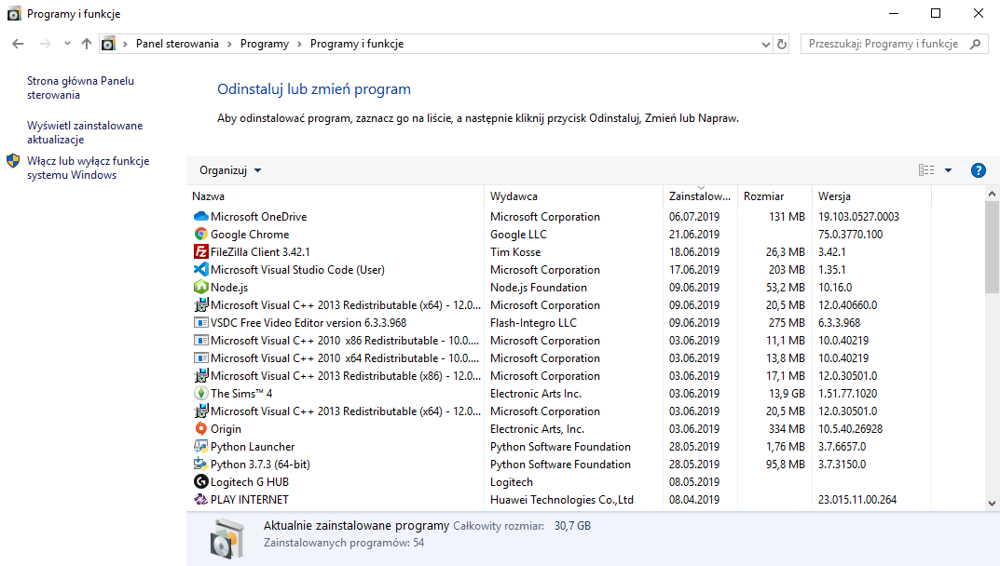

import AssemblingPcFooter from '../../typography/assemblingPcFooter'

Z poprzedniego rozdziału kursu dowiedziałeś/aś się trochę o budowie typowego komputera stacjonarnego. Czas tę teorię wcielić w życie i rozpocząć planowanie konfiguracji sprzętowej naszego "składaka". Proces ten można wykonać samemu, ale też wspomóc się sprawdzonymi konfiguracjami udostępnianymi na wielu portalach internetowych.

## Jakie masz wymagania?

Jako obserwator kilku grup technicznych na Facebooku, nagminnie widzę jednozdaniowe posty o treści "złóżcie mi komputer do 4 tysięcy". Tylko jaki?! Do czego?! Dla kogo?! Czy proces składania komputera to prosty algorytm, który jako jedyny parametr wejściowy potrzebuje maksymalnej ceny? Nie wydaje mi się.

Przed planowaniem konfiguracji swojego przyszłego komputera należy przeanalizować swoje wymagania. Skąd ktoś obcy, napotkany na portalu społecznościowym, ma wiedzieć, czego potrzebujesz? **Sporządź listę wszystkich czynności, jakich wykonujesz na co dzień na komputerze oraz jakich aplikacji używasz.** Nie muszą być to od razu bardzo techniczne stwierdzenia typu "Potrzebuję [kontrolera RAID oraz dwóch gniazd PCI-Express x16](/plyty-glowne-czesc-1)". Najważniejsze jest określenie czynności, jakie będą wykonywane na komputerze. Będzie to dobry krok w kierunku prawidłowo zaplanowanej konfiguracji komputera.

## Jak sporządzić taką listę?

Spokojnie, nie zostawię Cię, tylko z tekstem "sporządź listę" i tyle. Poniżej zamieszczam kilka aspektów, które pozwolą Ci zrozumieć, o co chodzi w planowaniu konfiguracji komputera.

### Lista aplikacji

Na początek sporządź listę aplikacji, jakich używasz. Podziel je również na dwie kategorie. W pierwszej, aplikacje, których używasz na co dzień, a w drugiej, te używane rzadziej. W tym zestawieniu pomiń małowymagające aplikacje i narzędzia - skup się na tych dużych i wymagających. Wyjątkiem są aplikacje, które wymagają jakiś specjalnych podzespołów i urządzeń na stanowisku.

Sporządzając taką listę, zaznacz również aplikacje, które służą ci do pracy. Powinny one działać jak najlepiej, a specyfikacja powinna być gotowa na ewentualne przyszłe podniesienie wymagań sprzętowych tego oprogramowania.

Jeśli nie jesteś w stanie spisać z pamięci wszystkich aplikacji, jakich używasz na komputerze, skorzystaj z jednego prostego tricku. Ja, gdy muszę przeinstalować system operacyjny komputera, zawsze zapisuję sobie listę wszystkich aplikacji z panelu sterowania (ścieżka: Panel sterowania > Programy > Programy i funkcje). Zrobienie zrzutów ekranu takiej listy nie tylko ułatwia odtworzenie stanu komputera (sprzed formatowania), ale także pozwala na zobaczenie wszystkich aplikacji, jakich potrzebowaliśmy na naszym komputerze.

### Przeglądanie stron internetowych

"Panie, ale ja potrzebuje komputra tylko do internetu". Czasy, w których strony internetowe miały postać prostych dokumentów tekstowych z okazjonalnym obrazkiem, już dawno minęły. Dzisiejszy internet to rozbudowane serwisy ładujące kilkadziesiąt jak nie kilkaset plików jednocześnie, w tym skrypty JavaScript wykonywane na naszym komputerze. Każdy element strony, tekst, link, obrazek, obdarzony jest wieloma, dziedzicznymi atrybutami stylów CSS określającymi jego wygląd oraz pozycję. Te wszystkie operacje muszą być wykonywane na naszym urządzeniu.

Internet jest pełen memów o przeglądarce Google Chrome, jakie to ona ma zapotrzebowanie na [pamięć operacyjną](/pamieci-ram). Tylko czy inne przeglądarki wypadają lepiej? Nieznacznie! Wymagania, jakie musi spełnić komputer, są ogromne, inaczej nie możemy mówić o przyjemnym przeglądaniu witryn WWW.

<AdSense/>

Mam nadzieję, że tym opisem udowodniłem Ci, jak ważnym aspektem w planowaniu konfiguracji jest przeglądarka internetowa. Duże zapotrzebowanie na pamięć operacyjną wymusza na nas zaopatrzenie komputera w dużą ilość [RAMu](/pamieci-ram). Nie obejdzie się też bez przyzwoitego [procesora](/procesory), który może zostać wsparty szybkim [dyskiem SSD](/nosniki-pamieci-dyski-hdd-ssd).

Ludzkość dzieli się na dwie grupy. Pierwszej grupie do pracy wystarczy otworzenie kilku aktualnie potrzebnych kart w przeglądarce, a te już niepotrzebne są od razu zamykane. Osoby z drugiej, gdy potrzebują jakiejś strony internetowej, otwierają ją w nowej karcie i nie ma tu znaczenia, że na pasku są już otwarte trzy inne jej kopie. Dodatkowo w przypadku drugiej grupy zamknięcie kart odbywa się jedynie przy wyłączeniu komputera. Jeśli należysz właśnie do tej drugiej grupy, zapisz na liście wymagań "DUŻO RAMu!".

### Gry komputerowe

Prawdopodobnie najczęstszym wśród czytelników powodem składania nowego komputera będzie potrzeba możliwości zagrania w najnowsze gry. Ich wymagania stale rosną, co wywiera potrzebę ciągłych modyfikacji jednostki. Na liście wymagań warto zatem zanotować, w jakie tytuły będziemy chcieli zagrać oraz sprawdzić, jakie posiadają one wymagania techniczne. Ważne jest też, czy użytkownikowi wystarczy wydajność umożliwiająca uruchomienie gry jedynie na podstawowych parametrach graficznych, czy wymaga od niej lepszej grafiki lub płynności.

Przy doborze podzespołów pomocne będą wszelkiej maści benchmarki pokazujące wydajność [procesorów](/procesory) i [kart graficznych](/karty-graficzne) przy danych grach. Przydadzą się także różnego rodzaju "kalkulatory bottleneck". Są to kreatory, które oceniają, czy w danej konfiguracji wystąpi zjawisko tzw. wąskiego gardła. Do tego zjawiska dochodzi, gdy któryś z podzespołów komputera jest za słaby w stosunku do pozostałych i obniża ogólną wydajność jednostki.

### Mobilność

Nie odkryję Ameryki, gdy powiem, że jeśli cenisz sobie możliwość mobilnej pracy, musisz wybrać laptopa. Należy jednak uważać, żebyśmy nie musieli z nim siedzieć przyklejeni do zasilacza sieciowego.

Coraz częściej słyszę stwierdzenie, że w laptopach nie trzeba już decydować między wydajnością a mobilnością. To fakt. Małe i smukłe jednostki (choć bardzo drogie) potrafią mieć oszałamiającą wydajność. Mimo to nadal nie możemy przeskoczyć jednego ograniczenia. Wysoka wydajność = wysoki pobór prądu. Osoby, które sądzą, że jak kupią sobie napakowany LEDami gamingowy laptop, to będą mogły grać w Wiedźmina w pociągu czy samochodzie, muszą się niestety ocknąć. Bateria laptopa przy takim obciążeniu zapewni rozgrywkę co najwyżej na kilkanaście minut.

Jeśli naprawdę zależy Ci na mobilnej pracy, bez ciągłego zerkania na ikonkę naładowania baterii musisz przestrzegać dwóch zasad. Pierwsza z nich to [energooszczędny procesor](/procesory). Trzeba znaleźć model oferujący przyzwoitą moc obliczeniową przy jak najmniejszym poborze prądu. Pozwoli to także na zniwelowanie nadmiernego nagrzewania się urządzenia. Druga zasada to [dysk SSD](/nosniki-pamieci-dyski-hdd-ssd). Dzięki brakowi ruchomych elementów ma bardzo niski pobór energii oraz zapewni cichą i bezpieczną (odporność na wstrząsy) pracę naszego urządzenia.

### Pozostałe aspekty

Mam nadzieję, że choć trochę uświadomiłem Ci, jak ważne jest sporządzenie listy wymagań. Mówię tutaj zarówno o sytuacjach, w których samemu projektujesz konfigurację sprzętową jednostki, jak i wtedy, gdy oddajesz to w czyjeś ręce, np. na portalach społecznościowych. Na koniec wyliczę jeszcze szybko garść pozostałych aspektów, które mogą być ważne w Twoim przyszłym komputerze. Pytania będą dotyczyły zarówno [podzespołów jednostki centralnej, jak i peryferiów](/podzespoly-i-urzadzenia).

- Ile czasu spędzasz przy komputerze? Czy zapewnienie wysokiego komfortu pracy będzie bardzo ważne? Przy długiej pracy z komputerem warto zadbać o dobry monitor, klawiaturę, mysz i oczywiście fotel biurowy.
- Czy podczas swojej pracy operujesz dużymi plikami z danymi? Potrzebujesz je często kopiować na nośniki zewnętrzne? Warto zastanowić się nad zaopatrzeniem komputera w szybkie interfejsy przeznaczone do przesyłu dużych ilości informacji.
- Jakiej pojemności magazynu danych potrzebujesz? Zależy Ci na wysokiej szybkości czy niskim koszcie "za gigabajt"? Jest to główny dylemat przy wyborze między dyskami HDD a SSD. Najprostszym rozwiązaniem jest oczywiście zastosowanie obu typów dysków w komputerze.
- Jak bardzo ważne dane posiadasz na komputerze? Jak bardzo kosztowna byłaby ich utrata? Tutaj z pomocą mogą przyjść dyski o zwiększonym poziomie niezawodności oraz kontrolery RAID, które potrafią tworzyć "w locie" kopię zapasową naszego dysku.
- Jakie masz wymagania co do obrazu na [monitorze](/monitory-czesc-1)? Operujesz dokumentami tekstowymi, grafiką, filmami? Zależy ci na dobrych kątach widzenia lub rzetelnym odwzorowaniu kolorów? Dobrej jakości monitor będzie wolniej męczył oczy i znacząco podniesie poziom komfortu pracy.
- Jak dużo piszesz na komputerze? Redagujesz dużo tekstów? Jesteś programistą lub webmasterem? Cenisz sobie komfort pisania lub cichą pracę [klawiatury](/klawiatury)? Warto sprawdzić jaki [typ klawiatury nam odpowiada - membranowa czy mechaniczna](/membranowa-czy-mechaniczna).
- Zależy Ci na wysokiej jakości audio? Słuchasz muzyki w pojedynkę czy chcesz mieć możliwość odsłuchu w grupie? Rozważ wybór [słuchawek](/sluchawki) lub [głośników](/glosniki-komputerowe)?

<AssemblingPcFooter nextPost='/od-czego-zaczac-dobieranie-podzespolow'/>
