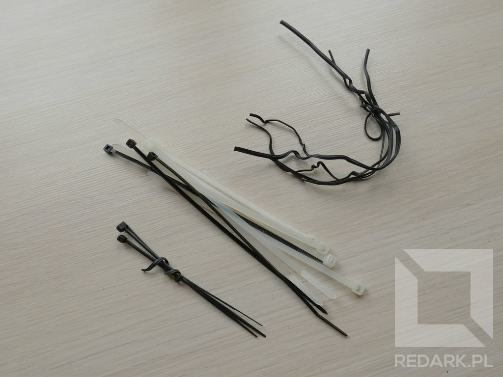

import AssemblingPcFooter from '../../typography/assemblingPcFooter'

Aby móc bezpiecznie i sprawnie złożyć swój przyszły komputer potrzebujemy przygotować do tego dobre stanowisko. Nie wyobrażam sobie, żeby ktoś montował podzespoły na kolanach lub podłodze. Elementy komputera są bardzo drogie i delikatne, dlatego trzeba obchodzić się z nimi z należytym szacunkiem.

## Powierzchnia robocza

Do montażu będziemy potrzebowali odrobiny przestrzeni. Przyda się do tego stół lub biurko niezawalone niepotrzebnymi szpargałami. Zminimalizuje to ryzyko zgubienia lub przeoczenia jakiejś części komputera. Stanowisko powinno być też należycie oświetlone. Może być to zarówno światło słoneczne, jak i sztuczne oświetlenie. Ważne jest, abyś dobrze widział element, nad którym pracujesz. Będzie to szczególnie ważne, gdy przejdziemy do umieszczania elementów wewnątrz obudowy komputera.

## Zestaw narzędzi

Przed przystąpieniem do pracy należy zadbać też o odpowiednie narzędzia do pracy. Naszym podstawowym narzędziem będzie **zestaw śrubokrętów**, które są niezbędne przy skręcaniu elementów komputera. Ja do montażu używam mojego sprawdzonego zestawu samochodowego, ponieważ posiada on dużo wymiennych końcówek, choć w 99% przypadków wystarcza kilka rozmiarów "krzyżaka" i "płaskiego". Do otwierania pudełek przydadzą się również **nożyczki**.

Oprócz śrubokrętów, do "dłubaniny" przy małych elementach, przydatna okazać się może również **latarka** oraz **pinceta**. Do późniejszego układania kabli warto przygotować sobie zestaw małych **trytek** lub **drucików**, które są dołączane do wielu urządzeń elektrycznych. Ponadto wielu komplikacji podczas montażu można uniknąć dzięki stosowaniu **korytek (pojemników) na śrubki**. Nie ma nic gorszego niż przeszukiwanie podłogi (a zwłaszcza wzorzystego dywanu) w poszukiwaniu zagubionej małej śrubki mocującej ważny element komputera.

<Gallery>

</Gallery>

## Odpowiedni ubiór

Pewnie teraz zastanawiasz się, o co mi chodzi i dlaczego każę Ci ubrać odpowiedni strój do montażu. Spokojnie, nie chodzi mi tutaj o ubieranie się na galowo bądź w kombinezon ochronny, ale o zapobieganie negatywnym zjawiskom z dziedziny elektrostatyki.

Ile razy zdarzyło Ci się poczuć, dosłownie na własnej skórze, wyładowanie elektrostatyczne po dotknięciu innego człowieka, lodówki, samochodu? A może pamiętasz jeszcze telewizory kineskopowe i efekt, jaki powodowały one na dłoni po przejechaniu nią po powierzchni ekranu? Choć dla nas te wyładowania są niegroźne i kończą się jedynie lekkim uczuciem bólu, to dla układów scalonych taki ładunek elektryczny może oznaczać poważnym uszkodzeniem obwodów. W profesjonalnych zakładach serwisanci posiadają specjalne opaski przyczepione do rąk, które odpowiedzialne są za uziemianie ich ciała. My jednak nie będziemy kupować takich rzeczy i postaramy się zniwelować ryzyko powstania tych ładunków domowymi sposobami.

<AdSense/>

Po pierwsze należy wyeliminować źródło powstawania ładunku elektrostatycznych. Dlatego do montażu należy wybrać luźną odzież i unikać wszelkiego rodzaju swetrów. Skarpetki trące o dywan podczas chodzenia również nie są wskazane.

Po drugie, przed przystąpieniem do pracy należy spróbować chwilowo uziemić na nasze ciało. Do tego celu można wykorzystać niemalowaną część kaloryfera (o ile rury nie są wykonane z tworzywa sztucznego) lub obudowę jakiegoś urządzenia posiadającego "bolec" we wtyczce (np. lodówka, kuchenka, pralka). W przypadku drugiego sposobu problemem może okazać się jednak instalacja elektryczna, która w wielu domach nie posiada poprawnie podłączonego uziemienia. W tym przypadku dotykanie obudów urządzeń, czy nawet bezpośrednio bolca nic nie da.

<InfoBlock>Wilgotność powietrza poniżej 40% sprzyja powstawaniu ładunków elektrostatycznych. W sezonie grzewczym warto zapewnić prawidłową wilgotność np. za pomocą nawilżacza powietrza.</InfoBlock>

## Odpowiednia temperatura podzespołów

Na koniec jeszcze jedna bardzo ważna rzecz dotycząca okresu zimowego. Gdy przyniesiemy skompletowane przez nas pudełka z podzespołami komputera z zewnątrz, pozwólmy im naturalnie ogrzać się do temperatury pokojowej. Ciepłe powietrze w naszym domu w połączeniu z zimnymi elementami komputera powoduje skraplanie się wody (zawartej w powietrzu) na ich powierzchni. Przed uruchomieniem urządzenia lub przystąpieniem do jego montażu, należy poczekać, aż cała wilgoć z powrotem odparuje do otoczenia.

<InfoBlock>Znajdujący się poniżej przycisk "Następny artykuł" kieruje do odświeżonej części poradnika składania PC z 2020 roku. Oprócz niego, do dospozycji jest jeszcze starsza edycja poradnika (rok 2014) z komputerem o innych parametrach technicznych. Dostęp do starszej wersji możliwy jest z poziomu spisu treści poradnika.</InfoBlock>

<AssemblingPcFooter nextPost='/skladanie-pc-2020-montaz-podzespolow-na-plycie-glownej'/>
