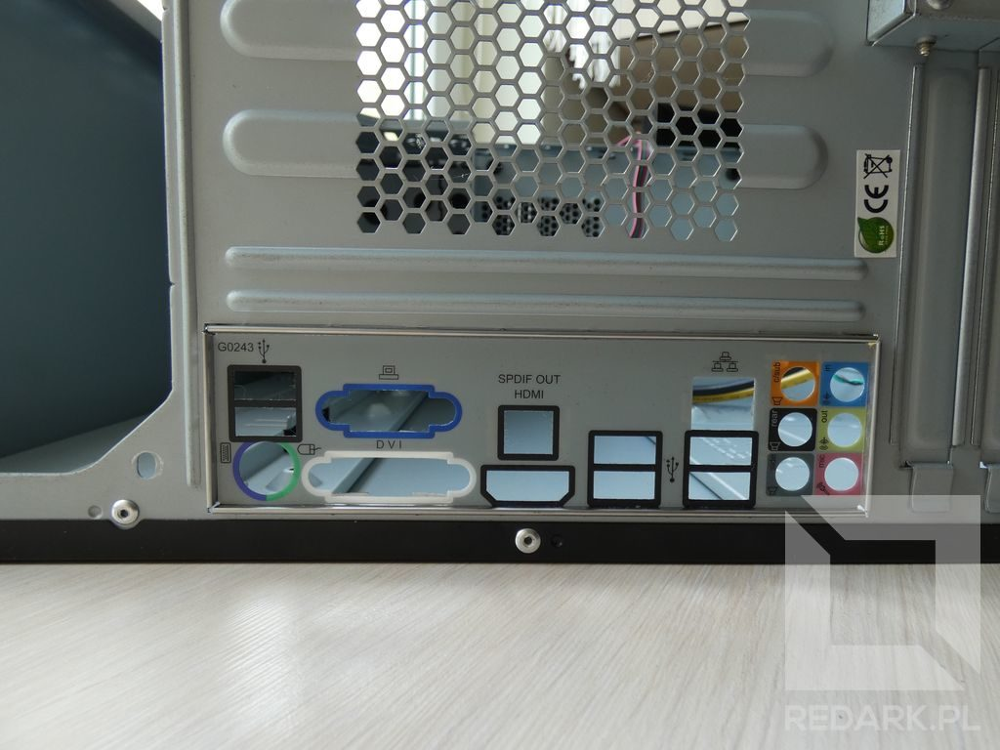
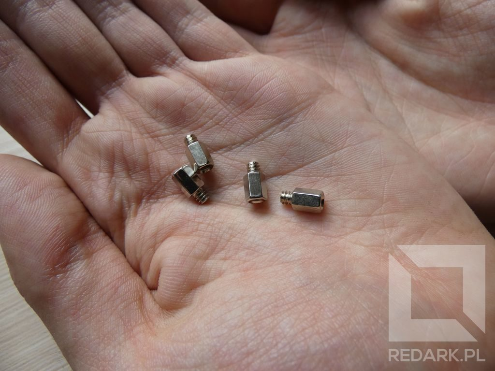
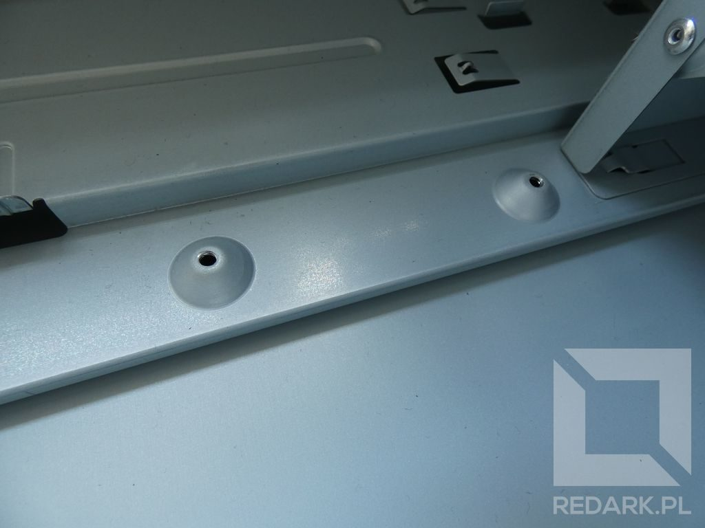
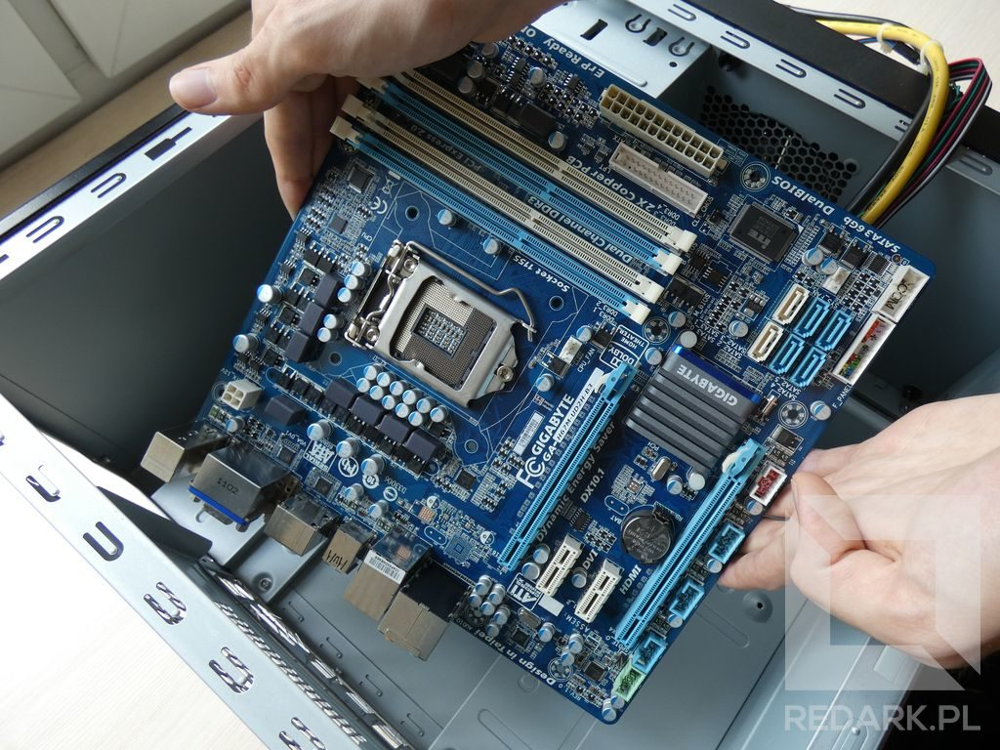
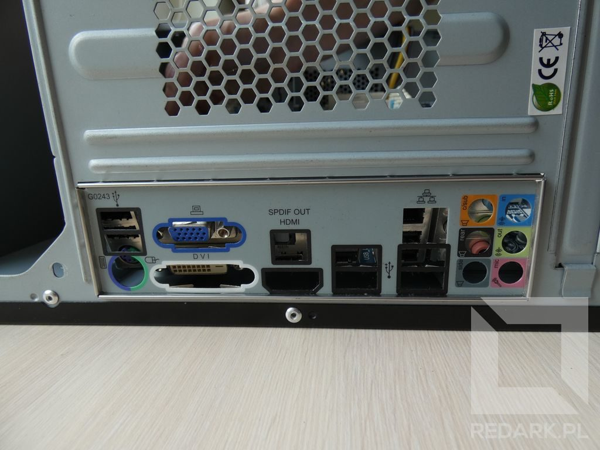
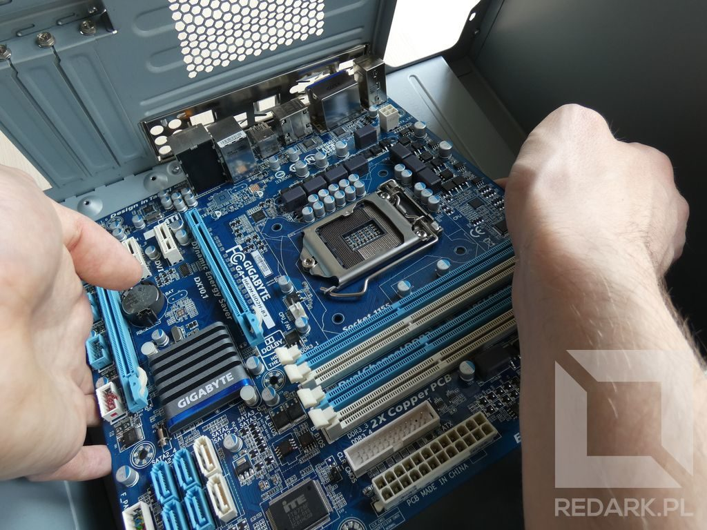

import AssemblingPcFooter from '../../typography/assemblingPcFooter'

W poprzednim artykule omówiłem ważne aspekty przygotowywania stanowiska do montażu komputera. Dziś przejdziemy już do właściwego montażu, a pierwszymi elementami, jakimi się zajmiemy, będą [obudowa](/obudowy-czesc-1) i [płyta główna](/plyty-glowne-czesc-1). Na samym początku obie części muszą przejść przymiarkę, która ułatwi ich przyszły montaż.

## Rozpakowywanie płyty głównej

Płyta główna jest największym podzespołem komputera. Najczęściej jest ona zapakowana w antystatyczną folię i umieszczona w piankowej ramce wypełniającej pudełko. Na wierzchniej stronie płyty znajdują się małe, wrażliwe na uszkodzenia elementy elektroniczne. Jej spód jest natomiast pokryty spoiwami lutowniczymi, dzięki którym wszystkie elementy tego podzespołu łączą się ze sobą. Luty są często ostro zakończone i nie mogą zostać naruszone. Dlatego też ważne jest, aby wyjętą z opakowania płytę odkładać ostrożnie i powoli.

Do ochrony płyty idealnie nada się wspomniana wcześniej pianka. Umożliwia ona bezpieczne odkładanie płyty na blat stołu oraz ochrania styki podczas montażu [procesora](/procesory) i [pamięci RAM](/pamieci-ram), które wymagają użycia trochę siły.

<InfoBlock>Podczas rozpakowywania podzespołów komputera należy wizualnie sprawdzić ich stan techniczny. W przypadku płyty głównej można sprawdzić, czy na dnie folii ochronnej nie znajdują się jakieś urwane jej elementy. Obudowa natomiast jest podatna na różnego rodzaju zadrapania i wgniecenia. Im szybciej zlokalizujemy takie uszkodzenia, tym mniejsze prawdopodobieństwo odrzucenia reklamacji przez producenta lub sklep.</InfoBlock>

## Montaż zaślepki panelu tylnego

Pierwszą rzeczą, jaką należy wykonać po rozpakowaniu płyty głównej i obudowy, jest zamontowanie zaślepki panelu tylnego. Te małe blaszki są jak opaski termokurczliwe, o nałożeniu których przypominasz sobie dopiero po zlutowaniu przewodu. Dlatego, aby uniknąć niemiłej niespodzianki, nie należy tego odkładać na później.

Zaślepka panelu tylnego znajduje się zawsze w pudełku z płytą główną. Posiada ona zestaw otworów pasujących tylko i wyłącznie do portów tego modelu płyty. Przed przystąpieniem do montażu należy określić prawidłowe jej ułożenie. Okrągłe gniazda audio mają znajdować się bliżej dołu obudowy. Górna część zaślepki zarezerwowana jest dla [portów PS/2, USB i wyjść obrazu](/kablologia-pajeczyna-za-biurkiem). Tą część montuje się zawsze od wewnątrz obudowy.

<Gallery>

</Gallery>

Prawidłowo zamontowana zaślepka z tylną ścianką obudowy tworzy gładką powierzchnię i nie może zostać wypchnięta przez zwykłe naciśnięcie palcem jej powierzchni.

<AdSense/>

## Przymiarka płyty głównej

Drugą rzeczą, którą zajmiemy się w tym artykule, jest przymiarka płyty głównej do obudowy i wkręcenie kołków dystansowych. Są to małe metalowe śrubki z gwintem montowane między obudową a płytą główną. Służą one do zapewnienia odpowiedniego odstępu między tymi elementami.

<Gallery>

</Gallery>

Kołki dystansowe znajdziemy w akcesoriach dołączonych do naszej obudowy, ale zanim zaczniemy je wkręcać do obudowy, należy sprawdzić, które otwory pokrywają się z naszą płytą główną. W tym celu należy wykonać małą przymiarkę. Podczas jej wykonywania należy oczywiście uważać, żeby nie poobijać płyty o elementy obudowy. Do prawidłowego określenia jej położenia pomoże zamontowana wcześniej zaślepka. Należy ustawić płytę w taki sposób, aby jej gniazda wpasowały się idealnie w otwory tylnej ścianki.

<Gallery>

</Gallery>

Gdy już wiemy, w których miejscach będziemy przykręcać płytę główną, możemy przejść do wkręcania kołków dystansowych. W przypadku mojej obudowy nie trzeba było ich wkręcać, ponieważ sama obudowa posiada stożkowe wypustki gotowe do przykręcenia płyty.

<WarningBlock>Źle dobrane lub wkręcone na wyrost kołki dystansowe mogą spowodować zwarcie obwodów elektrycznych płyty głównej i ich trwałe uszkodzenie.</WarningBlock>

## Dalsze działania

Tym sposobem na naszym stole leży przygotowana obudowa oraz płyta główna. Drugim z tych elementów zajmiemy się już w następnym artykule poświęconym montażowi procesora, czyli serca naszej jednostki.

<AssemblingPcFooter nextPost='/skladanie-pc-montaz-procesora-i-chlodzenia'/>
