import AssemblingPcFooter from '../../typography/assemblingPcFooter'

Kontynuujemy zagadnienie montażu podzespołów. Dziś zajmiemy się instalacją procesora na płycie głównej, a później jeszcze nałożymy na niego pastę oraz zamontujemy radiator. Do tego kroku przygotujmy sobie rozpakowaną (zgodnie z poprzednim artykułem) płytę główną oraz pudełko z procesorem i chłodzeniem.

## Chłodzenie BOX i OEM

Tak jak już wspominałem w [artykule poświęconym procesorom](/procesory), mamy dwie możliwości. Pierwsza z nich to kupić procesor z tzw. BOX-owym chłodzeniem producenta. Jest ono tanie, bardzo łatwe w montażu i często posiada już nałożoną pastę termoprzewodzącą. Niestety jego jakość jest proporcjonalna do ceny i osoby, które chcące mocno obciążać swój komputer nie powinny patrzeć na to rozwiązanie. Drugą, alternatywną możliwością jest zakup [chłodzenia](/chlodzenie-komputera) na własną rękę. Tutaj jakość oraz wydajność zestawu zależy już tylko od nas.

<WarningBlock>W przypadku montażu radiatora z dużym żebrowaniem, może dojść do sytuacji, w której stracimy dostęp do slotów pamięci RAM znajdujących się obok procesora. Nie jest to częsty problem, ale należy mieć go na uwadze. W takim przypadku należy najpierw zamontować moduły pamięci operacyjnej (co będzie tematem następnego artykułu z tego poradnika).</WarningBlock>

## Montaż procesora

Proces montażu pokażę na przykładzie procesora Intel i podstawki LGA1155. W przypadku procesorów konkurencyjnej firmy AMD proces montażu wygląda podobnie i powiedziałbym, że jest on łatwiejszy. Należy pamiętać, że w pudełku z procesorem zawsze znajduje się dokładna, ilustrowana instrukcja jego montażu.

### Otwarcie ramki procesora

W przypadku Intela procesor utrzymywany jest w gnieździe za pomocą metalowej ramki. Aby ją otworzyć, należy nacisnąć palcem na koniec dźwigni znajdującej się obok gniazda. Następnie ruchem w bok uwolnić ją spod małego metalowego zaczepu. Po tym zabiegu dźwignia zostanie zwolniona i będzie ją można unieść do góry. Podnoszenie jej spowoduje również samoczynne uniesienie się ramki znad gniazda.

<Gallery width='2'>
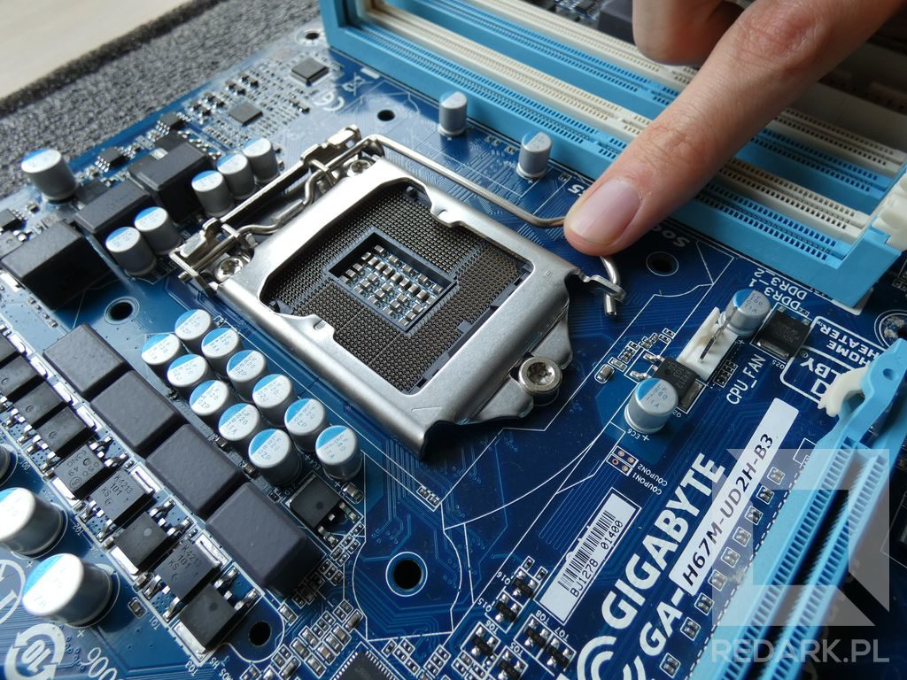
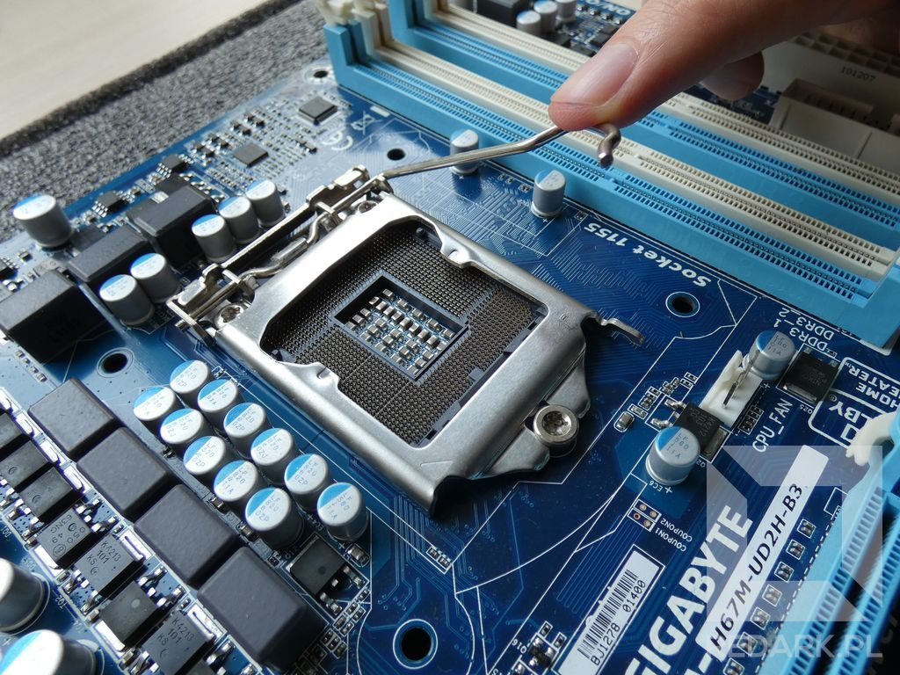
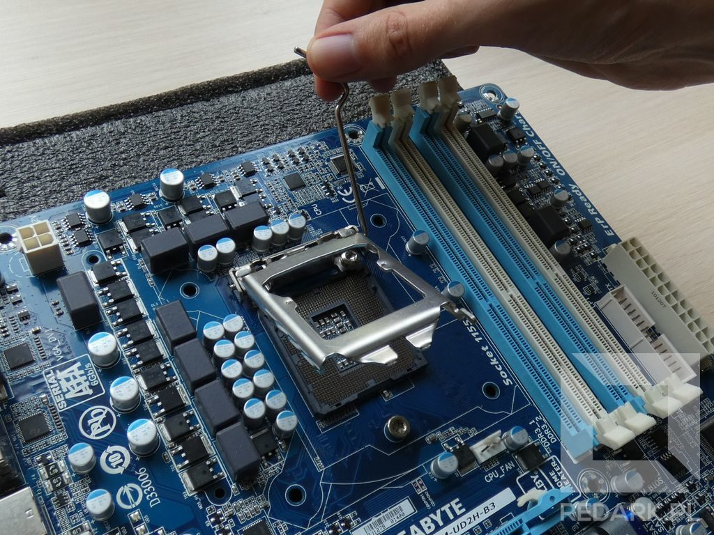
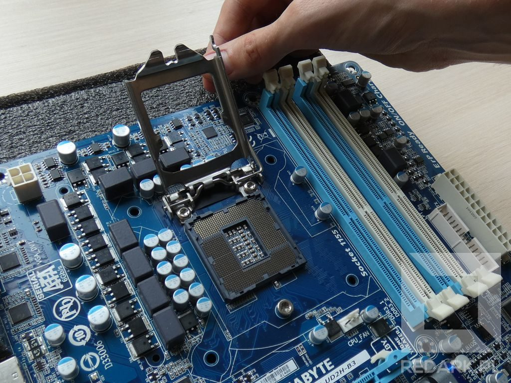
</Gallery>

Puste gniazdo procesora jest często chronione przez małą plastikową zaślepkę znajdującą się na gnieździe lub w ramce procesora. Po odblokowaniu do niej dostępu **NIE NALEŻY JEJ USUWAĆ!** Wyskoczy ona samoczynnie podczas zamykania klapki, jeśli procesor znajduje się już w gnieździe. Ja na swojej płycie już jej nie mam, ponieważ procesor był z niej zdemontowany na potrzeby wykonania tego poradnika.

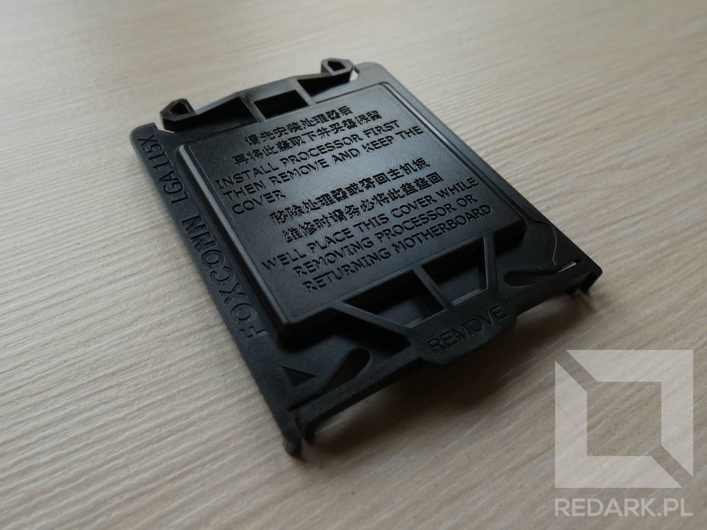

<ImageDescription>Przykładowa zaślepka gniazda LGA115x</ImageDescription>

<AdSense/>

### Instalacja procesora w gnieździe

Gdy mamy już dostęp do samego gniazda możemy zainstalować w nim nasz procesor. W tym celu wyjmij go z opakowania. Powinien być on włożony w przeźroczystą wytłoczkę. Otwórz ją bardzo powoli, tak aby znajdujący się w niej leciutki procesor nie wykonał lotu parabolicznego po Twoim pokoju :) .

<Gallery>
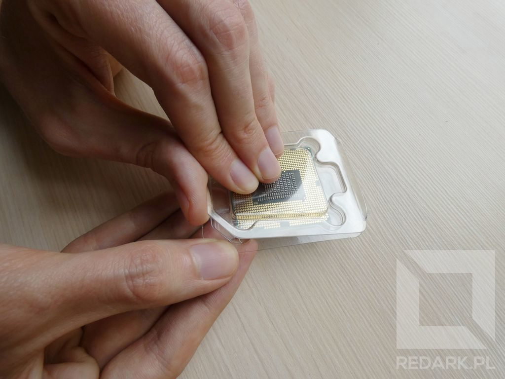
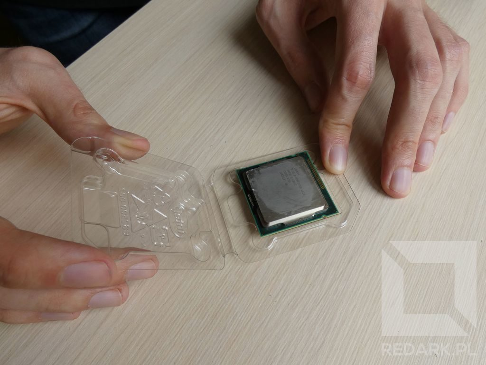
</Gallery>

Teraz ważne jest ustalenie prawidłowego położenia procesora w gnieździe. W przypadku Intela, służą do tego dwie wypustki znajdujące się na przeciwległych krawędziach gniazda. Ich pozycja musi odpowiadać wcięciom na płytce drukowanej procesora. Jeśli już je znalazłeś, umieść ostrożnie procesor na powierzchni gniazda.

<Gallery>
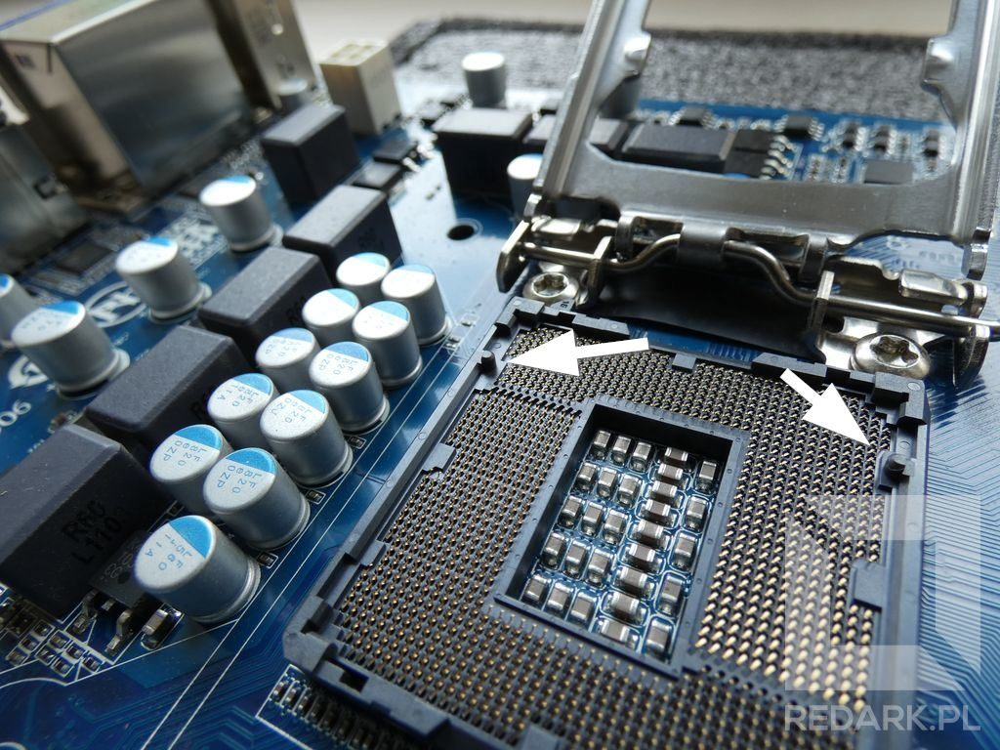
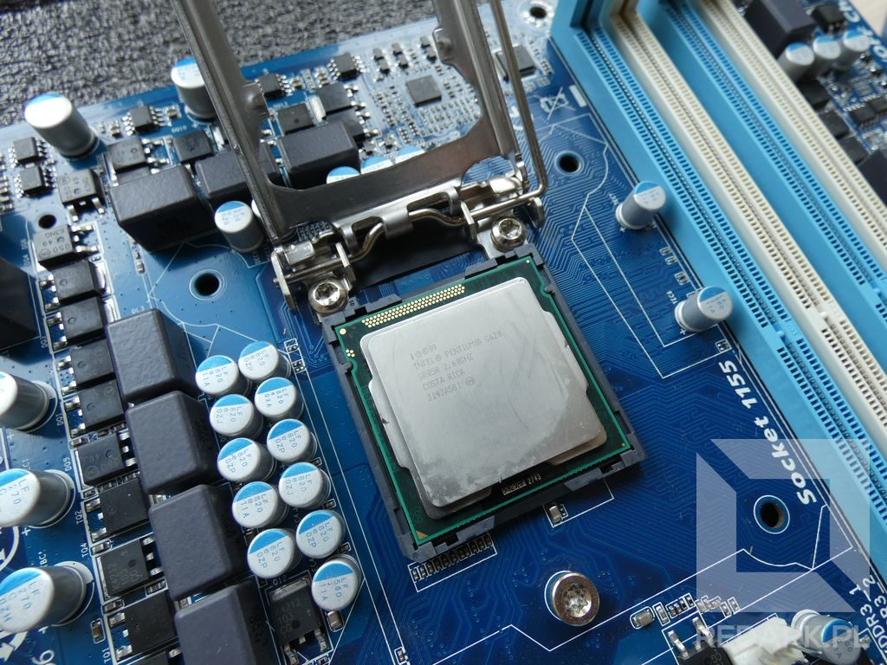
</Gallery>

Proces instalacji procesorów AMD możesz obejrzeć w odświeżonej edycji tego poradnika z 2020 roku.

<ActionButton to='/skladanie-pc-2020-montaz-podzespolow-na-plycie-glownej'>Montaż procesorów AMD</ActionButton>

### Blokowanie ramki na procesorze

Procesor jest już na miejscu, więc można zamykać! Aby go unieruchomić, upuść na procesor odblokowaną wcześniej ramkę dokładnie tak jak na zdjęciach poniżej:

<Gallery width='2'>
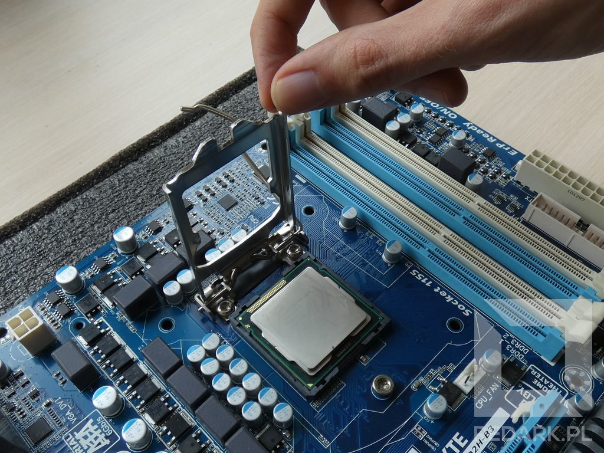
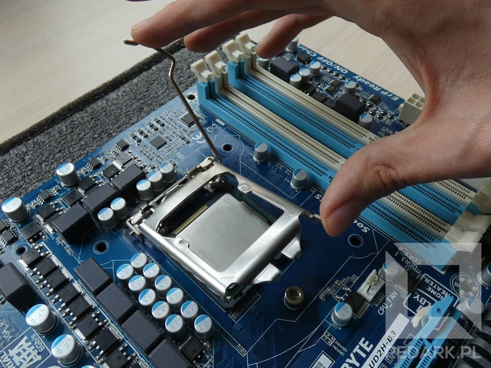
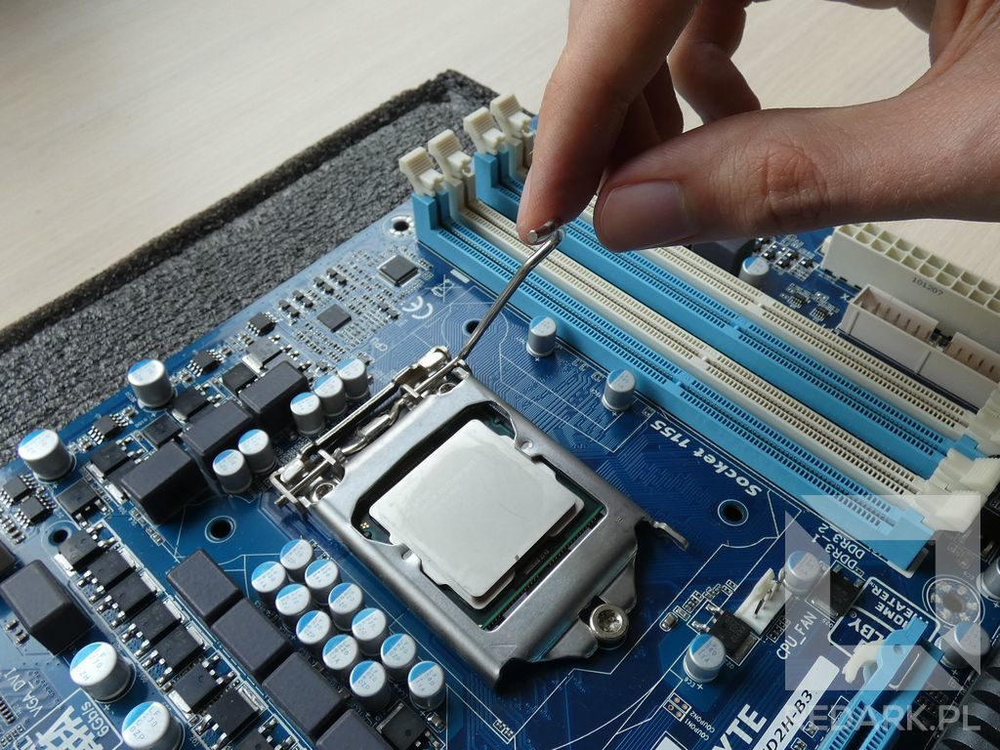
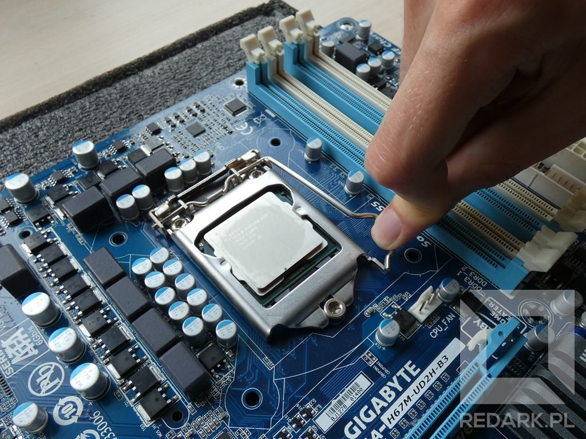
</Gallery>

Gdy ramka leży już na procesorze, można z powrotem zablokować jej dźwignię. W tym celu, odwrotnie do procedury jej odblokowywania, dociśnij dźwignię do powierzchni płyty głównej i zablokuj na metalowym zaczepie. Proces ten wymaga użycia odrobiny siły, ale spokojnie, jeśli procesor leży równo w gnieździe, nic mu się nie stanie.

## Montaż chłodzenia

Po zamontowaniu procesora w gnieździe trzeba go jeszcze pokryć pastą termoprzewodzącą i zamontować chłodzący go radiator. Do zaprezentowania tego procesu użyję BOX-owego chłodzenia dołączanego do procesorów Intela z usuniętą fabrycznie nałożoną pastą. W odświeżonej edycji tego poradnika z 2020 roku pokazuję montaż znacznie bardziej rozbudowanego chłodzenia wodnego Nzxt Kraken - link do niego znajduje się poniżej.

<ActionButton to='/skladanie-pc-2020-montaz-chlodzenia-wodnego-i-plyty-glownej'>Montaż chłodzenia wodnego</ActionButton>

### Nakładanie pasty

Warto tutaj wtrącić jeszcze odrobinę teorii i wyjaśnień. W internecie od dawien dawna toczy się dyskusja o tym, jak optymalnie nakładać pastę termoprzewodzącą. Do najpopularniejszych metod należą:

- **Ziarnko grochu** - dawka pasty wielkości ziarenka grochu jest aplikowana na sam środek procesora. Proces dociskania chłodzenia rozprowadza ją równomiernie po całej powierzchni.
- **Litera X** - na powierzchni procesora rysowana jest litera X.
- **Poziome kreski** - pasta aplikowana jest w postaci poziomych kresek na całej powierzchni procesora.
- **Rozsmarowywanie szpatułką** - odmierzona porcja pasty jest rozsmarowywana plastikową szpatułką równomiernie na całej powierzchni procesora.

Zadaniem pasty termoprzewodzącej jest wypełnienie drobnych nierówności powierzchni obu metali, a co za tym idzie usprawnienie procesu transferu cieplnego. Idąc tą definicją, można spokojnie stwierdzić, że **metoda ziarnka grochu** w zupełności wystarczy, ponieważ rozprowadzenie pasty jest samoczynne. Niestety metoda ta często zawodzi, ponieważ musi mieć idealnie odmierzoną ilość pasty, a to nie jest łatwe. Ulepszeniem ziarnka grochu jest **metoda z literą X**. Wypełnia ona znacznie lepiej powierzchnię procesora i nie wymaga precyzyjnego dozowania ilości pasty.

**Metoda poziomych kresek** dowiodła swojej skuteczności w jednym przypadku. Chodzi tutaj o prostokątne procesory AMD z serii Threadripper, których powierzchnia do pokrycia jest przeogromna. Na koniec pozostaje **metoda polegająca na ręcznym rozsmarowywaniu pasty** po procesorze. Ma ona swoich zwolenników i przeciwników, ale należy mieć ją na uwadze, ponieważ część producentów chłodzeń do swoich past dorzuca plastikową szpatułkę, sugerując użycie tej metody.

Do prezentacji użyję metody z literą X i jednej z najtańszych past termoprzewodzących na rynku. Osobom, które będą podkręcać swój sprzęt, zalecam oczywiście kupno produktów wyższej jakości. Pasta zamknięta jest w strzykawce, która dodatkowo posiada na swojej powierzchni wskaźnik ułatwiający odmierzenie 4 dawek po 1 gram pasty na procesor.

<Gallery>

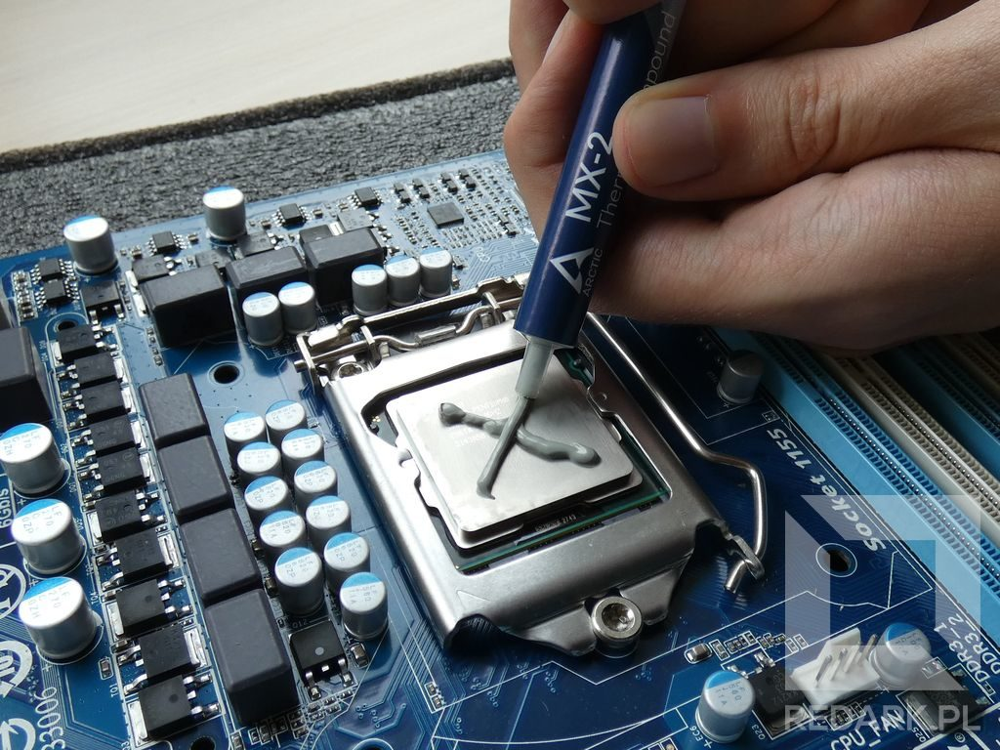
</Gallery>

### Montaż radiatora

Montaż standardowego chłodzenia od Intela jest bajecznie prosty i nie wymaga użycia narzędzi. Po wyjęcia radiatora z opakowania jedyne co można zrobić przed montażem to upewnienie się, że wszystkie jego nóżki znajdują się w odpowiedniej pozycji. Szczelina na śrubokręt powinna być skierowana do środka radiatora:

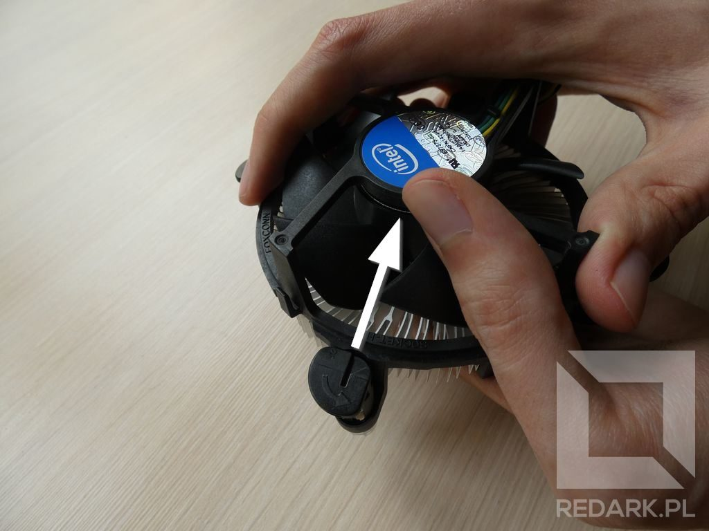

<ImageDescription>Nóżka o takim położeniu jest gotowa do zablokowania na płycie głównej</ImageDescription>

<WarningBlock>Stopa (element dotykający procesor) niektórych radiatorów może być zabezpieczona folią ochronną. Jej pozostawienie nie dość, że będzie zakłócało transfer cieplny, to może doprowadzić do roztopienia się jej na powierzchni procesora!</WarningBlock>

<AdSense/>

Cały proces montażu sprowadza się do położenia radiatora na procesorze w taki sposób, aby wszystkie jego cztery nóżki trafiły w odpowiednie otwory montażowe na płycie głównej. W przypadku tego chłodzenia orientacja radiatora nie ma znaczenia, ponieważ wydmuchuje on powietrze centralnie. Mimo to warto obrócić je w taki sposób, aby kabel zasilający ich wentylator był jak najbliżej gniazda **CPU\_FAN** (więcej informacji później). Inaczej sprawa ma się w przypadku rozbudowanych radiatorów wieżowych, które mają ustalony kierunek przepływu powietrza i należy montować je zgodnie z zaleceniami producenta.

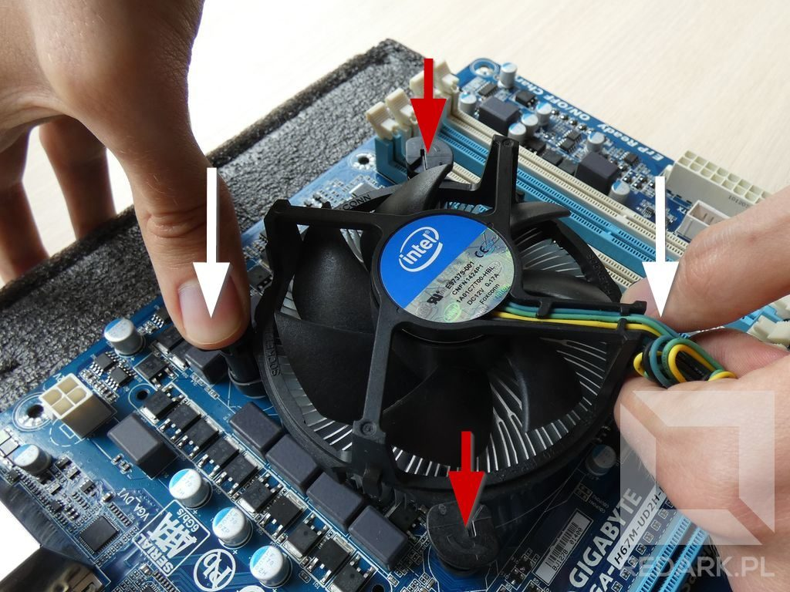

<ImageDescription>Radiator należy dociskać za pomocą dwóch przeciwległych uchwytów</ImageDescription>

Gdy radiator leży już na procesorze, jedyne co pozostało zrobić to nacisnąć palcem na jego nóżki, co spowoduje ich zablokowanie w otworach montażowych. Najpierw należy docisnąć dwa przeciwległe uchwyty, a później dwa pozostałe. Zapewni to równomierny docisk radiatora, a co za tym idzie również równomierne rozprowadzenie pasty na procesorze. Nóżka w momencie zablokowania wyda wyraźne kliknięcie.

### Podłączanie zasilania wentylatora

Ostatnim zadaniem jest podłączenie kabelka odpowiedzialnego za zasilenie wentylatora wymuszającego przepływ powietrza przez radiator. Jego końcówka musi zostać podłączona do gniazda oznaczonego napisem **CPU\_FAN**. Jest to dedykowane gniazdo dla chłodzenia procesora.

<Gallery>
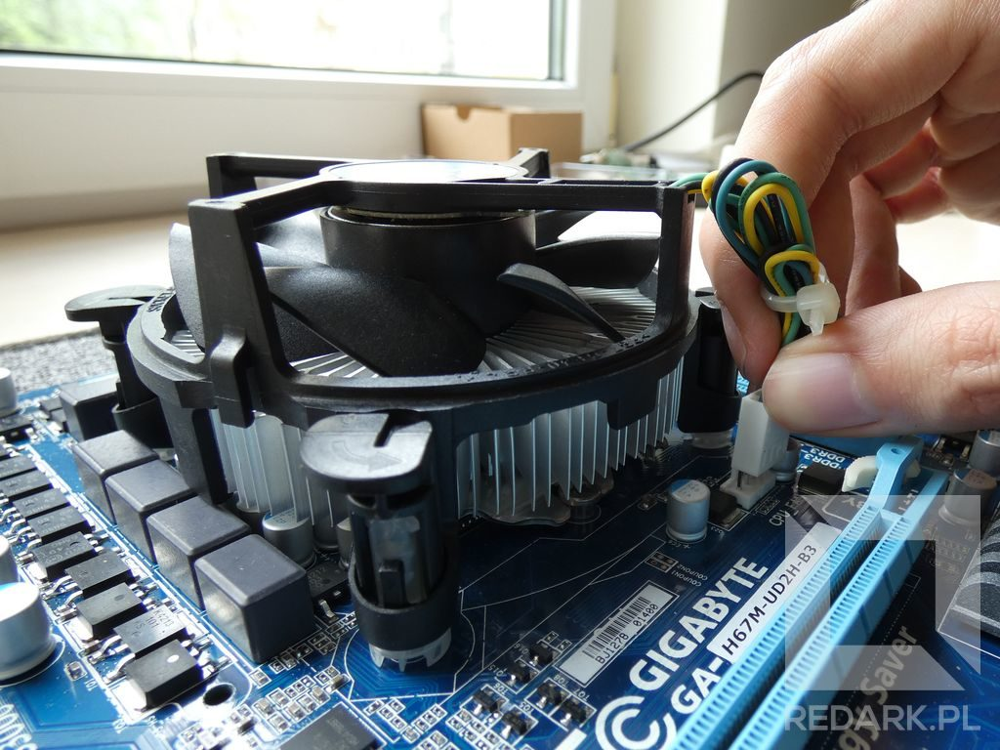
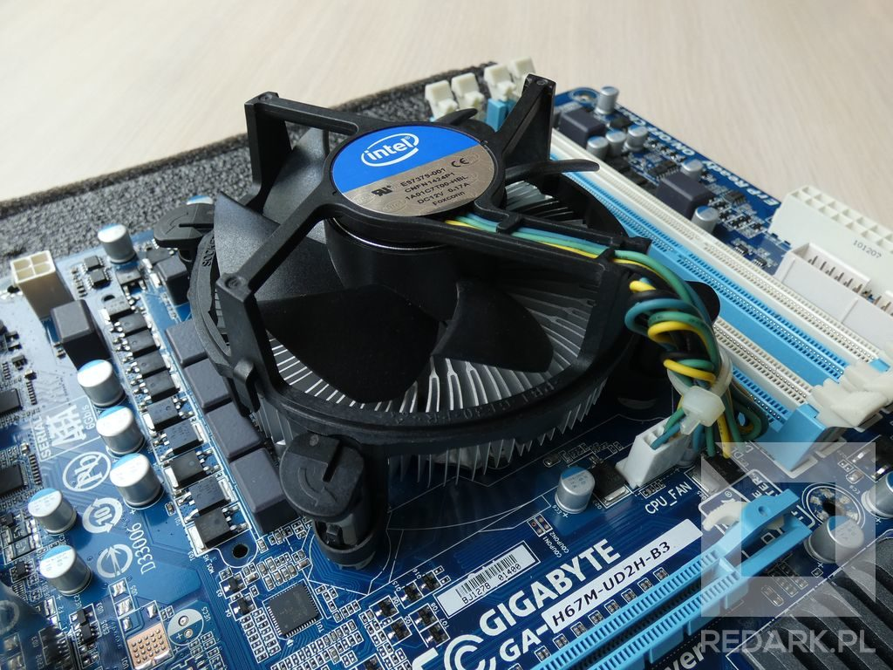
</Gallery>

Ważne jest również prawidłowe spięcie kabla przy pomocy trytki. Musi on być na tyle napięty, aby nie mógł dostać się między łopatki żadnego z wentylatorów. Nie jestem w stanie wyobrazić sobie osoby, które zostawiają ten przewód luźno. Jest to proszenie się o tragedię.

## Podsumowanie

Takim oto sposobem zamontowaliśmy procesor na płycie głównej. Proces, choć wymaga chwili skupienia, nie jest moim zdaniem bardzo trudny. W następnym kroku zajmiemy się sąsiadującymi z procesorem slotami pamięci operacyjnej, w których zamontujemy [moduły pamięci RAM](/pamieci-ram).

<AssemblingPcFooter nextPost='/skladanie-pc-instalujemy-kosci-pamieci-ram'/>
