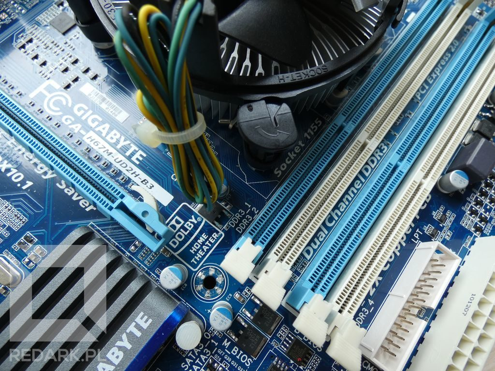
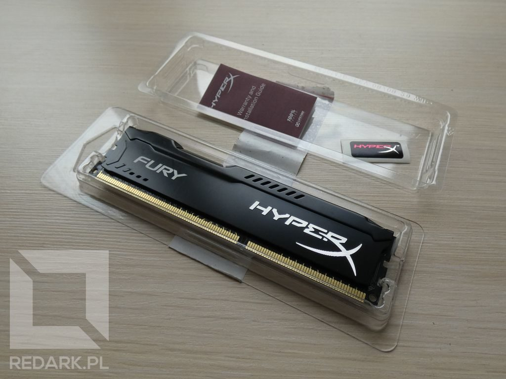
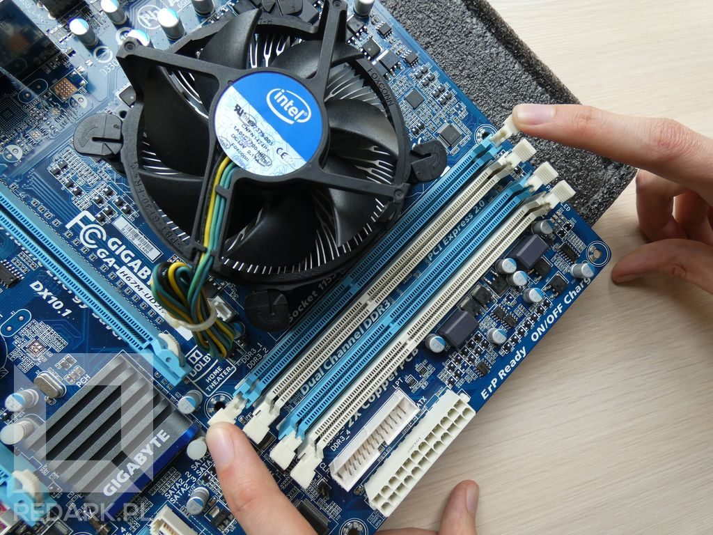
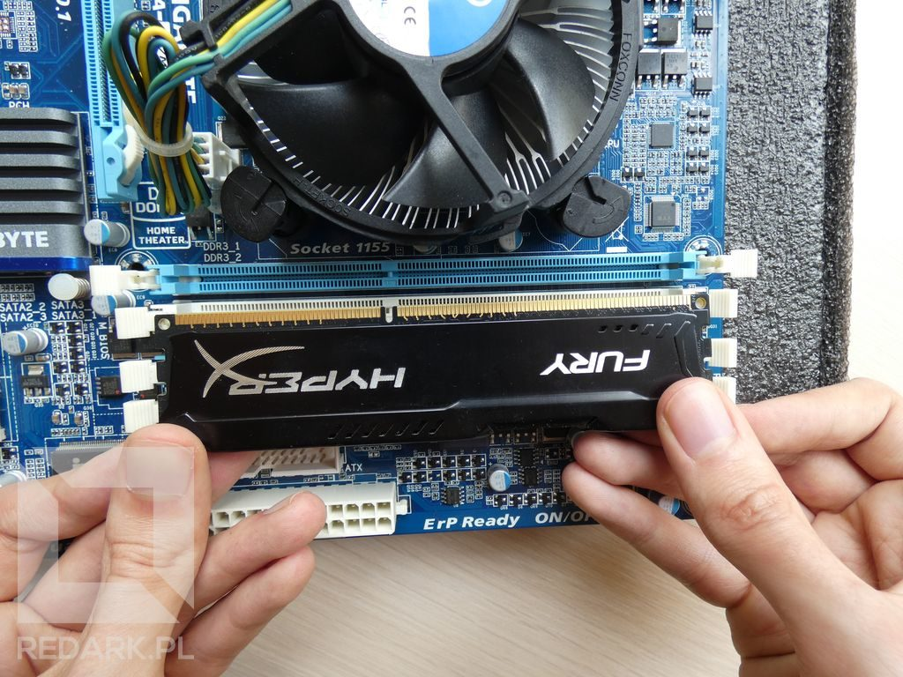
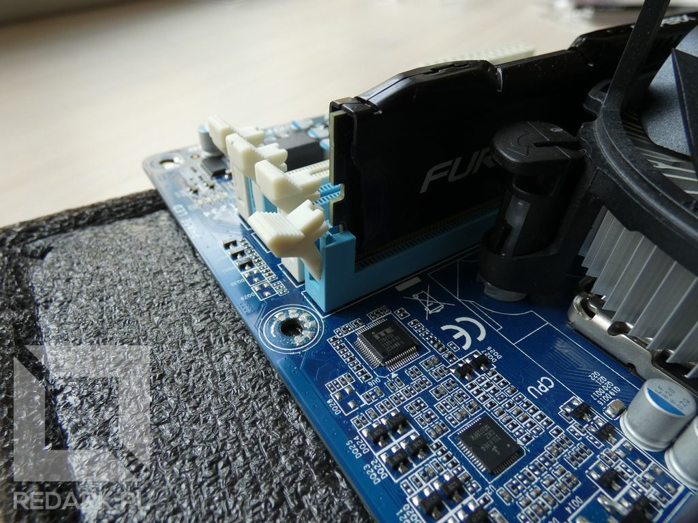
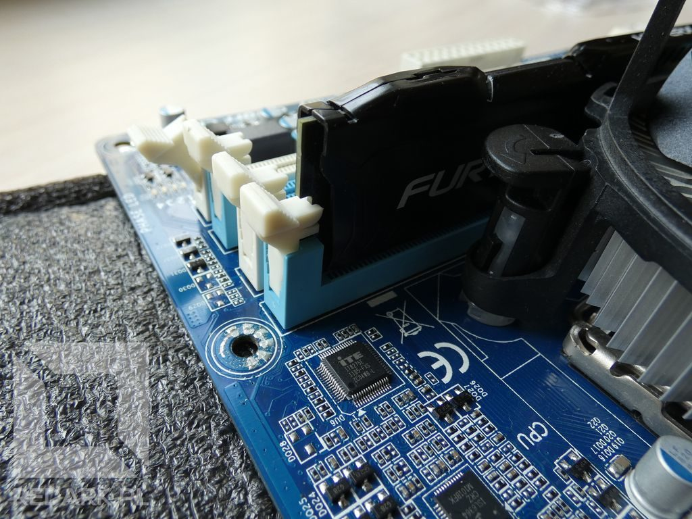
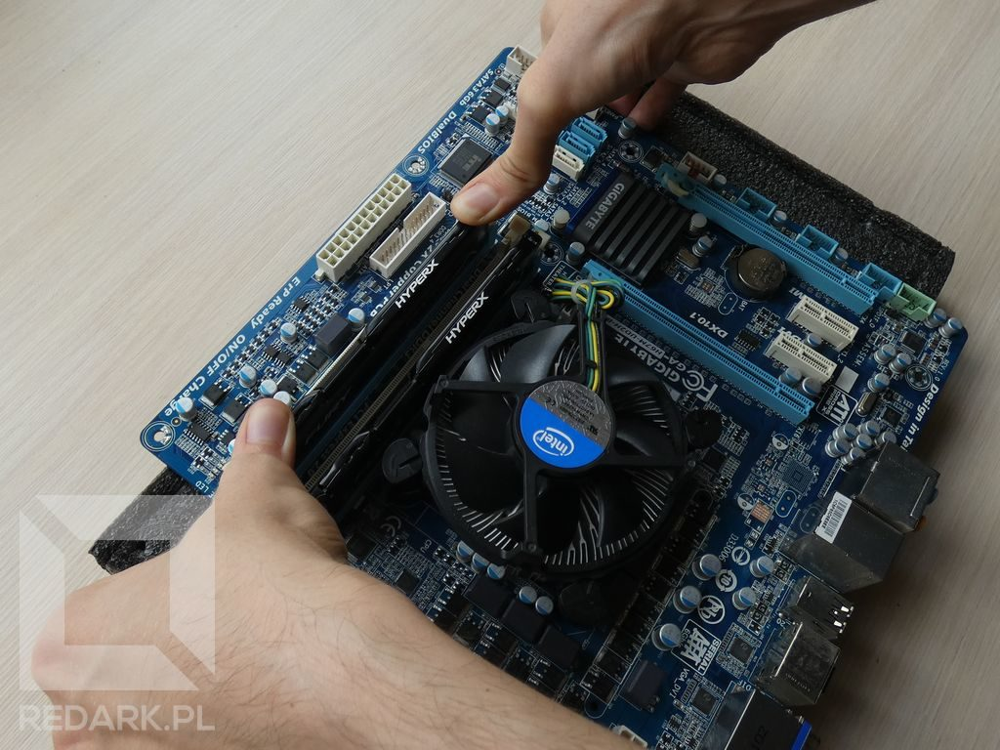
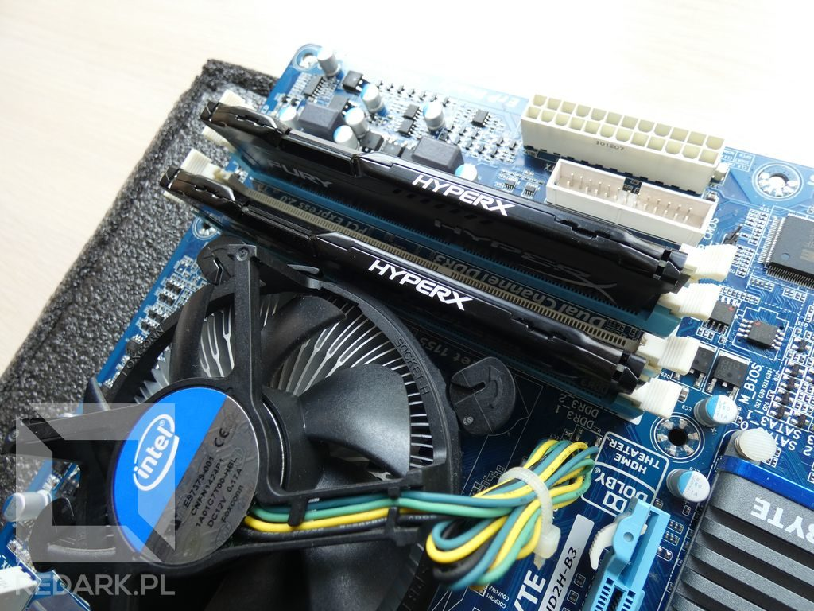

import AssemblingPcFooter from '../../typography/assemblingPcFooter'

W [poprzednim artykule](/skladanie-pc-montaz-procesora-i-chlodzenia) zajmowaliśmy się instalacją [procesora](/procesory) oraz [chłodzenia](/chlodzenie-komputera) na [płycie głównej](/plyty-glowne-czesc-1). Dziś zamontujemy na niej drugi ważny element, czyli kości pamięci operacyjnej RAM. Proces nie jest skomplikowany, ale należy pamiętać o kilku prostych zasadach.

## Numeracja slotów

Sloty pamięci RAM posiadają numerację, która określa, jakie porty pracują ze sobą w tzw. [trybie dual channel](/pamieci-ram). Jeśli instalujesz w komputerze tylko jedną kość pamięci, ten temat nie jest dla Ciebie ważny. Natomiast, jeśli masz zakupione dwa moduły (np. 2x4GB lub 2x8GB) warto prawidłowo rozpoznać te gniazda.

<ImageDescription>Widoczne obok gniazd nazwy slotów: DDR3_1 oraz DDR3_2</ImageDescription>

Ich zlokalizowanie odbywa się poprzez sprawdzenie oznaczeń (np. posiadają literki A i B) lub kolorów złączy. W przypadku mojej płyty sprawa jest bardzo prosta. Producent zastosował tutaj rozróżnienie kolorami: dwa sloty są koloru niebieskiego, a dwa białego.

<InfoBlock>Jeśli opisane powyżej oznaczenia nie występują, niezbędne informacje zawsze można znaleźć w instrukcji dołączonej do płyty głównej.</InfoBlock>

## Rozpakowywanie modułów

Ja, w swoim przypadku będę instalował dwa moduły po 4 gigabajty każdy. Aby wykorzystać tryb dual channel, moduły zamontuje w najbliższej procesorowi, niebieskiej parze slotów. Moduły pamięci RAM są szczególnie wrażliwe na wyładowania elektrostatyczne, o których mówiłem jeszcze przed rozpoczęciem składania komputera. Aby niepotrzebnie nie narażać ich na ryzyko uszkodzenia, po wyjęciu z opakowania należy unikać dotykania styków. Dodatkowo nawet odrobina brudu na ich powierzchni może utrudnić komunikację pamięci z systemem. Ryzyko uszkodzenia tyczy się również banków pamięci znajdujących się na powierzchni płytki drukowanej modułów. W moim przypadku akurat są one ukryte pod czarnym, metalowym radiatorem.

<ImageDescription>Moduł pamięci DDR3 od firmy HyperX</ImageDescription>

## Instalacja modułu

Aby móc zainstalować moduł w gnieździe należy najpierw odblokować zaczepy na płycie głównej. W tym celu należy rozchylić je palcami, tak jak jest to pokazane na zdjęciu poniżej:

<ImageDescription>Zwalnianie zaczepów po obu stronach gniazda pamięci RAM</ImageDescription>

Następnie wyjmij moduł z opakowania i przyłóż go płasko w pobliżu gniazda. Wewnątrz gniazda znajduje się mała wypustka, której musi odpowiadać wcięcie w ciągu styków na module. Cel jej występowania jest taki sam jak w przypadku instalacji procesora - zapobiega błędnemu ułożeniu podzespołu w gnieździe.

<ImageDescription>Wcięcia się zgadzają, więc możemy montować!</ImageDescription>

Jeśli wcięcie w module nie pasuje do gniazda, obróć pamięć i przymierz ją ponownie. Jeśli druga strona również nie pasuje, oznacza to, że Twój moduł pamięci nie jest kompatybilny z tą płytą główną. Wszystkie generacje pamięci DDR posiadały wycięcia w różnych miejscach i nie były ze sobą kompatybilne.

<WarningBlock>Choć omawiane tutaj wcięcia teoretycznie powinny uniemożliwić błędną instalację modułu, to praktyka pokazuje, że dla chcącego nic trudnego...</WarningBlock>

<AdSense/>

Gdy zaczepy są już zwolnione, a moduł prawidłowo obrócony można przystąpić do jego montażu. Po wsunięciu modułu do gniazda należy naciskać kciukami na jego końce. Proces ten wymaga użycia trochę siły i dlatego ważne jest, aby naciskać na moduł prostopadle do płyty głównej. Nacisk z boku może spowodować wyłamanie się styków modułu lub całego gniazda.

<ImageDescription>Moduły pamięci operacyjnej nie zawsze wchodzą lekko...</ImageDescription>

Dla łatwiejszego wsuwania modułów polecam naprzemiennie dociskać mocniej raz jedną, a raz drugą stronę pamięci. Moduł dostanie prawidłowo podłączony, gdy odblokowane przez nas wcześniej zaczepy powrócą do swojej pionowej pozycji, blokując się na wycięciu płytki modułu:

<Gallery>

</Gallery>

Prawidłowo zamontowanego moduł nie można wyjąć z gniazda bez zwalniania zaczepów. Z kolei zbyt słabo dociśnięty RAM uniemożliwi uruchomienie komputera, ponieważ BIOS natychmiast wykryję błąd w komunikacji z pamięcią.

Jeśli pierwszy moduł siedzi już pewnie w gnieździe, przejdźmy do następnego slota. Tutaj proces instalacji wygląda identycznie:

<ImageDescription>A teraz drugi moduł...</ImageDescription>

## Podsumowanie

Na powierzchni naszej płyty głównej znajduje się procesor i pamięć RAM. Są to już wszystkie elementy, które musieliśmy na niej zamontować, dlatego w następnym artykule zajmiemy się już je montażem wewnątrz obudowy.

<AssemblingPcFooter nextPost='/skladanie-pc-montaz-zasilacza-i-plyty-glownej'/>
