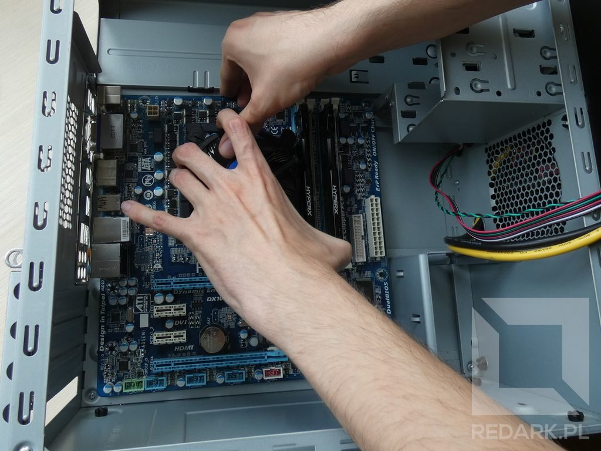
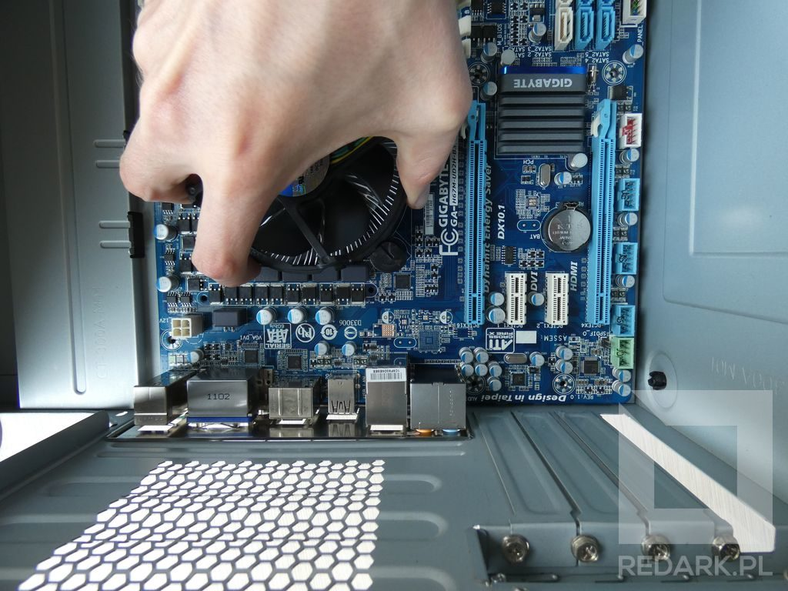
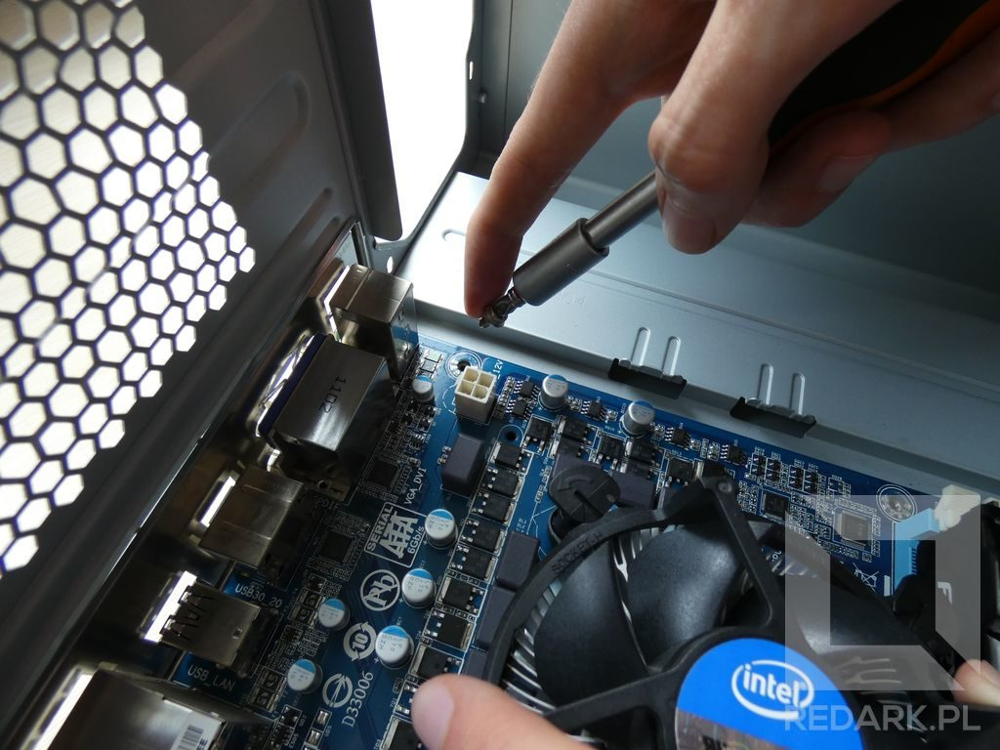
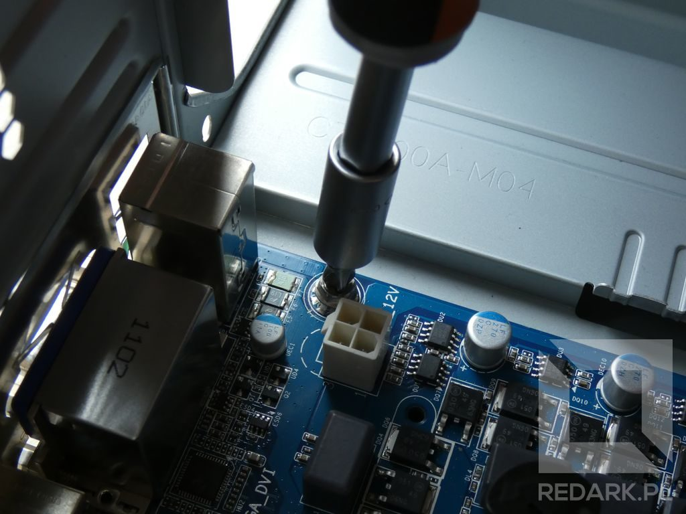
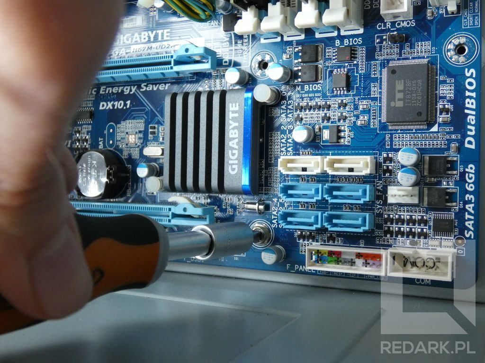
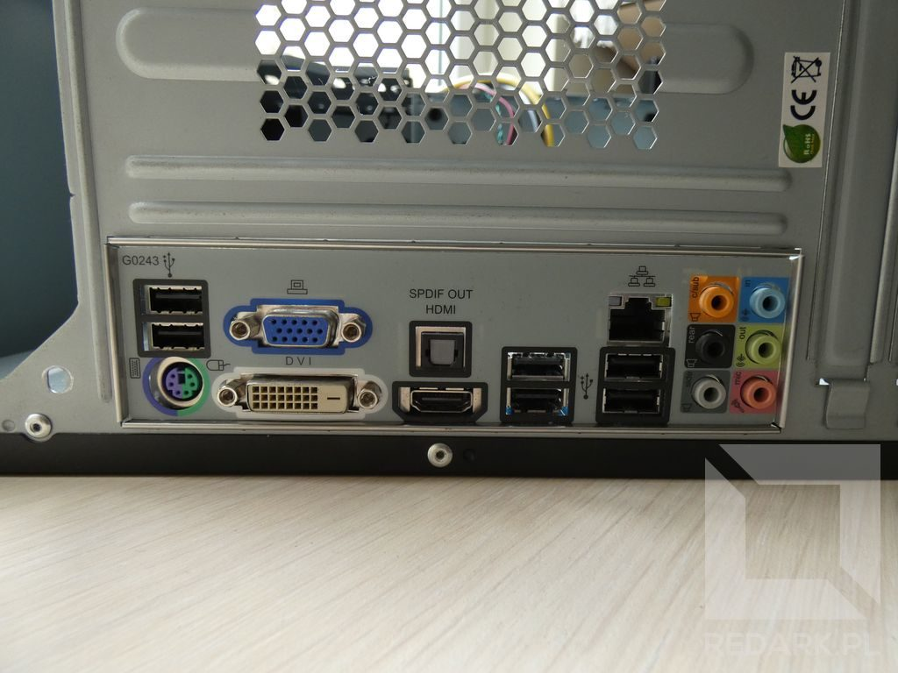
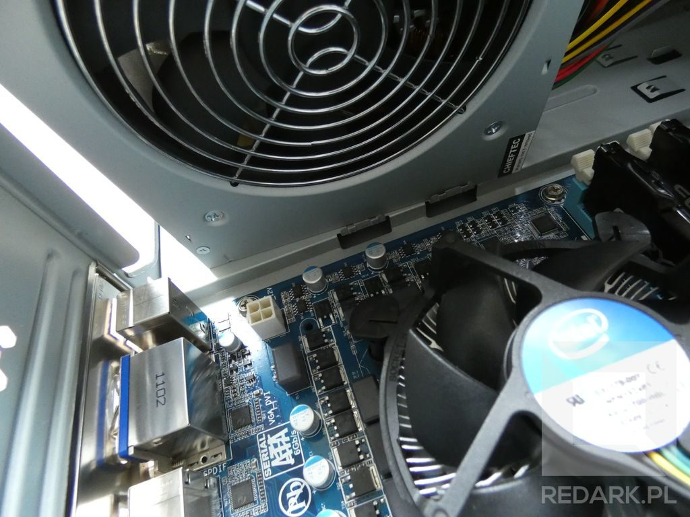
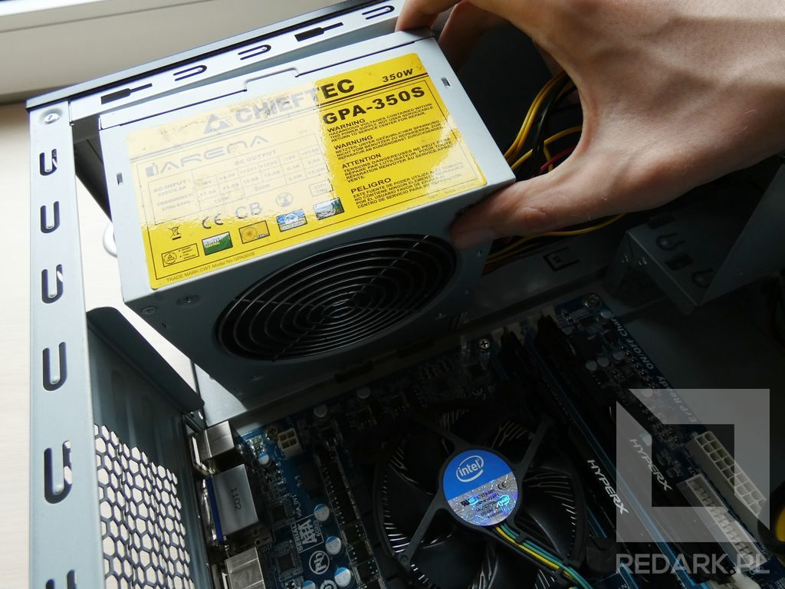
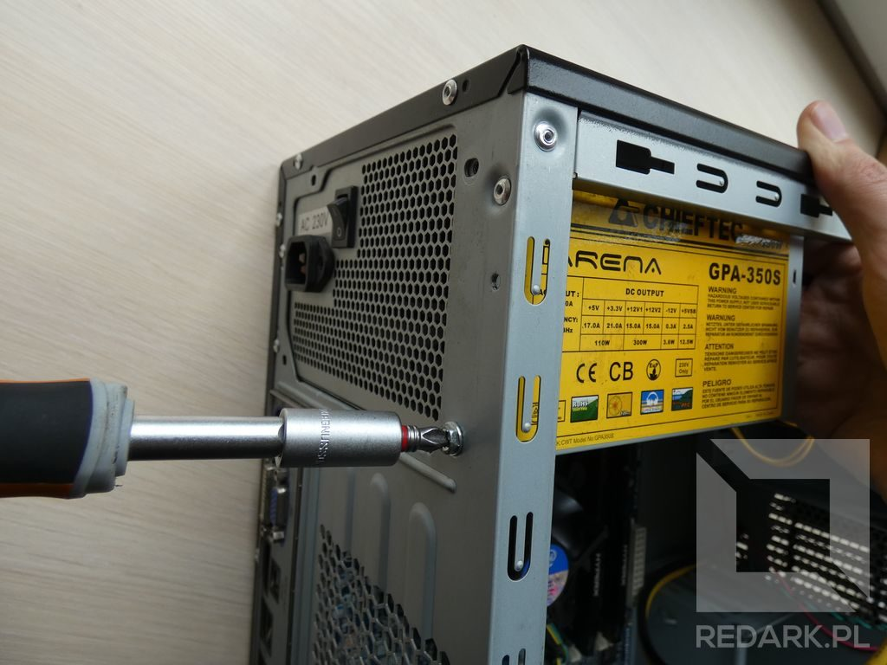
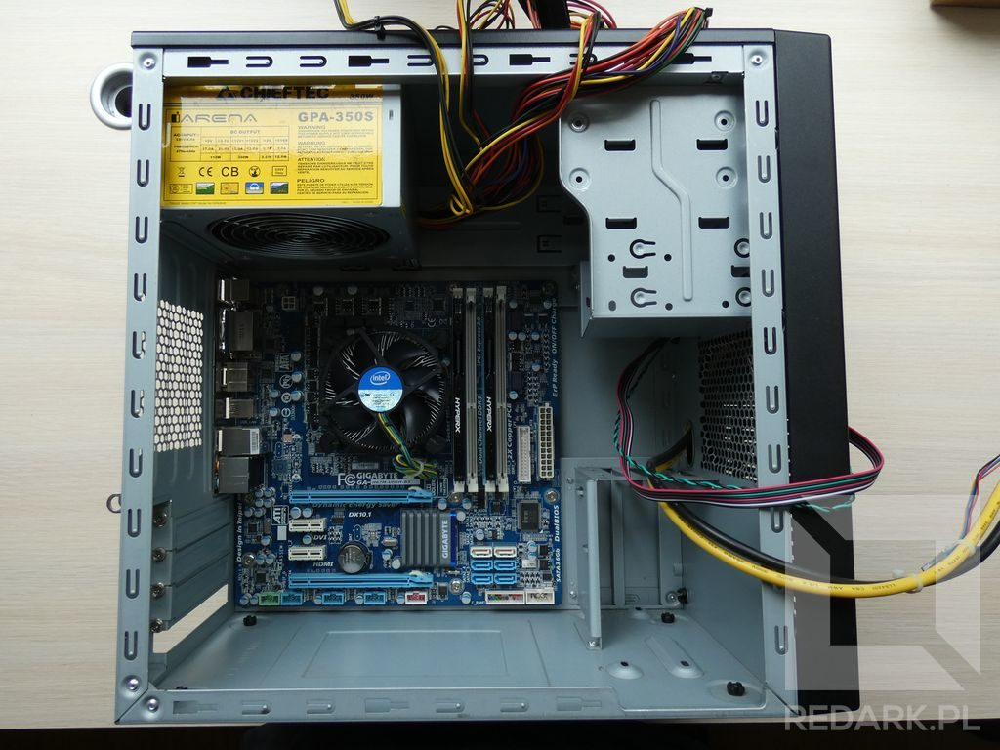

import AssemblingPcFooter from '../../typography/assemblingPcFooter'

W tym artykule rozpoczniemy montaż podzespołów w obudowie komputera. Pierwszymi elementami, jakie się w niej znajdą, będą zasilacz oraz płyta główna z zamontowanym już [procesorem](/procesory) i [pamięcią RAM](/pamieci-ram).

## Co pierwsze?

Kilka razy spotkałem się z pytaniem: co pierwsze montuje się w obudowie - zasilacz czy płytę główną? Jednoznaczna odpowiedź na to pytanie nie istnieje, ponieważ wiele zależy od obudowy, rozmiaru samej płyty, jak i znajdującego się na niej radiatora. Przy składaniu każdego komputera należy podjąć tę decyzję indywidualnie. Przedstawię to na dwóch przykładach.

### Zasilacz u góry + duży radiator

Zasilacz znajdujący się nad płytą główną znajduje się blisko procesora. Jeśli zamontowany na nim radiator jest wysoki, może całkowicie uniemożliwić późniejsze wsunięcie zasilacza na swoje miejsce. W takim przypadku należy bezwzględnie zamontować najpierw zasilacz, a dopiero później płytę główną z radiatorem.

### Płyta główna w standardzie ATX + zasilacz u dołu

[Płyta w standardzie ATX](/plyty-glowne-czesc-1) wypełnia całą przestrzeń obudowy. Jest duża i ciężko nią manewrować. Zasilacz umieszczony jest na dole, więc nie ma prawa kolidować z radiatorem procesora. W tym przypadku można zacząć od dowolnego z elementów, ale bezpieczniejszą metodą jest rozpoczęcie montażu od płyty głównej. Mamy wtedy więcej miejsca na manewrowanie płytą i przykręcanie śrubek, a także mniej plątających się kabli.

## Montaż płyty głównej

Gdy już wiemy, od którego podzespołu zacząć, możemy przystąpić do pracy. Ja rozpocznę od płyty głównej. Co prawda, zasilacz znajduje się u góry obudowy, ale spokojnie zmieści się obok standardowego chłodzenia Intela.

### Wkładanie płyty

Pierwszym krokiem jest odgarnięcie wszelkich przewodów, jakie mogłyby wejść pod płytę główną. Później możemy już włożyć płytę do wnętrza obudowy. Należy to robić bardzo ostrożnie, aby nie oderwać któregoś z elementów znajdujących się na jej powierzchni. Ostatnią fazę wkładania, w której nie ma już miejsca na włożenie palców pod spód płyty, można dokończyć, trzymając ją za radiator.

<Gallery>

</Gallery>

Płytę należy ułożyć tak, by jej tylne złącza wpasowały się idealnie w zaślepkę w obudowie. Nasz motherboard na początku nie będzie chciał dobrze od niej przylegać, ponieważ wewnętrzna strona zaślepki posiada metalowe, sprężynujące "wąsy". Dlatego, po wstępnym ułożeniu płyty na kołkach dystansowych, należy ją przykręcić.

### Przykręcanie płyty do obudowy

Proces ten wymaga trochę skupienia, ponieważ niesie za sobą pewne niebezpieczeństwo. Podczas wkręcania śrub na płycie głównej istnieje ryzyko zeskoczenia śrubokręta z główki śruby i "zaoranie" powierzchni płyty. Niestety, może to skutkować oderwaniem małych elementów z jej powierzchni lub – co gorsza – niewidocznym przerwaniem jednej ze ścieżek elektrycznych. Montaż ułatwi nam śrubokręt z główką magnetyczną, ale nie jest on wymagany.

<AdSense/>

Przykręcanie płyty polecam zacząć od śruby znajdującej się przy górnym lewym narożniku, między procesorem a panelem tylnym, chyba że rozmiary radiatora na to nie pozwalają. Przed jej wkręceniem, aby dobrze trafić śrubą w kołek dystansowy, można drugą ręką złapać radiator i za jego pomocą docisnąć płytę do tylnej ścianki tak jak robię to na zdjęciach poniżej.

<Gallery>

</Gallery>

Na razie lepiej nie dokręcać jej do końca, by zostawić sobie jeszcze ruchomość płyty i nie wytwarzać niepotrzebnych napięć materiału. Po chwyceniu pierwszej śruby zrób to samo z resztą, cały czas pamiętając o pewnym trzymaniu śrubokręta.

<Gallery>

</Gallery>

Gdy już wszystkie śruby są na miejscu, można je dokładnie dokręcić. Nie trzeba tutaj stosować dużej siły, zwłaszcza że jej użycie wiąże się z ryzykiem zadrapania płyty.

<ActionButton to='/skladanie-pc-2020-montaz-chlodzenia-wodnego-i-plyty-glownej'>Montaż płyty głównej w standardzie ATX</ActionButton>

## Montaż zasilacza

Gdy płyta główna już jest na miejscu, można przystąpić do instalacji [zasilacza](/zasilacze). Po jego rozpakowaniu należy ostrożnie wsunąć go do obudowy, omijając przy tym radiator procesora. W przypadku mojej obudowy, poniżej miejsca na zasilacz znajdują się małe zaczepy podtrzymujące jego krawędź.

<Gallery>

</Gallery>

Po włożeniu zasilacza do środka należy przykręcić go do tylnej ścianki obudowy w miejscach wszystkich dostępnych otworów. Aby ułatwić sobie przykręcanie, drugą ręką należy cały czas podtrzymywać zasilacz.

## Podsumowanie

Takim oto sposobem wewnątrz obudowy mamy już zamontowaną płytę i zasilacz. W następnych artykułach zajmiemy się montażem pozostałych, mniejszych podzespołów oraz podłączeniem wszystkich kabli.

<AssemblingPcFooter nextPost='/skladanie-pc-dyski-karta-graficzna-naped-optyczny'/>
