import AssemblingPcFooter from '../../typography/assemblingPcFooter'

Gdy w obudowie znajduje się już [płyta główna](/plyty-glowne-czesc-1) z [zasilaczem](/zasilacze), można przejść do montażu pozostałych, mniejszych podzespołów. W tym artykule pokażę jak zamontować [dyski pamięci masowej](/nosniki-pamieci-dyski-hdd-ssd), [kartę graficzną](/karty-graficzne) oraz [napęd optyczny](/napedy-optyczne) w slocie 5.25 cala.

## Montaż dysków HDD/SSD

Sposobów mocowania dysków w obudowie jest bardzo dużo, więc ciężko byłoby opisać wszystkie rozwiązania. Na szczęście wszelkie potrzebne informacje znajdują się w dokumentacji dołączonej do obudowy.

Proces montażu zaprezentuję na dwóch dyskach talerzowych 3.5", które w przypadku mojej obudowy, są umieszczone wertykalnie tuż za jej frontem. Dyski tego typu mocuje się z dwóch lub z jednej strony. Może to się odbywać zarówno poprzez standardowe śruby, jak i plastikowe śledzie/zatrzaski. U mnie, montaż odbywa się z obu stron za pomocą śrubek: jednej przykręcanej od góry i drugiej od spodu, od zewnątrz obudowy.

<Gallery width='2'>
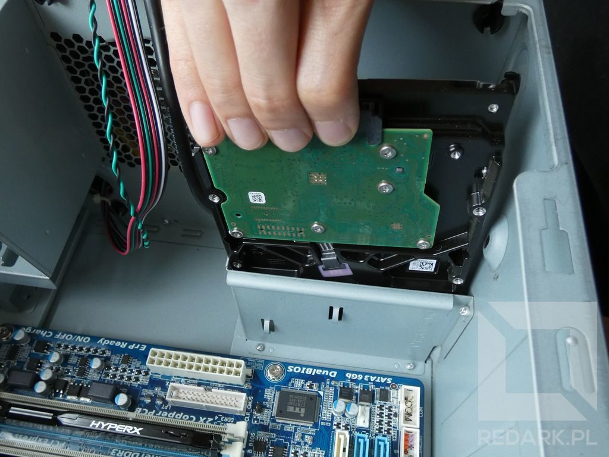
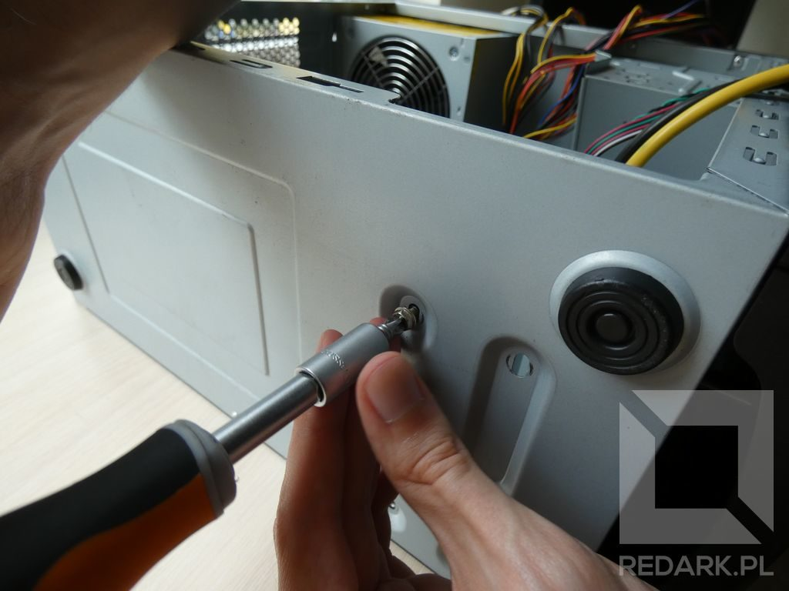

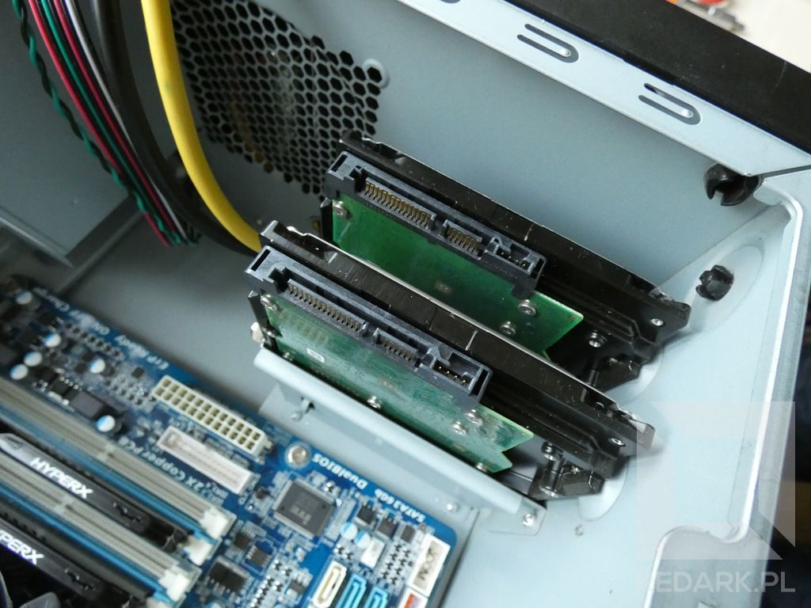
</Gallery>

Montaż mniejszych dysków SSD odbywa się analogicznie. Jednakże należy pamiętać, że wielu producentów przeznacza na nie miejsca "na plecach" płyty głównej i aby się do nich dostać, należy zdemontować drugie drzwiczki obudowy. W odświeżonej edycji tego poradnika z 2020 roku pokazuję montaż standardowego dysku 2.5" oraz superszybkiego dysku NVMe w gnieździe M.2 na płycie głównej. Odpowiednie linki umieszczam poniżej:

<LayoutContainer>
<LayoutColumn><ActionButton to='/skladanie-pc-2020-montaz-zasilacza-oraz-dyskow-na-dane'>Montaż dysku 2.5"</ActionButton></LayoutColumn>
<LayoutColumn><ActionButton to='/skladanie-pc-2020-montaz-podzespolow-na-plycie-glownej'>Montaż dysku M.2</ActionButton></LayoutColumn>
</LayoutContainer>

## Montaż karty graficznej

### Określanie miejsca położenia karty

Karta graficzna montowana jest najczęściej w pierwszym (licząc od procesora) [gnieździe PCI-Express x16](/plyty-glowne-czesc-2). Należy sprawdzić jak "wysoka" jest nasza karta, czyli ile tylnych slotów zajmują jej gniazda monitora. Obecnie większość modeli kart graficznych wymaga zarezerwowania dwóch slotów.

<AdSense/>

### Demontaż zaślepek

Sloty kart rozszerzeń są zaślepione za pomocą metalowych śledzi. W zależności od ich mocowania wyróżniamy dwa rodzaje:

- **Śledzie przykręcane** - zaślepka mocowana jest za pomocą śrubki i może być montowana i demontowana wielokrotnie.
- **Śledzie wyłamywalne** - zaślepka wykonana jest z tego samego arkusza blachy co obudowa. Posiada ona nacięcia umożliwiające jej wyłamanie. Zaślepka po zdemontowaniu nie może zostać użyta ponownie.

U mnie występuje pierwszy sposób mocowania zaślepek. Dlatego, aby przygotować moją obudowę do montażu karty graficznej, muszę za pomocą śrubokręta odkręcić śruby mocujące dwie pierwsze zaślepki:

<Gallery>
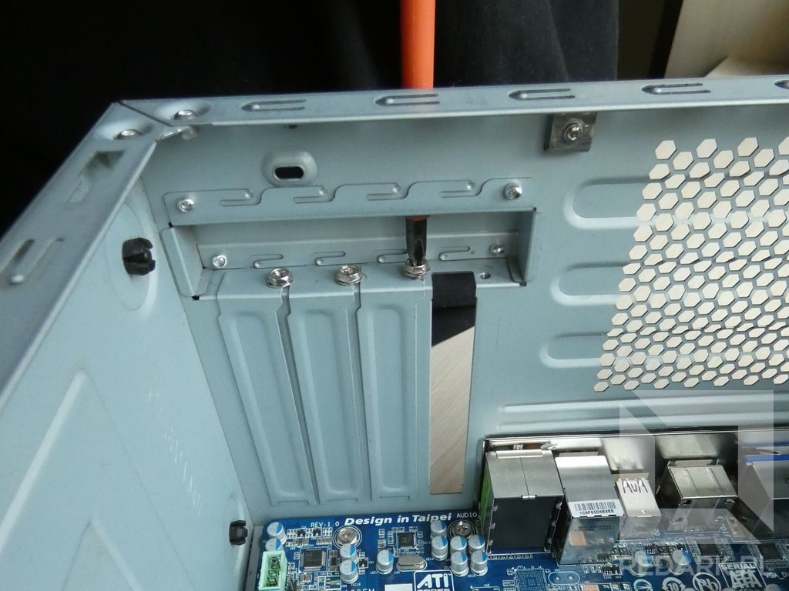
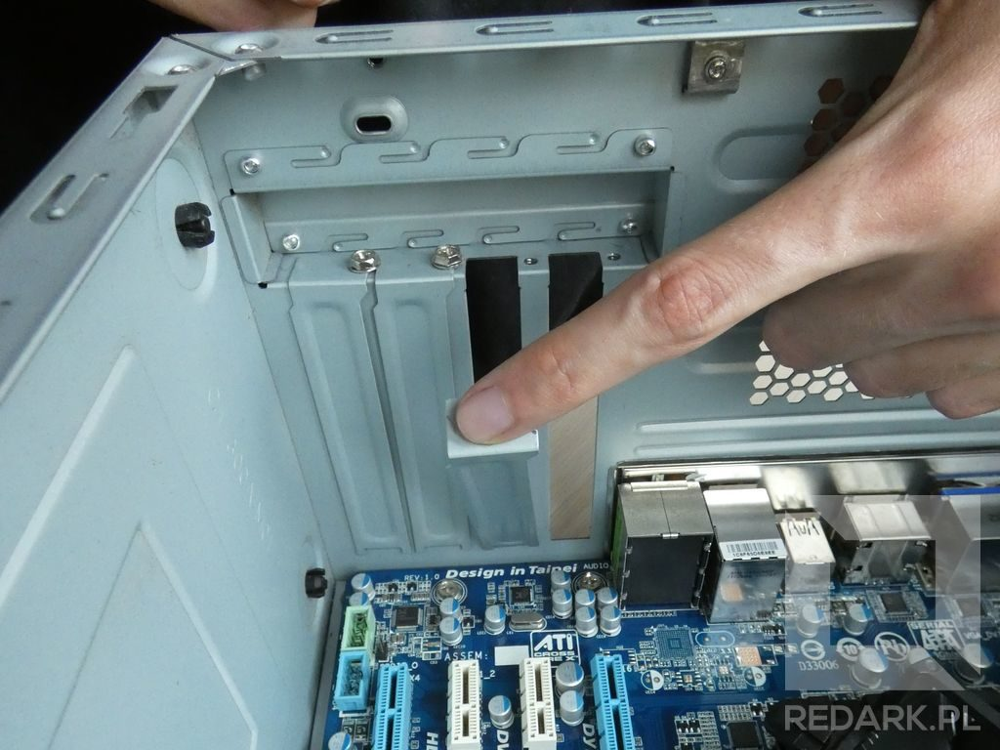
</Gallery>

<WarningBlock>Wyłamywanie śledzia należy robić bardzo ostrożnie. Po pierwsze, aby nie uszkodzić znajdującej się obok płyty głównej, a po drugie, aby nie rozciąć sobie skóry o bardzo ostre krawędzie blachy!</WarningBlock>

### Instalacja karty w gnieździe PCI

Gdy potrzebne sloty kart rozszerzeń już są odblokowane, można przejść do montażu karty graficznej. Cały proces sprowadza się do wsunięcia karty do gniazda płyty głównej pod kątem 90 stopni. Jedyne, na co należy zwrócić uwagę to mały zaczep znajdujący się na końcu gniazda PCI-Express. Jego zadaniem jest zapobieganie samoczynnemu odłączeniu się karty z gniazda np. podczas transportu komputera. W przypadku płyty Gigabyte jest to biała, sprężynująca dźwigienka, która musi zostać naciśnięta palcem, żeby możliwe było wsunięcie karty do końca:

<Gallery>
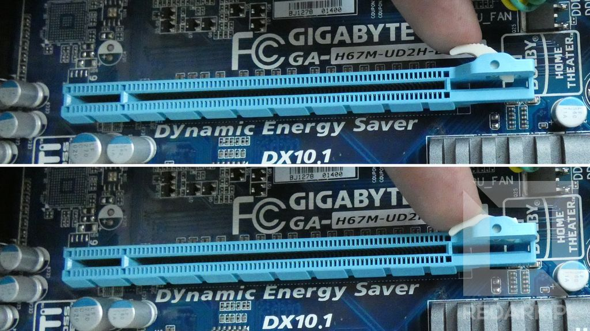
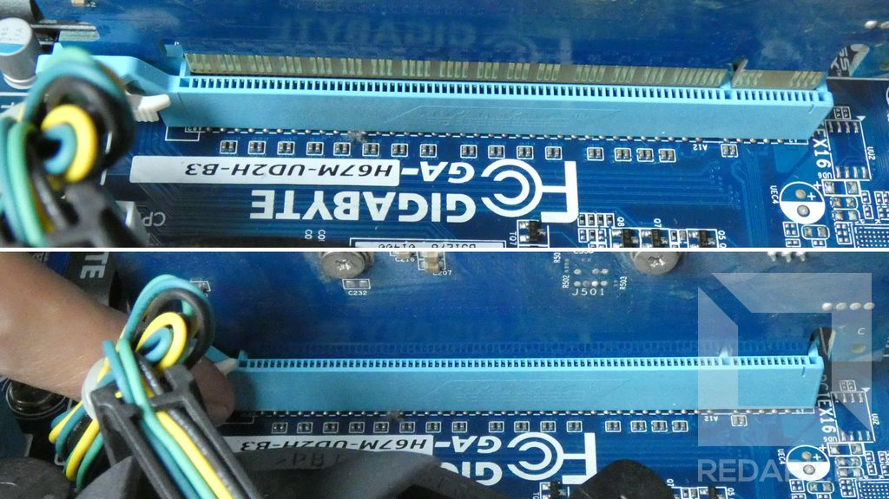
</Gallery>

Prawidłowo zamontowana karta idealnie przylega do tylnej ścianki obudowy. Montaż należy zakończyć przykręceniem śledzia karty graficznej do blachy obudowy, tak samo, jak mocowane były wcześniej jej zaślepki.

<Gallery>
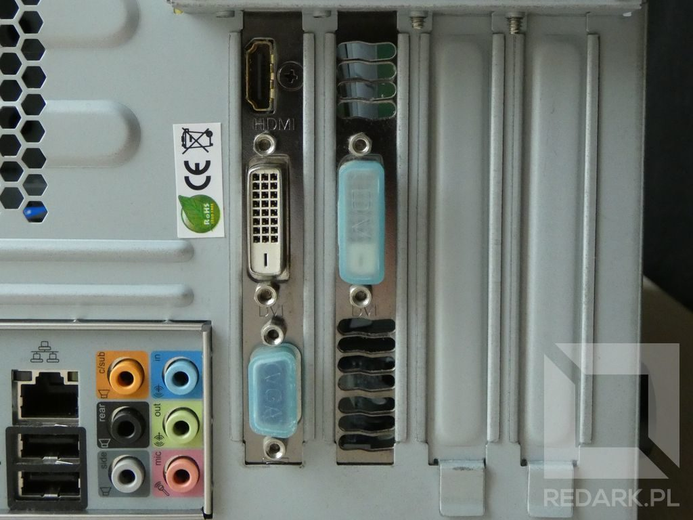
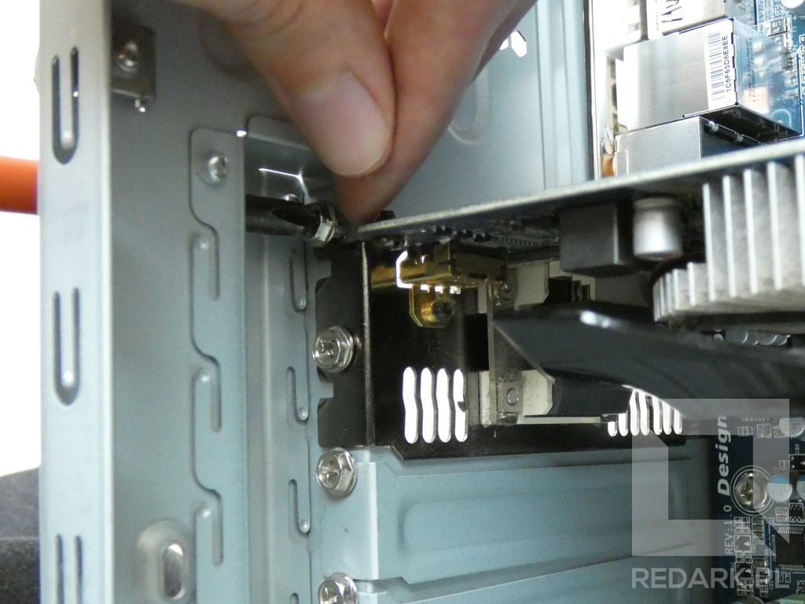
</Gallery>

## Montaż napędu optycznego

Choć cyfrowa dystrybucja oprogramowania sprawiła, że napędy optyczne to w dzisiejszych komputerach rzadkość, postanowiłem pokazać sposób ich montażu. Nie jest on taki łatwy i oczywisty, i tak samo, jak w przypadku karty graficznej, wymaga usunięcia zaślepek. Osoby, które nie decydują się na montaż napędu, mogą zignorować ten rozdział.

### Demontaż panelu frontowego

Standardowe napędy optyczne montowane są z przodu obudowy w slotach o rozmiarze 5.25 cala. Aby móc zdemontować ich zaślepki należy najpierw zdjąć cały przedni panel. W tym celu należy odszukać otwór znajdujący się u dołu obudowy (patrz na zdjęcie poniżej) i przy użyciu odrobiny siły oddzielić cały plastik od blachy.

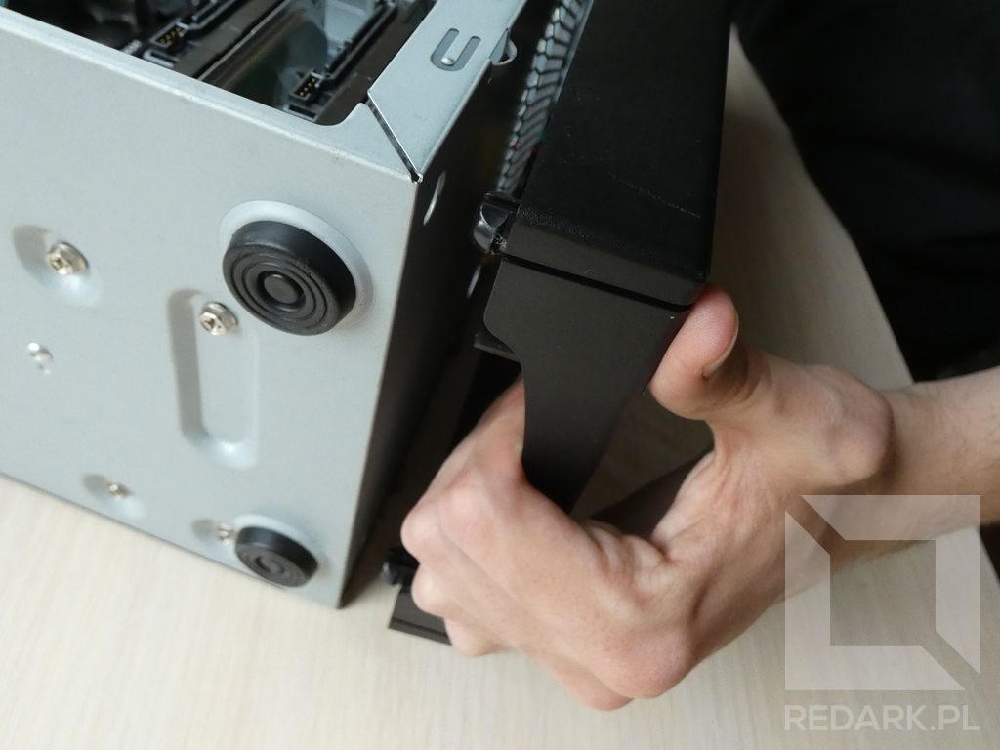

Należy jednak bardzo uważać podczas wykonywania tego ruchu. Z własnego doświadczenia wiem, że zaczepy mocujące front są bardzo delikatne i mogą całkowicie się rozpaść, co uniemożliwi ponowny montaż panelu. Drugą ważną rzeczą są przewody idące do przycisków i gniazd audio oraz USB. Często posiadają one mały zapas przewodu i ich mocniejsze szarpnięcie może spowodować katastrofalne zniszczenia.

<AdSense/>

### Demontaż zaślepek

W przypadku mojej obudowy zaślepki są aż dwie. Pierwsza, plastikowa znajduje się na froncie obudowy i można ją normalnie wyjąć, wciskając w kierunku wnętrza obudowy. Druga jest metalowa i należy ją wyłamać z blachy.

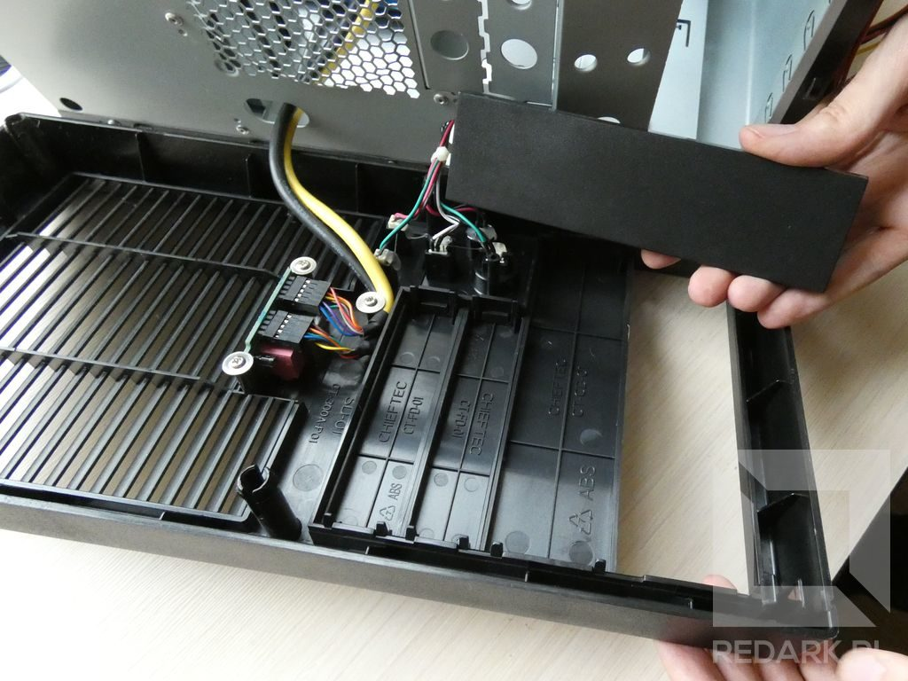

### Instalacja napędu

Gdy zaślepki zostały już zdemontowane, można z powrotem założyć plastikowy front obudowy, a następnie wsunąć napęd do przygotowanego przez nas otworu. Na koniec należy przykręcić śrubki mocujące napęd wewnątrz obudowy.

<Gallery>
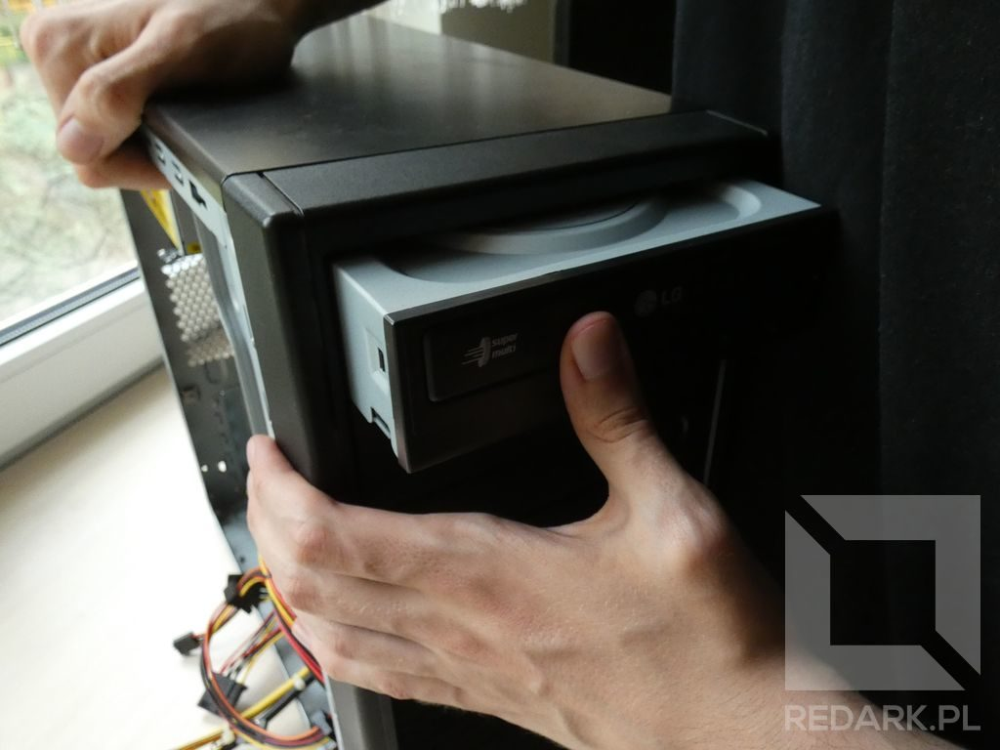
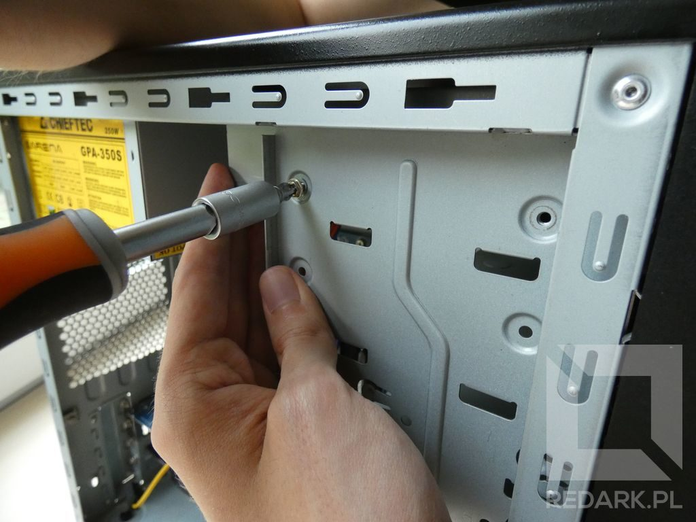
</Gallery>

Warto jeszcze wspomnieć o niektórych obudowach, które ukrywają swój napęd za klapką ze sprężyną zamontowaną we froncie obudowy. Takie modele posiadają również swój własny przycisk służący do wysuwania tacki napędu. Wsunięcie napędu do takiej obudowy należy oczywiście przeprowadzić przed założeniem plastikowego frontu.

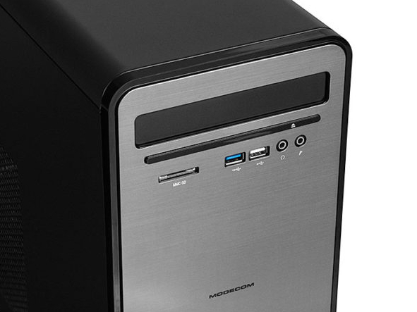

<ImageDescription>Modecom Ling - przykład obudowy wyposażonej w maskownicę napędu optycznego</ImageDescription>

Następnie, po zamontowaniu z powrotem frontu trzeba tak dosunąć i przykręcić napęd, aby przycisk obudowy idealnie dotykał właściwy przycisk napędu. Po dokręceniu śrubek należy sprawdzić, czy naciśnięcie przycisku obudowy wywołuje charakterystyczny klik przycisku napędu oraz, czy jego puszczenie powoduje prawidłowe odbicie mikroprzełącznika. Jeśli napęd będzie przykręcony zbyt blisko frontu, tacka będzie się samoczynnie wysuwać.

## Podsumowanie

W obudowie znajdują się już wszystkie potrzebne podzespoły. W następnym artykule zajmiemy się całym ["makaronem" przewodów wewnątrz obudowy](/kablologia-przewody-jednostki-centralnej) i tym sposobem zakończymy rozdział poświęcony składaniu komputera.

<AssemblingPcFooter nextPost='/skladanie-pc-podlaczanie-i-ukladanie-kabli-w-obudowie'/>
