import AssemblingPcFooter from '../../typography/assemblingPcFooter'

Przed nami ostatni artykuł poświęcony składaniu jednostki centralnej komputera. Naszym końcowym zadaniem jest połączenie wszystkich podzespołów ze sobą oraz spięcie kabli w wiązki tak, aby ułatwić przepływ powietrza wewnątrz obudowy.

<InfoBlock>Pokazywana tutaj obudowa nie posiada wydzielonych korytek na kable, dlatego wszelkie przewody będą prowadzone wewnątrz głównej komory. Osoby posiadające obudowy przystosowane do układania kabli, w miarę możliwości powinny prowadzić przewody poza główną komorą.</InfoBlock>

## Wiązka panelu przedniego

Aby móc używać [złączy znajdujących się z przodu obudowy](/obudowy-czesc-1) komputera, musimy je najpierw podłączyć do płyty głównej komputera. Dotyczy to również przycisku POWER, bez którego nie uruchomimy później naszej jednostki.

### Przyciski oraz diody

Do podłączenia tych dwóch elementów służą małe gniazda szpilkowe (tzw. goldpin-y), które swoje gniazdo posiadają w pobliżu dolnego prawego rogu płyty głównej. Czasami występują one w postaci pojedynczych przewodów, a czasami w postaci zintegrowanych wtyczek. W moim przypadku są to luźne przewody:

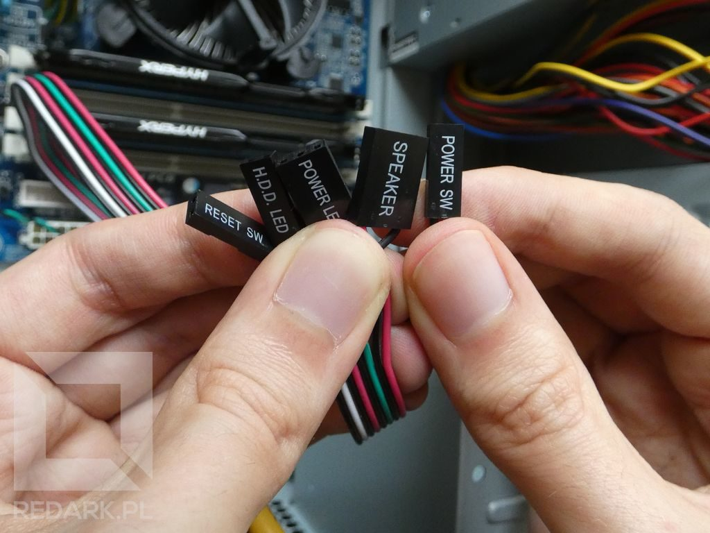

<ImageDescription>W przypadku starszych komputerów podłączenie tych kabelków było istnym horrorem</ImageDescription>

Odpowiednie dla nich gniazdo zostało oznaczone skrótem "**F\_PANEL**". Producent płyty, dla ułatwienia, umieścił również małą ściągawkę ze schematem podłączenia, więc nawet nie trzeba sięgać po dokumentację.

<Gallery>
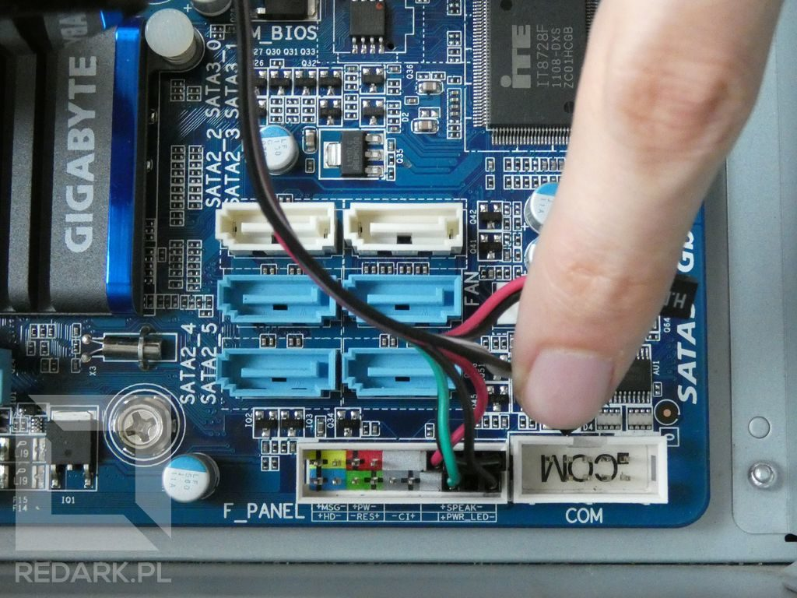
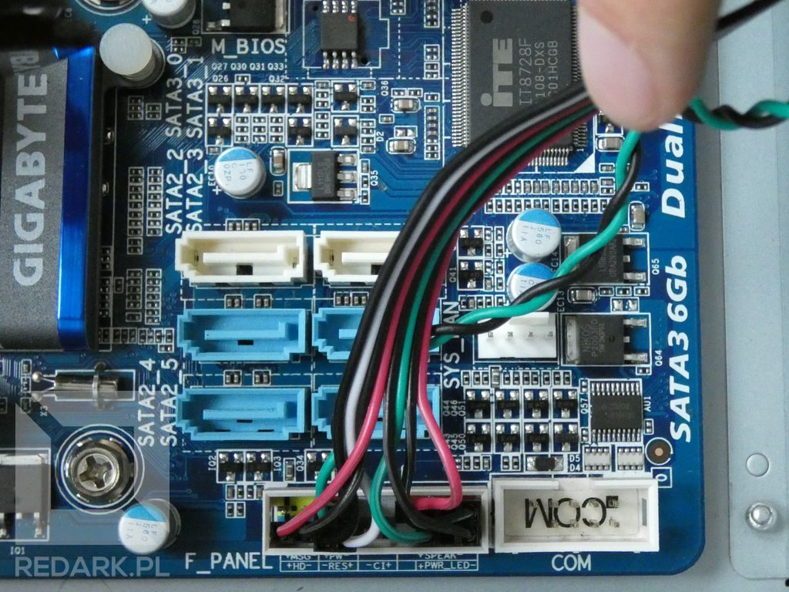
</Gallery>

Należy także zwrócić szczególną uwagę na małe plusiki znajdujące się na dnie gniazda, które oznaczają prawidłową biegunowość przewodów. W przypadku przycisku **POWER** i **RESET** to nie ma znaczenia, ale jeśli chodzi o diody LED, trzeba zwrócić na to baczną uwagę.

<InfoBlock>W wiązce mojej obudowy znalazła się również wtyczka oznaczona napisem SPEAKER. Jest to kabel idący do małego głośniczka, który jest odpowiedzialny za dźwiękowe nadawanie kodu błędu w przypadku awarii komputera. Istnieją również płyty, które posiadają je zamontowane na stałe na swojej powierzchni oraz takie, które posiadają osobne gniazdo do podłączenia brzęczyka na krótkim kabelku.</InfoBlock>

<AdSense/>

### Gniazda audio oraz USB

Czas podłączyć gniazda panelu przedniego. W przypadku audio, gniazdo za nie odpowiedzialne znajduje się zazwyczaj w pobliżu dolnego lewego narożnika płyty. Tam też może znajdować się podobnie wyglądające [gniazdo USB 2.0](/kablologia-zlacza-usb):

<Gallery>
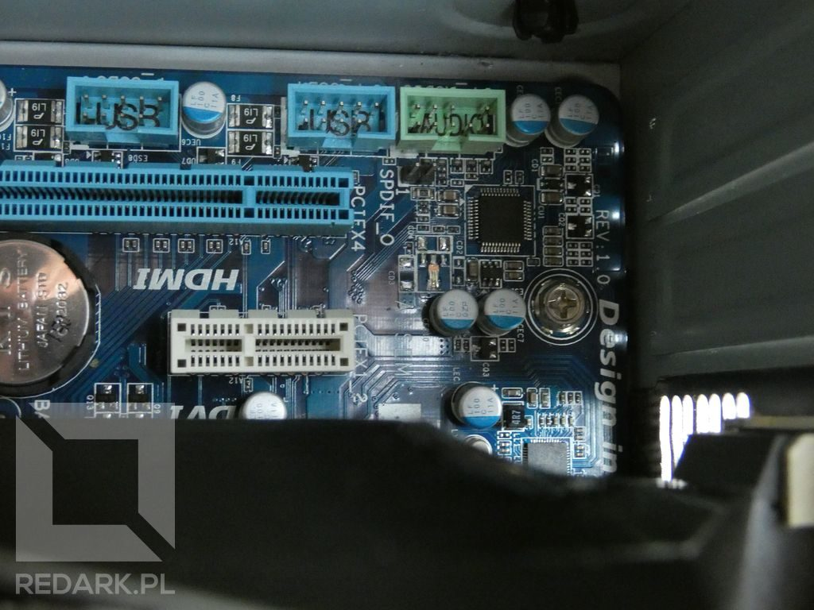

</Gallery>

Prawidłową orientację wtyczki określa zaślepiony pin znajdujący się na jednym z narożników. Moja obudowa potrzebowała jedynie jednej wtyczki USB 2.0. Jeśli Twoja obudowa potrzebuje ich więcej lub posiada także [gniazda USB trzeciej generacji](/kablologia-zlacza-usb), odnajdź odpowiadające im gniazda na powierzchni płyty. Jeśli będziesz miał z tym kłopot, skorzystaj z dokumentacji.

<Gallery>
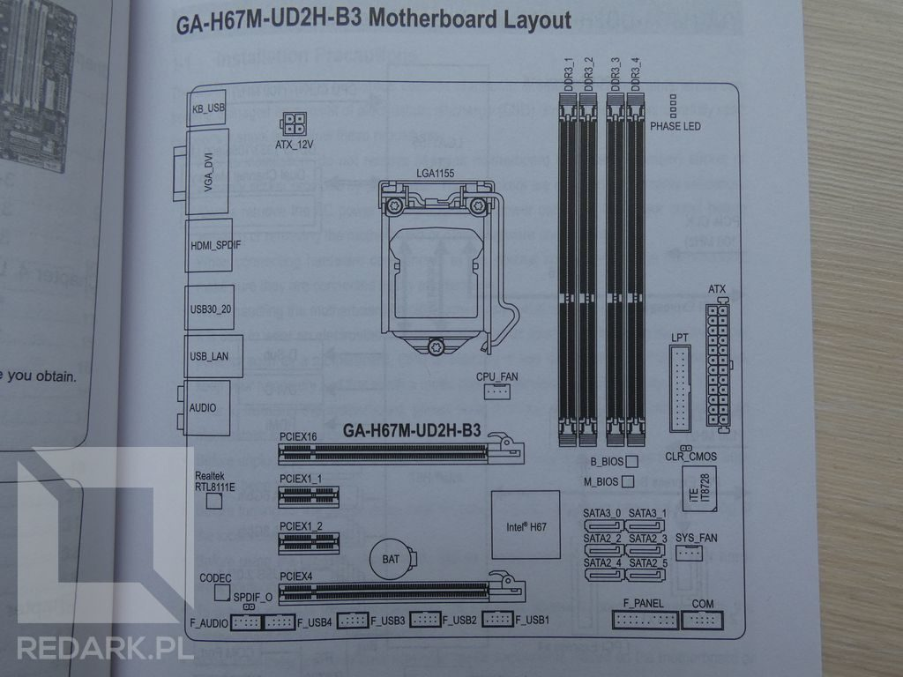
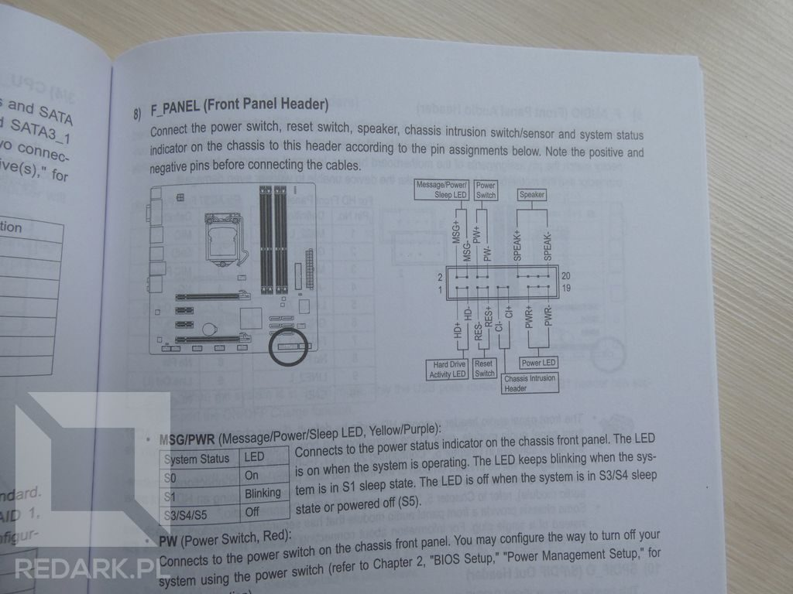
</Gallery>

## Zasilanie podzespołów

### Płyta główna

Gdy panel obudowy został już podłączony, odsuń ich kable na bok tak, aby nie zaplątały się w pozostałe wiązki i zajmiemy się zasileniem płyty głównej komputera. Odpowiedzialne są za to dwa kable. Jeden duży 24-pinowy ATX oraz drugi mniejszy 4 lub 8-pinowy odpowiedzialny za obsługę sekcji zasilania procesora.

<Gallery>
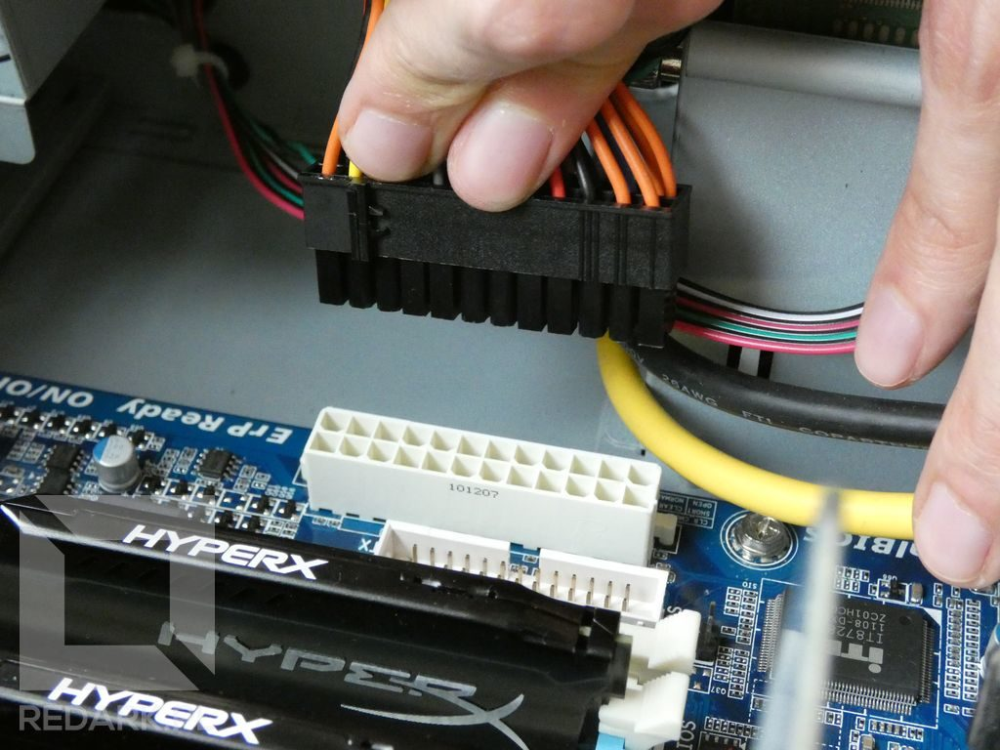

</Gallery>

W przypadku wtyczki ATX należy upewnić się, ile pinów ona posiada. Dla zapewnienia kompatybilności ze starszymi modelami płyt, producenci zasilaczy stosują wtyczki typu 20+4, w której 4 piny są "dopinane" do głównej wtyczki za pomocą plastikowych zaczepów. Jeśli nie wiesz, o czym teraz mówię, wróć do artykułu, w którym omawiałem [przewody znajdujące się wewnątrz komputera](/kablologia-przewody-jednostki-centralnej).

Po podłączeniu kabli upewnij się, że są one wciśnięte do końca gniazd oraz ułóż ich kable w taki sposób, aby nie przeszkadzały w dalszej pracy.

### Dyski oraz napęd optyczny

Te elementy również potrzebują zasilania. Służy do tego płaska wtyczka SATA. Mój zasilacz posiada akurat przewód z dwoma kątowymi wtyczkami SATA, które idealnie nadają się do podłączenia obu dysków:

<Gallery>
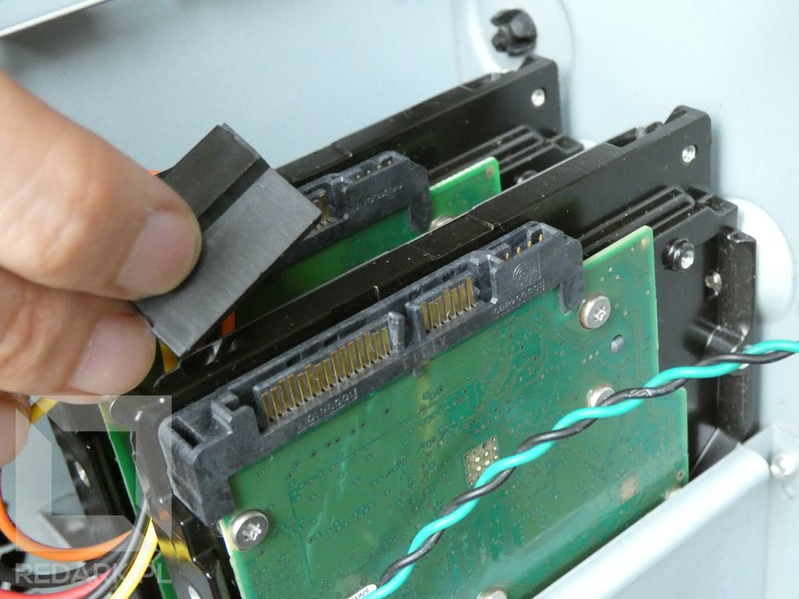

</Gallery>

W przypadku mojego zasilacza i napędu optycznego pojawia się problem. Zasilacz posiada jedynie dwie wtyczki SATA i do dyspozycji pozostały jedynie dwa MOLEX-y oraz jeden mini MOLEX. Jednak jest to idealna sytuacja, żeby pokazać, jak radzić sobie z takimi problemami. Z pomocą przychodzi tutaj bardzo popularna przejściówka **MOLEX > 2xSATA**. Dzięki temu kabelkowi problem został rozwiązany i można spokojnie zasilić napęd optyczny.

<Gallery>
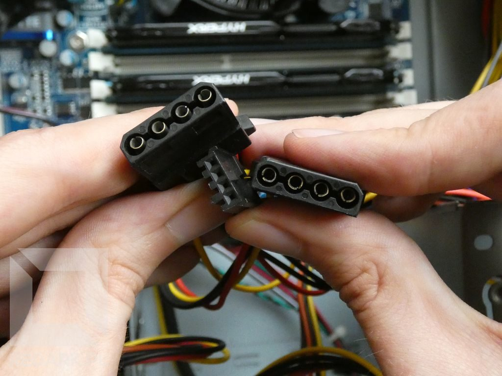
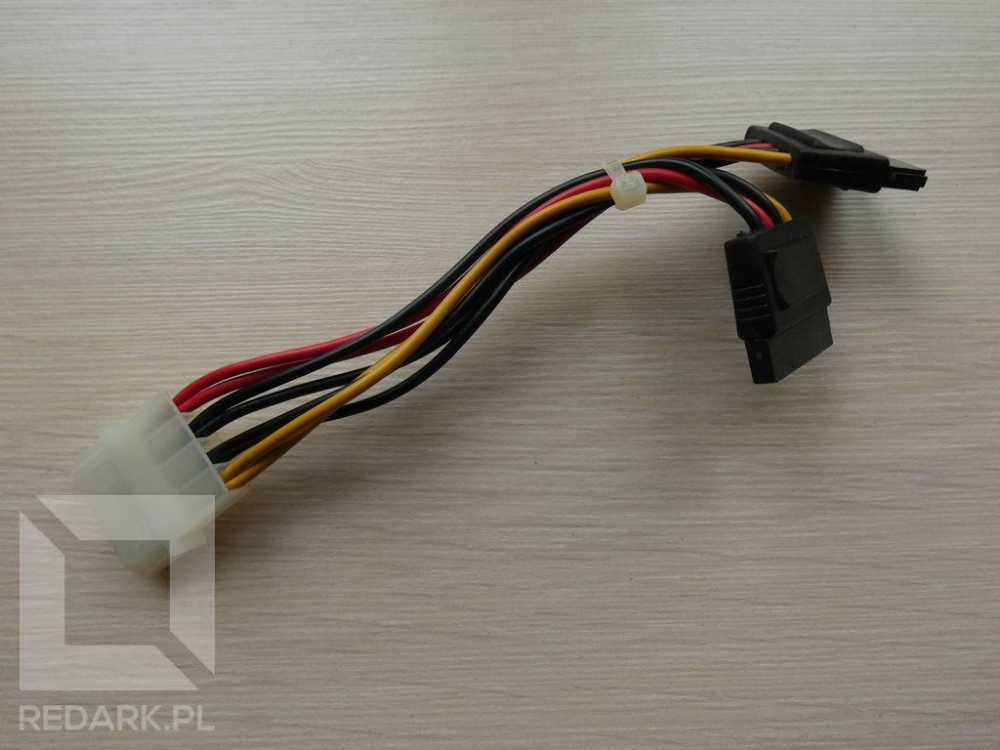
</Gallery>

### Karta graficzna

Na koniec pozostała karta graficzna. Moja nie wymaga dodatkowego zasilania, dlatego nie mogę pokazać tego kroku na montowanym przez nas komputerze. Wydajne modele kart graficznych nie mogą zostać zasilone prądem dostarczanym przez gniazdo PCIe płyty głównej. Wymagają one osobnego kabla zasilającego biegnącego bezpośrednio z zasilacza. Spotykane gniazda mają 6 lub 8 pinów. Aby móc podłączyć taką kartę graficzną, nasz zasilacz powinien posiadać kable tego typu lub uniwersalne wtyczki typu 6+2. W razie konieczności można się też ratować przejściówkami podobnymi do tej użytej do zasilenia napędu optycznego. W odświeżonej edycji tego poradnika z 2020 roku pokazuję już, jak podłączyć dodatkowe zasilanie GPU:

<ActionButton to='/skladanie-pc-2020-montaz-karty-graficznej-oraz-sieciowej'>Dodatkowe zasilanie GPU</ActionButton>

<AdSense/>

## Uporządkowywanie kabli

Choć pozostało jeszcze do podłączenia kilka ważnych kabli sygnałowych, uważam, że w tym momencie warto zadbać o odpowiednie ułożenie przewodów zasilających. Ja, z racji braku rynienek na kable, wykorzystam, jak to tylko możliwe, wnękę 5.25 cala do ukrycia przewodów zasilacza. Do związania kabli użyję niezawodnych trytek:

<Gallery>
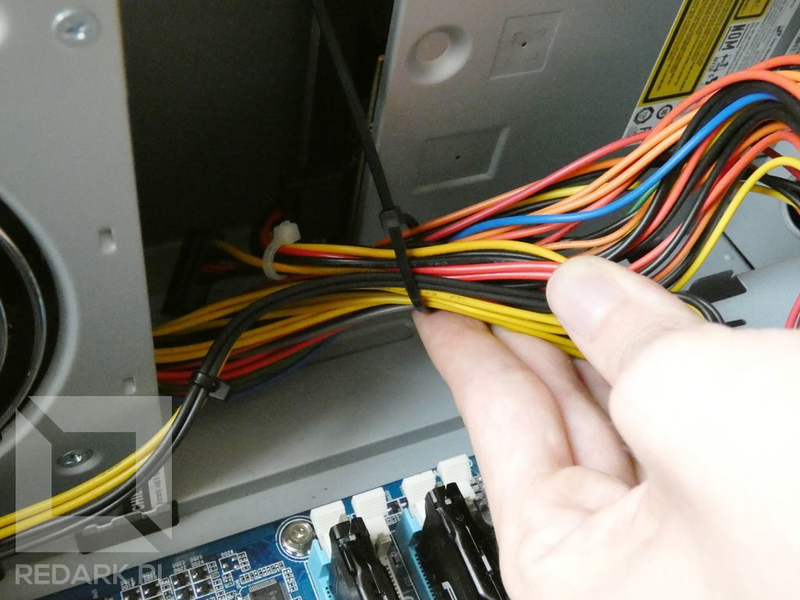
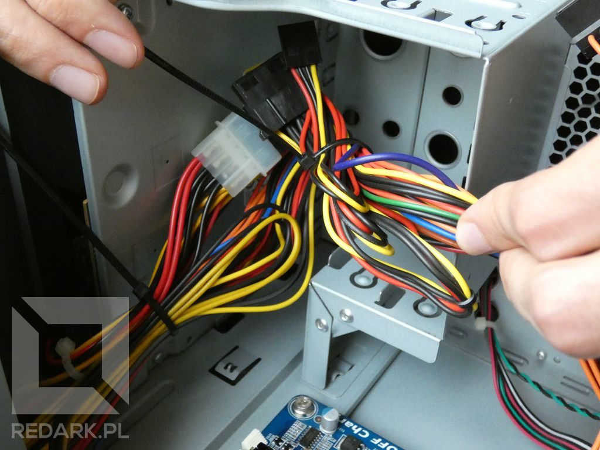
</Gallery>

Jeśli chcesz zobaczyć proces porządkowania znacznie większej ilości przewodów, zapraszam Cię do odświeżonej edycji z 2020 roku:

<ActionButton to='/skladanie-pc-2020-podlaczanie-i-ukladanie-przewodow-w-obudowie'>Układanie przewodów</ActionButton>

## Podłączenie kabli sygnałowych

Ostatnie kable, które nam pozostały, odpowiedzialne są za wymianę danych między płytą główną i dyskami oraz napędem optycznym. Są one o połowę węższe od kabli zasilających SATA, ale podłącza się je dokładnie tak samo. Odpowiadające im gniazda płyty głównej znajdziemy w pobliżu jej dolnego prawego rogu. Kolejność ich podłączania nie ma większego znaczenia.

<Gallery>
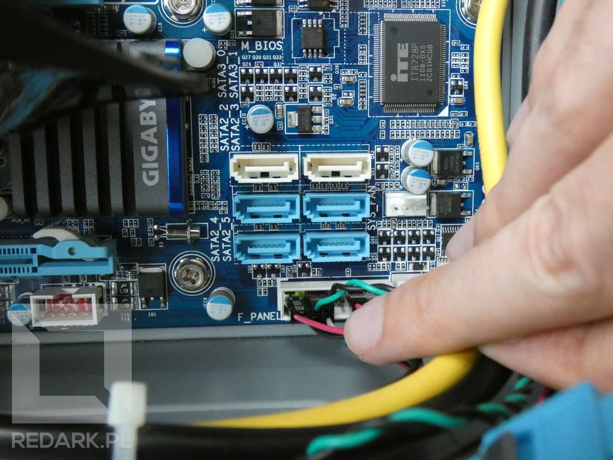
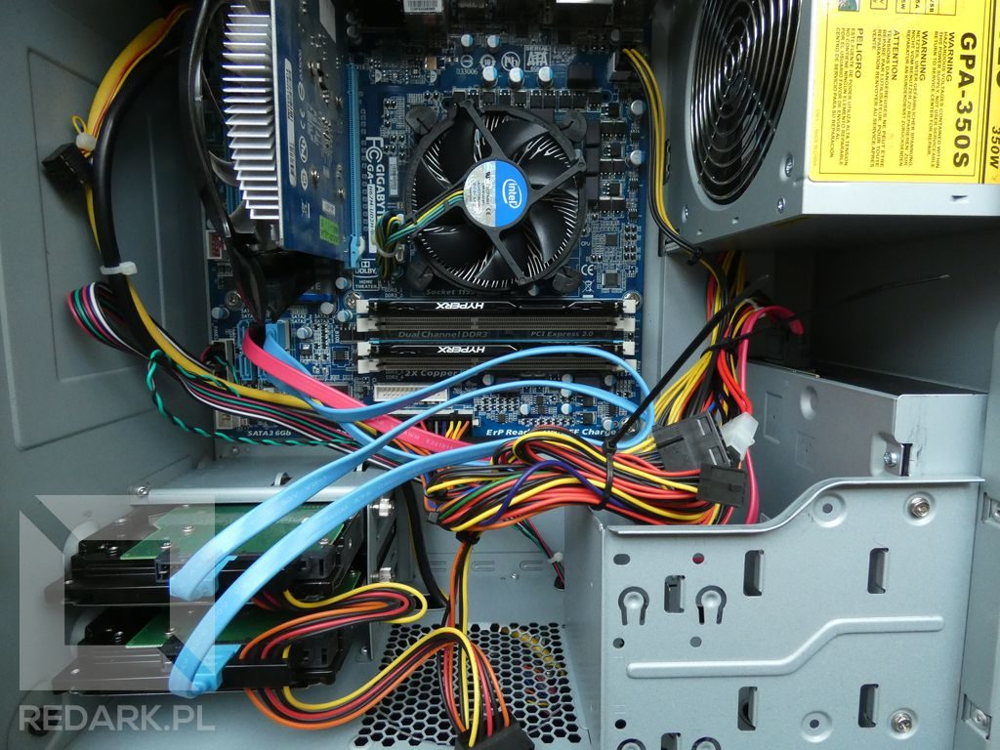
</Gallery>

Choć dla dysków talerzowych nie ma to znaczenia, postanowiłem podłączyć je do szybszej 3. generacji interfejsu SATA (u mnie oznaczonej kolorem białym), a napęd optyczny do wolniejszej 2. generacji (kolor niebieski). Generację interfejsu można rozpoznać, odczytując etykiety znajdujące się na powierzchni płyty głównej.

## Czynności końcowe

Na koniec pozostało spiąć podłączone przed chwilą kable sygnałowe z resztą wiązki przewodów. Jeśli Twoje ułożenie kabli Cię nie satysfakcjonuje, nie bój się eksperymentować. Rozetnij trytki (tylko uważaj na kable!), rozłącz wtyczki i przetestuj nowy układ przewodów. Nikt nie powiedział, że pierwsza wersja będzie już tą właściwą. Ja swoją obudowę pozostawię w takim stanie. Pewnie można by jeszcze lepiej ukryć przewody, ale w tej jednostce nie ma prądożernych podzespołów, więc nie trzeba też silić się na ich wydajne chłodzenie.

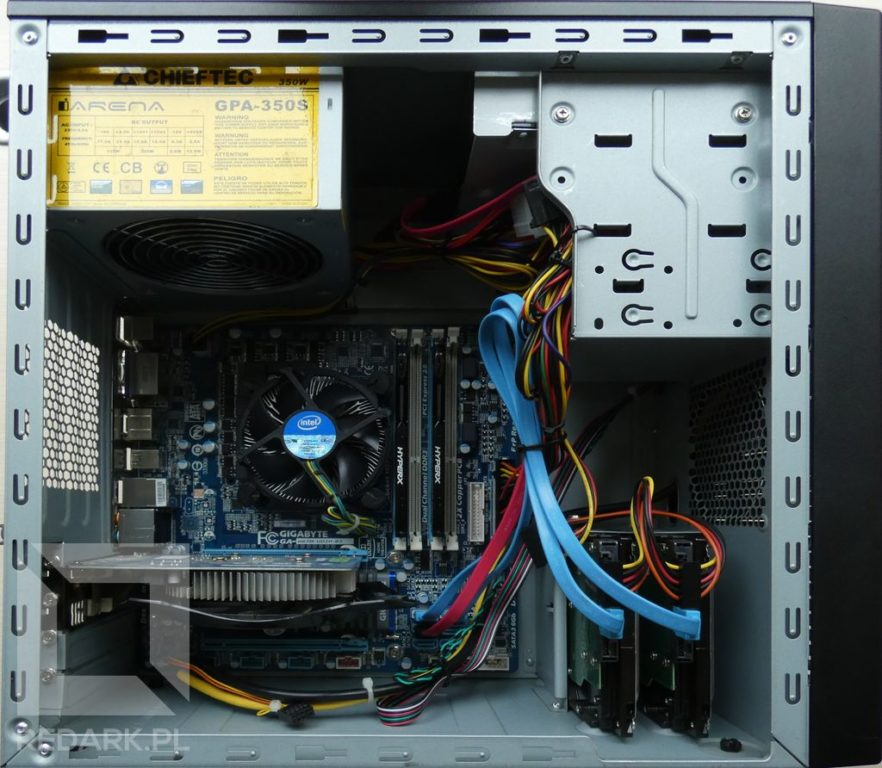

Przewodami, które możesz jeszcze spotkać na swojej drodze, są m.in. kable zasilania dodatkowych wentylatorów obudowy. Ich końcówki należy podłączyć do gniazd płyty głównej oznaczonych napisami **CHA\_FAN** lub **SYS\_FAN**. Niektóre obudowy posiadają również wbudowane kontrolery wentylatorów. W takich przypadkach wentylatory należy podłączyć do płytki drukowanej kontrolera oraz dostarczyć mu zasilanie z zasilacza (najczęściej za pomocą wtyczki MOLEX). Wszelkie dodatkowe informacje z pewnością będą znajdować się w instrukcji dołączonej do obudowy komputera.

<AssemblingPcFooter nextPost='/pierwsze-uruchomienie-komputera-diagnostyka-awarii'/>
